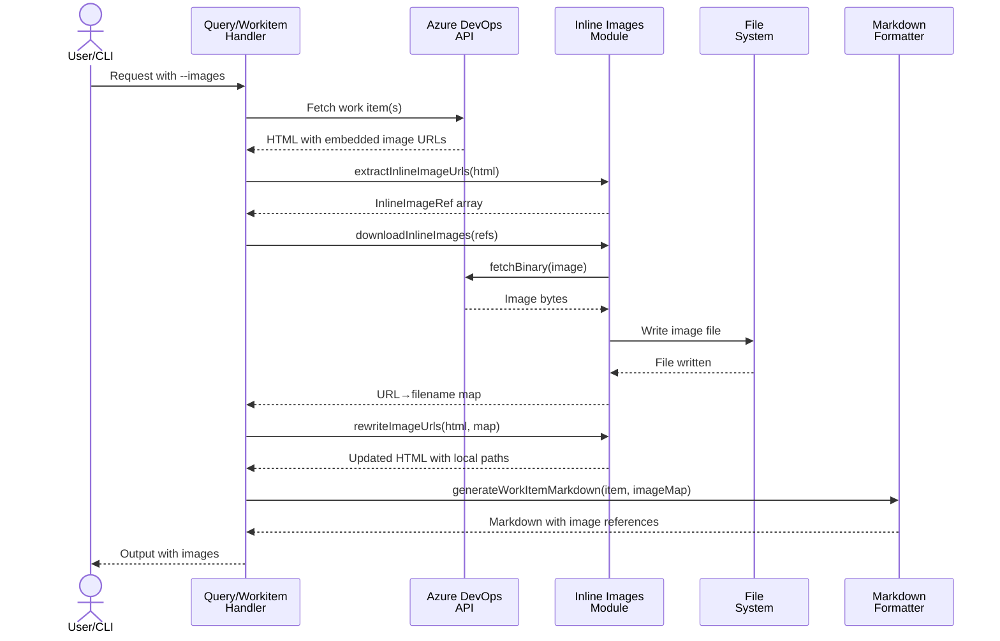

# PR Review: #74

**feat(azure-devops): download inline images from work items**

| | |
|---|---|
| **Repository** | [genesiscz/GenesisTools](https://github.com/genesiscz/GenesisTools/pull/74) |
| **State** | OPEN |
| **Generated** | 2026-03-03T02:02:09.670Z |

## Summary

| Metric | Count |
|--------|-------|
| Total Threads | 10 |
| [X] Unresolved | 10 |
| [OK] Resolved | 0 |
| [HIGH] High Priority | 2 |
| [MED] Medium Priority | 7 |
| [LOW] Low Priority | 1 |

## PR-Level Comments

### @coderabbitai (2026-03-02)

<!-- This is an auto-generated comment: summarize by coderabbit.ai -->
<!-- walkthrough_start -->

<details>
<summary>📝 Walkthrough</summary>

## Walkthrough

This PR adds inline image download functionality to Azure DevOps work item commands. It introduces a new `--images` CLI flag, a dedicated module for extracting and downloading image references from HTML descriptions and comments, and propagates image data through the command pipeline for proper markdown generation and display.

## Changes

|Cohort / File(s)|Summary|
|---|---|
|**Documentation** <br> `plugins/genesis-tools/skills/azure-devops/SKILL.md`|Updated to document the new `--images` option, Inline Image Output Paths section, enhanced Analyze Work Items workflow with image handling steps, Visual Context field in output, and new example user requests demonstrating image downloading workflows.|
|**Query Command Interface** <br> `src/azure-devops/commands/query.ts`|Added `--images` CLI flag to `registerQueryCommand`, introduced `images?: boolean` field to `QueryOptions`, extended `handleQuery` signature and `WorkItemHandler` type to accept new `downloadImages` parameter, and propagated the flag through the call chain.|
|**Work Item Handler Integration** <br> `src/azure-devops/commands/workitem.ts`|Extended work item rendering pipeline to accept and process inline images; updated `formatWorkItemAI` and `generateWorkItemMarkdown` signatures to handle image maps; added image extraction and download phases to `handleWorkItem`; integrated image URL rewriting into markdown generation for both new and cached items.|
|**Inline Image Processing Module** <br> `src/azure-devops/inline-images.ts`|New module providing image extraction, download, and URL rewriting: `extractInlineImageUrls` parses HTML for attachment URLs and constructs local filenames; `downloadInlineImages` fetches images to disk; `rewriteImageUrls` replaces original URLs with local paths in HTML content.|

## Sequence Diagram(s)



## Estimated code review effort

🎯 3 (Moderate) | ⏱️ ~22 minutes

## Possibly related PRs

- genesiscz/GenesisTools#20: Modifies the same Azure DevOps query/workitem command interfaces (query.ts, workitem.ts) and work item fetching logic, affecting handleQuery/handleWorkItem signatures and handler invocation patterns.

## Poem

> 🐰 *A rabbit hops through Azure's halls,*
> *Fetching images from DevOps walls,*
> *Screenshots now dance in markdown's light,*
> *Downloaded swift, rewritten right,*
> *Visual context blooms so bright!* 📸✨

</details>

<!-- walkthrough_end -->


<!-- pre_merge_checks_walkthrough_start -->

<details>
<summary>🚥 Pre-merge checks | ✅ 3</summary>

<details>
<summary>✅ Passed checks (3 passed)</summary>

|     Check name     | Status   | Explanation                                                                                                                                                                                                |
| :----------------: | :------- | :--------------------------------------------------------------------------------------------------------------------------------------------------------------------------------------------------------- |
|  Description Check | ✅ Passed | Check skipped - CodeRabbit’s high-level summary is enabled.                                                                                                                                                |
|     Title check    | ✅ Passed | The PR title 'feat(azure-devops): download inline images from work items' accurately and concisely describes the main change: adding functionality to download inline images from Azure DevOps work items. |
| Docstring Coverage | ✅ Passed | Docstring coverage is 90.91% which is sufficient. The required threshold is 80.00%.                                                                                                                        |

</details>

<sub>✏️ Tip: You can configure your own custom pre-merge checks in the settings.</sub>

</details>

<!-- pre_merge_checks_walkthrough_end -->

<!-- finishing_touch_checkbox_start -->

<details>
<summary>✨ Finishing Touches</summary>

- [ ] <!-- {"checkboxId": "7962f53c-55bc-4827-bfbf-6a18da830691"} --> 📝 Generate docstrings (stacked PR)
- [ ] <!-- {"checkboxId": "3e1879ae-f29b-4d0d-8e06-d12b7ba33d98"} --> 📝 Generate docstrings (commit on current branch)
<details>
<summary>🧪 Generate unit tests (beta)</summary>

- [ ] <!-- {"checkboxId": "f47ac10b-58cc-4372-a567-0e02b2c3d479", "radioGroupId": "utg-output-choice-group-unknown_comment_id"} -->   Create PR with unit tests
- [ ] <!-- {"checkboxId": "07f1e7d6-8a8e-4e23-9900-8731c2c87f58", "radioGroupId": "utg-output-choice-group-unknown_comment_id"} -->   Post copyable unit tests in a comment
- [ ] <!-- {"checkboxId": "6ba7b810-9dad-11d1-80b4-00c04fd430c8", "radioGroupId": "utg-output-choice-group-unknown_comment_id"} -->   Commit unit tests in branch `feat/azure-devops-images`

</details>

</details>

<!-- finishing_touch_checkbox_end -->

<!-- tips_start -->

---

Thanks for using [CodeRabbit](https://coderabbit.ai?utm_source=oss&utm_medium=github&utm_campaign=genesiscz/GenesisTools&utm_content=74)! It's free for OSS, and your support helps us grow. If you like it, consider giving us a shout-out.

<details>
<summary>❤️ Share</summary>

- [X](https://twitter.com/intent/tweet?text=I%20just%20used%20%40coderabbitai%20for%20my%20code%20review%2C%20and%20it%27s%20fantastic%21%20It%27s%20free%20for%20OSS%20and%20offers%20a%20free%20trial%20for%20the%20proprietary%20code.%20Check%20it%20out%3A&url=https%3A//coderabbit.ai)
- [Mastodon](https://mastodon.social/share?text=I%20just%20used%20%40coderabbitai%20for%20my%20code%20review%2C%20and%20it%27s%20fantastic%21%20It%27s%20free%20for%20OSS%20and%20offers%20a%20free%20trial%20for%20the%20proprietary%20code.%20Check%20it%20out%3A%20https%3A%2F%2Fcoderabbit.ai)
- [Reddit](https://www.reddit.com/submit?title=Great%20tool%20for%20code%20review%20-%20CodeRabbit&text=I%20just%20used%20CodeRabbit%20for%20my%20code%20review%2C%20and%20it%27s%20fantastic%21%20It%27s%20free%20for%20OSS%20and%20offers%20a%20free%20trial%20for%20proprietary%20code.%20Check%20it%20out%3A%20https%3A//coderabbit.ai)
- [LinkedIn](https://www.linkedin.com/sharing/share-offsite/?url=https%3A%2F%2Fcoderabbit.ai&mini=true&title=Great%20tool%20for%20code%20review%20-%20CodeRabbit&summary=I%20just%20used%20CodeRabbit%20for%20my%20code%20review%2C%20and%20it%27s%20fantastic%21%20It%27s%20free%20for%20OSS%20and%20offers%20a%20free%20trial%20for%20proprietary%20code)

</details>

<sub>Comment `@coderabbitai help` to get the list of available commands and usage tips.</sub>

<!-- tips_end -->

<!-- internal state start -->


<!-- DwQgtGAEAqAWCWBnSTIEMB26CuAXA9mAOYCmGJATmriQCaQDG+Ats2bgFyQAOFk+AIwBWJBrngA3EsgEBPRvlqU0AgfFwA6NPEgQAfACgjoCEYDEZyAAUASpETZWaCrKPR1AGxJcAZiWoAFGgAXtgUJGBKEvjciACUXLT4AO4YHvho9PBp2SQozGikyD4ULJDJ+BQA1ig0zMgBtpBmAOwALHGQkAYAyvhhDHkCVBgMsL7+uAD0IWERUTGIYPAFRZCASYQwzqS4kMOYY1wFiDR83QCCeLCVXKTkiEgMwZCAKASQAMLh1HRcAEwADL8AGxgf4AZlBv2gAEYAKwcaFtBFAgBar0gPVw1GwiC4MTIRnesEwRQ4Big51otGQaEg5GSumWq2kkB8HkKkAInNgeVm4UiJGisQ+ABkAJIKJwYanlSpVdQkZjoaWQACO2Eo8i5SVS6UyKBy5HyhRZAUQDHCZEQ11wyEVAjoSiyWAAEtAALIiyBKc0UeDccT4DA0lVMVjseKs0pK86hcKQAAigoA8rENOTEyk0hknca1s48og0FJ6GhkMBkvBaHowMAfPAvBg0Gw9BpuBgiOh0h2HkpuXkKtVaorWQ3pOmoO7nFUdVh+rhuHgUMhwsk/bgaFgueE/OFRnlcDzIOkGGgPHm8txqLBEABufuQABSPWTADl+HhF7twljsshD3klTwEQ2RnpAsZzImKbCgAqjYIqIBOkAwdwtDfP+R58vMgqLPY8oeOeXJ/rgFDYGIHzstgfbbv4WTMsUlSQBISDYGBTAYDQAAeuy0GE2SdpgZ6yA8iFuNIuzcOyWABLw+DMU6CQZjY2BYLSg7ynUkoFCqlaHoyKwmiG9BSH6PjyAZayznqTpIe8Qb1hQSoaMw9D1l4K4kLuZCDMe+CnueFl5G5ZDNiymD0BoQiIEGo7uZAVQkCQ3D8H6IFNuecEIUhABqlDwGZkCkRgGD8eU6jXEuECBcgVk5sgGD4BeolQDYERFSVHb2BVHj0Ig8rJSQnFIOInXVemBgWB8LDMOokBsIgRZrA4TguIS02zdkJGKGRLIAfp9GsuynaHtQZJQAAotxVBiOWKxEHoyHwcU0aykOCpKm6nqQAEPoWv6gaqaG00RnESEJlm1k0huaBjGwHFNUx8C0ntaBXOw8CnjQ9AQfGSYSKmyDnFYErhfYxa7TySplpAFZVjWdZjk2LZtp15DcZyjXObQUyRdFWDBc1kCtWuCrIAU1SzhzhWeZQ3l5CeYGBTw17IMkCBeDw4SIJQzGdUBaVgZlyDZE+L6vkh53BnMyCnmMdDDvU0t3MoNBzdOktq2QCMFnSJDJB48i1ZkdBIShaE0BhvJxthQrIH1DaEY14TquJF6+ZkpU+IxzEOGxQZcZoRj6MY4BQGQ9D4D4OAEMQZAu/bYZw5wmv8MIojiFIMjyEwShUKo6haDoxcmFAcCoKgmDV4QztUFjWnsFwVAMst4vyHICi9yoaiaNojKGCXpgGJJ2BpYgUzOyJYAEPgHhn/HBFn1hAqx1MPQANJiiKIpc2SABE/8TUsOcMUtdyCz3tivZw8hK6MGJB2aQRdwJUntrSek/AAzwBitqCGOYDQeFyE1LgVUDoBCznwHGeQ8YE1ejUd6HMb78VBhmMUHFSi8UGKWb0dAMbfHoCw/BRoxTMkgMmT8S4rAq3sO3TBWBfp+jUJ1JQPhUYeF2ArAGiAAA0PBKBXzLFUMAWceqUD2CQYkzFKjaNJuEdkHc8g7llvuY2WB3QJliuODMls4EcIfOcdKshgh5AAOpykgGKOoqs5RshSFLGGTAVK7DIYQgwXQWpJXZD4va2R1BI3PH4XAYx7A0GSrpWA6BWQkAKWU96cdincmoAaBgHgqIsmqhMKpZU9LEMMl2IMRBex5AgFiPqhib691EqkpBuZUF+yKUlKWXxSwqmyEwCg3BKjfDwQQ6qKAq68GkOwbRKzmm0FKrSa0JACL2BKtwbglSpb4JOGnAWyp6BEGwFWA4B5GrMVmQBZg6ZJmUmmb7BkgAcAmyixMCdkOKDVwIAXAJRyXOdA+QSAcRIfgXEuLkkC/SBPKMSXY2QBF5B2daFIgLdDIVQrwh8l1JKVF5HcIlGBoiYxkYdGJXJZKDBQT4U46CAZngDo0yo6zZ6lRzqxc87EC4W04leaU9s9p+KEiJKYIShzhJHINZskkhgnhqERAiOISKbLRQE0qpSmpHNGCc0qaCSUMT4JC3O54YUF1eZAbANK54ww0UhFhW12H2zQbq5g+rvXaz4MnDUJxcQpKpb/AA4vc4ZNRgRwhaLCTpZTfSJWDDaRAv83a3OVY1WkjdSbWqGfo0ZxiKDIG6UUSlUBf6qoDvigQJ9c1NRLXI+ADpSzIAAGKVMKTWpkPTNitX1DszY9L0jxhNPDa1Uq86wu4khYFKCuGnMxhA7AAhtZiA5SpXuWyjRK3nF+ZWh4aqVO0AIzsSiVG4G0em+tvcrEqhsdQSQEQrx6QcXuQYWieDNJpNLRu5d7bqWiQyMMCjSq1pGUY8ZXrm0eKMIA8CqiXYyP/I1PaSgmnOH/UGZAMDBrirnoxRcAh8EMEgOjcQCCMxWCPUx0UEoYgA3QMg2gXAAAGWHEDCa4b6Qd5bvQ4LnYaUlB0ShlAHRgoMUwYMcQaGgHwfgbq+OjlBfGwp1IOy0qTBwFBlE+RNiRvyjh2AUYwEwqAnHGMYxoQhyTf01NYB9eHH44F/H4s1TUbVjsvMNQZEkBgDmtOQDgbQZ9/Aq7Eu2fRW1TSqJnNUlSHJQYwKuulVNTdiT4DIoNJir841XxvnOkYEUuQbZwNIEJyAABqYEUwwBgiMOdE4Bk5493sYKcrDJPJkObu6bhjgDD/1/kXQ+iAKAMBmNHZ+iwNPTXCmfFOLgNC2j/gAyawDQH116o4VeKXYEknYxdBV4V7ahfCy6cKXg+APCIE2XAkEiJ2paaCwVMiwJXioGwU4uJ0DQ1huwEdDZTgAH4uDns8rkJZ9Ag60CEYZJHex8A338BgW1AnTn8a5HtQaw1M7jtgKmANMAEA0ipHHH1tHWSMT48DgKwjMelQdOYzBfBydHkS+97dgnyloIY9xomEpLPWe8LJ3UOZsdFFxwIfHXhJ6oCi8rCguwYF7We3UV70p3v2GAt9uY2idxeFPZ1PaaClaY8YGgK8ah8G4FkIG1h20fEzIZHt6BvnDoch2QEaq6vNeE86CbAAihqFwdPCNS1laUbnJowB/rnvz4sgv2d8D2+VwWl1Ny5lFyQBPmpWQqVPTFT7Vv4xcjiUlXYAe9ehQFZj1X0go8E8wNokK7nRo87k/QNPN8oxlD2kHljrD5BAdgEhKwpQrxEFpY72Z3eDqg87yYw8pQT5lL2v5c8i+uCeywNkaI8oHdHlM3Ql3zFkb37lC9t7lAP1HlP3SGJDhbn4JhRYBwpUAd7g4mI/Rj496RjUx7T1jpToAUDvJNzfT7IWI4girnL8Qayc6UalouZTK7poLvDiih6dhiZSwz6J7dzbYqgBDhAgQnCUBV4uB2RSi0CdBcg0b4Daxpy86dQT6JxRqUCCxhwb7f60H0CVh+gO6NRXgLRA6UYaA7KbSNQV4sGyCD5NjD7HRHhoK54WJ8DlxXyEDlzjTmBAL4YSp4HC55CkbsjWHBjXbcH672z0ZcYeasbF6IIjq178YN7Yjxj+a8IibG6Kim5JaUASYmzCbLarZPwLCxBbbsG7bUEHbiaJpQDJg9ShFv4m4f58AAC8302QX4XAJwMhRA2iZCBQzcoiWKuAI6lQtR1RlQgwrUJQ0g4weO/eROruNARAlQsguOFR/EH6+iTRDaiAfeWufRQe02WI4caAuOU43AwAGAjgDoFA2iGh4WCxmQ1AaAeg1RNOyelGuOAA3vPFpjMYTveMERHLcZPAAL6dCFEPQr4sBIAkDADRB0y3jCaZGQCvh+y5HVDv5m4mLFER4YBlFFKVGtGOSnQiJiKNHNHUCIntGeRazdEa69HaIHqDEuAjEkRjGcgTFjIiFPFzHUH7FLErFu7rGbGf6QC7F1B0mHHHEVJVJnHBiXHXG2jUn3G+q95cB4mzGQDPFWLQ6wBNxw5WG44o7wF0DaLb445inR6YBvEfHRjfG/H4D/GAmTKvj4A0BcA7r0DCbUBYgw4cTymI7I5KrKm0ASakzCZqlq4am9ESa2E8AeGrYuFzxe53JIS+GjD+GW6BF5APGBbCYaG8niYGinAK5AnZFtYNSQDCbVQSb1jIpAkgnJAiaR5emzE5nlY9Qk50AZhhl15YABE/ZBEiltbCbqHUE5l+EyKpk5GZmtmagwlwmjEdiIm1FcD1FfhNFInvoF5YmdHWglmE7VHw5UlcAaH2kiGqlj6hY1LUkEnfBEnDHlGklDnkl9STHjLUkJDWC6naz6mGn5mgk9kf4aH9l4CHkIkF4jkokNETktHTkkAdE4nzkD6xQQ646rlLmNobnK6ZBbkRI7n9EkD7kknvnppnnLk9GzFQXZiZDQEXlcCfEzQ3l/HVgAkZhsHaT0AMHDSOHepNkiZUVMEUAaHkXhRGlUpplcAkG8Yh7aw8RVi/4spZZ9jVT3mFmEEVwh6iZTpFASbWqqb8akzyFLAH79BEBlLP6Znxm+aITZlkXCoW6uwxltbX5+RObXYtlPltldnNm9kuAvlTm4HBgaA1EYmKFOVkI+QI4I6shnjayLlWHgaOWISY6wWKiBXaUaCElDHaJBUHYUlTFxCkXGkPkWWQnPmlF4AxURUuUOXZVtF5BeU+W3wkD+UQ5ZUBohVyg1LlWEaRV7nRVuWISoWUmQWNXKH0SJWAkGCNb3A3bwJtbtbQj/DdZtB9YDa1ENyKAja/Lja6aVBTYzbMBzYALkhLYrZrZzAbZJFVrShnzqTvTpFHYLYnYgIzy0q4rQJVxjC3aICIIWn2Cs7zUF6XqKYmgJZvalQqVH7zg0JmZ7i9w5a9R54dgaBhK+4hohgvXQGlo6J8AP51DaJKXKqwCH5qUfkNKkxnX8Y+Adk2FJx+zrivWkCPQIReqnKICSRoDyAKxn4qzypl7gRihTDiwzhZiQBY0cp/ZCW8hYD8IELQ0nr8aX7ezxiY4qnHhU6dQ03uKlrcD8QNDRQDB5CbA+gjROYEFWDEi8HXXwLOLvWQlhFKhciOXCqBxj4vUIyQHQVY5KZHSgyQBBI8jAHaFeC0BHIHQ+wgH+r2zKZKjyUp6kyaa2hYXWT2x3Jw2hLvQ/pLJpyZQw2oCyQhquSMT+CFIHUcZljGzCIFDCiqFuwSxs0c0xSkzALo0bj8RkiTI5WG2l264t4BhQY53XZKxGwPKmV5JjgTJUpY0kCG1TgF2pC0UBb0DN4MCDABjKhuWKzMirFeo0QiyuxKwgZyzIA4ilQDxAmXSS2djDZ3o3j1LfiwZ8D+14GB3Azxa66riE2x1PQEpeza7Z1u7LiawHIcQ+7Bo7T0BoI7USX8YUHk6pSkB8BpZXqj7W1eos2SwMF1yOHR0QbMkj2M5uXcio3H5qEf6G1ISO1ew7I+xi1u1OwwPoSQCuLuLOp456T0gir5J2xZARJeq2w8h0NhUH3vV0RvWY7gZWh8SdSQNs227tw1Rj72wgNE0eKTjZD0bXj61JaA35C0ZM5CCmoyb/5s5oJ+BRkNBCAGn8wvQNRKAcCL5MK4bnBWFOZEYPj2HkYaLOEKrzVuF8DS6eEcQ5J3aQA1kRlfZRlD0hGZnV15GKjAIR51BcCG2+EETjF9QSKHhvlkmMMkDuBsC44JjfAh05h0DnAylNzTHmlZPsAsJZwADaAAuraiSrhVwKscAIOVUfCfxHoJeTUxJpsHXWPa3pDZkKTlzpmaI9ARJrvuARQKGbjXWZGQ2dGXRZmT3X3e7FmME4qKEwE8wOEx4I00eUQM07/gyMJtM0s/3azakPM8wIs+CXUCs+7SaKsQyWsTU9ojUw07Ex2MJsM+GRyvWZBEZSJhXobfZY87UzlaOaiT+a5R5f+diV0UBX0VFS4OcEgchWSc1VMbC0QPBfMY+vSZU4yRscwFsTsdQXsei5yScTydpfyUHTkxhXcT448ZC5KdKTabKbDhBbjpkwy3KRBZeQRXqcRXoJs7rsci0pDSbeeO6VAfRNSf0+RoM7ZJIfAzi6VJ81NOwcg50yI1gAxWamTo1NwbwaI3wWPhXUCfdU48xo5SJmJhJgEOKTHpQa/tUHQj/a2tSsPegLWWAZUvvrIHclLAK32FmeK5C9EXOBFUCRIgtPbMJrFdmVLKlZEYba6ZHIDqK9bX04gcgewNulcqfg8BHKw/9SYoxDlQ7PVDEkpQ+KslrOstKOvY/clAEMLfstrBxLHhxI1MJv46c4E2KK6SqDs0QzQDMwPRgM8w1k1n1a1lwO1i0AABzdYACcy1C2q1YARgcRG1/IiRZ8oj0l44h2i7Jjp1/bh6K0l1477GwKUGaC0AXrJAPQPmuwzA20GsDSa7CROESR27Y0torDsk8krSCmacoumcjEFCRm1C8NI4n038kAb8JA8gONrzBWnusgZ0UEypyAfN5APeHRCySUWs7Ak9erSs1q+soEGU8E9LMMjL8MYoCY/leQTMJVDDLAX49s0twUdIoUSEXtYgmHJAPeMEFAt8AQsAuAzAHg2i6k4WYoHBXAoO2syAUHbdB6acitK20gpVIhz1oHVCwo1pVHKBRsqpdAPqTG6Exnfonc7ir4oU30GlcdAzKUUObL+TrkwqAgMMVQcQcD7EFRZE37NN8pJANnbA6AyAwmAAJBcVJ3UDJ88WAFF8FCFyQM8cJveD+GEE4bSE6KZzwn6hQFQKe3x9h55Nx1dP6kF8lwEGEBJ85wZ655edaYqA3VLADVIOUkl7Z77STWqNQWAdZ6FPeMog/HsJ57EmTCVOIIEgQ0oKcDNCVANsxox1Gp9ZhHkxxDJ0hEWJN/AIEpV6FAEIx5eeEJTWBgaBIGePxQLMJJpNdddBDr2ijo2qsuI0rthVjgptAUEHLRc0UDFaiQmPABQJeZwyxlR2nL6RTaIPlOVhXKid6ED+3EMSt51G7vAM5TTgAEKgQuCSeE3IAaWY8qR3P9TGxVyoJBhgDNde4y1niLLyCU7xpwMZcUBZcw3dekfpSCdCGBdjjJf3i+ssiUClB8BAeo8qjpBEBpREBIRX0KgCdCeIAidie1c1erHHcE2iyQBKfrwncZKlSc+Gy33WoVvSBVunJS3t3uKMer0PB36XilB/v0A52hziD4KBLIBAanBOFERKAuMFT6e2m7Ct2kxijujJr2ArbOfyJ4DSD3jvLOAyiFDaDBi7DU/mSwl4B3iNInIsiS/S9Q5cLdoCQ6TOAdSdheBSC3zjRwB5CPu8QaxD5xQ8cjSdhL0yygYsjddQdpMZz29KjsRdNIcBzM+a+t/a8ehejco6O7Bcg00ionCMrj4xDF7VEwwNjqD/qdT7OSxF26NlBKfWr2iOhqskpNTmEmNmM2O+lWOOFUZVyBkON+nubMZeFuNBqUAK6VnNnFfMgdFBsy1Yi61N9i/E/b0R0ibFKAHDmRSQ5I2qUMjtzz+bCZtEVpdbrgBk5ICUBnXNgJgMzK88vAyXJAdWRGbf8RMLfX/iaG55K9RO4nP5pJyWYYC6QzJYHlwAoGkAOiJTAAUAPiLrZN2UwMAYZAgHEDEOuWJ0CJm7yfd6I33eAOaR+6EIwa5TP/p5BKb/cGigPCgH805bXkfiVTW5nUw7B6BeWlWbgeuxjibYBBLaW0ICSgEkDVWzZOXjQAV7CcaBHgOgd6iE6rFMWNzdZnc3WYPN9BGzYwa+14Hvst2CmHdk1QyK4YpwJUPwE8iC5BYhIgSCgKO16o60J2HWREG0G6z/Axq4gCasvz7DhAZqLGOavri4AuhgIsAfdqtX3gjw58FccnngGnhHtl+4YDiIvDQDLxLsUCPYDQU3j9wd4Q8MAIYHqGNx1AAAfSrCIAJhxQsbHQAmEnBnAuwYuAYHqECAWgVINoJsLBC0AgQPgAQLCAEAAg522aFQHOx8CwgwQDAMECQH2G0BfgvwadtcNhC0BYQVcVYWMPWi4Aph1IWYaNj9gLDy4e8NYaXBfoTC2ASBEgBMLtgMAqgMwpYfrhBEGALiiaX+EgFsCY9DUdAciuwCsA8EsYv8XwL5RKpojyU2AHqFiL8hVBbARIoqn5TRFIBkwJkP0MggwB0jhuDIroL/FOS0BlIGAcGAwExCVFEARIUQFUDpEkQNQmiNEbyP5HuBcAXgMUXCMlGkRSR3IuUSpCTBSZfMyoiUcSOKoyjuRAiBKFjgWhxphRdI/+EaMgC/x2QJwPUa1AcCqJi0XAQpomi6Coiug3o20bCKqDJcrR2o+9hyj1G/wbRPo3+EsJ+yujOQao8Md6N/g0YpITmK0XqLwj+g7k9AKAHZCUA2At46gQAJgEyABAGpTACV9LkD1E9s/Sb4hwwxHohMfXxIBWjkgZffiHWJ9HcjDeHgPUQGK4A8jpAwYoMAth9FSl6xXojsb/D9G9jbRCojWH6PbETioxOIVUdKPrHcikxgkAGFaNr7WA7A4gRUXkAADkGjXAEEBCGxwQe5tIjkphegQd6gh411rFnASYEgYowb4iKgHQOhE2BQE2OkMVydNM4IzS7jT2wTgNrxPSbrjp2giRI3oESDQAuIjGNjmxrYjsAhITHhB2I9Yd5OEA5Ekj4xnY+AelB7GhQrR+4rwMOO9GjifR44iMVOJIl9jBRNTKaCZBNBoTuRS4mMVKPVETiNx32GRIGL8hMSmALE4mqgDnb/ANAc7aEAAFICUGMapCzl0wYxysb9BnCNnVCI9EGOJMZM/WnYST/g/waSfBPwm2ikJfYlsazzbEmTf4XY4iWwCtExYamxaesc8UTSlM0R9o3ALYCDF+hfMVo44bCAYACB/gLQFoLyjQAtB/g4kloECDaDTs0AsINoGCDQD/A3hLQMEA6DaCwg52YIIENCASmDAwQwIadhsMuEMB8pBw6ED4H+AHCWgaAOdtOwXF2iywXkmwLOKbF9j/ghw6ENOypC0AfAc7BgC0B8Bgg2gCUxKdOxKmqBbhsIIECQDBALSfA07X4JFIEBAgGA8U3KbFKpDlSwQ1U6EA6FhBHCfAoUx4U1McnrM7IIk/jrClZ5nhMQ3wOkTRNtHBDNqfAiwbuxjHPTuRBALEB4A8aEY6RsIayQh1rKIAgk5URiesxjGwgXJ8YyMcAPPGbYf6qRTUOkSelrjbRv0s8ADMox0jfgIMkZuDMhmCToZ+MuGfWIRk8C3poQ5IhRT2pVU6g6MrgN9KxmmkcZRMukW0EJkiDiZh4KGSKLpG9YRxiaVya5NBEQBwRkI0gDCJ5BwiZhwI4eGCNRgEAJhV4HENCKjGaysQSI1YRcWaknAJEGs2gJk1agzUcR3wuyAkiJH/BxZ9QlWfgDVmoxtYiwrEDQAmGKyRhQAA=== -->

<!-- internal state end -->

---

### @gemini-code-assist (2026-03-02)

## Summary of Changes

Hello, I'm Gemini Code Assist[^1]! I'm currently reviewing this pull request and will post my feedback shortly. In the meantime, here's a summary to help you and other reviewers quickly get up to speed!

This pull request significantly enhances the Azure DevOps integration by allowing users to download inline images embedded within work item descriptions and comments. This feature provides crucial visual context for tasks, bugs, and design mockups, which can be particularly useful for AI agents performing analysis. By saving images locally and updating markdown references, the system ensures that all relevant information, including visual data, is readily available and organized for comprehensive review and processing.

### Highlights

* **Inline Image Download**: Introduced a new `--images` flag for the `workitem` and `query` commands, enabling the download of inline images (screenshots embedded in HTML descriptions/comments) from Azure DevOps work items.
* **Local Image Referencing**: Downloaded images are saved as `<wid>-<filename>.png` alongside work item files, and the generated markdown is rewritten to reference these local paths instead of remote URLs. The original Azure DevOps URLs are preserved in the `.json` file.
* **Agent Instruction Update**: The `azure-devops` skill documentation has been updated to instruct Claude to read these downloaded images, providing visual context during analysis of work items.
* **Idempotent Downloads**: The image download process is idempotent; running the command multiple times will skip already existing images, preventing redundant downloads.

🧠 **New Feature in Public Preview:** You can now enable **Memory** to help **Gemini Code Assist** learn from your team's feedback. This makes future code reviews more consistent and personalized to your project's style. **Click [here](https://codeassist.google/code-review/login) to enable Memory in your admin console.**

<details>
<summary><b>Changelog</b></summary>

* **plugins/genesis-tools/skills/azure-devops/SKILL.md**
    * Added documentation for the new `--images` flag.
    * Included a new section detailing inline image output paths and recommended usage.
    * Updated agent instructions to include fetching work items with `--images` and reading inline images for visual context.
    * Added a 'Visual Context' placeholder to the AI format example.
    * Provided new examples demonstrating the use of the `--images` flag.
* **src/azure-devops/commands/query.ts**
    * Modified the `workItemHandler` type and `QueryOptions` interface to support the new `downloadImages` parameter.
    * Updated the `handleQuery` function signature and call to pass the `downloadImages` flag.
    * Registered the `--images` option for the `query` command line interface.
* **src/azure-devops/commands/workitem.ts**
    * Imported necessary functions for inline image handling (`downloadInlineImages`, `extractInlineImageUrls`, `rewriteImageUrls`).
    * Updated `formatWorkItemAI` to include information about downloaded inline images.
    * Modified `generateWorkItemMarkdown` to accept an `imageMap` and rewrite image URLs in HTML content before conversion to markdown.
    * Extended `handleWorkItem` to include a new phase for extracting and downloading inline images, and regenerating markdown for cached items if images are downloaded.
    * Registered the `--images` option for the `workitem` command line interface.
* **src/azure-devops/inline-images.ts**
    * Added a new file to encapsulate logic for inline image extraction, sanitization, downloading, and URL rewriting.
    * Implemented `extractInlineImageUrls` to parse image URLs from HTML content.
    * Provided `extractFileName` and `sanitizeFileName` utilities for robust filename handling.
    * Developed `downloadInlineImages` for concurrent and idempotent downloading of images.
    * Created `rewriteImageUrls` to update image source URLs in HTML to point to locally downloaded files.
</details>

<details>
<summary><b>Activity</b></summary>

* No human activity has been recorded on this pull request yet.
</details>

<details>
<summary><b>Using Gemini Code Assist</b></summary>
<br>

The full guide for Gemini Code Assist can be found on our [documentation page](https://developers.google.com/gemini-code-assist/docs/review-github-code), here are some quick tips.

<b>Invoking Gemini</b>

You can request assistance from Gemini at any point by creating a comment using either `/gemini <command>` or `@gemini-code-assist <command>`. Below is a summary of the supported commands on the current page.

Feature | Command | Description
--- | --- | ---
Code Review | `/gemini review` | Performs a code review for the current pull request in its current state.
Pull Request Summary | `/gemini summary` | Provides a summary of the current pull request in its current state.
Comment | @gemini-code-assist | Responds in comments when explicitly tagged, both in pull request comments and review comments.
Help | `/gemini help` | Displays a list of available commands.

<b>Customization</b>

To customize Gemini Code Assist for GitHub experience, repository maintainers can create a configuration file and/or provide a custom code review style guide (such as PEP-8 for Python) by creating and adding files to a `.gemini/` folder in the base of the repository. Detailed instructions can be found [here](https://developers.google.com/gemini-code-assist/docs/customize-gemini-behavior-github).

<b>Limitations & Feedback</b>

Gemini Code Assist may make mistakes. Please leave feedback on any instances where its feedback is incorrect or counter productive. You can react with :thumbsup: and :thumbsdown: on @gemini-code-assist comments. If you're interested in giving your feedback about your experience with Gemini Code Assist for Github and other Google products, sign up [here](https://google.qualtrics.com/jfe/form/SV_2cyuGuTWsEw84yG).

<b>You can also get AI-powered code generation, chat, as well as code reviews directly in the IDE at no cost with the [Gemini Code Assist IDE Extension](https://cloud.google.com/products/gemini/code-assist).</b>
</details>


[^1]: Review the [Privacy Notices](https://policies.google.com/privacy), [Generative AI Prohibited Use Policy](https://policies.google.com/terms/generative-ai/use-policy), [Terms of Service](https://policies.google.com/terms), and learn how to configure Gemini Code Assist in GitHub [here](https://developers.google.com/gemini-code-assist/docs/customize-gemini-behavior-github). Gemini can make mistakes, so double check it and [use code with caution](https://support.google.com/legal/answer/13505487).


---

### @gemini-code-assist — COMMENTED (2026-03-02)

## Code Review

This pull request introduces a valuable feature for downloading inline images from Azure DevOps work items, enhancing the context available for analysis. The changes are well-structured, touching on the CLI commands, core logic, and agent skill documentation. My review focuses on improving the robustness of the implementation. I've identified a potential runtime error when handling cached items, a minor issue with fallback image naming, and an opportunity to make the agent instructions more general. Overall, this is a solid contribution.

---

### @copilot-pull-request-reviewer — COMMENTED (2026-03-02)

## Pull request overview

Adds support to the Azure DevOps CLI to optionally download inline images embedded in work item HTML (description/comments), save them alongside task files, and rewrite generated markdown to reference local image paths.

**Changes:**
- Introduces `src/azure-devops/inline-images.ts` to extract attachment-backed `` URLs, download them, and rewrite HTML URLs to local filenames.
- Adds `--images` flag to `workitem` and `query` commands to enable image download + markdown regeneration.
- Updates the Azure DevOps skill documentation to instruct reading downloaded images for visual context.

### Reviewed changes

Copilot reviewed 4 out of 4 changed files in this pull request and generated 3 comments.

| File | Description |
| ---- | ----------- |
| src/azure-devops/inline-images.ts | New inline image extraction/downloader + HTML URL rewrite helpers |
| src/azure-devops/commands/workitem.ts | Adds `--images` flag handling and integrates image download + markdown rewriting |
| src/azure-devops/commands/query.ts | Plumbs `--images` through query → workitem downloads |
| plugins/genesis-tools/skills/azure-devops/SKILL.md | Documents `--images` usage and image-reading workflow |


---

💡 <a href="/genesiscz/GenesisTools/new/master?filename=.github/instructions/*.instructions.md" class="Link--inTextBlock" target="_blank" rel="noopener noreferrer">Add Copilot custom instructions</a> for smarter, more guided reviews. <a href="https://docs.github.com/en/copilot/customizing-copilot/adding-repository-custom-instructions-for-github-copilot" class="Link--inTextBlock" target="_blank" rel="noopener noreferrer">Learn how to get started</a>.

---

### @coderabbitai — COMMENTED (2026-03-02)

**Actionable comments posted: 4**

> [!CAUTION]
> Some comments are outside the diff and can’t be posted inline due to platform limitations.
> 
> 
> 
> <details>
> <summary>⚠️ Outside diff range comments (1)</summary><blockquote>
> 
> <details>
> <summary>src/azure-devops/commands/query.ts (1)</summary><blockquote>
> 
> `390-429`: _⚠️ Potential issue_ | _🟡 Minor_
> 
> **Validate `--images` usage when `--download-workitems` is not enabled.**
> 
> `--images` is exposed at Line 390, but it has no effect unless work item download is enabled later. Right now this fails silently.
> 
> 
> 
> <details>
> <summary>✅ Guard against silent no-op</summary>
> 
> ```diff
>          .option("--images", "Download inline images from description and comments")
>          .action(async (input: string, options: QueryOptions) => {
> +            if (options.images && !options.downloadWorkitems) {
> +                throw new Error("--images requires --download-workitems.");
> +            }
> +
>              // Parse filters from options
>              const filters: QueryFilters = {};
> ```
> </details>
> 
> <details>
> <summary>🤖 Prompt for AI Agents</summary>
> 
> ```
> Verify each finding against the current code and only fix it if needed.
> 
> In `@src/azure-devops/commands/query.ts` around lines 390 - 429, The --images flag
> is ignored unless work item download is enabled; before calling handleQuery, add
> a validation that checks options.images and options.downloadWorkitems (the
> values passed into handleQuery) and either reject/throw a clear error or print a
> user-facing warning and disable images when images are requested without
> downloadWorkitems. Update the CLI action (the block building filters and
> invoking handleQuery) to perform this guard using options.images and
> options.downloadWorkitems so users aren’t silently no-op’ed.
> ```
> 
> </details>
> 
> </blockquote></details>
> 
> </blockquote></details>

<details>
<summary>🧹 Nitpick comments (2)</summary><blockquote>

<details>
<summary>plugins/genesis-tools/skills/azure-devops/SKILL.md (1)</summary><blockquote>

`130-153`: **Renumber the analysis workflow steps for clarity.**

The sequence currently has `4.` at Line 130 and again at Line 152. Renumbering the latter to `5.` avoids ambiguity when referencing steps.

<details>
<summary>🤖 Prompt for AI Agents</summary>

```
Verify each finding against the current code and only fix it if needed.

In `@plugins/genesis-tools/skills/azure-devops/SKILL.md` around lines 130 - 153,
Rename the duplicated step number in the SKILL.md workflow: change the second
"4." (the heading that starts "Write `.analysis.md` next to the work item file:
- Work item: `.claude/azure/tasks/261575-Title.md`") to "5." so the sequence
reads 4. Spawn **Explore agent** ... then 5. Write `.analysis.md` next to the
work item file, ensuring any internal references to that step are updated
accordingly.
```

</details>

</blockquote></details>
<details>
<summary>src/azure-devops/commands/workitem.ts (1)</summary><blockquote>

`376-379`: **Deduplicate image refs across description and comments before download.**

Lines 376-379 can include the same URL multiple times (across fields/comments), which causes redundant download attempts and noisy counts.


<details>
<summary>♻️ Suggested dedup before download</summary>

```diff
-            const imageRefs = [
-                ...extractInlineImageUrls(item.description ?? "", id),
-                ...item.comments.flatMap((c) => extractInlineImageUrls(c.text, id)),
-            ];
+            const imageRefs = Array.from(
+                new Map(
+                    [
+                        ...extractInlineImageUrls(item.description ?? "", id),
+                        ...item.comments.flatMap((c) => extractInlineImageUrls(c.text, id)),
+                    ].map((ref) => [ref.originalUrl, ref])
+                ).values()
+            );
```
</details>

<details>
<summary>🤖 Prompt for AI Agents</summary>

```
Verify each finding against the current code and only fix it if needed.

In `@src/azure-devops/commands/workitem.ts` around lines 376 - 379, The imageRefs
array built from extractInlineImageUrls on item.description and item.comments
can contain duplicates causing redundant downloads; deduplicate imageRefs (e.g.,
via a Set) immediately after construction so downstream code that iterates or
counts imageRefs uses the unique list—replace the current imageRefs assignment
with a deduped version (maintaining order if needed) before any download or
counting logic that follows.
```

</details>

</blockquote></details>

</blockquote></details>

<details>
<summary>🤖 Prompt for all review comments with AI agents</summary>

```
Verify each finding against the current code and only fix it if needed.

Inline comments:
In `@src/azure-devops/commands/query.ts`:
- Around line 366-369: The workItemHandler(...) invocation is incorrectly
formatted for the project formatter; reformat the call to match the codebase
style by placing each argument (ids, format, false, effectiveCategory,
effectiveTaskFolders, queryMetadata, the options object { comments: true },
undefined, downloadImages) on its own line or following the surrounding
call-site convention so the formatter passes; locate the call to workItemHandler
in query.ts and adjust the argument list spacing and line breaks to align with
nearby multi-line function calls.

In `@src/azure-devops/commands/workitem.ts`:
- Around line 507-509: The console.log call invoking formatWorkItemAI is not
formatted per the project's formatter; break the argument list into the
preferred multi-line layout so each argument is on its own line and the closing
parenthesis aligns with console.log. Specifically reformat the call to
formatWorkItemAI(item, taskPath, cacheTime, attachmentsMap.get(item.id),
inlineImageMaps.get(item.id)) into a multi-line invocation referencing
formatWorkItemAI and the variables item, taskPath, cacheTime,
attachmentsMap.get(item.id), and inlineImageMaps.get(item.id) so CI formatting
passes.

In `@src/azure-devops/inline-images.ts`:
- Around line 62-77: The current sanitizeFileName(name: string) leaves path
separators and dot-prefixed segments which enables path traversal; update
sanitizeFileName to also remove or replace "/" and "\" characters, strip leading
"." segments (e.g., trim leading dots until a non-dot character), collapse any
".." sequences, and ensure the resulting filename is not empty (if empty, return
the fallback `image-${attachmentId.slice(0,8)}.png` used elsewhere).
Additionally, when constructing the final path with outputDir and path.join,
resolve the resulting path and verify it is inside outputDir (e.g., compare
path.resolve(outputDir, safeName).startsWith(path.resolve(outputDir))) and if
not, fall back to the safe fallback name to prevent escaping the output
directory; reference sanitizeFileName, attachmentId, and the outputDir path-join
usage in your changes.
- Around line 31-53: The localFileName currently built in the loop
(localFileName) uses only workItemId and fileName which allows different
attachments with identical fileName to collide; update the naming logic inside
the for loop that builds localFileName (where attachmentId is available) to
include the attachmentId (or a short hash derived from it) along with workItemId
and fileName so each attachment yields a unique local name; adjust any
downstream consumers that expect the previous name if necessary and keep using
extractFileName, attachmentId, images and the images.push(...) call to locate
the change.

---

Outside diff comments:
In `@src/azure-devops/commands/query.ts`:
- Around line 390-429: The --images flag is ignored unless work item download is
enabled; before calling handleQuery, add a validation that checks options.images
and options.downloadWorkitems (the values passed into handleQuery) and either
reject/throw a clear error or print a user-facing warning and disable images
when images are requested without downloadWorkitems. Update the CLI action (the
block building filters and invoking handleQuery) to perform this guard using
options.images and options.downloadWorkitems so users aren’t silently no-op’ed.

---

Nitpick comments:
In `@plugins/genesis-tools/skills/azure-devops/SKILL.md`:
- Around line 130-153: Rename the duplicated step number in the SKILL.md
workflow: change the second "4." (the heading that starts "Write `.analysis.md`
next to the work item file: - Work item: `.claude/azure/tasks/261575-Title.md`")
to "5." so the sequence reads 4. Spawn **Explore agent** ... then 5. Write
`.analysis.md` next to the work item file, ensuring any internal references to
that step are updated accordingly.

In `@src/azure-devops/commands/workitem.ts`:
- Around line 376-379: The imageRefs array built from extractInlineImageUrls on
item.description and item.comments can contain duplicates causing redundant
downloads; deduplicate imageRefs (e.g., via a Set) immediately after
construction so downstream code that iterates or counts imageRefs uses the
unique list—replace the current imageRefs assignment with a deduped version
(maintaining order if needed) before any download or counting logic that
follows.
```

</details>

---

<details>
<summary>ℹ️ Review info</summary>

**Configuration used**: defaults

**Review profile**: CHILL

**Plan**: Pro

<details>
<summary>📥 Commits</summary>

Reviewing files that changed from the base of the PR and between aa421549c38078b6a1f00ff181ef9ffa6cfa0ee2 and b7dd47d3d6fb5b20975ab9f53c3e6fd2283c5d5f.

</details>

<details>
<summary>📒 Files selected for processing (4)</summary>

* `plugins/genesis-tools/skills/azure-devops/SKILL.md`
* `src/azure-devops/commands/query.ts`
* `src/azure-devops/commands/workitem.ts`
* `src/azure-devops/inline-images.ts`

</details>

</details>

<!-- This is an auto-generated comment by CodeRabbit for review status -->

---

## Review Threads

### `src/azure-devops/commands/workitem.ts`

*2 thread(s)*

### Thread #1 (PRRT_kwDOOay0us5xk1cP): If item.comments is undefined (which could happen if read...

| Property | Value |
|----------|-------|
| **Status** | [X] UNRESOLVED |
| **Severity** | [HIGH] HIGH |
| **File** | `src/azure-devops/commands/workitem.ts:378` |
| **Author** | @gemini-code-assist |
| **Thread ID** | #1 (`PRRT_kwDOOay0us5xk1cP`) |
| **First Comment ID** | `PRRC_kwDOOay0us6rPtlh` |

**Issue:**

If `item.comments` is `undefined` (which could happen if reading an older cached file that doesn't have this property), `item.comments.flatMap` will throw a runtime error. To make this more robust, you should handle the case where `comments` might not be present.

```suggestion
                ...(item.comments ?? []).flatMap((c) => extractInlineImageUrls(c.text, id)),
```

<details>
<summary>Code Context</summary>

> Comment targets **line 378**

```diff
@@ -375,1 +375,4 @@
+
+            const imageRefs = [
+                ...extractInlineImageUrls(item.description ?? "", id),
+                ...item.comments.flatMap((c) => extractInlineImageUrls(c.text, id)),
```

</details>

**Suggested Change:**

```suggestion
                ...(item.comments ?? []).flatMap((c) => extractInlineImageUrls(c.text, id)),
```

---

### Thread #8 (PRRT_kwDOOay0us5xk5YL): _⚠️ Potential issue_ | _🟡 Minor_

| Property | Value |
|----------|-------|
| **Status** | [X] UNRESOLVED |
| **Severity** | [MED] MEDIUM |
| **File** | `src/azure-devops/commands/workitem.ts:507-509` |
| **Author** | @coderabbitai |
| **Thread ID** | #8 (`PRRT_kwDOOay0us5xk5YL`) |
| **First Comment ID** | `PRRC_kwDOOay0us6rPyug` |

**Issue:**

_⚠️ Potential issue_ | _🟡 Minor_

**Apply formatter layout for `formatWorkItemAI(...)` call (CI currently failing).**

This block matches the pipeline formatter failure and needs the formatter-preferred argument layout.


<details>
<summary>🧹 Formatter-aligned layout</summary>

```diff
-                console.log(
-                    formatWorkItemAI(item, taskPath, cacheTime, attachmentsMap.get(item.id), inlineImageMaps.get(item.id))
-                );
+                console.log(
+                    formatWorkItemAI(
+                        item,
+                        taskPath,
+                        cacheTime,
+                        attachmentsMap.get(item.id),
+                        inlineImageMaps.get(item.id)
+                    )
+                );
```
</details>

<!-- suggestion_start -->

<details>
<summary>📝 Committable suggestion</summary>

> ‼️ **IMPORTANT**
> Carefully review the code before committing. Ensure that it accurately replaces the highlighted code, contains no missing lines, and has no issues with indentation. Thoroughly test & benchmark the code to ensure it meets the requirements.

```suggestion
                console.log(
                    formatWorkItemAI(
                        item,
                        taskPath,
                        cacheTime,
                        attachmentsMap.get(item.id),
                        inlineImageMaps.get(item.id)
                    )
                );
```

</details>

<!-- suggestion_end -->

<details>
<summary>🤖 Prompt for AI Agents</summary>

```
Verify each finding against the current code and only fix it if needed.

In `@src/azure-devops/commands/workitem.ts` around lines 507 - 509, The
console.log call invoking formatWorkItemAI is not formatted per the project's
formatter; break the argument list into the preferred multi-line layout so each
argument is on its own line and the closing parenthesis aligns with console.log.
Specifically reformat the call to formatWorkItemAI(item, taskPath, cacheTime,
attachmentsMap.get(item.id), inlineImageMaps.get(item.id)) into a multi-line
invocation referencing formatWorkItemAI and the variables item, taskPath,
cacheTime, attachmentsMap.get(item.id), and inlineImageMaps.get(item.id) so CI
formatting passes.
```

</details>

<!-- fingerprinting:phantom:medusa:hawk -->

<!-- This is an auto-generated comment by CodeRabbit -->

<details>
<summary>Code Context</summary>

> Comment targets **lines 507-509**

```diff
@@ -504,4 +504,6 @@
 
         switch (format) {
             case "ai":
-                console.log(formatWorkItemAI(item, taskPath, cacheTime, attachmentsMap.get(item.id)));
+                console.log(
+                    formatWorkItemAI(item, taskPath, cacheTime, attachmentsMap.get(item.id), inlineImageMaps.get(item.id))
+                );
```

</details>

**Suggested Change:**

```suggestion
                console.log(
                    formatWorkItemAI(
                        item,
                        taskPath,
                        cacheTime,
                        attachmentsMap.get(item.id),
                        inlineImageMaps.get(item.id)
                    )
                );
```

---

### `plugins/genesis-tools/skills/azure-devops/SKILL.md`

*1 thread(s)*

### Thread #2 (PRRT_kwDOOay0us5xk1cX): The ls command provided is specific to the case where bot...

| Property | Value |
|----------|-------|
| **Status** | [X] UNRESOLVED |
| **Severity** | [MED] MEDIUM |
| **File** | `plugins/genesis-tools/skills/azure-devops/SKILL.md:123` |
| **Author** | @gemini-code-assist |
| **Thread ID** | #2 (`PRRT_kwDOOay0us5xk1cX`) |
| **First Comment ID** | `PRRC_kwDOOay0us6rPtlr` |

**Issue:**

The `ls` command provided is specific to the case where both `--category` and `--task-folders` are used. The tool supports other output structures (e.g., with only `--task-folders`, or with neither). The instruction for the agent should be more general to handle these other cases, or explicitly state that this `ls` command only works for the recommended folder structure. A more robust approach might be to first locate the work item's `.md` or `.json` file and then `ls` for images in the same directory.

<details>
<summary>Code Context</summary>

> Comment targets **line 123**

```diff
@@ -120,2 +120,4 @@
 
-3. Spawn **Explore agent** (Task tool with `subagent_type: "Explore"`) for each:
+3. **Read inline images** - Check if the work item directory contains image files:
+   ```bash
+   ls .claude/azure/tasks/<category>/<id>/<id>-*.{png,jpg,gif,jpeg} 2>/dev/null
```

</details>

---

### `src/azure-devops/inline-images.ts`

*5 thread(s)*

### Thread #3 (PRRT_kwDOOay0us5xk1cb): The fallback filename hardcodes the .png extension. If an...

| Property | Value |
|----------|-------|
| **Status** | [X] UNRESOLVED |
| **Severity** | [MED] MEDIUM |
| **File** | `src/azure-devops/inline-images.ts:71` |
| **Author** | @gemini-code-assist |
| **Thread ID** | #3 (`PRRT_kwDOOay0us5xk1cb`) |
| **First Comment ID** | `PRRC_kwDOOay0us6rPtlw` |

**Issue:**

The fallback filename hardcodes the `.png` extension. If an inline image attachment URL doesn't contain a `fileName` query parameter and the image is not a PNG (e.g., a JPEG or GIF), it will be saved with an incorrect extension. While many image viewers can handle this, it's technically incorrect and may cause issues with other tools. It would be more robust to determine the file extension from the `Content-Type` header of the download response.

<details>
<summary>Code Context</summary>

> Comment targets **line 71**

```diff
@@ -68,1 +68,4 @@
+        // Invalid URL, fall through
+    }
+
+    return `image-${attachmentId.slice(0, 8)}.png`;
```

</details>

---

### Thread #4 (PRRT_kwDOOay0us5xk3N8): sanitizeFileName doesn’t remove path separators ("/" and ...

| Property | Value |
|----------|-------|
| **Status** | [X] UNRESOLVED |
| **Severity** | [MED] MEDIUM |
| **File** | `src/azure-devops/inline-images.ts:74-78` |
| **Author** | @copilot-pull-request-reviewer |
| **Thread ID** | #4 (`PRRT_kwDOOay0us5xk3N8`) |
| **First Comment ID** | `PRRC_kwDOOay0us6rPv5n` |

**Issue:**

`sanitizeFileName` doesn’t remove path separators ("/" and "\\") or normalize to a basename. Since `fileName` comes from a URL query param, this allows `../`-style traversal and could write outside `outputDir` when building `targetPath`. Consider applying `basename()` (like attachments.ts does) and replacing both separators to ensure the final filename can’t escape the target directory.

<details>
<summary>Code Context</summary>

> Comment targets **lines 74-78**

```diff
@@ -71,1 +71,8 @@
+    return `image-${attachmentId.slice(0, 8)}.png`;
+}
+
+/** Sanitize filename for filesystem */
+function sanitizeFileName(name: string): string {
+    // biome-ignore lint/suspicious/noControlCharactersInRegex: intentional control char removal
+    return name.replace(/[<>:"|?*\x00-\x1f]/g, "_");
+}
```

</details>

---

### Thread #5 (PRRT_kwDOOay0us5xk3OW): The comment says existing files are skipped “with matchin...

| Property | Value |
|----------|-------|
| **Status** | [X] UNRESOLVED |
| **Severity** | [MED] MEDIUM |
| **File** | `src/azure-devops/inline-images.ts:82` |
| **Author** | @copilot-pull-request-reviewer |
| **Thread ID** | #5 (`PRRT_kwDOOay0us5xk3OW`) |
| **First Comment ID** | `PRRC_kwDOOay0us6rPv6P` |

**Issue:**

The comment says existing files are skipped “with matching content”, but the implementation only checks `stat.size > 0`. Either update the comment to match behavior, or implement a stronger check (e.g., compare against expected size if available, or re-download on suspiciously small/partial files).
```suggestion
 * Skips already-existing non-empty files (does not verify content).
```

<details>
<summary>Code Context</summary>

> Comment targets **line 82**

```diff
@@ -79,1 +79,4 @@
+
+/**
+ * Download inline images to the output directory.
+ * Skips already-existing files with matching content.
```

</details>

**Suggested Change:**

```suggestion
 * Skips already-existing non-empty files (does not verify content).
```

---

### Thread #9 (PRRT_kwDOOay0us5xk5YS): _⚠️ Potential issue_ | _🟠 Major_

| Property | Value |
|----------|-------|
| **Status** | [X] UNRESOLVED |
| **Severity** | [MED] MEDIUM |
| **File** | `src/azure-devops/inline-images.ts:31-53` |
| **Author** | @coderabbitai |
| **Thread ID** | #9 (`PRRT_kwDOOay0us5xk5YS`) |
| **First Comment ID** | `PRRC_kwDOOay0us6rPyus` |

**Issue:**

_⚠️ Potential issue_ | _🟠 Major_

**Prevent local filename collisions across different attachments.**

Line 50 builds `localFileName` from only work item ID + filename. Different attachment IDs with the same filename can overwrite/alias each other, causing incorrect image references.


<details>
<summary>🧩 Collision-safe naming</summary>

```diff
 export function extractInlineImageUrls(html: string, workItemId: number): InlineImageRef[] {
     if (!html) {
         return [];
     }

     const seen = new Set<string>();
+    const seenLocalNames = new Set<string>();
     const images: InlineImageRef[] = [];
...
-        const localFileName = `${workItemId}-${fileName}`;
+        let localFileName = `${workItemId}-${fileName}`;
+        if (seenLocalNames.has(localFileName)) {
+            localFileName = `${workItemId}-${attachmentId.slice(0, 8)}-${fileName}`;
+        }
+        seenLocalNames.add(localFileName);

         images.push({ originalUrl: url, attachmentId, fileName, localFileName });
```
</details>

<!-- suggestion_start -->

<details>
<summary>📝 Committable suggestion</summary>

> ‼️ **IMPORTANT**
> Carefully review the code before committing. Ensure that it accurately replaces the highlighted code, contains no missing lines, and has no issues with indentation. Thoroughly test & benchmark the code to ensure it meets the requirements.

```suggestion
    const seen = new Set<string>();
    const seenLocalNames = new Set<string>();
    const images: InlineImageRef[] = [];

    for (const match of html.matchAll(IMG_SRC_PATTERN)) {
        const url = match[1];

        if (seen.has(url)) {
            continue;
        }

        seen.add(url);
        const attachmentMatch = url.match(ATTACHMENT_URL_PATTERN);

        if (!attachmentMatch) {
            continue;
        }

        const attachmentId = attachmentMatch[1];
        const fileName = extractFileName(url, attachmentId);
        let localFileName = `${workItemId}-${fileName}`;
        if (seenLocalNames.has(localFileName)) {
            localFileName = `${workItemId}-${attachmentId.slice(0, 8)}-${fileName}`;
        }
        seenLocalNames.add(localFileName);

        images.push({ originalUrl: url, attachmentId, fileName, localFileName });
    }
```

</details>

<!-- suggestion_end -->

<details>
<summary>🤖 Prompt for AI Agents</summary>

```
Verify each finding against the current code and only fix it if needed.

In `@src/azure-devops/inline-images.ts` around lines 31 - 53, The localFileName
currently built in the loop (localFileName) uses only workItemId and fileName
which allows different attachments with identical fileName to collide; update
the naming logic inside the for loop that builds localFileName (where
attachmentId is available) to include the attachmentId (or a short hash derived
from it) along with workItemId and fileName so each attachment yields a unique
local name; adjust any downstream consumers that expect the previous name if
necessary and keep using extractFileName, attachmentId, images and the
images.push(...) call to locate the change.
```

</details>

<!-- fingerprinting:phantom:medusa:hawk -->

<!-- This is an auto-generated comment by CodeRabbit -->

<details>
<summary>Code Context</summary>

> Comment targets **lines 31-53**

```diff
@@ -39,1 +39,15 @@
+        }
+
+        seen.add(url);
+        const attachmentMatch = url.match(ATTACHMENT_URL_PATTERN);
+
+        if (!attachmentMatch) {
+            continue;
+        }
+
+        const attachmentId = attachmentMatch[1];
+        const fileName = extractFileName(url, attachmentId);
+        const localFileName = `${workItemId}-${fileName}`;
+
+        images.push({ originalUrl: url, attachmentId, fileName, localFileName });
+    }
```

</details>

**Suggested Change:**

```suggestion
    const seen = new Set<string>();
    const seenLocalNames = new Set<string>();
    const images: InlineImageRef[] = [];

    for (const match of html.matchAll(IMG_SRC_PATTERN)) {
        const url = match[1];

        if (seen.has(url)) {
            continue;
        }

        seen.add(url);
        const attachmentMatch = url.match(ATTACHMENT_URL_PATTERN);

        if (!attachmentMatch) {
            continue;
        }

        const attachmentId = attachmentMatch[1];
        const fileName = extractFileName(url, attachmentId);
        let localFileName = `${workItemId}-${fileName}`;
        if (seenLocalNames.has(localFileName)) {
            localFileName = `${workItemId}-${attachmentId.slice(0, 8)}-${fileName}`;
        }
        seenLocalNames.add(localFileName);

        images.push({ originalUrl: url, attachmentId, fileName, localFileName });
    }
```

---

### Thread #10 (PRRT_kwDOOay0us5xk5Ya): _⚠️ Potential issue_ | _🔴 Critical_

| Property | Value |
|----------|-------|
| **Status** | [X] UNRESOLVED |
| **Severity** | [HIGH] HIGH |
| **File** | `src/azure-devops/inline-images.ts:62-77` |
| **Author** | @coderabbitai |
| **Thread ID** | #10 (`PRRT_kwDOOay0us5xk5Ya`) |
| **First Comment ID** | `PRRC_kwDOOay0us6rPyuz` |

**Issue:**

_⚠️ Potential issue_ | _🔴 Critical_

**Block path traversal when writing inline images.**

Line 62 consumes a URL-provided filename, but Line 77 does not sanitize `/` or `\` (or dot-prefixed segments). With Line 99 path joining, a crafted name can escape `outputDir`.


<details>
<summary>🔒 Proposed hardening</summary>

```diff
-import { join } from "node:path";
+import { basename, join, resolve, sep } from "node:path";
...
 function sanitizeFileName(name: string): string {
-    // biome-ignore lint/suspicious/noControlCharactersInRegex: intentional control char removal
-    return name.replace(/[<>:"|?*\x00-\x1f]/g, "_");
+    const base = basename(name);
+    // biome-ignore lint/suspicious/noControlCharactersInRegex: intentional control char removal
+    const safe = base.replace(/[<>:"/\\|?*\x00-\x1f]/g, "_").replace(/^\.+/, "_");
+    return safe || "image.png";
 }
...
-            const targetPath = join(outputDir, img.localFileName);
+            const rootDir = resolve(outputDir);
+            const targetPath = resolve(rootDir, img.localFileName);
+            if (targetPath !== rootDir && !targetPath.startsWith(`${rootDir}${sep}`)) {
+                throw new Error(`Unsafe image path: ${img.localFileName}`);
+            }
```
</details>


Also applies to: 99-99

<details>
<summary>🤖 Prompt for AI Agents</summary>

```
Verify each finding against the current code and only fix it if needed.

In `@src/azure-devops/inline-images.ts` around lines 62 - 77, The current
sanitizeFileName(name: string) leaves path separators and dot-prefixed segments
which enables path traversal; update sanitizeFileName to also remove or replace
"/" and "\" characters, strip leading "." segments (e.g., trim leading dots
until a non-dot character), collapse any ".." sequences, and ensure the
resulting filename is not empty (if empty, return the fallback
`image-${attachmentId.slice(0,8)}.png` used elsewhere). Additionally, when
constructing the final path with outputDir and path.join, resolve the resulting
path and verify it is inside outputDir (e.g., compare path.resolve(outputDir,
safeName).startsWith(path.resolve(outputDir))) and if not, fall back to the safe
fallback name to prevent escaping the output directory; reference
sanitizeFileName, attachmentId, and the outputDir path-join usage in your
changes.
```

</details>

<!-- fingerprinting:phantom:medusa:hawk -->

<!-- This is an auto-generated comment by CodeRabbit -->

<details>
<summary>Code Context</summary>

> Comment targets **lines 62-77**

```diff
@@ -63,1 +63,15 @@
+
+        if (fileName) {
+            return sanitizeFileName(fileName);
+        }
+    } catch {
+        // Invalid URL, fall through
+    }
+
+    return `image-${attachmentId.slice(0, 8)}.png`;
+}
+
+/** Sanitize filename for filesystem */
+function sanitizeFileName(name: string): string {
+    // biome-ignore lint/suspicious/noControlCharactersInRegex: intentional control char removal
+    return name.replace(/[<>:"|?*\x00-\x1f]/g, "_");
```

</details>

---

### `src/azure-devops/commands/query.ts`

*2 thread(s)*

### Thread #6 (PRRT_kwDOOay0us5xk3Oy): attachmentFilter?: undefined in the WorkItemHandler type ...

| Property | Value |
|----------|-------|
| **Status** | [X] UNRESOLVED |
| **Severity** | [LOW] LOW |
| **File** | `src/azure-devops/commands/query.ts:190-194` |
| **Author** | @copilot-pull-request-reviewer |
| **Thread ID** | #6 (`PRRT_kwDOOay0us5xk3Oy`) |
| **First Comment ID** | `PRRC_kwDOOay0us6rPv6y` |

**Issue:**

`attachmentFilter?: undefined` in the `WorkItemHandler` type is an unusual “placeholder” parameter that makes the API harder to understand and blocks future callers from passing an attachment filter even if they need to. Prefer either (1) making this parameter `AttachmentFilter | undefined` (matching `handleWorkItem`), or (2) replacing positional parameters with a single options object so adding flags like `downloadImages` doesn’t require dummy args.

<details>
<summary>Code Context</summary>

> Comment targets **lines 190-194**

```diff
@@ -188,5 +188,7 @@
     category?: string,
     taskFolders?: boolean,
     queryMetadata?: Map<number, QueryItemMetadata>,
-    fetchOptions?: { comments?: boolean; updates?: boolean }
+    fetchOptions?: { comments?: boolean; updates?: boolean },
+    attachmentFilter?: undefined,
+    downloadImages?: boolean
 ) => Promise<void>;
```

</details>

---

### Thread #7 (PRRT_kwDOOay0us5xk5X-): _⚠️ Potential issue_ | _🟡 Minor_

| Property | Value |
|----------|-------|
| **Status** | [X] UNRESOLVED |
| **Severity** | [MED] MEDIUM |
| **File** | `src/azure-devops/commands/query.ts:366-369` |
| **Author** | @coderabbitai |
| **Thread ID** | #7 (`PRRT_kwDOOay0us5xk5X-`) |
| **First Comment ID** | `PRRC_kwDOOay0us6rPyuR` |

**Issue:**

_⚠️ Potential issue_ | _🟡 Minor_

**Reformat `workItemHandler(...)` call to satisfy CI formatter.**

This matches the formatter failure reported in the pipeline.


<details>
<summary>🧹 Formatter-aligned invocation</summary>

```diff
-        await workItemHandler(ids, format, false, effectiveCategory, effectiveTaskFolders, queryMetadata, {
-            comments: true,
-        }, undefined, downloadImages);
+        await workItemHandler(
+            ids,
+            format,
+            false,
+            effectiveCategory,
+            effectiveTaskFolders,
+            queryMetadata,
+            {
+                comments: true,
+            },
+            undefined,
+            downloadImages
+        );
```
</details>

<!-- suggestion_start -->

<details>
<summary>📝 Committable suggestion</summary>

> ‼️ **IMPORTANT**
> Carefully review the code before committing. Ensure that it accurately replaces the highlighted code, contains no missing lines, and has no issues with indentation. Thoroughly test & benchmark the code to ensure it meets the requirements.

```suggestion
        await workItemHandler(
            ids,
            format,
            false,
            effectiveCategory,
            effectiveTaskFolders,
            queryMetadata,
            {
                comments: true,
            },
            undefined,
            downloadImages
        );
    }
```

</details>

<!-- suggestion_end -->

<details>
<summary>🤖 Prompt for AI Agents</summary>

```
Verify each finding against the current code and only fix it if needed.

In `@src/azure-devops/commands/query.ts` around lines 366 - 369, The
workItemHandler(...) invocation is incorrectly formatted for the project
formatter; reformat the call to match the codebase style by placing each
argument (ids, format, false, effectiveCategory, effectiveTaskFolders,
queryMetadata, the options object { comments: true }, undefined, downloadImages)
on its own line or following the surrounding call-site convention so the
formatter passes; locate the call to workItemHandler in query.ts and adjust the
argument list spacing and line breaks to align with nearby multi-line function
calls.
```

</details>

<!-- fingerprinting:phantom:medusa:hawk -->

<!-- This is an auto-generated comment by CodeRabbit -->

<details>
<summary>Code Context</summary>

> Comment targets **lines 366-369**

```diff
@@ -365,5 +365,5 @@
         // Pass queryMetadata for smart comparison (ignores forceRefresh when metadata available)
         await workItemHandler(ids, format, false, effectiveCategory, effectiveTaskFolders, queryMetadata, {
             comments: true,
-        });
+        }, undefined, downloadImages);
     }
```

</details>

**Suggested Change:**

```suggestion
        await workItemHandler(
            ids,
            format,
            false,
            effectiveCategory,
            effectiveTaskFolders,
            queryMetadata,
            {
                comments: true,
            },
            undefined,
            downloadImages
        );
    }
```

---

