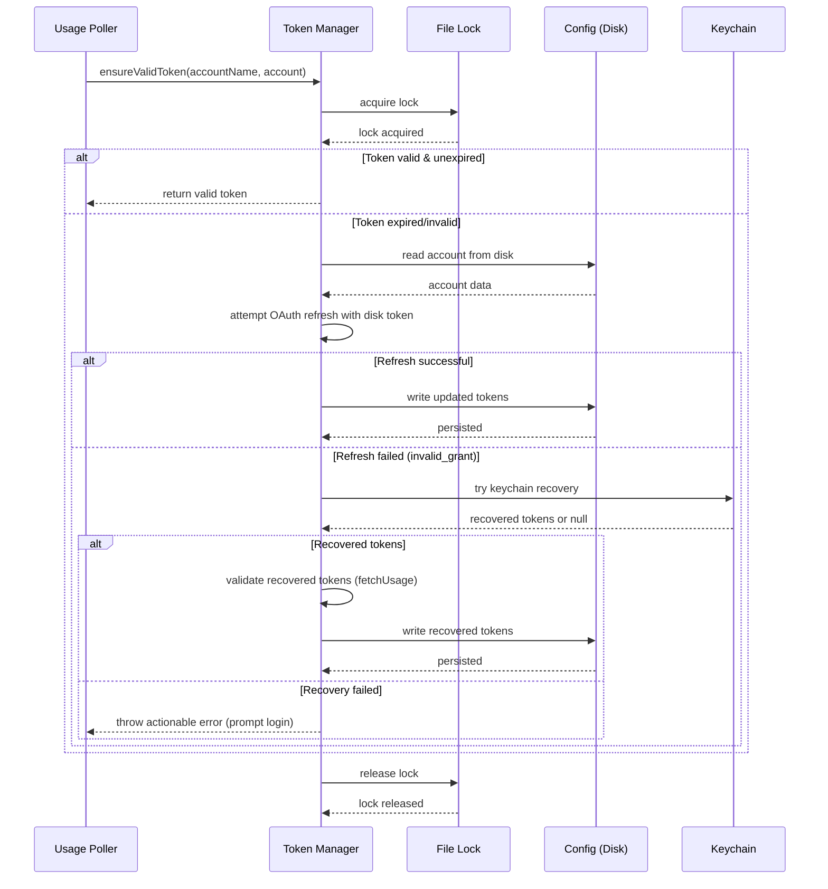

# PR Review: #75

**fix(claude-usage): prevent OAuth token loss on crash**

| | |
|---|---|
| **Repository** | [genesiscz/GenesisTools](https://github.com/genesiscz/GenesisTools/pull/75) |
| **State** | OPEN |
| **Generated** | 2026-03-02T18:15:03.232Z |

## Summary

| Metric | Count |
|--------|-------|
| Total Threads | 11 |
| [X] Unresolved | 11 |
| [OK] Resolved | 0 |
| [HIGH] High Priority | 1 |
| [MED] Medium Priority | 6 |
| [LOW] Low Priority | 4 |

## PR-Level Comments

### @coderabbitai (2026-03-02)

<!-- This is an auto-generated comment: summarize by coderabbit.ai -->
<!-- This is an auto-generated comment: rate limited by coderabbit.ai -->

> [!WARNING]
> ## Rate limit exceeded
> 
> `@genesiscz` has exceeded the limit for the number of commits that can be reviewed per hour. Please wait **1 minutes and 44 seconds** before requesting another review.
> 
> <details>
> <summary>⌛ How to resolve this issue?</summary>
> 
> After the wait time has elapsed, a review can be triggered using the `@coderabbitai review` command as a PR comment. Alternatively, push new commits to this PR.
> 
> We recommend that you space out your commits to avoid hitting the rate limit.
> 
> </details>
> 
> 
> <details>
> <summary>🚦 How do rate limits work?</summary>
> 
> CodeRabbit enforces hourly rate limits for each developer per organization.
> 
> Our paid plans have higher rate limits than the trial, open-source and free plans. In all cases, we re-allow further reviews after a brief timeout.
> 
> Please see our [FAQ](https://docs.coderabbit.ai/faq) for further information.
> 
> </details>
> 
> <details>
> <summary>📥 Commits</summary>
> 
> Reviewing files that changed from the base of the PR and between b984a1931517bfa5f216b7859f13503be5b6bd77 and 83f3b3477387e43715b9315c09a820e4e27f2763.
> 
> </details>
> 
> <details>
> <summary>📒 Files selected for processing (6)</summary>
> 
> * `src/claude/commands/usage-legacy.ts`
> * `src/claude/commands/usage/hooks/use-usage-poller.ts`
> * `src/claude/commands/usage/index.tsx`
> * `src/claude/lib/config/index.ts`
> * `src/claude/lib/usage/api.ts`
> * `src/claude/lib/usage/poll-daemon.ts`
> 
> </details>

<!-- end of auto-generated comment: rate limited by coderabbit.ai -->

<!-- walkthrough_start -->

<details>
<summary>📝 Walkthrough</summary>

## Walkthrough

Reloads config each poll and rebuilds/filters accounts every cycle; token refresh now runs under a file lock with on-disk re-read/write and recovery paths; watcher registers SIGINT/SIGTERM handlers for graceful shutdown. (50 words)

## Changes

|Cohort / File(s)|Summary|
|---|---|
|**Usage poller** <br> `src/claude/commands/usage/hooks/use-usage-poller.ts`|Always reloads configuration on each poll, unconditionally builds `accounts` (falls back to keychain-derived default if empty), applies `accountFilter` consistently, and assigns `accountsRef.current` after filtering.|
|**Token refresh & persistence** <br> `src/claude/lib/usage/api.ts`|Introduces `CONFIG_LOCK_PATH` + `withFileLock` to guard token refresh; re-reads/writes on-disk config under lock, handles concurrent refreshes and `invalid_grant` recovery (including keychain recovery), persists tokens to disk inside the lock, and changes `ensureValidToken` signature to `(accountName: string, account: AccountConfig)`.|
|**Watcher lifecycle** <br> `src/claude/lib/usage/watch.ts`|Adds SIGINT/SIGTERM handlers that log cleanup and exit, enabling immediate termination of the usage watcher.|
|**Config command surface** <br> `src/claude/commands/config.ts`|Removes Keychain-based add flow and related imports; `config add` now requires `--token` (manual-token path), deletes add-from-keychain UI/options and refresh/forking logic; OAuth add remains via `add-oauth`.|

## Sequence Diagram



## Estimated code review effort

🎯 4 (Complex) | ⏱️ ~45 minutes

## Possibly related PRs

- **genesiscz/GenesisTools#49**: Modifies token refresh logic in `src/claude/lib/usage/api.ts` (OAuth refresh and token persistence), closely related to the file-locking and on-disk sync changes here.

## Poem

> 🐰  
> I hopped to check the tokens bright,  
> Locked the chest to keep them tight,  
> Read from disk and set them right,  
> If keys go missing, I'll invite,  
> A nibble, a hop — your creds take flight ✨

</details>

<!-- walkthrough_end -->

<!-- pre_merge_checks_walkthrough_start -->

<details>
<summary>🚥 Pre-merge checks | ✅ 2 | ❌ 1</summary>

### ❌ Failed checks (1 warning)

|     Check name     | Status     | Explanation                                                                           | Resolution                                                                         |
| :----------------: | :--------- | :------------------------------------------------------------------------------------ | :--------------------------------------------------------------------------------- |
| Docstring Coverage | ⚠️ Warning | Docstring coverage is 16.67% which is insufficient. The required threshold is 80.00%. | Write docstrings for the functions missing them to satisfy the coverage threshold. |

<details>
<summary>✅ Passed checks (2 passed)</summary>

|     Check name    | Status   | Explanation                                                                                                                                                                               |
| :---------------: | :------- | :---------------------------------------------------------------------------------------------------------------------------------------------------------------------------------------- |
| Description Check | ✅ Passed | Check skipped - CodeRabbit’s high-level summary is enabled.                                                                                                                               |
|    Title check    | ✅ Passed | The title accurately reflects the main change: preventing OAuth token loss on crash by introducing file-lock-based atomic token persistence and related configuration management updates. |

</details>

<sub>✏️ Tip: You can configure your own custom pre-merge checks in the settings.</sub>

</details>

<!-- pre_merge_checks_walkthrough_end -->

<!-- finishing_touch_checkbox_start -->

<details>
<summary>✨ Finishing Touches</summary>

<details>
<summary>🧪 Generate unit tests (beta)</summary>

- [ ] <!-- {"checkboxId": "f47ac10b-58cc-4372-a567-0e02b2c3d479", "radioGroupId": "utg-output-choice-group-unknown_comment_id"} -->   Create PR with unit tests
- [ ] <!-- {"checkboxId": "07f1e7d6-8a8e-4e23-9900-8731c2c87f58", "radioGroupId": "utg-output-choice-group-unknown_comment_id"} -->   Post copyable unit tests in a comment
- [ ] <!-- {"checkboxId": "6ba7b810-9dad-11d1-80b4-00c04fd430c8", "radioGroupId": "utg-output-choice-group-unknown_comment_id"} -->   Commit unit tests in branch `fix/claude-usage`

</details>

</details>

<!-- finishing_touch_checkbox_end -->

<!-- tips_start -->

---

Thanks for using [CodeRabbit](https://coderabbit.ai?utm_source=oss&utm_medium=github&utm_campaign=genesiscz/GenesisTools&utm_content=75)! It's free for OSS, and your support helps us grow. If you like it, consider giving us a shout-out.

<details>
<summary>❤️ Share</summary>

- [X](https://twitter.com/intent/tweet?text=I%20just%20used%20%40coderabbitai%20for%20my%20code%20review%2C%20and%20it%27s%20fantastic%21%20It%27s%20free%20for%20OSS%20and%20offers%20a%20free%20trial%20for%20the%20proprietary%20code.%20Check%20it%20out%3A&url=https%3A//coderabbit.ai)
- [Mastodon](https://mastodon.social/share?text=I%20just%20used%20%40coderabbitai%20for%20my%20code%20review%2C%20and%20it%27s%20fantastic%21%20It%27s%20free%20for%20OSS%20and%20offers%20a%20free%20trial%20for%20the%20proprietary%20code.%20Check%20it%20out%3A%20https%3A%2F%2Fcoderabbit.ai)
- [Reddit](https://www.reddit.com/submit?title=Great%20tool%20for%20code%20review%20-%20CodeRabbit&text=I%20just%20used%20CodeRabbit%20for%20my%20code%20review%2C%20and%20it%27s%20fantastic%21%20It%27s%20free%20for%20OSS%20and%20offers%20a%20free%20trial%20for%20proprietary%20code.%20Check%20it%20out%3A%20https%3A//coderabbit.ai)
- [LinkedIn](https://www.linkedin.com/sharing/share-offsite/?url=https%3A%2F%2Fcoderabbit.ai&mini=true&title=Great%20tool%20for%20code%20review%20-%20CodeRabbit&summary=I%20just%20used%20CodeRabbit%20for%20my%20code%20review%2C%20and%20it%27s%20fantastic%21%20It%27s%20free%20for%20OSS%20and%20offers%20a%20free%20trial%20for%20proprietary%20code)

</details>

<sub>Comment `@coderabbitai help` to get the list of available commands and usage tips.</sub>

<!-- tips_end -->

<!-- internal state start -->


<!-- DwQgtGAEAqAWCWBnSTIEMB26CuAXA9mAOYCmGJATmriQCaQDG+Ats2bgFyQAOFk+AIwBWJBrngA3EsgEBPRvlqU0AgfFwA6NPEgQAfACgjoCEYDEZyAAUASpETZWaCrKPR1AGxJcAZvAAeABQMHmjYSmDYiGikAJRcvCRSGLiQAPIAgniwkAQA1mSQHviIyPhYDFSIOYG2kGYA7ACssZCQBlm4sPgUXKTkiEgMAF6QgCgEkADK+NgUDN6Qfv4A9CFhEVExJJCASYQwzqSckMxoiDR87ZO41FFc+NyFEwCqNgAyXLC4uNyIHMvLRHUsGwAg0TGYALI0iGw2WAHEoYNENB8PgPIhltxsB4PMtmm0DABhCgkah0LgAJgADBSAGxgKkAZgZFOgAEYmhwACxUjhsxkALSMk0cJxc/B8jFgmFIvwMUAyBGY8AYuXwBSwDwoSKONhIPhJ1TVGuQzm2Wp1dDVkFoSDyKFYdHgZI88jQPnOkBJBukOQA7ggvJBuh5bRgiOhFvAg8UGPaCDwSclUvlCsVSihJV1zRR8PMM6g8tGvPRlbQwN7DTU0LRaIbENJIAADeAYCRoDzwWgAfSIVBSTcglFz2vQHso/CkFAw8CIny92AwiFiGnlkAA0iRZAxpa3IAISNKJPAelKZQtCYoc0kT1FXQol13KFafB3O+H92g49bCaFwttLyUAByZACm3XcKhJJQUmddFIADQo0C9fUq2NQo/VOHhKBOcgUnvVt207WgAG4FFYdRgyQAhxVbW0GDJUCtx3bQsHgZhuB6XBlkAHAIMlrRZc2YDcmIgwBcAn4bhxHKeDMJJZh8CkegEzQCR8C7RYeiLD9TwIjsu2oVsI1/dYAKvexpEGcpEFXKBJlnDAO2DTBaHfCMADIHz8CMSWKGsuD42hkBCUksBIfwKOkyYAEk4SigA5aBlmiuFoAAURsABZFAsAw3Ad2OK9SOzGAniing0S8PgfPwGsgvKLyBJYG07SHL8cgYbcgwTbgVXtbBuEYXNSjAXg8wstCsErX1pFXAxoGkVJuFCDAODXGxF2bAg0SCv8lCKfBAQwQcfFPL8mEXXBkD9IEh38HqoIm5BAleSRWzyNAABpID1BsKGPcgVzWjamy2uC1n/SBNlIGS8tgQdnMgKd4B8N0cXQBhzpSZBqnwP0bWoNAbI3Yt4JuwlcAoDwAGpCRtWZDOQn1qi+w1rgoVIJiRlHHvsWZjykIn1py6h8qp8qcTAWg0BIeSsEGZhsWucgZkQe9OcoZH5AwfBPM7MRrLXV4SFSCgNoUygZznDnEY17ntebXSiN7ftcEHYcegNgwLEgS9yNSNhSi2bHRWcVw1yWYJdpISJojiLg5PNyAwOYvc2I49mJKk0KYJ8+QJgTqRkGKgAiALGqEzdwJY4vFmKPGD3oqJtgok6KDyZBjIhwCSBAxnUNTLAEfo1i2z0qWaB9qOfbMhtShPJcitgHN8BEMRE31ShkCiBmQdRMGp+KQ7B0CTJslaBNKlJCfaJIB4MGglN1TIT39GMcAoDIeh8ElMICGIKEqA0HoOCNgKQEh8EEKvcQhd9zyCYEoKgqh1BaB0K/EwUA4CoFQJgHAf9+jKCAWRUBRwqB4wcE4cUcgFAIJUGoTQ2hdBgEMG/UwBhEBzFWFHVYLAcKBWWFDEgyxujqgxE3GOWwRoVUoBoS6q1i7yK9pYDIUV/7kEAVachYp5DfzPOGaQRgoB6j9JpIuS9PKzn2jWBm3BqA5FbIMPaxUOJox8IuMQ89rQdgwrIZA1UazmKILMAy0lpKknys4jw2Uziki/pKco94EKDwxjMLG6ASTZXULBe8MtJKyCJgAIWwNGQK6NMaXXLowHwRAtDJIulvDATB76ZPKG+WQpFkZDnYrgWQX0fDGx3I2ZOEFBp0HYLBU098HxnFNvrSMShXyK1KSk1IBomrZmYETDI3AlrwEbGdZZAAxaMnp3Seg4jQGCrSpkU2wO4j8xV9l1P4MIUQuAvr2JoP4nR8T5CLgQYwSg1w9yNNtFnA2UAMrm1MdsU4gwiAYGIZ42pWM9Q+DBLMEkKRPHjj4A85FKzjkaw/IfFUgtjYsWQGFKiDMDxHhPHwVuRQVAkEif1ceezJkOAEA2AAjtgdgiYxpz3DF9AQeBSZdFyGYtlZJ6A+DrkOJc9N7lPyXMcNA8gDx92mvQKhYVzgOUiaNfMs9ZpGEUZADIHhzjBLVQmYqSg1iAPnmUSUYV06ENPFiAQetFXiHEPotccUdbMT0UXHW7rOJ0ExCCX1Yzun2HsjcQ0NpjavLoLNF6AxdGkFoFwKmbIACcywwDUiMKlM4bFZXUO2EmXZeN9StyOBlJ0jgDDyOLgY1h7CGCcJMssTsAh+Gx0EWgHqMi5Qdotco1RBCNEh3FDo0NsoDGQCiikXMtBbkvmjNHWM9oBCnCtBaKiZB5gaVxaq7V1RVptAVLWK0hI0hxQOTFbsrw0iEnXN2KwGRoAAAl0CTOul0I5XhXh5j6iO60gTnBKSvVNaoq472KocCSAAamPFEGpIDazxlqVuzBfEoV9JDe+E4kJ+BjJBlm0cSRWO0hgSWLVGleS+tKe+rkHwMAxQKxDS9EBfQRieytH5yB4wHuG5qiB7RsTYLaF0mr9Q9G2E3ImqU7rOStPx2uuMJU5HKMxmT9hZANNgLmGcwxbVAfoCSJgU5ZC3t0Gun+2tsx8GNeNfjdAvpN2QLaYzkn2mSjc7RpmAnIaDHuWYwzAX4xXoRjKmgMh8CSrizZ7KYA2DyXFGcMkyHnMBStO7PgHGXIM0ZY7LsztMCpC3RQBm/GvqBK7AzYqTdL37UOkQ5y4LvokGMW3K0jSKZol03jBGJWnKcYq6efjTmoCEnYFQTswwrQD0htwdlXWVT6b3MVKje7IPmXceUUiBcrStiyzLHo8gOJnArCRo0SXzS2IK1ANII9CLVb7LV5C9nKDyFfNGWYJAvpdFzH6U0p2HI+u2CVomVhY27YyFYMqaHXznprEIKIuBiFyhQ302GVqPAZHxYgJ40G8OMDfJSpVGGsNXpAzkPFZTcNoDYJAQIDk2CtARo8rF49CZrisJvU9DTti0pUvSnN3gDAob1PJRSUrzQlFwGAIn+UotEC8GAP0DWJ4iYueen1kGipXqN2e7YeYeOjmZ/tsxh2wD7uvTkGxXRZreytTasF1oHWiFCM6qyEpboeqtF65Hqp427MQKug5bis6Jvhcm1TW3ZVcCbM/UHmGiLYbIIEAXRwydlMvBgLysRBx7Ez/TkgOeux54wAX/FcUOcLGmYZIT+L/L4tL+Xwce4mw9r7f+Ad8Ah0COWGO+AE6mzmEsBlTAyMFqQDA9sDIhrZBrYoEYLNjZl3kkgFTWkVIS2MgpO2hR8pu0cPBkoUf4+R3LFyjuCdciFFe5Ufg9R9BNGhxD/v2PDoWsZAX7eYVxSJaoPAWgXGLAYRdua0Z/WASnLYWBXmblSoMfNrHWZKeKaADLZKNKTKDLUaY8MMCMJCYKTAfqRYBPDxLoagLrU0Y4CyFAybcKcpJxXME1DQGAMxSgjAag1AEkQEaJB6A8VubYYqE4PcCJBmYoe4DLaAxsNzdAa1CcVxBpRPOFByXAUHMoKqY2WYLAbpB4aySAYNWXKTEbXMSJeVPTA8WQcoegMgFQLjOTJ0MkXIbCVsazRJKVEobYbQjsU0dJOzEgSQDNc1adNQoPO1HWf3J1W1V1UPKNL+DzSPP1TJQNKAYNcgHfVsPfDjXNfNBoEtKkctStE4QheBWtG8AbIcHwJtLgFtW0NtKdK/MAIwIfW/QREBXrbhMvWcV/C/TtD/Wdb/XmChbRSUAA1dRXc2egSuFOJjQ9BsegQvdAWsZpTUWxLgB5WsMAIZFidGRPfnNGdQZAUqQVLpQTS1NHGnHEW4jbVuLSIgL6b7ceeeITTlaXYlA6XbM0VNLwIBHguAbYU+SVBGHCbADsMAZ4uuYjaQjAUVcVKQqgxyOwvGVAcQK2KEeDZCPleAdJJCDbY8JCCADbBGBMM4FTfgDAe8M6CyBvLne2F45YHTElBgFcdoKAJ4NPQhGsYBHhBGKXY8HoPYsxQUtAvoyZanEkQklNEkq9MkxhDbQID5GJEPCmWQLA5CfxVZCuESY408F4wybksE3mDGcaAOaDeWHZPwdbHWLxDVZAWiFUTwjYwUq0ZnGYf2MZcoBmX+QgfjMlLdeYegNOTiCZegJQO+aCBgGPZCUIQhBMJY4ZKkhDJ7WAeOG7ZXSM9mZARlQ4NMliYkUZS5OCBGfjCE2ABvL6FlNiHw8QaLcIqqC6NiVTEdImUqZYe4X3O0zsPweiLOHMpXdbMxXifiA04SKuVscSPsjxBGC49AUoPMZ0QhMrNw4wyU/FE4jxTEomDKVsU8JQRADAySCIywrgF7JSSU/iGUmM6Qc8xPBMb0LwNeaE2EjbARDLGsnbHYrobxZCJE10lIL8VIFU4qKlUTcgg4mqbIcbT3SwOfS1GIpIv3MxR1QPdCnRSNdmcPdIn1XbaPbItddiTiYChYjPYso01sMsh+cZY6QSZsAAATHW4GHzv0HWHS2Enx6n7ywEHxvy4QfIxFYyGMulnygCinIozguzzWbGrM6FrNVSYqaibDYu2X4XEHRE4tHWyAEubG6JEuFPvjEvqgksQCkqmBBAfMznnmWCCN0OJNoBxzOERUCG9V9VR3R1mExxIHiFl2tCbHEqIEHAfMAEwCU0fiLlB8+XZzA5QSDPUKzY+gYAHnEgPQQcZncqC5cQRyEsq7VYl8BVdUhpDwcIBmBc4PTsAoZsCk1Sr6JsCAbWDXTSJsWIeKjBfAZKiy2CtKjKrK/TewCmFUVIZquEq9YAAeIa6qweTlNOQc3ZdYmHJPHQ0HSLHePs34SAAAbwmgAH4uB28PwABfaygAESfIawvJCUlC8t2zsqco2pvIWxXyStTTPJusT29GfAaUaxiQq2YsKvmrlU0n3EPGlx6C6pgB6s+ufI8V+sxQTI/E/I8Empwx/JPmUv/J4FsWAopURmdGbEFLAHgq6A6vyOzX3wUoLRPzAA5FpAqPECqOGzMjrXqMbU4maNbWYBGK7WYXQUVViVwUIC/2rRAXYHjjQDIQXU1TgSvEQToRQUYUMCFpAXUG7C7EQG7A5r9DoG7DywzlfgMCFrZHmAaB8ELQAA4GhGQBBC0GgSBraKQfBrbGQi0GhrafAGgKQBBGRC0uRXw2QSASAeRGQI6uRVbTb35IAGh3RGQqQBAg7GQXbaRrbC0SBU6qRaQI6mgqQmhrbSQSAqQ3ai6s73QfBaQ2Ro6haHbrauQ0Ai0Pamg2QGgBBXwmgfAKQ2RaQBAvamhC0fB+R877aSAmgBA+7aAGgGho6Y6IAiFNbtbda6j9aexP5a7Y7Ehuw2AKBSBuwBk4wdajbUgTbdr4ri4kBbB8l906BfZiErA1c6Bi5fBgiwcL6cZsRaAb7INbAX7Fg36PoL6kA0gpwGsH0MB/7Xx0R362hi5bRaAhYLq8wrgGtwxEBCQl44x/6blYHIB4GuwhZ3BcAvBMHRA8gcHTY8GCHEHFwrqvr4BbqMAyHsHX6YGgG4H3wChaAopSh+VEBUH/75EOH8HQgzgWG8gfpFZEB/6ABteKtoc+toZR/Bw+vIFvNgIR+hhG6SCR4uERlR4uPLXQmRvYqhgx5R4ud1ZaW1IRiR+wIsbZK0RbK8GwWhdQKKyiOcZ3JIFlSYrRFAOnVwjNfRhRyx+SJQIRjCacQyUJlRuBnoWcHwjwCRjRkgIR08nRyBsJ06ixpR+J4uNRtJoR4hoMNRuJgp4xqISh/lCxuB6xzAWxrgYuC0/1IMM6IJGge8N815aFdVYFIohYRIZMBmP8jbdMMoSCU4HIKhVsUbMMirXdZ3SDMAYq9YpUXbDbS3CXDLHyCWvqzpjxHCLYRFF7ayCpwxiJ9J5p6JmccMC5yxuzA5kkKBwBsJhJhrQ6DsVJ1vIRtp9JnJvJ951RrB9R355p5BhgE6oyc2KgUgB5uBqp0xgB9h4Fqxu6GxrOLRvMaFhQKcFA1AXujQWkBoAAUnggQHyiwSVUaJVF2RSFBLMXlKKQegh19DRAjOQGtqpA0CpCpFJY0ARfwcNDRDwHniEYAHUDdthoCoXRr0GL0VcaDNCXVjgkBtcVchJqSDJEBuZioAc4XJDzN2XQxBW6n8GrmonnA7miAhXi5EmvmUnQXinmnZXoWZGcn4qABdER4uMR3AWwbR768V5ptAL2w9RoxkWgBu/Op2rkLkRkeOhgNkHwLkO2+24ehgW22gHwBgB2hoLkCkBoKkNkLkR22gOkWkRu62vutAa2poLN4eqkCpv104ANmwUp65/Bt2rN5OrkR1BgRkLkfUWkdO9OtkNkcQ12/ugQa2tkCkKNnNikWgAunwWgf28ehoBgKutkKkZoBgJoRkWkCkIuhgWkFtt1+VogS8fF0gddA1DsK4Mkf+/JxF4S/tUSni0gIRVEduYdaOARSRHEaRS6F9tFgga4DwePFVqyf+tkc14uDQmHRACVoESF91/+8olR3JsJox99kfbiifRAidMD+J/BiDjsaD5DuDhDpDsFVDrodDq95FrD5RnDwx4y/tQjx/KfEjrgV9yxijqD2g2DykWjkTpcBj2AJjtBogZFtkQF3DzjkfT90Kvjva8D1LSjiT5FikcTmDyTtDnF5jzDz1toU6gwCz+eqAbe3e/etRnWjetBWOoM7sGxJuQ264GgTz5wU+phIwXa1ts4KwMINYxUPUY8AbO+nhdQS8C6F+qkKzoW1z9zhsHz7zpzphIAA= -->

<!-- internal state end -->

---

### @gemini-code-assist (2026-03-02)

## Summary of Changes

Hello, I'm Gemini Code Assist[^1]! I'm currently reviewing this pull request and will post my feedback shortly. In the meantime, here's a summary to help you and other reviewers quickly get up to speed!

This pull request addresses the issue of OAuth token loss in the Claude usage tool, particularly when the process is killed during a token refresh. It introduces atomic token persistence, keychain recovery, and improved signal handling to ensure more reliable token management and prevent `invalid_grant` errors.

### Highlights

* **Atomic Token Persistence**: Refresh tokens are now immediately persisted to disk with file locking, preventing token loss during process interruptions.
* **Keychain Recovery**: The system now attempts to recover credentials from the Claude Code keychain if a refresh token is permanently invalid.
* **Signal Handling and Config Reload**: Implemented clean exit on SIGINT/SIGTERM in watch mode, and the TUI poller reloads config each cycle to pick up cross-process token refreshes.

🧠 **New Feature in Public Preview:** You can now enable **Memory** to help **Gemini Code Assist** learn from your team's feedback. This makes future code reviews more consistent and personalized to your project's style. **Click [here](https://codeassist.google/code-review/login) to enable Memory in your admin console.**

<details>
<summary><b>Changelog</b></summary>

* **src/claude/commands/usage/hooks/use-usage-poller.ts**
    * The poller now reloads the config on each cycle.
* **src/claude/lib/usage/api.ts**
    * Added file locking to token refresh to prevent data loss.
    * Implemented keychain recovery for invalid tokens.
    * Refactored token refresh logic for better reliability.
* **src/claude/lib/usage/watch.ts**
    * Added signal handling for SIGINT and SIGTERM to allow for clean exits.
</details>

<details>
<summary><b>Activity</b></summary>

* The pull request implements atomic token persistence to prevent token loss on crash.
* Keychain recovery was added to fallback to Claude Code's keychain credentials.
* Signal handling for SIGINT/SIGTERM was implemented for clean exits in watch mode.
* The TUI poller now reloads config from disk each cycle.
</details>

<details>
<summary><b>Using Gemini Code Assist</b></summary>
<br>

The full guide for Gemini Code Assist can be found on our [documentation page](https://developers.google.com/gemini-code-assist/docs/review-github-code), here are some quick tips.

<b>Invoking Gemini</b>

You can request assistance from Gemini at any point by creating a comment using either `/gemini <command>` or `@gemini-code-assist <command>`. Below is a summary of the supported commands on the current page.

Feature | Command | Description
--- | --- | ---
Code Review | `/gemini review` | Performs a code review for the current pull request in its current state.
Pull Request Summary | `/gemini summary` | Provides a summary of the current pull request in its current state.
Comment | @gemini-code-assist | Responds in comments when explicitly tagged, both in pull request comments and review comments.
Help | `/gemini help` | Displays a list of available commands.

<b>Customization</b>

To customize Gemini Code Assist for GitHub experience, repository maintainers can create a configuration file and/or provide a custom code review style guide (such as PEP-8 for Python) by creating and adding files to a `.gemini/` folder in the base of the repository. Detailed instructions can be found [here](https://developers.google.com/gemini-code-assist/docs/customize-gemini-behavior-github).

<b>Limitations & Feedback</b>

Gemini Code Assist may make mistakes. Please leave feedback on any instances where its feedback is incorrect or counter productive. You can react with :thumbsup: and :thumbsdown: on @gemini-code-assist comments. If you're interested in giving your feedback about your experience with Gemini Code Assist for Github and other Google products, sign up [here](https://google.qualtrics.com/jfe/form/SV_2cyuGuTWsEw84yG).

<b>You can also get AI-powered code generation, chat, as well as code reviews directly in the IDE at no cost with the [Gemini Code Assist IDE Extension](https://cloud.google.com/products/gemini/code-assist).</b>
</details>


[^1]: Review the [Privacy Notices](https://policies.google.com/privacy), [Generative AI Prohibited Use Policy](https://policies.google.com/terms/generative-ai/use-policy), [Terms of Service](https://policies.google.com/terms), and learn how to configure Gemini Code Assist in GitHub [here](https://developers.google.com/gemini-code-assist/docs/customize-gemini-behavior-github). Gemini can make mistakes, so double check it and [use code with caution](https://support.google.com/legal/answer/13505487).


---

### @gemini-code-assist — COMMENTED (2026-03-02)

## Code Review

This pull request introduces several important reliability improvements for Claude token handling. The use of a file lock for atomic token persistence is a solid approach to prevent token loss on crashes. The fallback to keychain credentials for recovery from `invalid_grant` errors is a great enhancement for user experience. Additionally, adding signal handlers for graceful shutdown in watch mode and ensuring the config is always reloaded in the TUI poller are valuable changes.

My review includes a couple of suggestions for `src/claude/lib/usage/api.ts` to improve code clarity and maintainability by refactoring a dynamic import and reducing some code duplication. Overall, these are excellent changes that address a critical stability issue.

---

### @coderabbitai — COMMENTED (2026-03-02)

**Actionable comments posted: 4**

<details>
<summary>🤖 Prompt for all review comments with AI agents</summary>

```
Verify each finding against the current code and only fix it if needed.

Inline comments:
In `@src/claude/commands/usage/hooks/use-usage-poller.ts`:
- Around line 78-80: The current filter logic in use-usage-poller.ts silently
falls back to the full accounts set when accountFilter is provided but not
found; change the fallback to an empty set (or short-circuit) so we do not poll
other accounts: in the block referencing accountFilter and accounts replace the
else branch that returns the unfiltered accounts with an explicit empty object
(e.g., accounts = accounts[accountFilter] ? { [accountFilter]:
accounts[accountFilter] } : {}) or return early/skip processing when the keyed
account is missing, keeping the reference to accountFilter and accounts to
locate the change.

In `@src/claude/lib/usage/api.ts`:
- Around line 97-105: tryKeychainRecovery() can return credentials for a
different identity, so when handling the invalid_grant path in the function that
updates freshConfig.accounts[accountName] and returns recovered tokens, validate
that the recovered credentials actually belong to accountName before writing or
assigning them; modify tryKeychainRecovery to accept accountName (or return an
identity claim like user id/email/client_id), or perform a token
introspection/userinfo call after recovery to verify the subject matches
accountName, and only then update freshConfig.accounts[accountName],
account.accessToken/refreshToken/expiresAt and return refreshed:true; apply the
same guard to the other recovery block around lines 138-153.
- Around line 138-141: The function signature for tryKeychainRecovery has
formatting that fails the linter/formatter; run the project's formatter (or bun
run lint --fix / npm run format) and update the signature to match the repo
style so the return type and generics are wrapped/spaced per rules (i.e.,
normalize spacing and line breaks around: async function tryKeychainRecovery():
Promise<Pick<AccountConfig, "accessToken" | "refreshToken" | "expiresAt"> |
null>), then commit the formatted result so CI passes.

In `@src/claude/lib/usage/watch.ts`:
- Around line 164-170: The current signal handler (cleanup) calls
process.exit(0) immediately which can interrupt in-flight operations; instead,
change cleanup to set a shared stop flag (e.g., shouldStop = true) and remove
the immediate process.exit call, register cleanup for SIGINT/SIGTERM, and have
the main watch loop (the function performing poll/refresh iterations) check
shouldStop at the start/end of each iteration and exit cleanly when true; once
the loop completes, call process.exit(0) (or resolve/return) and remove the
signal listeners so cleanup is idempotent.
```

</details>

---

<details>
<summary>ℹ️ Review info</summary>

**Configuration used**: defaults

**Review profile**: CHILL

**Plan**: Pro

<details>
<summary>📥 Commits</summary>

Reviewing files that changed from the base of the PR and between aa421549c38078b6a1f00ff181ef9ffa6cfa0ee2 and 1ce7f9873b97e82f831978f72b394fa1ee403334.

</details>

<details>
<summary>📒 Files selected for processing (3)</summary>

* `src/claude/commands/usage/hooks/use-usage-poller.ts`
* `src/claude/lib/usage/api.ts`
* `src/claude/lib/usage/watch.ts`

</details>

</details>

<!-- This is an auto-generated comment by CodeRabbit for review status -->

---

### @copilot-pull-request-reviewer — COMMENTED (2026-03-02)

## Pull request overview

Improves reliability of Claude usage polling by making OAuth refresh handling crash-/multi-process-safe and by ensuring long-running polling UIs pick up refreshed credentials from disk.

**Changes:**
- Refresh flow now re-reads config under a file lock and persists refreshed tokens immediately (plus keychain-based recovery on `invalid_grant`).
- Watch mode adds SIGINT/SIGTERM handling for stopping the loop.
- TUI poller reloads config from disk every poll cycle to observe cross-process token refreshes.

### Reviewed changes

Copilot reviewed 3 out of 3 changed files in this pull request and generated 5 comments.

| File | Description |
| ---- | ----------- |
| `src/claude/lib/usage/watch.ts` | Adds signal handling intended to stop watch mode cleanly. |
| `src/claude/lib/usage/api.ts` | Introduces lock-guarded refresh + immediate persistence and keychain recovery path. |
| `src/claude/commands/usage/hooks/use-usage-poller.ts` | Reloads config on each poll so refreshed tokens are observed across processes. |


---

💡 <a href="/genesiscz/GenesisTools/new/master?filename=.github/instructions/*.instructions.md" class="Link--inTextBlock" target="_blank" rel="noopener noreferrer">Add Copilot custom instructions</a> for smarter, more guided reviews. <a href="https://docs.github.com/en/copilot/customizing-copilot/adding-repository-custom-instructions-for-github-copilot" class="Link--inTextBlock" target="_blank" rel="noopener noreferrer">Learn how to get started</a>.

---

### @coderabbitai — COMMENTED (2026-03-02)

<details>
<summary>🧹 Nitpick comments (1)</summary><blockquote>

<details>
<summary>src/claude/lib/usage/api.ts (1)</summary><blockquote>

`80-82`: **Consider throwing when disk account state prevents refresh.**

When `diskAccount` is missing or lacks a `refreshToken`, returning the in-memory token (which we know is expired/expiring from line 68) will cause the subsequent API call to fail. While this is caught by `Promise.allSettled`, an explicit error here would provide clearer diagnostics.


<details>
<summary>💡 Optional: Throw with actionable guidance</summary>

```diff
             if (!diskAccount?.refreshToken) {
-                return { accessToken: account.accessToken, refreshed: false };
+                throw new Error(
+                    `Cannot refresh token for ${accountName}: no refresh token on disk. ` +
+                    `Run: tools claude login ${accountName}`
+                );
             }
```

</details>

<details>
<summary>🤖 Prompt for AI Agents</summary>

```
Verify each finding against the current code and only fix it if needed.

In `@src/claude/lib/usage/api.ts` around lines 80 - 82, The current logic returns
account.accessToken when diskAccount is missing or has no refreshToken
(diskAccount?.refreshToken check), which hides the fact the in-memory token is
expired and causes later API failures; change this to throw a clear Error
instead of returning the stale token — include actionable guidance in the
message (e.g., mention missing diskAccount.refreshToken and that refresh is
required) so callers (and Promise.allSettled) surface the failure; update the
code path that uses diskAccount, refreshToken, and account.accessToken to throw
rather than return in that branch.
```

</details>

</blockquote></details>

</blockquote></details>

<details>
<summary>🤖 Prompt for all review comments with AI agents</summary>

```
Verify each finding against the current code and only fix it if needed.

Nitpick comments:
In `@src/claude/lib/usage/api.ts`:
- Around line 80-82: The current logic returns account.accessToken when
diskAccount is missing or has no refreshToken (diskAccount?.refreshToken check),
which hides the fact the in-memory token is expired and causes later API
failures; change this to throw a clear Error instead of returning the stale
token — include actionable guidance in the message (e.g., mention missing
diskAccount.refreshToken and that refresh is required) so callers (and
Promise.allSettled) surface the failure; update the code path that uses
diskAccount, refreshToken, and account.accessToken to throw rather than return
in that branch.
```

</details>

---

<details>
<summary>ℹ️ Review info</summary>

**Configuration used**: defaults

**Review profile**: CHILL

**Plan**: Pro

<details>
<summary>📥 Commits</summary>

Reviewing files that changed from the base of the PR and between 1ce7f9873b97e82f831978f72b394fa1ee403334 and 7af30b4f382689e3806335058eae0f88ee3aff61.

</details>

<details>
<summary>📒 Files selected for processing (1)</summary>

* `src/claude/lib/usage/api.ts`

</details>

</details>

<!-- This is an auto-generated comment by CodeRabbit for review status -->

---

### @coderabbitai — COMMENTED (2026-03-02)

<details>
<summary>🧹 Nitpick comments (1)</summary><blockquote>

<details>
<summary>src/claude/commands/config.ts (1)</summary><blockquote>

`473-484`: **Consider adding token validation for consistency with interactive flow.**

The interactive `add-manual` flow (lines 283-297) validates the token via `fetchUsage()` before saving, but the CLI `add` command saves immediately without validation. This could lead to saving invalid tokens.

If this is intentional for scripting/automation scenarios, consider documenting this difference. Otherwise, you could add optional validation:


<details>
<summary>♻️ Optional: Add validation with skip flag</summary>

```diff
     .option("--token <token>", "OAuth access token")
+    .option("--skip-validation", "Skip token validation")
-    .action(async (name: string, opts: { token?: string }) => {
+    .action(async (name: string, opts: { token?: string; skipValidation?: boolean }) => {
         const config = await loadConfig();
         if (config.accounts[name]) {
             p.log.error(`Account "${name}" already exists.`);
             process.exit(1);
         }

         if (!opts.token) {
             p.log.error("--token is required. Use `tools claude login` for OAuth with auto-refresh.");
             process.exit(1);
         }

+        if (!opts.skipValidation) {
+            try {
+                await fetchUsage(opts.token);
+            } catch (err) {
+                p.log.error(`Token validation failed: ${err}`);
+                process.exit(1);
+            }
+        }
+
         config.accounts[name] = { accessToken: opts.token };
```

</details>

<details>
<summary>🤖 Prompt for AI Agents</summary>

```
Verify each finding against the current code and only fix it if needed.

In `@src/claude/commands/config.ts` around lines 473 - 484, The CLI "add" branch
currently accepts opts.token and immediately sets config.accounts[name] and
calls saveConfig without validating the token, unlike the interactive add-manual
flow which calls fetchUsage() first; update the add command handler (the branch
that checks opts.token and assigns config.accounts[name]) to optionally validate
the token by calling fetchUsage() before persisting, or add a --skip-validation
flag to bypass validation for automation; ensure you use the same validation
logic as add-manual (calling fetchUsage() and handling failures by logging
p.log.error and exiting) and only call saveConfig and p.log.success when
validation passes (or when --skip-validation is set).
```

</details>

</blockquote></details>

</blockquote></details>

<details>
<summary>🤖 Prompt for all review comments with AI agents</summary>

```
Verify each finding against the current code and only fix it if needed.

Nitpick comments:
In `@src/claude/commands/config.ts`:
- Around line 473-484: The CLI "add" branch currently accepts opts.token and
immediately sets config.accounts[name] and calls saveConfig without validating
the token, unlike the interactive add-manual flow which calls fetchUsage()
first; update the add command handler (the branch that checks opts.token and
assigns config.accounts[name]) to optionally validate the token by calling
fetchUsage() before persisting, or add a --skip-validation flag to bypass
validation for automation; ensure you use the same validation logic as
add-manual (calling fetchUsage() and handling failures by logging p.log.error
and exiting) and only call saveConfig and p.log.success when validation passes
(or when --skip-validation is set).
```

</details>

---

<details>
<summary>ℹ️ Review info</summary>

**Configuration used**: defaults

**Review profile**: CHILL

**Plan**: Pro

<details>
<summary>📥 Commits</summary>

Reviewing files that changed from the base of the PR and between 7af30b4f382689e3806335058eae0f88ee3aff61 and b984a1931517bfa5f216b7859f13503be5b6bd77.

</details>

<details>
<summary>📒 Files selected for processing (1)</summary>

* `src/claude/commands/config.ts`

</details>

</details>

<!-- This is an auto-generated comment by CodeRabbit for review status -->

---

## Review Threads

### `src/claude/lib/usage/api.ts`

*8 thread(s)*

### Thread #1 (PRRT_kwDOOay0us5xlOmY): There's some code duplication in how the new tokens are p...

| Property | Value |
|----------|-------|
| **Status** | [X] UNRESOLVED |
| **Severity** | [MED] MEDIUM |
| **File** | `src/claude/lib/usage/api.ts` |
| **Author** | @gemini-code-assist |
| **Thread ID** | #1 (`PRRT_kwDOOay0us5xlOmY`) |
| **First Comment ID** | `PRRC_kwDOOay0us6rQOc1` |

**Issue:**

There's some code duplication in how the new tokens are persisted to the config file and updated in the in-memory `account` object. This happens both after a successful keychain recovery and after a normal token refresh. This logic could be extracted into a helper function to improve maintainability and reduce repetition.

For example, you could create a helper function:
```typescript
async function updateAndPersistTokens(
    config: ClaudeConfig,
    accountName: string,
    inMemoryAccount: AccountConfig,
    newTokens: Pick<AccountConfig, "accessToken" | "refreshToken" | "expiresAt">
) {
    const diskAccount = config.accounts[accountName];
    config.accounts[accountName] = { ...diskAccount, ...newTokens };
    await saveConfig(config);

    Object.assign(inMemoryAccount, newTokens);
}
```
Using this helper would make the `ensureValidToken` function cleaner and less error-prone.

<details>
<summary>Code Context</summary>

```diff
@@ -48,30 +52,108 @@ export async function fetchUsage(accessToken: string): Promise<UsageResponse> {
 
 /**
  * Check if an account's token needs refresh and refresh if possible.
- * Returns the (possibly updated) access token.
+ * Persists new tokens to disk immediately under a file lock to prevent
+ * token loss on crash (refresh tokens are single-use).
  */
-async function ensureValidToken(account: AccountConfig): Promise<{ accessToken: string; refreshed: boolean }> {
+async function ensureValidToken(
+    accountName: string,
+    account: AccountConfig
+): Promise<{ accessToken: string; refreshed: boolean }> {
     // No refresh token? Can't auto-refresh
     if (!account.refreshToken) {
         return { accessToken: account.accessToken, refreshed: false };
     }
 
     // Token still valid? No refresh needed
-    const now = Date.now();
-    if (account.expiresAt && account.expiresAt > now + EXPIRY_BUFFER_MS) {
+    if (account.expiresAt && account.expiresAt > Date.now() + EXPIRY_BUFFER_MS) {
         return { accessToken: account.accessToken, refreshed: false };
     }
 
-    // Token expired or expiring soon — refresh it
-    const refreshed = await refreshOAuthToken(account.refreshToken);
+    // Token expired or expiring soon — refresh under file lock
+    return withFileLock(
+        CONFIG_LOCK_PATH,
+        async () => {
+            // Re-read config from disk (another process may have refreshed)
+            const freshConfig = await loadConfig();
+            const diskAccount = freshConfig.accounts[accountName];
 
-    // Update in-memory account so subsequent polls use fresh tokens
-    // (Critical: refresh tokens are single-use, old RT is now invalid)
-    account.accessToken = refreshed.accessToken;
-    account.refreshToken = refreshed.refreshToken;
-    account.expiresAt = refreshed.expiresAt;
+            if (!diskAccount?.refreshToken) {
+                return { accessToken: account.accessToken, refreshed: false };
+            }
+
+            // Another process already refreshed — use their tokens
+            if (diskAccount.expiresAt && diskAccount.expiresAt > Date.now() + EXPIRY_BUFFER_MS) {
+                account.accessToken = diskAccount.accessToken;
+                account.refreshToken = diskAccount.refreshToken;
+                account.expiresAt = diskAccount.expiresAt;
+                return { accessToken: diskAccount.accessToken, refreshed: true };
+            }
+
+            // Refresh using the on-disk token (in-memory might be stale)
+            let refreshed: Awaited<ReturnType<typeof refreshOAuthToken>>;
+            try {
+                refreshed = await refreshOAuthToken(diskAccount.refreshToken);
+            } catch (err) {
+                if (String(err).includes("invalid_grant")) {
+                    const recovered = await tryKeychainRecovery();
+                    if (recovered) {
+                        freshConfig.accounts[accountName] = { ...diskAccount, ...recovered };
+                        await saveConfig(freshConfig);
+                        account.accessToken = recovered.accessToken;
+                        account.refreshToken = recovered.refreshToken;
+                        account.expiresAt = recovered.expiresAt;
+                        return { accessToken: recovered.accessToken, refreshed: true };
+                    }
+
+                    throw new Error(`Token expired (invalid_grant). Run: tools claude login ${accountName}`);
+                }
+
+                throw err;
+            }
 
-    return { accessToken: refreshed.accessToken, refreshed: true };
+            // Persist immediately BEFORE using the new token
+            freshConfig.accounts[accountName] = {
+                ...diskAccount,
+                accessToken: refreshed.accessToken,
+                refreshToken: refreshed.refreshToken,
+                expiresAt: refreshed.expiresAt,
+            };
+            await saveConfig(freshConfig);
+
+            // Update in-memory account
+            account.accessToken = refreshed.accessToken;
+            account.refreshToken = refreshed.refreshToken;
+            account.expiresAt = refreshed.expiresAt;
+
+            return { accessToken: refreshed.accessToken, refreshed: true };
```

</details>

---

### Thread #2 (PRRT_kwDOOay0us5xlOmh): The dynamic import of getKeychainCredentials is a bit unu...

| Property | Value |
|----------|-------|
| **Status** | [X] UNRESOLVED |
| **Severity** | [MED] MEDIUM |
| **File** | `src/claude/lib/usage/api.ts` |
| **Author** | @gemini-code-assist |
| **Thread ID** | #2 (`PRRT_kwDOOay0us5xlOmh`) |
| **First Comment ID** | `PRRC_kwDOOay0us6rQOc_` |

**Issue:**

The dynamic import of `getKeychainCredentials` is a bit unusual here. For better code clarity and to make dependencies explicit, consider importing `getKeychainCredentials` at the top of the file. This would require adjusting the existing re-export to an import and then an export, which would make the code easier to follow.

For example, you could change the imports at the top of the file to:
```typescript
import { getKeychainCredentials, refreshOAuthToken } from "@app/utils/claude/auth";
// ...
export { getKeychainCredentials };
```
With this change, you can call `getKeychainCredentials()` directly in this function without a dynamic import.

<details>
<summary>Code Context</summary>

```diff
@@ -48,30 +52,108 @@ export async function fetchUsage(accessToken: string): Promise<UsageResponse> {
 
 /**
  * Check if an account's token needs refresh and refresh if possible.
- * Returns the (possibly updated) access token.
+ * Persists new tokens to disk immediately under a file lock to prevent
+ * token loss on crash (refresh tokens are single-use).
  */
-async function ensureValidToken(account: AccountConfig): Promise<{ accessToken: string; refreshed: boolean }> {
+async function ensureValidToken(
+    accountName: string,
+    account: AccountConfig
+): Promise<{ accessToken: string; refreshed: boolean }> {
     // No refresh token? Can't auto-refresh
     if (!account.refreshToken) {
         return { accessToken: account.accessToken, refreshed: false };
     }
 
     // Token still valid? No refresh needed
-    const now = Date.now();
-    if (account.expiresAt && account.expiresAt > now + EXPIRY_BUFFER_MS) {
+    if (account.expiresAt && account.expiresAt > Date.now() + EXPIRY_BUFFER_MS) {
         return { accessToken: account.accessToken, refreshed: false };
     }
 
-    // Token expired or expiring soon — refresh it
-    const refreshed = await refreshOAuthToken(account.refreshToken);
+    // Token expired or expiring soon — refresh under file lock
+    return withFileLock(
+        CONFIG_LOCK_PATH,
+        async () => {
+            // Re-read config from disk (another process may have refreshed)
+            const freshConfig = await loadConfig();
+            const diskAccount = freshConfig.accounts[accountName];
 
-    // Update in-memory account so subsequent polls use fresh tokens
-    // (Critical: refresh tokens are single-use, old RT is now invalid)
-    account.accessToken = refreshed.accessToken;
-    account.refreshToken = refreshed.refreshToken;
-    account.expiresAt = refreshed.expiresAt;
+            if (!diskAccount?.refreshToken) {
+                return { accessToken: account.accessToken, refreshed: false };
+            }
+
+            // Another process already refreshed — use their tokens
+            if (diskAccount.expiresAt && diskAccount.expiresAt > Date.now() + EXPIRY_BUFFER_MS) {
+                account.accessToken = diskAccount.accessToken;
+                account.refreshToken = diskAccount.refreshToken;
+                account.expiresAt = diskAccount.expiresAt;
+                return { accessToken: diskAccount.accessToken, refreshed: true };
+            }
+
+            // Refresh using the on-disk token (in-memory might be stale)
+            let refreshed: Awaited<ReturnType<typeof refreshOAuthToken>>;
+            try {
+                refreshed = await refreshOAuthToken(diskAccount.refreshToken);
+            } catch (err) {
+                if (String(err).includes("invalid_grant")) {
+                    const recovered = await tryKeychainRecovery();
+                    if (recovered) {
+                        freshConfig.accounts[accountName] = { ...diskAccount, ...recovered };
+                        await saveConfig(freshConfig);
+                        account.accessToken = recovered.accessToken;
+                        account.refreshToken = recovered.refreshToken;
+                        account.expiresAt = recovered.expiresAt;
+                        return { accessToken: recovered.accessToken, refreshed: true };
+                    }
+
+                    throw new Error(`Token expired (invalid_grant). Run: tools claude login ${accountName}`);
+                }
+
+                throw err;
+            }
 
-    return { accessToken: refreshed.accessToken, refreshed: true };
+            // Persist immediately BEFORE using the new token
+            freshConfig.accounts[accountName] = {
+                ...diskAccount,
+                accessToken: refreshed.accessToken,
+                refreshToken: refreshed.refreshToken,
+                expiresAt: refreshed.expiresAt,
+            };
+            await saveConfig(freshConfig);
+
+            // Update in-memory account
+            account.accessToken = refreshed.accessToken;
+            account.refreshToken = refreshed.refreshToken;
+            account.expiresAt = refreshed.expiresAt;
+
+            return { accessToken: refreshed.accessToken, refreshed: true };
+        },
+        15_000
+    ); // 15s timeout — refresh API call can be slow
+}
+
+/**
+ * Attempt to recover from invalid_grant by checking if Claude Code's
+ * keychain has a valid token we can use.
+ */
+async function tryKeychainRecovery(): Promise<Pick<AccountConfig, "accessToken" | "refreshToken" | "expiresAt"> | null> {
+    try {
+        const { getKeychainCredentials } = await import("@app/utils/claude/auth");
```

</details>

---

### Thread #4 (PRRT_kwDOOay0us5xlQO7): _⚠️ Potential issue_ | _🟠 Major_

| Property | Value |
|----------|-------|
| **Status** | [X] UNRESOLVED |
| **Severity** | [LOW] LOW |
| **File** | `src/claude/lib/usage/api.ts` |
| **Author** | @coderabbitai |
| **Thread ID** | #4 (`PRRT_kwDOOay0us5xlQO7`) |
| **First Comment ID** | `PRRC_kwDOOay0us6rQQjv` |

**Issue:**

_⚠️ Potential issue_ | _🟠 Major_

**Keychain recovery is not account-scoped; it can overwrite the wrong account in multi-account configs.**

`tryKeychainRecovery()` returns a valid token, but not necessarily for `accountName`. On invalid_grant, this can silently replace `freshConfig.accounts[accountName]` with credentials from a different identity.


<details>
<summary>Safer guard (minimal blast radius)</summary>

```diff
             } catch (err) {
                 if (String(err).includes("invalid_grant")) {
+                    if (Object.keys(freshConfig.accounts).length > 1) {
+                        throw new Error(
+                            `Token expired (invalid_grant) for ${accountName}. ` +
+                                `Keychain fallback is disabled in multi-account mode. ` +
+                                `Run: tools claude login ${accountName}`
+                        );
+                    }
+
                     const recovered = await tryKeychainRecovery();
                     if (recovered) {
                         freshConfig.accounts[accountName] = { ...diskAccount, ...recovered };
                         await saveConfig(freshConfig);
```
</details>


Also applies to: 138-153

<details>
<summary>🤖 Prompt for AI Agents</summary>

```
Verify each finding against the current code and only fix it if needed.

In `@src/claude/lib/usage/api.ts` around lines 97 - 105, tryKeychainRecovery() can
return credentials for a different identity, so when handling the invalid_grant
path in the function that updates freshConfig.accounts[accountName] and returns
recovered tokens, validate that the recovered credentials actually belong to
accountName before writing or assigning them; modify tryKeychainRecovery to
accept accountName (or return an identity claim like user id/email/client_id),
or perform a token introspection/userinfo call after recovery to verify the
subject matches accountName, and only then update
freshConfig.accounts[accountName], account.accessToken/refreshToken/expiresAt
and return refreshed:true; apply the same guard to the other recovery block
around lines 138-153.
```

</details>

<!-- fingerprinting:phantom:poseidon:hawk -->

<!-- This is an auto-generated comment by CodeRabbit -->

<details>
<summary>Code Context</summary>

```diff
@@ -48,30 +52,108 @@ export async function fetchUsage(accessToken: string): Promise<UsageResponse> {
 
 /**
  * Check if an account's token needs refresh and refresh if possible.
- * Returns the (possibly updated) access token.
+ * Persists new tokens to disk immediately under a file lock to prevent
+ * token loss on crash (refresh tokens are single-use).
  */
-async function ensureValidToken(account: AccountConfig): Promise<{ accessToken: string; refreshed: boolean }> {
+async function ensureValidToken(
+    accountName: string,
+    account: AccountConfig
+): Promise<{ accessToken: string; refreshed: boolean }> {
     // No refresh token? Can't auto-refresh
     if (!account.refreshToken) {
         return { accessToken: account.accessToken, refreshed: false };
     }
 
     // Token still valid? No refresh needed
-    const now = Date.now();
-    if (account.expiresAt && account.expiresAt > now + EXPIRY_BUFFER_MS) {
+    if (account.expiresAt && account.expiresAt > Date.now() + EXPIRY_BUFFER_MS) {
         return { accessToken: account.accessToken, refreshed: false };
     }
 
-    // Token expired or expiring soon — refresh it
-    const refreshed = await refreshOAuthToken(account.refreshToken);
+    // Token expired or expiring soon — refresh under file lock
+    return withFileLock(
+        CONFIG_LOCK_PATH,
+        async () => {
+            // Re-read config from disk (another process may have refreshed)
+            const freshConfig = await loadConfig();
+            const diskAccount = freshConfig.accounts[accountName];
 
-    // Update in-memory account so subsequent polls use fresh tokens
-    // (Critical: refresh tokens are single-use, old RT is now invalid)
-    account.accessToken = refreshed.accessToken;
-    account.refreshToken = refreshed.refreshToken;
-    account.expiresAt = refreshed.expiresAt;
+            if (!diskAccount?.refreshToken) {
+                return { accessToken: account.accessToken, refreshed: false };
+            }
+
+            // Another process already refreshed — use their tokens
+            if (diskAccount.expiresAt && diskAccount.expiresAt > Date.now() + EXPIRY_BUFFER_MS) {
+                account.accessToken = diskAccount.accessToken;
+                account.refreshToken = diskAccount.refreshToken;
+                account.expiresAt = diskAccount.expiresAt;
+                return { accessToken: diskAccount.accessToken, refreshed: true };
+            }
+
+            // Refresh using the on-disk token (in-memory might be stale)
+            let refreshed: Awaited<ReturnType<typeof refreshOAuthToken>>;
+            try {
+                refreshed = await refreshOAuthToken(diskAccount.refreshToken);
+            } catch (err) {
+                if (String(err).includes("invalid_grant")) {
+                    const recovered = await tryKeychainRecovery();
+                    if (recovered) {
+                        freshConfig.accounts[accountName] = { ...diskAccount, ...recovered };
+                        await saveConfig(freshConfig);
+                        account.accessToken = recovered.accessToken;
+                        account.refreshToken = recovered.refreshToken;
+                        account.expiresAt = recovered.expiresAt;
+                        return { accessToken: recovered.accessToken, refreshed: true };
```

</details>

---

### Thread #5 (PRRT_kwDOOay0us5xlQPA): _⚠️ Potential issue_ | _🟡 Minor_

| Property | Value |
|----------|-------|
| **Status** | [X] UNRESOLVED |
| **Severity** | [MED] MEDIUM |
| **File** | `src/claude/lib/usage/api.ts` |
| **Author** | @coderabbitai |
| **Thread ID** | #5 (`PRRT_kwDOOay0us5xlQPA`) |
| **First Comment ID** | `PRRC_kwDOOay0us6rQQj1` |

**Issue:**

_⚠️ Potential issue_ | _🟡 Minor_

**Fix formatting in `tryKeychainRecovery` signature to unblock CI.**

`bun run lint` is failing on this exact region per pipeline output. Please apply formatter output before merge.

<details>
<summary>🧰 Tools</summary>

<details>
<summary>🪛 GitHub Actions: CI</summary>

[error] 138-141: Formatter would have printed changes for tryKeychainRecovery. Command 'bun run lint' failed with exit code 1.

</details>

</details>

<details>
<summary>🤖 Prompt for AI Agents</summary>

```
Verify each finding against the current code and only fix it if needed.

In `@src/claude/lib/usage/api.ts` around lines 138 - 141, The function signature
for tryKeychainRecovery has formatting that fails the linter/formatter; run the
project's formatter (or bun run lint --fix / npm run format) and update the
signature to match the repo style so the return type and generics are
wrapped/spaced per rules (i.e., normalize spacing and line breaks around: async
function tryKeychainRecovery(): Promise<Pick<AccountConfig, "accessToken" |
"refreshToken" | "expiresAt"> | null>), then commit the formatted result so CI
passes.
```

</details>

<!-- fingerprinting:phantom:poseidon:hawk -->

<!-- This is an auto-generated comment by CodeRabbit -->

<details>
<summary>Code Context</summary>

```diff
@@ -48,30 +52,108 @@ export async function fetchUsage(accessToken: string): Promise<UsageResponse> {
 
 /**
  * Check if an account's token needs refresh and refresh if possible.
- * Returns the (possibly updated) access token.
+ * Persists new tokens to disk immediately under a file lock to prevent
+ * token loss on crash (refresh tokens are single-use).
  */
-async function ensureValidToken(account: AccountConfig): Promise<{ accessToken: string; refreshed: boolean }> {
+async function ensureValidToken(
+    accountName: string,
+    account: AccountConfig
+): Promise<{ accessToken: string; refreshed: boolean }> {
     // No refresh token? Can't auto-refresh
     if (!account.refreshToken) {
         return { accessToken: account.accessToken, refreshed: false };
     }
 
     // Token still valid? No refresh needed
-    const now = Date.now();
-    if (account.expiresAt && account.expiresAt > now + EXPIRY_BUFFER_MS) {
+    if (account.expiresAt && account.expiresAt > Date.now() + EXPIRY_BUFFER_MS) {
         return { accessToken: account.accessToken, refreshed: false };
     }
 
-    // Token expired or expiring soon — refresh it
-    const refreshed = await refreshOAuthToken(account.refreshToken);
+    // Token expired or expiring soon — refresh under file lock
+    return withFileLock(
+        CONFIG_LOCK_PATH,
+        async () => {
+            // Re-read config from disk (another process may have refreshed)
+            const freshConfig = await loadConfig();
+            const diskAccount = freshConfig.accounts[accountName];
 
-    // Update in-memory account so subsequent polls use fresh tokens
-    // (Critical: refresh tokens are single-use, old RT is now invalid)
-    account.accessToken = refreshed.accessToken;
-    account.refreshToken = refreshed.refreshToken;
-    account.expiresAt = refreshed.expiresAt;
+            if (!diskAccount?.refreshToken) {
+                return { accessToken: account.accessToken, refreshed: false };
+            }
+
+            // Another process already refreshed — use their tokens
+            if (diskAccount.expiresAt && diskAccount.expiresAt > Date.now() + EXPIRY_BUFFER_MS) {
+                account.accessToken = diskAccount.accessToken;
+                account.refreshToken = diskAccount.refreshToken;
+                account.expiresAt = diskAccount.expiresAt;
+                return { accessToken: diskAccount.accessToken, refreshed: true };
+            }
+
+            // Refresh using the on-disk token (in-memory might be stale)
+            let refreshed: Awaited<ReturnType<typeof refreshOAuthToken>>;
+            try {
+                refreshed = await refreshOAuthToken(diskAccount.refreshToken);
+            } catch (err) {
+                if (String(err).includes("invalid_grant")) {
+                    const recovered = await tryKeychainRecovery();
+                    if (recovered) {
+                        freshConfig.accounts[accountName] = { ...diskAccount, ...recovered };
+                        await saveConfig(freshConfig);
+                        account.accessToken = recovered.accessToken;
+                        account.refreshToken = recovered.refreshToken;
+                        account.expiresAt = recovered.expiresAt;
+                        return { accessToken: recovered.accessToken, refreshed: true };
+                    }
+
+                    throw new Error(`Token expired (invalid_grant). Run: tools claude login ${accountName}`);
+                }
+
+                throw err;
+            }
 
-    return { accessToken: refreshed.accessToken, refreshed: true };
+            // Persist immediately BEFORE using the new token
+            freshConfig.accounts[accountName] = {
+                ...diskAccount,
+                accessToken: refreshed.accessToken,
+                refreshToken: refreshed.refreshToken,
+                expiresAt: refreshed.expiresAt,
+            };
+            await saveConfig(freshConfig);
+
+            // Update in-memory account
+            account.accessToken = refreshed.accessToken;
+            account.refreshToken = refreshed.refreshToken;
+            account.expiresAt = refreshed.expiresAt;
+
+            return { accessToken: refreshed.accessToken, refreshed: true };
+        },
+        15_000
+    ); // 15s timeout — refresh API call can be slow
+}
+
+/**
+ * Attempt to recover from invalid_grant by checking if Claude Code's
+ * keychain has a valid token we can use.
+ */
+async function tryKeychainRecovery(): Promise<Pick<AccountConfig, "accessToken" | "refreshToken" | "expiresAt"> | null> {
+    try {
+        const { getKeychainCredentials } = await import("@app/utils/claude/auth");
+        const kc = await getKeychainCredentials();
```

</details>

---

### Thread #7 (PRRT_kwDOOay0us5xlQan): The 15_000 passed to withFileLock is a timeout for *waiti...

| Property | Value |
|----------|-------|
| **Status** | [X] UNRESOLVED |
| **Severity** | [MED] MEDIUM |
| **File** | `src/claude/lib/usage/api.ts:116-117` |
| **Author** | @copilot-pull-request-reviewer |
| **Thread ID** | #7 (`PRRT_kwDOOay0us5xlQan`) |
| **First Comment ID** | `PRRC_kwDOOay0us6rQQzK` |

**Issue:**

The `15_000` passed to `withFileLock` is a timeout for *waiting to acquire the lock*, not a timeout for the refresh API call itself. The trailing comment suggests it bounds refresh duration, but the lock can be held indefinitely while `refreshOAuthToken()`/`fetchUsage()` run, potentially causing other processes to hit the acquisition timeout. Either adjust the comment and increase the acquisition timeout, or add an explicit request timeout for the refresh/validation calls.
```suggestion
        60_000
    ); // 60s timeout for acquiring the config lock; refresh itself may take longer
```

<details>
<summary>Code Context</summary>

> Comment targets **lines 116-117**

```diff
@@ -113,2 +113,8 @@
 
-    return { accessToken: refreshed.accessToken, refreshed: true };
+            // Persist immediately BEFORE using the new token
+            freshConfig.accounts[accountName] = {
+                ...diskAccount,
+                accessToken: refreshed.accessToken,
+                refreshToken: refreshed.refreshToken,
+                expiresAt: refreshed.expiresAt,
+            };
```

</details>

**Suggested Change:**

```suggestion
        60_000
    ); // 60s timeout for acquiring the config lock; refresh itself may take longer
```

---

### Thread #8 (PRRT_kwDOOay0us5xlQbJ): This persists refreshed tokens immediately, but saveConfi...

| Property | Value |
|----------|-------|
| **Status** | [X] UNRESOLVED |
| **Severity** | [LOW] LOW |
| **File** | `src/claude/lib/usage/api.ts:100-108` |
| **Author** | @copilot-pull-request-reviewer |
| **Thread ID** | #8 (`PRRT_kwDOOay0us5xlQbJ`) |
| **First Comment ID** | `PRRC_kwDOOay0us6rQQz6` |

**Issue:**

This persists refreshed tokens immediately, but `saveConfig()` ultimately calls `Bun.write()` directly, which is not an atomic update and can leave `config.json` truncated/corrupted if the process is killed mid-write (the exact failure mode this change is trying to avoid). To truly prevent token loss, consider making config writes atomic (write to a temp file and rename) in `Storage.setConfig()` / `saveConfig()` and using that here.

<details>
<summary>Code Context</summary>

> Comment targets **lines 100-108**

```diff
@@ -97,1 +97,15 @@
+                if (String(err).includes("invalid_grant")) {
+                    const recovered = await tryKeychainRecovery();
+                    if (recovered) {
+                        freshConfig.accounts[accountName] = { ...diskAccount, ...recovered };
+                        await saveConfig(freshConfig);
+                        account.accessToken = recovered.accessToken;
+                        account.refreshToken = recovered.refreshToken;
+                        account.expiresAt = recovered.expiresAt;
+                        return { accessToken: recovered.accessToken, refreshed: true };
+                    }
+
+                    throw new Error(`Token expired (invalid_grant). Run: tools claude login ${accountName}`);
+                }
+
+                throw err;
```

</details>

---

### Thread #9 (PRRT_kwDOOay0us5xlQbV): ensureValidToken now has multiple important branches (loc...

| Property | Value |
|----------|-------|
| **Status** | [X] UNRESOLVED |
| **Severity** | [MED] MEDIUM |
| **File** | `src/claude/lib/usage/api.ts:54` |
| **Author** | @copilot-pull-request-reviewer |
| **Thread ID** | #9 (`PRRT_kwDOOay0us5xlQbV`) |
| **First Comment ID** | `PRRC_kwDOOay0us6rQQ0L` |

**Issue:**

`ensureValidToken` now has multiple important branches (lock contention, on-disk refresh vs in-memory, invalid_grant→keychain recovery, and persistence ordering). There’s existing Bun test infrastructure under `src/claude/lib/usage/*.test.ts`; adding unit tests around this function (with mocked `loadConfig`/`saveConfig`/`refreshOAuthToken` and a stubbed `fetchUsage`) would help prevent regressions and validate the crash/race scenarios described in the PR.
```suggestion
export async function ensureValidToken(
```

<details>
<summary>Code Context</summary>

> Comment targets **line 54**

```diff
@@ -52,5 +52,6 @@
 
 /**
  * Check if an account's token needs refresh and refresh if possible.
- * Returns the (possibly updated) access token.
+ * Persists new tokens to disk immediately under a file lock to prevent
+ * token loss on crash (refresh tokens are single-use).
  */
```

</details>

**Suggested Change:**

```suggestion
export async function ensureValidToken(
```

---

### Thread #11 (PRRT_kwDOOay0us5xlQb_): withFileLock is being used to guarantee single refresher,...

| Property | Value |
|----------|-------|
| **Status** | [X] UNRESOLVED |
| **Severity** | [LOW] LOW |
| **File** | `src/claude/lib/usage/api.ts:68-71` |
| **Author** | @copilot-pull-request-reviewer |
| **Thread ID** | #11 (`PRRT_kwDOOay0us5xlQb_`) |
| **First Comment ID** | `PRRC_kwDOOay0us6rQQ0_` |

**Issue:**

`withFileLock` is being used to guarantee single refresher, but the current lock implementation is not actually exclusive: it checks `existsSync()` and then writes the lock file without an atomic create. Two processes can race and both “acquire” the lock, leading to simultaneous refresh attempts and `invalid_grant` errors. Consider updating the lock acquisition to use an atomic operation (e.g., `fs.open(..., 'wx')` / `writeFile` with `flag: 'wx'`, or an atomic `mkdir`-based lock), then relying on that here.

<details>
<summary>Code Context</summary>

> Comment targets **lines 68-71**

```diff
@@ -65,10 +65,10 @@
     }
 
     // Token still valid? No refresh needed
-    const now = Date.now();
-    if (account.expiresAt && account.expiresAt > now + EXPIRY_BUFFER_MS) {
+    if (account.expiresAt && account.expiresAt > Date.now() + EXPIRY_BUFFER_MS) {
         return { accessToken: account.accessToken, refreshed: false };
     }
 
-    // Token expired or expiring soon — refresh it
-    const refreshed = await refreshOAuthToken(account.refreshToken);
+    // Token expired or expiring soon — refresh under file lock
+    return withFileLock(
+        CONFIG_LOCK_PATH,
```

</details>

---

### `src/claude/commands/usage/hooks/use-usage-poller.ts`

*1 thread(s)*

### Thread #3 (PRRT_kwDOOay0us5xlQOw): _⚠️ Potential issue_ | _🟠 Major_

| Property | Value |
|----------|-------|
| **Status** | [X] UNRESOLVED |
| **Severity** | [MED] MEDIUM |
| **File** | `src/claude/commands/usage/hooks/use-usage-poller.ts:65-67` |
| **Author** | @coderabbitai |
| **Thread ID** | #3 (`PRRT_kwDOOay0us5xlQOw`) |
| **First Comment ID** | `PRRC_kwDOOay0us6rQQji` |

**Issue:**

_⚠️ Potential issue_ | _🟠 Major_

**`accountFilter` miss should not silently expand to all accounts.**

When the filtered account is absent, current logic falls back to the unfiltered set. That can produce unexpected cross-account polling and notifications.


<details>
<summary>Tighten filter behavior</summary>

```diff
             if (accountFilter) {
-                accounts = accounts[accountFilter] ? { [accountFilter]: accounts[accountFilter] } : accounts;
+                accounts = accounts[accountFilter] ? { [accountFilter]: accounts[accountFilter] } : {};
             }
```
</details>

<!-- suggestion_start -->

<details>
<summary>📝 Committable suggestion</summary>

> ‼️ **IMPORTANT**
> Carefully review the code before committing. Ensure that it accurately replaces the highlighted code, contains no missing lines, and has no issues with indentation. Thoroughly test & benchmark the code to ensure it meets the requirements.

```suggestion
            if (accountFilter) {
                accounts = accounts[accountFilter] ? { [accountFilter]: accounts[accountFilter] } : {};
            }
```

</details>

<!-- suggestion_end -->

<details>
<summary>🤖 Prompt for AI Agents</summary>

```
Verify each finding against the current code and only fix it if needed.

In `@src/claude/commands/usage/hooks/use-usage-poller.ts` around lines 78 - 80,
The current filter logic in use-usage-poller.ts silently falls back to the full
accounts set when accountFilter is provided but not found; change the fallback
to an empty set (or short-circuit) so we do not poll other accounts: in the
block referencing accountFilter and accounts replace the else branch that
returns the unfiltered accounts with an explicit empty object (e.g., accounts =
accounts[accountFilter] ? { [accountFilter]: accounts[accountFilter] } : {}) or
return early/skip processing when the keyed account is missing, keeping the
reference to accountFilter and accounts to locate the change.
```

</details>

<!-- fingerprinting:phantom:poseidon:hawk -->

<!-- This is an auto-generated comment by CodeRabbit -->

<details>
<summary>Code Context</summary>

> Comment targets **lines 65-67**

```diff
@@ -62,1 +62,9 @@
+            const cfg = await loadConfig();
+            let accounts = cfg.accounts;
+
+            if (Object.keys(accounts).length === 0) {
+                const kc = await getKeychainCredentials();
+
+                if (kc) {
+                    accounts = {
+                        default: {
```

</details>

**Suggested Change:**

```suggestion
            if (accountFilter) {
                accounts = accounts[accountFilter] ? { [accountFilter]: accounts[accountFilter] } : {};
            }
```

---

### `src/claude/lib/usage/watch.ts`

*2 thread(s)*

### Thread #6 (PRRT_kwDOOay0us5xlQPF): _⚠️ Potential issue_ | _🔴 Critical_

| Property | Value |
|----------|-------|
| **Status** | [X] UNRESOLVED |
| **Severity** | [HIGH] HIGH |
| **File** | `src/claude/lib/usage/watch.ts:164-170` |
| **Author** | @coderabbitai |
| **Thread ID** | #6 (`PRRT_kwDOOay0us5xlQPF`) |
| **First Comment ID** | `PRRC_kwDOOay0us6rQQj7` |

**Issue:**

_⚠️ Potential issue_ | _🔴 Critical_

**Avoid immediate `process.exit(0)` in signal handler; it can still drop in-flight token persistence.**

On Line 166, hard exit can interrupt the current poll/refresh path mid-operation. Given this PR’s goal, signal handling should request stop and let the current iteration finish before exiting.


<details>
<summary>Proposed graceful-stop pattern</summary>

```diff
 export async function watchUsage(
     accounts: Record<string, AccountConfig>,
     notifications: NotificationConfig
 ): Promise<never> {
     const watcher = new UsageWatcher(notifications);
     const intervalMs = (notifications.watchInterval || 60) * 1000;
+    let stopping = false;

     const cleanup = () => {
-        console.log("\nStopping watch mode...");
-        process.exit(0);
+        stopping = true;
+        console.log("\nStopping watch mode...");
     };
-    process.on("SIGINT", cleanup);
-    process.on("SIGTERM", cleanup);
+    process.once("SIGINT", cleanup);
+    process.once("SIGTERM", cleanup);

-    while (true) {
+    while (!stopping) {
         // Fetch while showing old data, then clear and render
         const results = await fetchAllAccountsUsage(accounts);
         ...
         await Bun.sleep(intervalMs);
     }
+
+    process.off("SIGINT", cleanup);
+    process.off("SIGTERM", cleanup);
+    process.exit(0);
 }
```
</details>


Also applies to: 171-214

<details>
<summary>🤖 Prompt for AI Agents</summary>

```
Verify each finding against the current code and only fix it if needed.

In `@src/claude/lib/usage/watch.ts` around lines 164 - 170, The current signal
handler (cleanup) calls process.exit(0) immediately which can interrupt
in-flight operations; instead, change cleanup to set a shared stop flag (e.g.,
shouldStop = true) and remove the immediate process.exit call, register cleanup
for SIGINT/SIGTERM, and have the main watch loop (the function performing
poll/refresh iterations) check shouldStop at the start/end of each iteration and
exit cleanly when true; once the loop completes, call process.exit(0) (or
resolve/return) and remove the signal listeners so cleanup is idempotent.
```

</details>

<!-- fingerprinting:phantom:poseidon:hawk -->

<!-- This is an auto-generated comment by CodeRabbit -->

<details>
<summary>Code Context</summary>

> Comment targets **lines 164-170**

```diff
@@ -161,3 +161,10 @@
     const watcher = new UsageWatcher(notifications);
     const intervalMs = (notifications.watchInterval || 60) * 1000;
 
+    const cleanup = () => {
+        console.log("\nStopping watch mode...");
+        process.exit(0);
+    };
+    process.on("SIGINT", cleanup);
+    process.on("SIGTERM", cleanup);
+
```

</details>

**Suggested Change:**

```suggestion
</details>


Also applies to: 171-214

<details>
<summary>🤖 Prompt for AI Agents</summary>

```

---

### Thread #10 (PRRT_kwDOOay0us5xlQbo): Calling process.exit(0) directly inside SIGINT/SIGTERM ha...

| Property | Value |
|----------|-------|
| **Status** | [X] UNRESOLVED |
| **Severity** | [LOW] LOW |
| **File** | `src/claude/lib/usage/watch.ts:164-169` |
| **Author** | @copilot-pull-request-reviewer |
| **Thread ID** | #10 (`PRRT_kwDOOay0us5xlQbo`) |
| **First Comment ID** | `PRRC_kwDOOay0us6rQQ0m` |

**Issue:**

Calling `process.exit(0)` directly inside SIGINT/SIGTERM handlers is not a “clean exit” and can terminate the process mid-refresh or mid-config write, reintroducing token/config loss/corruption. Prefer setting a `stopRequested` flag (or using an `AbortController`) and exiting the `while (true)` loop after the current poll finishes, and use `process.once` to avoid registering multiple handlers if `watchUsage` is invoked more than once in a process.

<details>
<summary>Code Context</summary>

> Comment targets **lines 164-169**

```diff
@@ -161,3 +161,9 @@
     const watcher = new UsageWatcher(notifications);
     const intervalMs = (notifications.watchInterval || 60) * 1000;
 
+    const cleanup = () => {
+        console.log("\nStopping watch mode...");
+        process.exit(0);
+    };
+    process.on("SIGINT", cleanup);
+    process.on("SIGTERM", cleanup);
```

</details>

---

