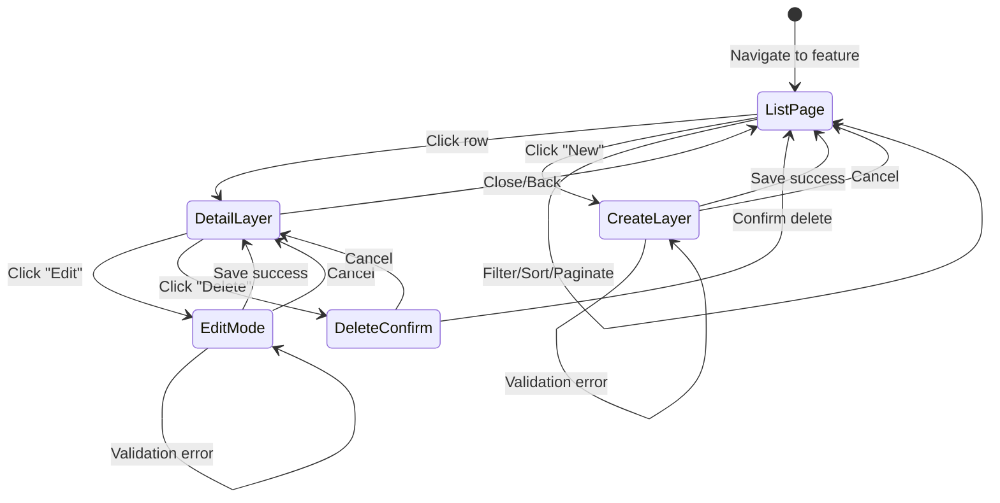

# Frontend Implementation Planner Agent

Generate detailed frontend implementation plans for newly developed backend features / changes in BE that FE needs to implement.

## Trigger Keywords

`frontend plan`, `fe plan`, `implementation plan`, `frontend implementation`, `angular plan`, `fe implementation`

## Usage

```
/frontend-planner [feature-name]
/frontend-planner [plan-file]
/frontend-planner [plan-file] --commits=[commit-count]
/frontend-planner memberships
/frontend-planner --controller=MembershipsController
```

---

## Where you will write the FE plan to:

${FE_PROJECT_ROOT}/.claude/plans/<plandate>-<planname>.FE.md (take date and planname from the plan file if specified)
${BE_PROJECT_ROOT}/.claude/plans/<plandate>-<planname>.FE.md (just copy from the FE plan file)

Then also copy the BE plan file to ${FE_PROJECT_ROOT}/.claude/plans/<plandate>-<planname>.md
Then make sure to switch FE branch to "plans", commit with message "plan(<plandate>): <planname> ready for implementation" and push. After that, switch back to the BE branch you were on before.

## Configuration Variables

**IMPORTANT**: Set these before running the agent.

| Variable          | Description                            | Example                                       |
| ----------------- | -------------------------------------- | --------------------------------------------- |
| `FE_PROJECT_ROOT` | Absolute path to frontend project root | `~/Tresors/Projects/ReservineFront/reservine` |

The agent will read `${FE_PROJECT_ROOT}/.claude/CLAUDE.md` for patterns, context triggers, and guidelines.

**Default**:

- Either `~/Tresors/Projects/ReservineFront/reservine`
- or `/Users/lukaspribik/Documents/Work/personal/reservine`

Depends on where you have access to. If you are unsure, use the Tresors one

---

## Pre-Execution Step: Read FE CLAUDE.md

**MANDATORY FIRST STEP**: Before analyzing anything, read the frontend project's CLAUDE.md:

```
Read: ${FE_PROJECT_ROOT}/.claude/CLAUDE.md
```

This file contains:

- **Context Triggers** - Keywords that map to relevant files/docs to load
- **Import Alias Patterns** - `@ui/*`, `@reservine/*`, `@apps/shared/*`
- **Coding Standards** - Signals, @if/@for/@switch, DatetimePipe, etc.
- **External Docs** - When to load `api-guide.md`, `state-management.md`, etc.
- **Quality Checklists** - What to verify before completing implementation

Use the context triggers to identify which additional docs and reference files to load for the specific feature.

---

## Agent Context

**Backend Project (Current)**: ReservineBack - Laravel 11, PHP 8.3
**Frontend Project**: `${FE_PROJECT_ROOT}` - Angular 21, TypeScript 5.9.3, Nx monorepo

### Frontend Path Aliases (from tsconfig.base.json)

| Alias                           | Maps To                                             | Use For                  |
| ------------------------------- | --------------------------------------------------- | ------------------------ |
| `@apps/shared/*`                | `libs/shared/src/lib/*`                             | Models, constants, types |
| `@reservine/*`                  | Main app modules/features                           | Feature-specific code    |
| `@reservine/services/*`         | `apps/reservine/src/app/shared/services/*`          | Shared services          |
| `@reservine/admin/*`            | `apps/reservine/src/modules/admin/*`                | Admin module features    |
| `@reservine/admin/services/*`   | `apps/reservine/src/app/modules/admin/services/*`   | Admin services           |
| `@reservine/admin/components/*` | `apps/reservine/src/app/modules/admin/components/*` | Admin components         |
| `@ui/*`                         | `libs/ui-lib/src/lib/*`                             | UI components library    |
| `@reservine/types`              | `libs/shared/src/lib/@types/enums.ts`               | Enums                    |

### Frontend Type Definitions

Types are auto-generated from BE and stored in:

- `libs/shared/src/lib/@types/app.d.ts` - API response types (`App.Data.*`, `App.Http.Responses.*`, `App.Http.Requests.*`)
- `libs/shared/src/lib/@types/models.d.ts` - Model interfaces (`App.Models.*`)
- `libs/shared/src/lib/@types/enums.ts` - Enums

**Type Import Pattern:**

```typescript
// Import namespace aliases at end of imports
import VoucherData = App.Data.VoucherData;
import CreateVoucherRequest = App.Http.Requests.Admin.Voucher.CreateVoucherRequest;
import GetVouchersResponse = App.Http.Responses.Admin.Voucher.GetVouchersResponse;
```

---

## Workflow

When invoked, execute these steps:

### Step 1: Analyze Backend Feature

Scan the following BE locations for the specified feature:

1. **Controller**: `app/Http/Controllers/Api/[Admin/]*.php`
   - Extract endpoint methods with OpenAPI annotations
   - Note HTTP verbs and routes
   - Identify request/response DTOs from docblocks

2. **Request DTOs**: `app/Http/Requests/[Admin/][Feature]/*.php`
   - Extract request payload structure (constructor params)
   - Note `#[Optional]` attributes for nullable fields
   - Identify validation rules from parent Data class

3. **Response DTOs**: `app/Http/Responses/[Admin/][Feature]/*.php`
   - Extract response structure
   - Note nested data objects (e.g., `FeatureData`)

4. **Data Objects**: `app/Data/*.php`
   - Extract model data structure
   - Note Carbon dates, enums, relationships

5. **Routes**: `routes/api.php`
   - Extract exact endpoint paths
   - Note middleware (auth, permissions via `perm()`)

### Step 2: Map to Frontend Types

For each DTO found in BE:

1. Check if corresponding type exists in FE `@types/app.d.ts`
2. Document the full type path: `App.Http.Requests.Admin.Feature.RequestName`
3. Note any missing types that need regeneration via `./bin/types`

### Step 3: Identify Related FE Patterns (App-Wide Search)

**Search the ENTIRE FE codebase** for similar implementations, not just admin module.

**Primary Search Locations:**

```
${FE_PROJECT_ROOT}/apps/reservine/src/app/
├── @layout/              # Layout components
├── components/           # Shared app components
├── modules/              # Feature modules (admin, cart, etc.)
│   └── admin/
│       ├── components/   # Admin shared components
│       ├── pages/        # Admin feature pages
│       ├── services/     # Admin services
│       └── dialogs/      # Admin dialogs
├── pages/                # Client-facing pages
│   ├── order/            # Booking flow
│   ├── profile/          # User profile
│   └── tenant/           # Tenant/branch pages
├── guards/               # Route guards
├── interceptors/         # HTTP interceptors
└── shared/               # Shared utilities & services

${FE_PROJECT_ROOT}/libs/
├── shared/src/lib/       # Shared models, types, constants
├── ui-lib/src/lib/       # @ui/* component library
│   ├── components/       # UI components
│   ├── modules/          # UI modules (layer, etc.)
│   ├── pipes/            # Pipes (DatetimePipe, etc.)
│   └── services/         # UI services
└── ui-kit/               # React/shadcn (Next.js only)
```

**Pattern Search Strategy:**

1. Check FE CLAUDE.md **Context Triggers** for relevant keywords
2. Search for similar entity patterns (e.g., for "memberships" search for "vouchers", "subscriptions")
3. Look for canonical reference files mentioned in CLAUDE.md

**Key Reference Files:**
| Pattern | Canonical Reference |
|---------|---------------------|
| Layer (detail view) | `apps/reservine/src/app/modules/admin/components/reservation-detail/reservation-detail.layer.ts` |
| Table with CDK/Sort/Pagination | `apps/reservine/src/app/modules/admin/components/reservations-table/reservations-table.component.ts` |
| Service with caching | `apps/reservine/src/app/modules/admin/pages/vouchers/service/voucher.service.ts` |
| Page component | `apps/reservine/src/app/modules/admin/pages/vouchers/vouchers.component.ts` |
| Create layer | `apps/reservine/src/app/modules/admin/pages/vouchers/components/voucher-create/voucher-create.layer.ts` |

### Step 4: Generate Implementation Plan

---

## Output Format

Generate a markdown plan with these exact sections:

````markdown
# Frontend Implementation Plan: [Feature Name]

## Overview

[Brief description - 1-2 sentences about what this feature does]

## State Flow Diagram

For complex features with multiple user interactions, include a Mermaid state diagram:


````

Customize the diagram based on the actual user flows for the feature.

## Backend Analysis Summary

### Endpoints Discovered

| Method | Endpoint                       | Purpose    | Auth  | Request DTO          | Response DTO        |
| ------ | ------------------------------ | ---------- | ----- | -------------------- | ------------------- |
| GET    | `/admin/[feature]/list`        | List items | Admin | GetFeaturesRequest   | GetFeaturesResponse |
| GET    | `/admin/[feature]/detail/{id}` | Get single | Admin | GetFeatureRequest    | GetFeatureResponse  |
| POST   | `/admin/[feature]/create`      | Create     | Admin | CreateFeatureRequest | GetFeatureResponse  |
| POST   | `/admin/[feature]/edit/{id}`   | Update     | Admin | CreateFeatureRequest | GetFeatureResponse  |
| DELETE | `/admin/[feature]/delete/{id}` | Delete     | Admin | GetFeatureRequest    | void                |

### Type Definitions (Expected in @types/app.d.ts)

```typescript
// Namespace: App.Http.Requests.Admin.[Feature]
declare namespace App.Http.Requests.Admin.Feature {
	export interface CreateFeatureRequest {
		id?: number; // Optional for edit
		branch_id: number;
		name: string;
		type: FeatureType; // Enum from enums.ts
		value?: number | null; // Optional
		expires_at: string; // Carbon -> ISO string
	}
}

// Namespace: App.Http.Responses.Admin.[Feature]
declare namespace App.Http.Responses.Admin.Feature {
	export interface GetFeatureResponse {
		feature: App.Data.FeatureData;
	}

	export interface GetFeaturesResponse {
		features: App.Data.FeatureData[];
		pagination: App.Data.PaginationData;
	}
}

// Namespace: App.Data
declare namespace App.Data {
	export interface FeatureData {
		id: number;
		uuid: string;
		branch_id: number;
		name: string;
		type: import('./enums').FeatureType;
		status: import('./enums').FeatureStatus;
		value: number | null;
		created_at: string;
		updated_at: string;
		expires_at: string | null;
	}
}
```

## Migration Guide

If this feature replaces or updates existing functionality, document:

### Breaking Changes

| What Changed   | Old Behavior     | New Behavior     | Migration Action     |
| -------------- | ---------------- | ---------------- | -------------------- |
| Endpoint path  | `/api/old-path`  | `/api/new-path`  | Update service URLs  |
| DTO field      | `old_field_name` | `new_field_name` | Update form controls |
| Type namespace | `App.Old.Type`   | `App.New.Type`   | Update imports       |

### Deprecation Notices

- List any deprecated fields/methods with replacement guidance
- Document timeline for removal if applicable

### Migration Steps

1. **Update Service Layer**
   - Change endpoint URLs
   - Update request/response type imports
   - Handle any new required fields

2. **Update Components**
   - Update template bindings for renamed fields
   - Add/remove form controls as needed
   - Update any hardcoded references

3. **Update i18n Keys**
   - Add new translation keys
   - Mark deprecated keys for removal

4. **Testing Checklist**
   - [ ] Verify all API calls succeed with new endpoints
   - [ ] Check form validation with new fields
   - [ ] Test backwards compatibility if applicable

## Implementation Steps

### Step 1: Service Layer

**File:** `apps/reservine/src/app/modules/admin/pages/[feature]/service/[feature].service.ts`

```typescript
import { HttpClient } from '@angular/common/http';
import { Injectable } from '@angular/core';
import { ApiResponse } from '@apps/shared/models';
import { AppConfig } from '@reservine/services/app-config.service';
import { HttpCacheClient } from '@ui/services/cache';

import CreateFeatureRequest = App.Http.Requests.Admin.Feature.CreateFeatureRequest;
import GetFeatureResponse = App.Http.Responses.Admin.Feature.GetFeatureResponse;
import GetFeaturesResponse = App.Http.Responses.Admin.Feature.GetFeaturesResponse;

@Injectable({ providedIn: 'root' })
export class FeatureService {
	constructor(
		private _http: HttpClient,
		private _appConfig: AppConfig,
		private _cacheHttp: HttpCacheClient,
	) {}

	getFeatures() {
		return this._cacheHttp.get<ApiResponse<GetFeaturesResponse>, string>(
			this._appConfig.apiUrl + '/admin/[feature]/list',
			{},
		);
	}

	getFeatureDetail(id: number) {
		return this._http.get<ApiResponse<GetFeatureResponse>>(
			this._appConfig.apiUrl + `/admin/[feature]/detail/${id}`,
		);
	}

	createFeature(data: CreateFeatureRequest) {
		return this._http.post<ApiResponse<GetFeatureResponse>>(
			this._appConfig.apiUrl + '/admin/[feature]/create',
			data,
		);
	}

	editFeature(data: CreateFeatureRequest) {
		return this._http.post<ApiResponse<GetFeatureResponse>>(
			this._appConfig.apiUrl + `/admin/[feature]/edit/${data.id}`,
			data,
		);
	}

	deleteFeature(id: number) {
		return this._http.delete<void>(this._appConfig.apiUrl + `/admin/[feature]/delete/${id}`);
	}
}
```

**Also create `index.ts`:**

```typescript
export * from './[feature].service';
```

### Step 2: Table Component (CDK Table Pattern)

**File:** `apps/reservine/src/app/modules/admin/pages/[feature]/components/[feature]-table/[feature]-table.component.ts`

**Reference:** `apps/reservine/src/app/modules/admin/components/reservations-table/reservations-table.component.ts`

```typescript
import { CdkTableModule } from '@angular/cdk/table';
import { AsyncPipe, NgClass } from '@angular/common';
import {
	ChangeDetectionStrategy,
	Component,
	DestroyRef,
	ViewChild,
	effect,
	inject,
	input,
	output,
	signal,
} from '@angular/core';
import { takeUntilDestroyed } from '@angular/core/rxjs-interop';
import { MatSort, MatSortModule, Sort } from '@angular/material/sort';
import { MatTableModule } from '@angular/material/table';
import { TranslateModule } from '@ngx-translate/core';
import { ButtonModule } from '@ui/components/button';
import { IconComponent } from '@ui/components/icon';
import { UiPaginator } from '@ui/components/paginator';
import { TableComponent, TableEmptyRowComponent, TableUtils } from '@ui/components/table';
import { DatetimePipe } from '@ui/pipes/datetime.pipe';
import { Breakpoint } from '@ui/services/breakpoint';
import { environment } from '@reservine/env';
import { Observable, Subject, combineLatest, debounceTime, startWith } from 'rxjs';

import FeatureData = App.Data.FeatureData;

@Component({
	selector: 'r-[feature]-table',
	standalone: true,
	changeDetection: ChangeDetectionStrategy.OnPush,
	imports: [
		CdkTableModule,
		MatTableModule,
		MatSortModule,
		TableComponent,
		TableEmptyRowComponent,
		UiPaginator,
		ButtonModule,
		IconComponent,
		TranslateModule,
		DatetimePipe,
		AsyncPipe,
		NgClass,
	],
	template: `
		@let isPhone = !bpService.smMinBreakpoint();

		<ui-table [loading]="isLoading()" [hover]="!isPhone" [bordered]="true" sideBordersHidden>
			<table
				[dataSource]="data$ | async"
				[fixedLayout]="false"
				class="w-full"
				cdk-table
				ui-table
				matSort
				matSortActive=""
				matSortDirection=""
				[trackBy]="trackByFn"
			>
				<!-- ID Column -->
				<ng-container cdkColumnDef="id">
					<th
						cdk-header-cell
						class="text-base-content-secondary w-16 text-center text-xs font-normal"
						*matHeaderCellDef
					>
						#
					</th>
					<td
						cdk-cell
						class="text-base-content-secondary text-center text-sm"
						*matCellDef="let element"
					>
						{{ element.id }}
					</td>
				</ng-container>

				<!-- Name Column -->
				<ng-container cdkColumnDef="name">
					<th
						cdk-header-cell
						class="text-base-content-secondary text-xs font-normal"
						mat-sort-header
						*matHeaderCellDef
					>
						{{ 'FEATURE.name' | translate }}
					</th>
					<td cdk-cell class="text-sm" *matCellDef="let element">
						{{ element.name }}
					</td>
				</ng-container>

				<!-- Status Column -->
				<ng-container cdkColumnDef="status">
					<th
						cdk-header-cell
						class="text-base-content-secondary w-28 text-xs font-normal"
						mat-sort-header
						*matHeaderCellDef
					>
						{{ 'FEATURE.status' | translate }}
					</th>
					<td cdk-cell class="w-28" *matCellDef="let element">
						<!-- Use appropriate status badge component -->
						<span
							class="badge badge-sm"
							[ngClass]="{
								'bg-success/10 text-success': element.status === 'active',
								'bg-error/10 text-error': element.status === 'inactive',
							}"
						>
							{{ 'STATUS.' + element.status | translate }}
						</span>
					</td>
				</ng-container>

				<!-- Date Column -->
				<ng-container cdkColumnDef="created_at">
					<th
						cdk-header-cell
						class="text-base-content-secondary w-36 text-xs font-normal"
						mat-sort-header="created_at"
						*matHeaderCellDef
					>
						{{ 'TABLE.TH.date_created' | translate }}
					</th>
					<td cdk-cell class="text-base-content-secondary w-36 text-sm" *matCellDef="let element">
						{{ element.created_at | datetime: 'shortDateTime' }}
					</td>
				</ng-container>

				<!-- Mobile Column (phone view) -->
				<ng-container cdkColumnDef="PHONE">
					<th cdk-header-cell *matHeaderCellDef></th>
					<td cdk-cell class="!px-4" *matCellDef="let element">
						<!-- Mobile card view -->
						<div class="py-2">
							<div class="font-medium">{{ element.name }}</div>
							<div class="text-base-content-secondary text-sm">
								{{ element.created_at | datetime: 'shortDateTime' }}
							</div>
						</div>
					</td>
				</ng-container>

				<!-- Empty Row -->
				<tr
					*matNoDataRow
					ui-table-empty-row
					[colspan]="displayedColumns().length"
					[isLoading]="isLoading()"
				></tr>

				<!-- Header Row -->
				<tr cdk-header-row *matHeaderRowDef="displayedColumns(); sticky: true"></tr>

				<!-- Data Rows -->
				<tr
					cdk-row
					*matRowDef="let row; columns: displayedColumns()"
					(click)="isPhone ? $event.stopPropagation() : rowClick.emit(row)"
				></tr>
			</table>

			<ui-paginator
				ui-paginator
				[length]="totalCount()"
				[pageSize]="pageSize"
				[pageSizeOptions]="pageSizes"
				[hidePageSize]="!bpService.lgMinBreakpoint()"
				aria-label="Select page"
			>
			</ui-paginator>
		</ui-table>
	`,
	host: {
		class: 'flex flex-col h-full',
	},
})
export class FeatureTableComponent {
	bpService = inject(Breakpoint);
	private _destroyRef = inject(DestroyRef);

	// Inputs
	data$ = input.required<Observable<FeatureData[]>>();
	isLoading = input<boolean>(false);
	totalCount = input<number>(0);

	// Outputs
	rowClick = output<FeatureData>();
	refresh = output<void>();

	// Pagination
	readonly pageSizes = environment.pageSizes;
	readonly pageSize = environment.defaultPageSize;

	@ViewChild(MatSort, { static: true }) sort!: MatSort;
	@ViewChild(UiPaginator, { static: true }) paginator!: UiPaginator;

	displayedColumns = signal<string[]>([]);
	private _desktopColumns = ['id', 'name', 'status', 'created_at'];
	private _phoneColumns = ['PHONE'];

	constructor() {
		effect(() => {
			const isDesktop = this.bpService.smMinBreakpoint();
			this.displayedColumns.set(isDesktop ? this._desktopColumns : this._phoneColumns);
		});
	}

	trackByFn(index: number, item: FeatureData) {
		return item.id;
	}
}
```

### Step 3: Detail Layer

**File:** `apps/reservine/src/app/modules/admin/pages/[feature]/components/[feature]-detail/[feature]-detail.layer.ts`

**Reference pattern:** `apps/reservine/src/app/modules/admin/components/reservation-detail/reservation-detail.layer.ts`

#### Understanding Layers

Layers are **route-like windows** designed for desktop experiences:

- Act as navigable "routes" that users can go back to
- Support browser back button navigation
- Persist state on page refresh via URL query params
- Primarily used for "detail" views on larger screens
- Managed by `AppLayerService` which extends `NavLayerService`

**Key Layer Concepts:**

- `beforeClose()` - Return `{ canClose: boolean, result: any }` to warn about unsaved changes
- `_appLayer.goBack({ skipCheck?, result? })` - Navigate back with optional result
- Layer params interface defined in `AppLayerService`
- `LayerRef` returned from `openLayer()` provides `afterClosed` observable

```typescript
import { CommonModule } from '@angular/common';
import {
	ChangeDetectionStrategy,
	Component,
	computed,
	Inject,
	inject,
	resource,
	signal,
} from '@angular/core';
import { FormBuilder, ReactiveFormsModule, Validators } from '@angular/forms';
import { TranslateModule, TranslateService } from '@ngx-translate/core';
import { AppLayerService, IFeatureDetailLayerParams } from '@reservine/services/app-layer.service';
import { GlobalRefresh } from '@reservine/shared/services/global-refresh.service';
import { ButtonModule } from '@ui/components/button';
import { InputComponent } from '@ui/components/input';
import { FormSectionComponent, FormItem } from '@ui/components/forms';
import { LayerLoader } from '@ui/components/layer-loader';
import { LayerError } from '@ui/components/layer-error';
import { ILayer, LAYER_DATA, LayerRef } from '@ui/modules/layer';
import { Notifier } from '@ui/services/notifier';
import { DateProvider } from '@ui/services/date-converter.service';
import { firstValueFrom, finalize } from 'rxjs';

import { FeatureService } from '../../service';
import FeatureData = App.Data.FeatureData;
import CreateFeatureRequest = App.Http.Requests.Admin.Feature.CreateFeatureRequest;

@Component({
	selector: 'r-[feature]-detail',
	standalone: true,
	changeDetection: ChangeDetectionStrategy.OnPush,
	imports: [
		CommonModule,
		ReactiveFormsModule,
		TranslateModule,
		ButtonModule,
		InputComponent,
		FormSectionComponent,
		FormItem,
		LayerLoader,
		LayerError,
	],
	template: `
		<!-- Loading state via resource() -->
		@if (featureResource.isLoading()) {
			<ui-layer-loader />
		} @else if (featureResource.error(); as error) {
			<ui-layer-error [error]="error" (tryAgain)="featureResource.reload()" />
		} @else if (featureResource.value(); as feature) {
			<div class="px-gapping w-full pb-8">
				<form [formGroup]="form">
					<ui-form-section heading="FEATURE.details">
						<ui-input
							uiStyle="next"
							[keepLabel]="true"
							formControlName="name"
							[label]="'FEATURE.name'"
						/>

						<!-- Add more fields matching DTO -->
					</ui-form-section>

					<div class="mt-6 flex justify-end gap-2">
						<button ui-button variant="outline" (click)="onCancel()">
							{{ 'GENERAL.cancel' | translate }}
						</button>
						<button ui-button [isLoading]="isSaving()" (click)="onSave()">
							{{ 'GENERAL.save' | translate }}
						</button>
					</div>
				</form>
			</div>
		}
	`,
})
export class FeatureDetailLayer implements ILayer {
	private _fb = inject(FormBuilder);
	private _featureService = inject(FeatureService);
	private _notifier = inject(Notifier);
	private _globalRefresh = inject(GlobalRefresh);
	private _appLayer = inject(AppLayerService);
	private _translate = inject(TranslateService);
	private _dateProvider = inject(DateProvider);

	private _feature: FeatureData | null = null;

	// Layer title (shown in top bar)
	title = computed(() => {
		const feature = this.featureResource.value();
		return feature?.name ?? this._translate.instant('FEATURE.detail');
	});

	isSaving = signal(false);

	form = this._fb.group({
		name: ['', [Validators.required]],
		// Add controls matching DTO fields
	});

	// Use resource() for async data loading - the Angular way
	featureResource = resource({
		request: () => ({ id: this.data.id }),
		loader: async ({ request }) => {
			const response = await firstValueFrom(this._featureService.getFeatureDetail(request.id));
			this._feature = response.data.feature;
			this._patchForm(response.data.feature);
			return response.data.feature;
		},
	});

	constructor(
		@Inject(LayerRef) private _layerRef: LayerRef<FeatureDetailLayer>,
		@Inject(LAYER_DATA) public data: IFeatureDetailLayerParams,
	) {}

	/**
	 * Called when user tries to close the layer (back button, X, etc.)
	 * Return { canClose: false } to prevent closing (e.g., unsaved changes)
	 */
	beforeClose() {
		return {
			canClose: this.form.pristine,
			result: this._feature,
		};
	}

	private _patchForm(feature: FeatureData) {
		this.form.patchValue({
			name: feature.name,
			// Patch other fields, convert dates with _dateProvider.myDayJs()
		});
		this.form.markAsPristine();
	}

	onCancel() {
		this._appLayer.goBack({});
	}

	onSave() {
		if (this.isSaving()) return;

		if (this.form.invalid) {
			this.form.markAllAsTouched();
			this._notifier.error('FORM_INVALID');
			return;
		}

		this.isSaving.set(true);

		const request: CreateFeatureRequest = {
			...this._feature,
			...this.form.value,
		} as CreateFeatureRequest;

		this._featureService
			.editFeature(request)
			.pipe(finalize(() => this.isSaving.set(false)))
			.subscribe({
				next: (response) => {
					this._notifier.success('SAVED');
					this._feature = response.data.feature;
					this._globalRefresh.refreshFeatures();
					this.form.markAsPristine();
					this._appLayer.goBack({ skipCheck: true, result: response.data.feature });
				},
				error: (error) => {
					this._notifier.error('SAVE_FAILED');
					console.error('Save failed:', error);
				},
			});
	}
}
```

### Step 4: Create Layer (if separate from detail)

**File:** `apps/reservine/src/app/modules/admin/pages/[feature]/components/[feature]-create/[feature]-create.layer.ts`

Similar to detail layer but without initial data loading. Use empty form values and create endpoint.

### Step 5: Page Component

**File:** `apps/reservine/src/app/modules/admin/pages/[feature]/[feature].page.ts`

```typescript
import { Component, ChangeDetectionStrategy, inject } from '@angular/core';
import { CommonModule } from '@angular/common';
import { TranslateModule } from '@ngx-translate/core';
import { toSignal } from '@angular/core/rxjs-interop';
import { AppLayerService } from '@reservine/services/app-layer.service';
import { GlobalRefresh } from '@reservine/shared/services/global-refresh.service';
import { StateService } from '@reservine/services/state.service';
import { ButtonModule } from '@ui/components/button';
import { IconComponent } from '@ui/components/icon';
import { Title } from '@ui/components/typography';
import { map, startWith, switchMap } from 'rxjs';

import { FeatureService } from './service';
import { FeatureTableComponent } from './components/[feature]-table/[feature]-table.component';
import FeatureData = App.Data.FeatureData;

@Component({
	selector: 'r-[feature]-page',
	standalone: true,
	changeDetection: ChangeDetectionStrategy.OnPush,
	imports: [
		CommonModule,
		TranslateModule,
		ButtonModule,
		IconComponent,
		Title,
		FeatureTableComponent,
	],
	template: `
		<div class="px-gapping py-6">
			<div class="mb-6 flex items-center justify-between">
				<h1 ui-title>{{ 'FEATURE.title' | translate }}</h1>
				<button ui-button (click)="onCreate()">
					<ui-icon name="heroPlus" class="mr-2 w-4"></ui-icon>
					{{ 'FEATURE.create' | translate }}
				</button>
			</div>

			<r-[feature]-table
				[items]="features()"
				(rowClick)="onDetail($event)"
				(onEdit)="onEdit($event)"
			></r-[feature]-table>
		</div>
	`,
})
export class FeaturePage {
	private _featureService = inject(FeatureService);
	private _appLayer = inject(AppLayerService);
	private _globalRefresh = inject(GlobalRefresh);
	private _state = inject(StateService);

	private _features$ = this._globalRefresh.features$.pipe(
		startWith(void 0),
		switchMap(() =>
			this._featureService.getFeatures().request({
				branch_id: this._state.branchId(),
			}),
		),
		map((res) => res.data?.features || []),
	);

	features = toSignal(this._features$, { initialValue: [] as FeatureData[] });

	onCreate() {
		this._appLayer.openFeatureCreate();
	}

	onDetail(feature: FeatureData) {
		this._appLayer.openFeatureDetail({ id: feature.id, featureData: feature });
	}

	onEdit(feature: FeatureData) {
		this._appLayer.openFeatureDetail({ id: feature.id, featureData: feature });
	}
}
```

### Step 6: Register Routes

**File:** `apps/reservine/src/app/modules/admin/admin.routes.ts`

```typescript
// Add to routes array:
{
  path: '[feature]',
  loadComponent: () => import('./pages/[feature]/[feature].page').then(m => m.FeaturePage),
},
```

### Step 7: Update AppLayerService

**File:** `apps/reservine/src/app/shared/services/app-layer.service.ts`

```typescript
// Add to layerDisplay enum
export enum layerDisplay {
  // ... existing entries
  featureDetail = 'featureDetail',
  featureCreate = 'featureCreate',
}

// Add interface for layer params
export interface IFeatureDetailLayerParams {
  id: number;
  featureData?: FeatureData;
}

// Add method to open layers
openFeatureDetail(
  data: IFeatureDetailLayerParams,
  options?: ILayerOpenOptions,
): Promise<LayerRef<any> | undefined> {
  const queryParams = {
    display: layerDisplay.featureDetail,
    id: data.id,
  };

  return this.openLayer(queryParams, data, options);
}

openFeatureCreate(
  data?: any,
  options?: ILayerOpenOptions,
): Promise<LayerRef<any> | undefined> {
  const queryParams = {
    display: layerDisplay.featureCreate,
  };

  return this.openLayer(queryParams, data || {}, options);
}
```

### Step 8: Register Layer in app.layers.ts

**File:** `apps/reservine/src/app/app.layers.ts`

```typescript
// Add to LAYER_DISPLAY_MAP provider
[layerDisplay.featureDetail]: {
  component: () => import('./modules/admin/pages/[feature]/components/[feature]-detail/[feature]-detail.layer').then(m => m.FeatureDetailLayer),
  width: 'md', // or 'lg', 'sm', 'full'
},
[layerDisplay.featureCreate]: {
  component: () => import('./modules/admin/pages/[feature]/components/[feature]-create/[feature]-create.layer').then(m => m.FeatureCreateLayer),
  width: 'md',
},
```

### Step 9: Update GlobalRefresh Service

**File:** `apps/reservine/src/app/shared/services/global-refresh.service.ts`

```typescript
// Add subject and observable
private _features$ = new Subject<void>();
features$ = this._features$.asObservable();

// Add method
refreshFeatures() {
  this._features$.next();
}
```

### Step 10: Add i18n Keys

**File:** `apps/reservine/src/assets/i18n/admin/cs-CZ.json`

```json
{
	"FEATURE": {
		"title": "[Feature Display Name]",
		"create": "Create [Feature]",
		"detail": "[Feature] Detail",
		"name": "Name",
		"status": "Status",
		"details": "Details"
		// ... more keys based on fields
	}
}
```

### Step 11: Add Admin Nav Item

**File:** `apps/reservine/src/app/modules/admin/services/nav.service.ts`

```typescript
// Add to navigation items
{
  label: 'FEATURE.title',
  icon: 'hero[Icon]',
  route: '/admin/[feature]',
},
```

## Existing FE Resources to Reference

| Pattern                          | Reference File                                                                                          |
| -------------------------------- | ------------------------------------------------------------------------------------------------------- |
| Layer component (canonical)      | `apps/reservine/src/app/modules/admin/components/reservation-detail/reservation-detail.layer.ts`        |
| Table with CDK/MatSort/Paginator | `apps/reservine/src/app/modules/admin/components/reservations-table/reservations-table.component.ts`    |
| Service pattern                  | `apps/reservine/src/app/modules/admin/pages/vouchers/service/voucher.service.ts`                        |
| Page component                   | `apps/reservine/src/app/modules/admin/pages/vouchers/vouchers.component.ts`                             |
| Detail layer with form           | `apps/reservine/src/app/modules/admin/pages/vouchers/components/voucher-detail/voucher-detail.layer.ts` |
| Create layer                     | `apps/reservine/src/app/modules/admin/pages/vouchers/components/voucher-create/voucher-create.layer.ts` |

## File Structure

```
apps/reservine/src/app/modules/admin/pages/[feature]/
├── index.ts
├── [feature].page.ts
├── service/
│   ├── index.ts
│   └── [feature].service.ts
└── components/
    ├── [feature]-table/
    │   ├── index.ts
    │   └── [feature]-table.component.ts
    ├── [feature]-detail/
    │   ├── index.ts
    │   └── [feature]-detail.layer.ts
    └── [feature]-create/
        ├── index.ts
        └── [feature]-create.layer.ts
```

## Type Generation Reminder

After implementing, if types are missing:

1. Run type generation in BE: `php artisan typescript:transform` or `./bin/types`
2. Copy generated types to FE: `libs/shared/src/lib/@types/`
3. Verify namespaces match: `App.Http.Requests.Admin.[Feature].*`

## Checklist

- [ ] Service with all CRUD operations
- [ ] Table component with CDK Table + MatSort + ui-paginator
- [ ] Detail layer with resource() for loading
- [ ] Create layer (if different from edit)
- [ ] Page component with list view
- [ ] Routes registered in admin.routes.ts
- [ ] Layers registered in app.layers.ts
- [ ] AppLayerService methods added (with layerDisplay enum)
- [ ] GlobalRefresh integration
- [ ] i18n keys added
- [ ] Nav item added
- [ ] Types imported with namespace aliases
- [ ] OnPush change detection everywhere
- [ ] Signals used for state
- [ ] @if/@for/@switch syntax (NOT *ngIf/*ngFor)
- [ ] DatetimePipe for dates (NOT DatePipe)
- [ ] [ngClass] for classes with `/` or `:`
- [ ] Layer beforeClose() for unsaved changes warning

````

---

## Key FE Patterns to Follow

### Angular 21 Signals + resource() API

```typescript
// CORRECT: Use resource() for async data loading
dataResource = resource({
  request: () => ({ id: this.id() }),
  loader: async ({ request }) => {
    const response = await firstValueFrom(this.service.getDetail(request.id));
    return response.data;
  },
});

// In template - resource provides isLoading(), error(), value()
@if (dataResource.isLoading()) {
  <ui-layer-loader />
} @else if (dataResource.error(); as error) {
  <ui-layer-error [error]="error" (tryAgain)="dataResource.reload()" />
} @else if (dataResource.value(); as data) {
  <!-- content using data -->
}

// AVOID: Manual try/catch with signals (anti-pattern for data loading)
// This is NOT the Angular way for component data loading:
async loadData() {
  this.isLoading.set(true);
  try {
    this.data.set(await this.service.getData());
  } catch (err) {
    this.error.set(err.message);
  } finally {
    this.isLoading.set(false);
  }
}
````

### Input/Output Signals

```typescript
// Inputs
id = input.required<number>();
showDetails = input(false, { transform: booleanAttribute });

// Outputs
itemSelected = output<Item>();

// Two-way binding
selectedTab = model<string>('info');
```

### Template Syntax (CRITICAL)

```html
<!-- CORRECT: Use @if/@for/@switch -->
@if (isLoading()) {
<ui-spinner />
} @else if (error()) {
<ui-error [message]="error()" />
} @else { @for (item of data(); track item.id) {
<app-item [item]="item" />
} @empty {
<ui-alert message="No items" />
} }

<!-- WRONG: Never use *ngIf/*ngFor -->
<div *ngIf="isLoading">...</div>
<!-- NO! -->
<div *ngFor="let item of data">...</div>
<!-- NO! -->
```

### Service Pattern

```typescript
@Injectable({ providedIn: 'root' })
export class FeatureService {
	constructor(
		private _http: HttpClient,
		private _appConfig: AppConfig,
		private _cacheHttp: HttpCacheClient,
	) {}

	getList() {
		return this._cacheHttp.get<ApiResponse<ListResponse>, Params>(
			this._appConfig.apiUrl + '/admin/feature/list',
			{},
		);
	}
}
```

### Date Handling

```typescript
// In component
private _dateProvider = inject(DateProvider);

// Convert API date to dayjs
const date = this._dateProvider.myDayJs(feature.expires_at);

// In template - ALWAYS use DatetimePipe
{{ feature.created_at | datetime: 'shortDateTime' }}
{{ feature.expires_at | datetime: 'date' }}

// NEVER use Angular DatePipe
{{ feature.created_at | date }}  // NO!
```

### Conditional Classes

```html
<!-- For classes with / or : characters, use [ngClass] -->
<div [ngClass]="{'bg-success/10 text-success': isActive}"></div>

<!-- For simple class names only, [class.xxx] is OK -->
<div [class.hidden]="isHidden"></div>

<!-- NEVER use @if for styling -->
```

### Layer Navigation Pattern

```typescript
// Opening a layer
const layerRef = await this._appLayer.openFeatureDetail({ id: feature.id });

// Listening for close
layerRef?.afterClosed.subscribe((result) => {
  if (result) {
    this.refresh$.next();
  }
});

// Inside layer - going back
onCancel() {
  this._appLayer.goBack({});
}

onSave() {
  // After successful save
  this._appLayer.goBack({ skipCheck: true, result: savedFeature });
}

// beforeClose for unsaved changes warning
beforeClose() {
  return {
    canClose: this.form.pristine,
    result: this._feature,
  };
}
```

---

## Validation Before Output

Before generating the plan, verify:

1. Controller exists and has docblock/OA annotations
2. Request/Response DTOs exist in BE `app/Http/` directories
3. Route is registered in `routes/api.php`
4. Similar patterns exist in FE for reference (search app-wide)
5. Type namespace follows convention: `App.Http.Requests.Admin.[Feature].*`
6. FE CLAUDE.md was read for context triggers and standards
