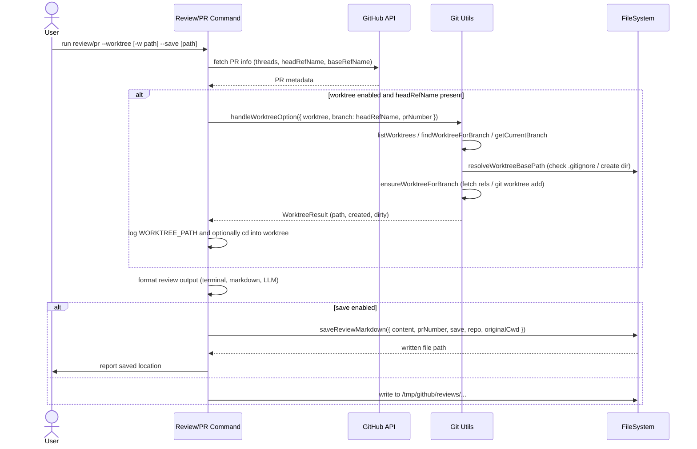

# PR Review: #128

**feat(github): worktree integration for review/pr commands**

| | |
|---|---|
| **Repository** | [genesiscz/GenesisTools](https://github.com/genesiscz/GenesisTools/pull/128) |
| **Branch** | `feat/github-worktrees` → `master` |
| **State** | OPEN |
| **Generated** | 2026-03-25T20:16:09.364Z |

## Summary

| Metric | Count |
|--------|-------|
| Total Threads | 14 |
| [X] Unresolved | 0 |
| [OK] Resolved | 14 |
| [HIGH] High Priority | 0 |
| [MED] Medium Priority | 3 |
| [LOW] Low Priority | 11 |

## PR-Level Comments

### @coderabbitai (2026-03-25)

<!-- This is an auto-generated comment: summarize by coderabbit.ai -->
<!-- This is an auto-generated comment: review in progress by coderabbit.ai -->

> [!NOTE]
> Currently processing new changes in this PR. This may take a few minutes, please wait...
> 
> <details>
> <summary>⚙️ Run configuration</summary>
> 
> **Configuration used**: Organization UI
> 
> **Review profile**: ASSERTIVE
> 
> **Plan**: Pro
> 
> **Run ID**: `fdbcada2-3586-49fc-aaf1-ab26c8eca679`
> 
> </details>
> 
> <details>
> <summary>📥 Commits</summary>
> 
> Reviewing files that changed from the base of the PR and between aa78410926cb8c87eced013e89033e54c582f388 and 5e3be78226dd441167e73a0219f30adfa1a59ddb.
> 
> </details>
> 
> <details>
> <summary>📒 Files selected for processing (1)</summary>
> 
> * `src/utils/git/worktree.ts`
> 
> </details>
> 
> ```ascii
>  ______________________________________
> < Warning: May contain traces of bugs. >
>  --------------------------------------
>   \
>    \   \
>         \ /\
>         ( )
>       .( o ).
> ```

<!-- end of auto-generated comment: review in progress by coderabbit.ai -->

<!-- walkthrough_start -->

<details>
<summary>📝 Walkthrough</summary>

## Walkthrough

Adds opt-in worktree support and configurable markdown save paths to PR/review commands: new `-w/--worktree` and `--save` CLI options, a git worktree utility module, extended PR metadata (head/base refs), and updated output/save and plan-file path logic.

## Changes

|Cohort / File(s)|Summary|
|---|---|
|**Documentation** <br> `plugins/genesis-tools/commands/github-pr.md`|Documented `-w/--worktree` and `--save`, added "Step 1.5: Worktree Switch", plan-file path rules, multi-PR worktree guidance and `--save` behavior.|
|**PR Command** <br> `src/github/commands/pr.ts`|Added CLI option `-w, --worktree [path]` and conditional worktree-switch step that dynamically imports `handleWorktreeOption` when `options.worktree` and `pr.head.ref` exist.|
|**Review Command** <br> `src/github/commands/review.ts`|Added CLI options `-w, --worktree [path]` and `--save [path]`; include `headRefName`/`baseRefName` in review payload; conditional worktree switching; pass `originalCwd` and `save` into markdown save routine.|
|**Review Output** <br> `src/github/lib/review-output.ts`|Added branch mapping (`head → base`) to terminal/markdown/LLM outputs; replaced old save API with `SaveReviewParams` and new `saveReviewMarkdown(params)` supporting `/tmp` default, `.claude/reviews/` when `save===true`, or custom `--save <path>` resolution relative to original CWD.|
|**Review Threads / Data** <br> `src/github/lib/review-threads.ts`|GraphQL first-page PR query extended to fetch `headRefName` and `baseRefName`; added fields to `PRReviewInfo` and return shape.|
|**Type Definitions** <br> `src/github/types.ts`|Added `worktree?: boolean | string` to `PRCommandOptions` and `ReviewCommandOptions`; added `save?: boolean | string` to `ReviewCommandOptions`; added optional `headRefName`/`baseRefName` to `ReviewData` and `ReviewSessionMeta`.|
|**Git Worktree Utilities** <br> `src/utils/git/worktree.ts`, `src/utils/git/index.ts`|New worktree module with listing, detection, branch helpers, `ensureWorktreeForBranch`, `handleWorktreeOption`, naming helpers and exported types; re-exported from `src/utils/git/index.ts`.|

## Sequence Diagram(s)



## Estimated code review effort

🎯 4 (Complex) | ⏱️ ~60 minutes

## Possibly related PRs

- genesiscz/GenesisTools#53: Overlaps changes to review command and `saveReviewMarkdown` API/behavior (CLI options, review-output/save flow).
- genesiscz/GenesisTools#2: Modifies PR command CLI/options and flow (`pr.ts`), overlapping `-w/--worktree` related edits.

</details>

<!-- walkthrough_end -->

<!-- pre_merge_checks_walkthrough_start -->

<details>
<summary>🚥 Pre-merge checks | ✅ 3</summary>

<details>
<summary>✅ Passed checks (3 passed)</summary>

|     Check name     | Status   | Explanation                                                                                                                                                                                                                |
| :----------------: | :------- | :------------------------------------------------------------------------------------------------------------------------------------------------------------------------------------------------------------------------- |
|  Description Check | ✅ Passed | Check skipped - CodeRabbit’s high-level summary is enabled.                                                                                                                                                                |
|     Title check    | ✅ Passed | The title 'feat(github): worktree integration for review/pr commands' clearly summarizes the primary feature being added, matching the main change of integrating Git worktree support into GitHub review and PR commands. |
| Docstring Coverage | ✅ Passed | Docstring coverage is 95.24% which is sufficient. The required threshold is 80.00%.                                                                                                                                        |

</details>

<sub>✏️ Tip: You can configure your own custom pre-merge checks in the settings.</sub>

</details>

<!-- pre_merge_checks_walkthrough_end -->

<!-- finishing_touch_checkbox_start -->

<details>
<summary>✨ Finishing Touches</summary>

<details>
<summary>📝 Generate docstrings</summary>

- [ ] <!-- {"checkboxId": "7962f53c-55bc-4827-bfbf-6a18da830691"} --> Create stacked PR
- [ ] <!-- {"checkboxId": "3e1879ae-f29b-4d0d-8e06-d12b7ba33d98"} --> Commit on current branch

</details>
<details>
<summary>🧪 Generate unit tests (beta)</summary>

- [ ] <!-- {"checkboxId": "f47ac10b-58cc-4372-a567-0e02b2c3d479", "radioGroupId": "utg-output-choice-group-unknown_comment_id"} -->   Create PR with unit tests
- [ ] <!-- {"checkboxId": "6ba7b810-9dad-11d1-80b4-00c04fd430c8", "radioGroupId": "utg-output-choice-group-unknown_comment_id"} -->   Commit unit tests in branch `feat/github-worktrees`

</details>

</details>

<!-- finishing_touch_checkbox_end -->

<!-- tips_start -->

---


<sub>Comment `@coderabbitai help` to get the list of available commands and usage tips.</sub>

<!-- tips_end -->

<!-- internal state start -->


<!-- DwQgtGAEAqAWCWBnSTIEMB26CuAXA9mAOYCmGJATmriQCaQDG+Ats2bgFyQAOFk+AIwBWJBrngA3EsgEBPRvlqU0AgfFwA6NPEgQAfACgjoCEYDEZyAAUASpETZWaCrKPR1AGxJcAZiWoAFETqsNgCAJRcAO74FADWuBQkJCgYNERU4vhYPrGQSRLwJFEA9LwKThi0yJAGAHKOApRcAIwATAAckIAoBPzcZJC1AMr42BQMKQJUGAywvv64JcG4oQJgMfGJyciASYSQzGiINHy1AIJ4sLFcpOSISAwAXoMGAMJJ1HRcbQAMbQBsYG+AGYwG0AKzQFp/DgAFiBHG+fwAWs8AKo2AAyXFguFw3EQHBKSxCYQ0TGYSzI0nuDxKAHEqXdENB8PgPIgytgPB4Su0OkYXrBMKRkJh6E0hYU8gEfGgxMhsh5ZJEDFBTrR6AADCAbBJJEiayAlSDaqKGnweNBESAEE0ENnIZarfIkQrFQ1iu2s9mQJ1hHgUQ3kg5VRAAbnQPmOkD8uFm8Aw1rQ1jsKxSwbForwhCUNDE/D4DHeNHQkDp6kguq2KVyfDTKcgU0wsw0qsg6q1EEQaCk5stRGiIVGuBQI4KRSiMfgXkd+Btc81JVwzG4JU1EaiIVHNtgJHkzhS3ak9GwVUoJrJluwShK4+KHM1ragdKo3FgAEUMZAAI7YSj7qp0G5fg8G4PAY1iA5cGQAIMQxABZAAafZnDiWh8CiDBkOOZgEzQDxwkgDAMNSBgPGvFJNV3NBaBsEgfDqNA2A9QDNQEQ4SDohimINJ9IDqYpIDwad1HkZhFC5SjEHGEphPZYlFirfUNGgw1eHwQpaATAcTQ8JBcAAdViPVtk1ZDNSQABJDAjM2fUzJNMgHCSWyTJIAAxWIACFplmBzNUQcjgh8WQfObWBHzbVzqyIpjtIUDApDSeBsi4TVeGAOo9DAYAmxmWAwEC7AiFIWg9ENAISAADyY7gvDS3gWiBAB2MA/GoMByCiMAEyUKrKE1cI+IACRIMZ9PgBhGw4nhqFgF1EDZYTskYXcGDiZBH2WeAiGIpJzTybhqGODBkD0uJKMvNAKJKJTTILC87ukNc+NRbhaA+ecd0ohTVjAXhDUQOJpw8L6EzIiiTXWRdtUKnsDRjftRUA5MnvsTc43mo4SG4Pj4MwbB8MgKQKHgHxJuoFKsFmUQ4j0o5SPIpRaA4AxBigF5snJihmBNML8o4D1uH6ZxkATL0HV9EkBBdN1J2AXg9F0MBuWYSL2cgTmMG53m0aLBYqZKXNRCyLAMfmzV7R9P0ZbveXFeV1XdDNdBWKtx1pYDSAFYoJXodbDWtZ1lD4nQzD7HhyAPHwBhKeyZBayhsBmFoCqlFlLkR0XZdVxt29XQnB9CM9WGU+Vo8EYCR8yOum87aLgPdE1rn4B5k0iuC0LfIiyAhSqGdIDoUhGA4mCYfMswHMQI6JkQZCmFO0RhKkSAPsQXdECGtmm+gWR+lW2m0ugog5wgYiAFFcNwNTDkQaRWwMCxm9YCs2EQbsRXsRwDhcIw1Q1JI78GxmD5LLCcMZki0HYutLg2A76u34MIE2s0qBsGjInCudE5b41DhhM2u4kgxlPGIKmvcaKQCBAAahQUxRAfErCAMoCvRI2g9KJkKpadevcEwjiaLWFIR0Vh0UWh4FeictJJDELEeQxsSHZD4sItkK92J3ysHNL6mB0ACBEXgAR6i+GxBSMwNCrcFKVmMjFfA/RMhUzoW2DE+BrRo0oBQWIMhwJJDACsVxk40y80WiPbklBkCSJIJIGsrCxiHh2hgfCdjVRgEMAYEwUAyD0HwD4HABBiBUkyHQCobA0hcHKIIEQJCpAyHkEwJQVBVDqC0DofQyTwBQDgKgVAmjrrZJuMoGg9BgzsC4FQScDgnAuEbFUxQyg6maG0MrJJzTTAGDqsVBMHIelMi8d6DkGZQy/TCP9CgGgU6swAETnMfpYU4lkcnkDyfQUZP95AZNWsKaQRhz5VRoGeLURBOA20OYaOBVoUielPDUpU8VLbbKlisf0dtHYeDVqkCQMc45YFtHKCY3As7rBKDqCx+pIAAG1BGwAALosU7HDFepK5qUo0DAXckAMQtBAnicCC8WH5iiIcIS70Pj0FtODJmlF+azC4MAaiZVIB7FyhxcqrtaDISiLuM2hLkgoGQGQFQXhlUmgMgAeRsAAaWgDYc+58AD6VhTjQGGpKsl5VGUdnycmLqkBAA4BEMGg3BIAtA0GCLg0UiVDAxrMQAuAQ7moC6JgFBqgmmNZZOklk6inAxFal4BkAAiDkrGm3wkqE0DBU5izSHOes6lNL5LRmS5CTkonIAcNokgv52B9F6bY/gDAGBjFSN9cxdlkjIU9IApR0gk4V0NEkS04gV5ktFEQbQp0Rz1liDtPCoMGBRFoIyt6H0+k8EtBgNq04Ug9JsStCgklkC2iUP0QCK1YZTsgAEdO10PDiETEezRC6hJnj4NnFc+yBD5zlhyYASRuD4D0CUDQ8G818HBeeauV4bx1UwByeucGEOVjVZO+GhpUB31wOEZCIrrzxQcMLWII5E7Jl7UcFgBGV4KzmoqiRJtpGMs8nwZgmd4BgFsK7fCsgmT1qqnVSanh5DqQQGoQ9R135QoJUOhGtBxrfoTOoeARNMCiaZEq1I2NyHp2CYOty6N1Dxm/baess7zzwBXF4QpuB0X2F9TxzdSoR2FOZigZzJBXPuaINgeAH0ZiHgXKptyQZrp32QNYoTdgnrIH1oK4mumJbW09gi+DjLoYqq3LE3C36lCICLPAJo9BE4rHwPA1LKqEBeAHbwFKgHqOUGg1EYJHA4HaWIOodYGrpA3xWC6A4ayB2ym5NAuIeGBjERHP179sMnqRUue2T9nb45fXrEoGul7Tr8EydVaDFBD2HTCHpKa7AdPvLbHUbIKQ30x0cOwdFYBFRVL7p/cW6UgprMpLcJAWyHQlF2dUEDhzjmpy3gYDECYJ2zDeSzSAlCYQwnxQATg+UcJzGXqkpARfRWsnAWUYQMOc05f8lnSQYCBiHLAQxQ94CpAkVOLlP2ubc3p+THnOGeZklHiZ3npQoJzSoqciIkQXlpAt3JZOUFrMwUUFnqyFXDVjX1AW2BaQ+EWtAUZzz1mE6gWMNN6Celjpb6I+HNT5tsRodbWr7AkBHCXNn0qNBJB8Iaaq+k57bloLIErFNFcBfO9BE0AABNAwtZLiHkssW6I2HKx25JtPutAvAhuSIanFVNDTmxNAAb3V/qZCeUJUBg0N733yFeANGYE0CgXAMCNHPAAXwcp6NM1Nshfr/LeitzLAEjheabmwhV+gMDJpNVe1BkwW4QN+gICKBlpA5N4/w1R57M/UEHmm60g9aR8D4Edj7QLgRV8dbSQ1IBDBxs4A3shzLpZoLYSXLOAjhA9BqNXD1F4DESyPoU2KGKIZCGLGKOlFYSlL6M7erFIFYVACUHsdrB+cwK5bbI7EfAdA7S0XAk7QeSTWjfJK7AQG7QeZKcQd5KAfdDLHwYhcAggl/cAtAqUPgf7enRnSHDkNnVSBqCXZnMUAIBMMCcnI4UmRMZCR3eOLgL/EQqoAvU2TeBQ1xXCO+YAVFcLRVYiScOXHTbIQteQBMVFC6LPMUXPEbFQovBbLAB3QveOZ3NPV3KtcLN1ViL3XfH3eiIjRLRhNIV6AVQ9YA0AyHVeUQQg9zbgmSPOPgsoI5QQ4tYsEgRQqXX/Lgb/MUQ0fQxmCiTaDQOQjAAIU5dYKA4bNTElMlclU5ZCU5MNazeaAgCHVIivTVROYTavWAU5P/B+RHW4V5UXNHShZqfFb4PHcQKCfJInMBQSUnWjLgeCOgeARwTnGnBJMAIwHg+IpQqHO2dnM5LnK5G5C9DLAXcZF5EXEUP+SAT5b5fzesTUO2bNJfQ0UpZBYVGYUVE0aVLiRiZiIzNiDif4nic0DQk0XgayXIXvQCXCCgVxJIIVDeUFDUIw47f7LBCcJ/ZTbIV4tzY5d3NASKf+fzQwhXdow8LXeKf7O2bIqoTUO3AYRw1QlwtTfwt3D3LwigaE/AOvXfUEwEjpCQVhXVEgbCZlCIkPMPDPItJzKPTaOPBPOSdZdQVPdk+eQtSw/uEgPPEgWw7IAIcvJ6KvbuYpHk7WPkv4+iAE8UgMZvVvSALvP/S/ZEgYLlBMYfSsLcesAPfHb9YcCQxGDCOxDmX7fJH+NCPBKcFraxJkb5CYftZ4guYoek6XKuYouhFOMbWAQiW0WU9ueGLE4oHBKMzCYvLcTRTMxBMpEcCjLSVbLldgfyJvTvQMcyCuLgTMjQKdcyKDfALgAAHU1AABJS88FKAu8wAxz+yu9hzYStR11ghYkPAXgd1zSY5pA6Ft1aBf8HI1kaByErjC0aSRwS9vsTQAgU4tZvlcBG8KAHTKA+i2xPkjofkB0wjUhjhZREz/sP9OIUyog0y9yJl0A0TVtyjlY0ZYCKUqUWMUgYKGUjAsCttjh0U8D9soi2Cu0XlECLtyC+AwJKCF87taDEBbinsSCo86BORiKpomCZhwC7hdpqBG0hjSo+JNR/ziygK9jMjn4WdGTt5ST8lPzMzWZBgNZTQKjoKajNRt4pKuxI5EL5KEckc0twyRiWhsd8UWhJiCdD1ZiSdz9FjIBhodpYB1jactiDAdjpYSg9JQM7Yvtr9NBoIjiadudTjclzjv5BdiDriHsRL+lsh5cqYiYKM7gVoXkuju4UJhZ4oq5rTuI2BZVpo75BSDRCJxYcJN0v4xlnlXLX1NRb9cAhg/KXBBpkJIyw4sBhNpUTcxTirSqeLSzaqqqjMMMEwvFqoRw4J4I3dcSsAGq+Aq4WrAL+rBp7DGx8BxtfdYo350BCFeBpB2AFEcZLQJgtRMFAK2q8EAgmyikPNpCiB7zHy28iI2y/9vTxt3V5jSD8LtqizdrUJaqAgjpUECRH9nq5Y1FPrrrmLYlcAokjMeFXENMtqB08LD1NQhgfqJw/raEiM0hlc5RkC5xY4ET5AuLB9mzzJWyW8BpXSwDwrQZyYvAXKOURwuVXEfQq5eyTR+z/IlzN01y4d1rdQIzXroyK5Ij/T3No5ggGAJKm46JxJjxpt4B+otQrobo85sN3jXLG4oBs16IP0RwAhiJCzexIhKxSYaBkBkNAMlxgN5bAKIN+zYMKp+yYwIT0oX9VdfDoNIAAB+F2yAU5U8OIfQjAU5QaZW7W7wG0a9A0aIfWidI2i8GuG6BWl0WdcJL6B3UmZc/CNmiqPIXtBE9tXUeKTjKRFwLeKSzsj2tjFYPQP2oZaQcdEJEgeO5hBcFmlctO19DOndMjYOhYW9KgESVbNcB6LW8mlIXqpyUhPlZMPOggcZNzCgUgDWj/U8ozKIfWmk06Dw9u2aghTceBf829ZlD69tCe6RRe8O5ACeotOzMfKu0RfJQe2aFYB+bnHA9CvbZlVgog3Ch6y7Qi67EimgoocitsAKOI+yxysDCcSmiQ9neSjWV1egaG/JHhVGiYNKaGr8pBlIOGqQHixG1XSAcvQ6yQxIbSCMAm1vdvNsiMCuF2rgAQb0fwLAAAH2OuIZdGg2oeYcTAjEbtTp3XYakJYZ72EsgAYMPXgZq2YNIUBtYqSC4FqEksck/vQEQFD3ookZWh2uwW5swgOtxqOv4ZkPtLbPIcJooF1oYRYCQBIGAH0aIEVT2Dkcks1FQcOBUaIUYskfhpLK0ZKI+toS4EwYAt+odrUOsA0MsesaIcTHKiMAGOR00q4EoTBDGLAGan0umJCqUDmMnAWIuy4HMqIEsup2su2OAbhVA1Aecp3xojoXcqsq8t53uXyqeQCvDPIvuLSXyXrBfHjw/C/E9W5gZiOlICjWEzbSnrnBX1+IFJtLBKBJUQApSoNBHQ1BmNiEAWgyqHinJlroTQvuQL3nyXWfjlBUAnszRVBk1FsB4t5ORu/LRuJtjhxSiTdPgRFPIgnR8AhPrAGZHCGcmHokMRdGBooAwHinrEAUzj3RCM6eZRKvd1mCucArgHeGqGnXdzGCwA+PzC+IhkyaommcWbguBIypmcBPwmyCIDuEyd9KqgmlW3EFwC8H8iOA+H8iqdReJvF2/3YEQA2xQtOCftUJfpSDfufo/uovSW/rouoIZf/rbBEcOfRZBZtAOfsCFH3nFbIPEfcafRX0RblmRd30QACAnIupseQn7K4HNcMZMeMdbzMbCa0P1YnF5MVViIZzzgqcAq8VgBRZqd5dApogbOtHxZokyqtciaICJfmfDY4ajcTudeKBuYfssHxlBb8AZncjPXbBXNkAeEoBifUvYs+HRx0rAD0oMHPnx3SYUEyeMrJyWJWLWKKc2JKY9fstwAOf9Y8s2x5zOMPQuKF2LfIqgHaffMuZsDTINNOkNBxZ+KrKcJXJNCenYdobZHocgCYZsb7CtD4jHf801B4vxOJK+mKJMJHixqmbDdJZID4cjejZBJvbvZOpJLuK+Q6a1B4qncXYDZL01BXZoboc0S3fvaBKocA/XeA7jdff3fyUPcApxKiowGWLcwrPGzPYueSttOfe0gfZJcWZw8TFfcoo3vPEFoXwzsH1puDIMM0ojDTHgQPB4CiUNzRKFdtF3n6CGEqxxTQYoB/MPHVfvmQt7cFa7T2ciMOzFdO0/oIuY+ldIrlagCAfbbKaXC7agaEYVfoEQf47RpNHSJZ2nd5a4CDbg4A5msg8Yeg60+hZ05Rr08TPg7lmPcZLAoPaw54kI6jfMhjafYjZfds4PQQYc4E5NC/b2OM7c7M61As7Xa8Cg+3Y7PhlXaA+s+3aC4y107C+c+xK3KphQ+JNM5Wa1E87YG8/8j84I4C9w8LcGMCpGOSYmMrercJymSycHhMtyYpyiCstbdspkhVIUhKF6mqkOLqZOIad8oKpabeQAbgCMQki8EAEwCRLH+qaU4KwUA5yML1AM7MUfJOQF0MAaG+KQtKi2jBOO2jQdU2LRlEjtMPgaGoPTt/oIPPIa9ZKVKjg9rJa9MTSzA0TtC9j0fEVrC9+mTiVh6IiqgxToK9uQbpPVUxYUbqqKB4r/zTxVBpxxRgAKltuY1ORu6elOTDAqke5ICO8QLuFWxd3Eg0xW+1Vk6FS7ZKAYrkVOiZxXUwGj0+eYyeKG+WH9zSBcGgx4Xh1iY0tRwSZaHGLSba7rcAs64bZ6764gBsp4MF7VKenG6Kfqf7f5wqqHcCoAdgdLA9RU8T2nGR9u+rCgf2CW+QKFF+dcWrWQHLDPJG1XnuA0n/CM3npWhWWQDCLajlHiliBpikPRUZUshHGe8XzcxVbe4gie9pf9KcS97QRoiX2Kr1JufboD6wHELwDHj1LeAWH1J/Y6tHWkEzlL5G2EUzn9sgFj6AgCXj+6K2TAEPvGTD2/V3A8DjLSg7jJi7nCiJdKr1NtPTsXfPZWvJmlpuotgyg7xMeyn9qMF40iLzFNnIzrJF4klnl0n0j1N5aa0mnmk+82mWEpKjn0mVnOwmEtATDgo+oSxldJgnR4TnCkOwDEGeYNQjYbmNZE2EfnjzAt4otaOaMhGGjnxTg2aU0uFAWovY8gmoDvNyGLz4ZcwcoXcLQHbqegLQVoBOHkHYhJASgk2LAOwE/50IW+HuAAiaCsg2RXCd6d3JQFKwpBVU7uAhKWGCBJRvekiSeqYTLRUtQUt/AIEd3JAfUoUN/AoP9FFgpAIAywbvq3ENASBNoigobMGGyDKDAw+A1iLPXxgJg6I0GGwKyGvhfRJBuiAdBQNYb1Z1AR9VxLNUHh8DOBRfRKPgAug1YIS5scWKjBGwx84+n9TaOTCqB6leM4qHuLaGjixwSwmiP0l+gz5VEJBa0TwZTUbDdxOWs9F4GMCSBpAIhs7OcEkGBYYpJSOQ9tN0WQEt1AM6AjwJgIGDYDLc8OLfoXz37udNoY6a+nqS8gcQ1EKwByKqgv69wxopMfHLKXkB3wvA8oAdGjHmb8CuM4yI7iiyhQaBtou0QxAdEAyy0bwqWd4psJ2ERgyYREMJI9zcKBE7yweNWnX0TpbCSAtvfUAG09Dx4H0CaVDLXFuGpY+6toLaDpjWH7QhINPa0F5FPAxlpAYmGgLzE26WQaBC3FCOLBppsgaOrueUi5nYAhdHIp0KJGEO8jdx+hCAWYECwxabR8GqRfVBIk7aN5oB6QpAT3i4AVgfmB8E/AthOFcUd0HJfCCi2eQlDkCzgWelSPyivprcLACQhOjJHqVkAhQZMJqBv4stgayACAI/1rrLoOq/eN3M4Ej4p8EE8QyAV71qzMpuixNUjhQC3rphUigBQSM9kZTl93MDaQBAOlmE995A8Qo/EKN0Rq40YDoyoZVBCDnhbAhyeiFLTk4j9tmeAi1iQFrIBESAJ3NPgkLmH51/6eGJAnyPxHoRpAGAZbiOCgj4j6w09WeshGNg8wi29YFlhdh4D4AeEr6aIUTGTI+AOQ0qCDN0TdaZIVqd8NILIUe7GiIEmMCdEnQ3RYBco3cRVK4JlxUUbsFYAKNPVwBWAyxaQDku4WZh6D6AV/E0DfzRhBtHwtAncD4gVA5BIkhCW0CELdJJj5oeQFaKeAcA9otyTBC5iuK95riH4rfOJHOCDbB8QCaDDIO5glEXdHqJoYaFYV1I2Eq+QJbPNYTUzTtcRgw2UptBtH/i1M4QnEchEFpNo3Mso19P+VJGtxyRpY28rpi3Q7orMmMe/P8KhQo4PAcQByG1i3wGpjUZqC1NaltT2oFyI8LsdqgRJuIvogtIzEUN9YYQU2qFHbMdgk6ishWmrb8RQVh5/14eZvW+pby16KR/BqkJfkcOybM9JO0RVQiLVHYqTsuaNNKHn0tJ4M76cwONhGGlQ1dOGR4sydaCYY1CDhiAboTI0s4JcMAtkwwRgAg5OSnS0DJuK+S1Z8cBOukkbFaJoDGcDJ3RSyRGHma9DYA3nShhOKnE8IYpNrVvOw1X6t4IwO5bzp5KEY+Tvx2k5BoALUyN9P0BkslOFMYAkj3J9DCKWaWMn8DO2lUzRIIw1g5TD07PU2MP0BwhQIh4gmqTY11oZdmpKktqVTDSiT8Rstpd6g+SMaXUTGiAgWHG36n3tspQ0tRm5OP5HBT+B1XhpZIdYWMtCek3IMSnJTRNBpUPYaalAYGIBrIepLabQG867TNCVjeLvQxOneSVpOrNaVKPdyuTjB+AUwbNVun3T1Ce0qxjY1emaSzpq00ab1CxEUBupYUuNvPG2kLTgZj04AAdLnDWSuQHgcGW+0hkfS0oWQsoXkO7iAydpqM8JjY03aXVuQuMlqTfShmM0r6UgLoT0Lmjr4cYf0sweTNCYgyImJ1Ome9I54oMMRLkEbHBPCgmsf2waQKakWM4PTwmepIqbgEFlQ88pQdTUL+J1J6kQpxpEbA1PS6Rtqp4UMqaQ2aAzTHSTUt6fjOFm/E/xOsxdlLPUlmV7ZAE1QgrK0I6EyoqlSXsWxGJAgOg3wOXi1ymIK9icSvHJuTnyaFMLkCSJJCkmoLpJMkXSQgAbxCqsBBk+QNACMiN6gUictSBTA0nmSLIoAwYdQFanCyIArUdsOgFamLEjgmkJcxfG0BIBggSAfwMEDCAYAtAwQPgMEIHOxzY5vgPgGEH8DQD/BscMIHuYiG+BJMWgRuUQMmCaQJyBAzUDoH4DBDfABALQD6ECFlAdA2gMIWgGCGxwMBO5AgMEAwD7lAhaAzUHwG0CBDtA/gAgYecXITk+Bvg2lZqECCBAdyp5F42+RvNoBAgfgfwUQG0DQB/AP5gc74AwH+BtBmofwN+S0nQBoA15U874Njn+AMABAHQBgB0GaiiA6An8oECQA6BDyf5rcruf3LaA+AA5XQRuQnLLm4AK51QauYBVrlpJkFEAAMCQCtRsAZ6fC4/BtDrkTji5BgUvNvFORIBbAXkaIZ4O5ZpApx2MWgKcl8BxJxSUipAIahJikwVmvtdReyE0WDBTk6EBgDY05gkwQU1kE6PhB9QfA1FeDBSh7TspqcEiAhRAI4skXyMTFBANzB4HcirTPFXwRCM4pMXnTToBkEINmhjg2NglkANoM4q7yhL5GpyVxasCZxS4sMgFdnF4rCUe0/F+EQJR9PiVtAUlPi05BEsQBRKVgMS8xZG1KVJLylJi9JWEAcpVYwGxQCBngFyVcBvFFSwpQEqCWOKYQzSySpUqCU1LYAdSuJY4qBBNLnFaS0phkq9ZywfWfrXpU4p8UFLZqRS4Za0DGXhLJl0S2JQ0scV6V5GySxZZryR7Dcde0EPJdstOSDLilHPeJe0EOUe0qlUymZWctaCJLLl28K5SYqJw2AVACmAyK4k/wUB3AjLEgI4pmx3xylaSy4FyFoByKY4cQWwAio0XIqtItEU8HUp9QnVEAgoWmI4sSB/g8V4WGwKeFhVeAyV60ClSHWpUEqMAqtCrKTEXaMq4gOKoxcirYSeCoRDgaQMSscXnIBVhwXADyuVnxLiUzi/pakuEW2lxVHKnjuAR5V1F8laS5CXAmZVUrtVZ2Y9OinFU8r7AwMYWPkg5hTIwVMyVbtwgKYqxXQtdJpv5T26xJKCdADQFqqeX094VXAU5LyhBbaQfVFS7hquRSEqqA15WdVVTBpyXKxliq8Zcqp4jir6V/3clZ8p1WsV4llK4xRUqNX6ZTYaa5lAyxawABydqLgCCDSxdaaMRBu+PAKJw7YiRApJmHLWMAEuFAItBcXgD5td6AiUmM0yrUg0mgZ3ErtVWoA2ZrQ9YGwYFWIINqbE36D3rf2oxR4vyc4D3sNHhRK9PQwmPgt6qzUdDloBimmR4CzV+rxVQa0FomFDWpLJELcULEkD5VIrtV4anlVGoKWeB4VCy+RkmpBWRrU1Aa35SdWbhWLSAd68ZTKL1VcA81WawtUDTjXAbTloGpgOBpSCoBscYIDQIfIACkeGQYcRmwDn5pMa1JlOHN/CtwYWgCS4B4B07IBA5Ggb4N8Fw2HrtVl6gNdepDVZr31gGtgOKrMWzKkl28clJKqOC2A1VXK4tQGrQAdAA5I8rBZ0DBBtzscLQC+VhrQDY5yFsmv4IgtoVoAd5fwbHEbigQ+B55MIDoKoGagMA/gLQb4MAoYBYKGAXckgDfPPyhrTknCScTYHTXiqgQYIW+SoCBDfBEFAgH+R0FoA9oYQdCuzbQA6AtBLNPgeLc1FoA+A153wAzWgomAdASAg85zbgrIUwgsNlPCYJ/MxxAgacXeYwCgpWr8LKApAK1MIqrlcLl5KClOVaiOhwI+FMo7rWIsbml5PNUqtRF1toCnBcAPFOgN/nUCcxTwuANRd8Cq1Nz2tnWu+KIo+BWoWtiSIAA== -->

<!-- internal state end -->

---

### @gemini-code-assist (2026-03-25)

## Summary of Changes

Hello, I'm Gemini Code Assist[^1]! I'm currently reviewing this pull request and will post my feedback shortly. In the meantime, here's a summary to help you and other reviewers quickly get up to speed!

This pull request significantly enhances the `tools github review` and `tools github pr` commands by integrating Git worktree functionality. The primary goal is to streamline the process of reviewing and fixing pull requests by allowing users to automatically switch to or create a dedicated worktree for a PR's branch. This change also improves the clarity of command outputs by including detailed branch information and provides greater control over where generated review files are stored, making the overall developer experience more efficient and organized.

### Highlights

* **Worktree Integration**: Introduced `--worktree` / `-w` flag to `tools github review` and `tools github pr` commands, enabling automatic detection and creation of Git worktrees for PR branches.
* **Enhanced Output**: Added `headRefName` and `baseRefName` to GraphQL queries and all output formats (LLM, markdown, terminal) for clearer branch information.
* **Flexible Review File Saving**: Implemented a `--save` flag to control the persistence of review output files, allowing them to be saved to `.claude/reviews/`, a custom path, or defaulting to `/tmp/`.
* **New Git Worktree Utilities**: Created a new `src/utils/git/worktree.ts` module with comprehensive utilities for listing, detecting, resolving paths, and ensuring worktrees, including a `slugifyBranch` helper and a standardized naming convention (`pr<N>-<branch-slugged>`).
* **Improved Skill Integration**: Updated the `/github-pr` skill to leverage the new `-w`/`--save` flags and incorporate the worktree switching step for a more integrated workflow.

<details>
<summary><b>Using Gemini Code Assist</b></summary>
<br>

The full guide for Gemini Code Assist can be found on our [documentation page](https://developers.google.com/gemini-code-assist/docs/review-github-code), here are some quick tips.

<b>Invoking Gemini</b>

You can request assistance from Gemini at any point by creating a comment using either `/gemini <command>` or `@gemini-code-assist <command>`. Below is a summary of the supported commands on the current page.

Feature | Command | Description
--- | --- | ---
Code Review | `/gemini review` | Performs a code review for the current pull request in its current state.
Pull Request Summary | `/gemini summary` | Provides a summary of the current pull request in its current state.
Comment | @gemini-code-assist | Responds in comments when explicitly tagged, both in pull request comments and review comments.
Help | `/gemini help` | Displays a list of available commands.

<b>Customization</b>

To customize Gemini Code Assist for GitHub experience, repository maintainers can create a configuration file and/or provide a custom code review style guide (such as PEP-8 for Python) by creating and adding files to a `.gemini/` folder in the base of the repository. Detailed instructions can be found [here](https://developers.google.com/gemini-code-assist/docs/customize-gemini-behavior-github).

<b>Limitations & Feedback</b>

Gemini Code Assist may make mistakes. Please leave feedback on any instances where its feedback is incorrect or counter productive. You can react with :thumbsup: and :thumbsdown: on @gemini-code-assist comments. If you're interested in giving your feedback about your experience with Gemini Code Assist for GitHub and other Google products, sign up [here](https://google.qualtrics.com/jfe/form/SV_2cyuGuTWsEw84yG).
</details>


[^1]: Review the [Privacy Notices](https://policies.google.com/privacy), [Generative AI Prohibited Use Policy](https://policies.google.com/terms/generative-ai/use-policy), [Terms of Service](https://policies.google.com/terms), and learn how to configure Gemini Code Assist in GitHub [here](https://developers.google.com/gemini-code-assist/docs/customize-gemini-behavior-github). Gemini can make mistakes, so double check it and [use code with caution](https://support.google.com/legal/answer/13505487).


---

### @gemini-code-assist — COMMENTED (2026-03-25)

## Code Review

This pull request introduces new `--worktree` and `--save` options to the `gt:github-pr` command. The `--worktree` option enables switching to or creating a Git worktree for the PR's branch, with corresponding logic added to `pr.ts` and `review.ts` commands, and a new `worktree.ts` utility file for Git worktree management. The `--save` option allows users to specify a persistent location for saving review output. Additionally, branch information (`headRefName`, `baseRefName`) is now fetched and displayed in the review output. The documentation has been updated to reflect these new features. Feedback suggests refactoring the duplicated worktree handling logic into a shared helper function and simplifying the `isInWorktree` function in `worktree.ts` for better maintainability.

---

### @coderabbitai — COMMENTED (2026-03-25)

**Actionable comments posted: 4**

<details>
<summary>🤖 Prompt for all review comments with AI agents</summary>

````
Verify each finding against the current code and only fix it if needed.

Inline comments:
In `@plugins/genesis-tools/commands/github-pr.md`:
- Around line 420-424: Add a blank line immediately before the fenced code block
that contains "```bash" and the command "mkdir -p <chosen-plan-dir>" to satisfy
MD031; locate the fenced code block in the "Create the target directory:"
section and insert a single empty line above the opening ```bash fence.

In `@src/github/lib/review-output.ts`:
- Around line 457-470: The directory-vs-file heuristic in the options.save
handling (variable target used to set filePath and create directories) should
not use target.includes("."); instead determine if the last path segment has an
extension by using path.extname on the basename (i.e., import or use
path.basename and path.extname) — treat as a directory when
extname(basename(target)) === "" and otherwise treat as a file; ensure you still
call mkdirSync for the directory case (mkdirSync(target, { recursive: true })
and file case (mkdirSync(dirname(target), { recursive: true })) and then set
filePath to join(target, filename) or to target accordingly, preserving existing
variable names (target, filename, filePath, mkdirSync, dirname).

In `@src/utils/git/worktree.ts`:
- Around line 74-100: The code casts partial objects to WorktreeInfo when
pushing into worktrees, but current.head may be undefined; update the type or
validation: either make the head property optional on the WorktreeInfo
interface, or add a small validator/builder around the parsing loop (referencing
current, worktrees, and the parsing of result.stdout) that checks current.path
and current.head exist before pushing (and only cast to WorktreeInfo after
validation), ensuring we never push an incomplete WorktreeInfo.
- Around line 145-146: The current replacement using /\/worktrees\/[^/]+$/ fails
on Windows because absCommon can contain backslashes; update the logic that
computes gitDir from absCommon to be cross-platform: either use a regex that
accepts both slashes (matching both "\\" and "/") when replacing the trailing
worktrees segment, or split absCommon on /[\\\/]/, find the
lastIndexOf("worktrees"), slice up to that index and join with path.sep to
produce gitDir, then continue returning resolve(gitDir, ".."); ensure you update
references to absCommon, gitDir and the resolve(...) return so Windows paths are
handled correctly.
````

</details>

<details>
<summary>🪄 Autofix (Beta)</summary>

Fix all unresolved CodeRabbit comments on this PR:

- [ ] <!-- {"checkboxId": "4b0d0e0a-96d7-4f10-b296-3a18ea78f0b9"} --> Push a commit to this branch (recommended)
- [ ] <!-- {"checkboxId": "ff5b1114-7d8c-49e6-8ac1-43f82af23a33"} --> Create a new PR with the fixes

</details>

---

<details>
<summary>ℹ️ Review info</summary>

<details>
<summary>⚙️ Run configuration</summary>

**Configuration used**: Organization UI

**Review profile**: ASSERTIVE

**Plan**: Pro

**Run ID**: `0eb53ab2-e91c-485d-ac3d-8d96babb459f`

</details>

<details>
<summary>📥 Commits</summary>

Reviewing files that changed from the base of the PR and between d1628b225796a556407cbae4901129ab9f777727 and da2e5e654c15f580990f46a269415060571afeca.

</details>

<details>
<summary>📒 Files selected for processing (8)</summary>

* `plugins/genesis-tools/commands/github-pr.md`
* `src/github/commands/pr.ts`
* `src/github/commands/review.ts`
* `src/github/lib/review-output.ts`
* `src/github/lib/review-threads.ts`
* `src/github/types.ts`
* `src/utils/git/index.ts`
* `src/utils/git/worktree.ts`

</details>

</details>

<details>
<summary>📜 Review details</summary>

<details>
<summary>🧰 Additional context used</summary>

<details>
<summary>📓 Path-based instructions (3)</summary>

<details>
<summary>**/*.{ts,tsx,js,jsx}</summary>


**📄 CodeRabbit inference engine (CLAUDE.md)**

> `**/*.{ts,tsx,js,jsx}`: No file-path comments as first line of files (e.g., `// src/path/to/file.ts`)
> No obvious comments that restate what the code says (e.g., `// Build initial context` before `buildContext()`)
> No one-line `if` statements—always use block form with braces, even for early returns
> Add an empty line before `if` statements unless the preceding line is a variable declaration used by that `if`
> Add an empty line after closing `}` unless followed by `else`, `catch`, `finally`, or another `}`
> Use object parameters for functions with 3+ params or optional params (e.g., `callLLM({ systemPrompt, userPrompt, providerChoice, streaming })`)
> Use positional parameters for 1-2 required obvious params (e.g., `estimateTokens(text)`, `resolve(base, path)`)

Files:
- `src/utils/git/index.ts`
- `src/github/lib/review-threads.ts`
- `src/github/types.ts`
- `src/github/commands/review.ts`
- `src/github/lib/review-output.ts`
- `src/utils/git/worktree.ts`
- `src/github/commands/pr.ts`

</details>
<details>
<summary>**/*.{ts,tsx}</summary>


**📄 CodeRabbit inference engine (CLAUDE.md)**

> `**/*.{ts,tsx}`: Never use `as any`—use proper type narrowing, type guards, or explicit interfaces instead
> For union types, use discriminant checks (e.g., `entity.className === "User"`) instead of type assertions
> Use `@clack/prompts` instead of `@inquirer/prompts` for new interactive prompts
> Handle user cancellation gracefully in interactive prompts
> Provide sensible defaults and suggestions in interactive prompts
> Use `clipboardy` for clipboard operations
> Use `chalk` for colored terminal output and strip ANSI codes for non-TTY environments
> Use `Bun.spawn()` for executing external commands instead of other process libraries
> Handle stdout/stderr streams properly in process execution using `new Response(proc.stdout).text()`
> Always check exit codes and provide meaningful error messages when executing processes
> Use Node.js `path` module for cross-platform path handling
> Resolve relative paths to absolute using `resolve()` before file operations
> Check file/directory existence before performing file operations
> Use Bun's native file APIs (`Bun.write()`) for better performance instead of Node.js alternatives
> Use the Logger from `src/logger.ts` for centralized logging with output to `/logs/` organized by date
> TypeScript strict mode is enabled; use proper type definitions throughout the project

Files:
- `src/utils/git/index.ts`
- `src/github/lib/review-threads.ts`
- `src/github/types.ts`
- `src/github/commands/review.ts`
- `src/github/lib/review-output.ts`
- `src/utils/git/worktree.ts`
- `src/github/commands/pr.ts`

</details>
<details>
<summary>src/*/commands/*.{ts,tsx}</summary>


**📄 CodeRabbit inference engine (CLAUDE.md)**

> `src/*/commands/*.{ts,tsx}`: Use `commander` for parsing command-line arguments with subcommands and options in CLI tools
> Define command structure with `.command()`, `.option()`, and `.action()` in CLI argument parsing
> Provide clear `--help` documentation with usage examples (auto-generated by commander)
> Treat `src/<tool>/commands/` files as thin wrappers—parse args and call into `src/<tool>/lib/` for business logic
> Respect `--silent` and `--verbose` flags in tool output handling

Files:
- `src/github/commands/review.ts`
- `src/github/commands/pr.ts`

</details>

</details><details>
<summary>🧠 Learnings (33)</summary>

<details>
<summary>📓 Common learnings</summary>

```
Learnt from: genesiscz
Repo: genesiscz/GenesisTools PR: 122
File: .claude/worktrees/rename-plugin-skills:1-1
Timestamp: 2026-03-25T16:32:28.680Z
Learning: In genesiscz/GenesisTools, entries under `.claude/worktrees/` (e.g., `.claude/worktrees/rename-plugin-skills`) are git worktree metadata pointers, not submodules. They intentionally have no `.gitmodules` entry and should never be flagged as misconfigured submodules or unrelated changes. Treat all `.claude/worktrees/` gitlink changes as safe internal worktree bookkeeping and do not raise review comments on them.
```

```
Learnt from: genesiscz
Repo: genesiscz/GenesisTools PR: 78
File: .claude/github/reviews/pr-74-2026-03-03T02-02-09.md:0-0
Timestamp: 2026-03-08T23:00:34.621Z
Learning: In the GenesisTools repository, files under the `.claude/github/reviews/` directory (e.g., `.claude/github/reviews/pr-74-2026-03-03T02-02-09.md`) are PR review artifacts that should NOT be committed to the repository. Flag any such files appearing in a PR diff as unrelated stray artifacts that should be removed from the branch/commit.
```

</details>
<details>
<summary>📚 Learning: 2026-03-22T17:34:10.633Z</summary>

```
Learnt from: genesiscz
Repo: genesiscz/GenesisTools PR: 117
File: src/indexer/lib/change-detector.ts:108-133
Timestamp: 2026-03-22T17:34:10.633Z
Learning: In genesiscz/GenesisTools, `src/indexer/lib/change-detector.ts` (which contained git porcelain output parsing via `parseStatusPorcelain` and `parseDiffNameStatus`) no longer exists. The change-detector was refactored into `src/utils/fs/change-detector.ts`, which is a pure hash-comparison utility that does not parse git porcelain output. Do not flag git porcelain parsing issues in the change-detector — the git-based detection code has been removed entirely.
```

**Applied to files:**
- `src/utils/git/index.ts`
- `plugins/genesis-tools/commands/github-pr.md`
- `src/github/lib/review-output.ts`
- `src/utils/git/worktree.ts`
- `src/github/commands/pr.ts`

</details>
<details>
<summary>📚 Learning: 2026-02-20T00:52:27.023Z</summary>

```
Learnt from: genesiscz
Repo: genesiscz/GenesisTools PR: 31
File: src/ask/utils/helpers.ts:3-3
Timestamp: 2026-02-20T00:52:27.023Z
Learning: In all TypeScript source files under src, prefer using picocolors for colored terminal output in new code. Picocolors is smaller and faster than chalk, so adopt it for CLI output coloring and avoid adding chalk in new code paths unless there is a compelling compatibility reason.
```

**Applied to files:**
- `src/utils/git/index.ts`
- `src/github/lib/review-threads.ts`
- `src/github/types.ts`
- `src/github/commands/review.ts`
- `src/github/lib/review-output.ts`
- `src/utils/git/worktree.ts`
- `src/github/commands/pr.ts`

</details>
<details>
<summary>📚 Learning: 2026-02-24T15:32:37.494Z</summary>

```
Learnt from: genesiscz
Repo: genesiscz/GenesisTools PR: 54
File: src/github/lib/output.ts:109-113
Timestamp: 2026-02-24T15:32:37.494Z
Learning: In TypeScript files under src/, do not require a leading blank line before an if statement that is the first statement inside a function body (immediately after the function signature). The blank line rule should only apply to if statements that come after other statements within the function body. Apply this guideline consistently across TS files in src to reduce unnecessary vertical whitespace and keep concise function bodies.
```

**Applied to files:**
- `src/utils/git/index.ts`
- `src/github/lib/review-threads.ts`
- `src/github/types.ts`
- `src/github/commands/review.ts`
- `src/github/lib/review-output.ts`
- `src/utils/git/worktree.ts`
- `src/github/commands/pr.ts`

</details>
<details>
<summary>📚 Learning: 2026-03-09T13:13:58.786Z</summary>

```
Learnt from: genesiscz
Repo: genesiscz/GenesisTools PR: 81
File: src/github/commands/get.ts:209-212
Timestamp: 2026-03-09T13:13:58.786Z
Learning: In the GenesisTools repo (genesiscz/GenesisTools), do not treat CI formatter warnings as enforceable formatting rules for TypeScript files under src/. Focus reviews on logical correctness and consistency with existing code patterns. For files under src (e.g., src/github/commands/get.ts), prioritize code structure, readability, naming, correctness, and adherence to project conventions over automated formatting warnings from CI tools.
```

**Applied to files:**
- `src/utils/git/index.ts`
- `src/github/lib/review-threads.ts`
- `src/github/types.ts`
- `src/github/commands/review.ts`
- `src/github/lib/review-output.ts`
- `src/utils/git/worktree.ts`
- `src/github/commands/pr.ts`

</details>
<details>
<summary>📚 Learning: 2026-03-12T01:26:31.610Z</summary>

```
Learnt from: genesiscz
Repo: genesiscz/GenesisTools PR: 95
File: src/timely/utils/entry-processor.ts:0-0
Timestamp: 2026-03-12T01:26:31.610Z
Learning: In code paths where JSON is consumed, prefer strict RFC 8259 validation by using SafeJSON.parse(text, { strict: true }) instead of the lenient default. Apply this at non-config boundaries (e.g., API responses, JSONL, cache outputs, subprocess outputs). Reserve the lenient comment-json behavior only for user-authored config files that may legitimately contain comments or trailing commas. For src/timely/utils/entry-processor.ts and similar modules, replace or wrap JSON parsing with SafeJSON.parse(text, { strict: true }) unless you are explicitly handling config files that require comments.
```

**Applied to files:**
- `src/utils/git/index.ts`
- `src/github/lib/review-threads.ts`
- `src/github/types.ts`
- `src/github/commands/review.ts`
- `src/github/lib/review-output.ts`
- `src/utils/git/worktree.ts`
- `src/github/commands/pr.ts`

</details>
<details>
<summary>📚 Learning: 2026-03-12T01:58:27.831Z</summary>

```
Learnt from: genesiscz
Repo: genesiscz/GenesisTools PR: 103
File: src/port/index.ts:137-144
Timestamp: 2026-03-12T01:58:27.831Z
Learning: In GenesisTools, apply a no-obvious-comments rule: do not add inline comments for well-known POSIX patterns or standard idioms (e.g., a process.kill(pid, 0) probe) when surrounding code is self-documenting through descriptive function/variable names. This guidance applies to TypeScript files under src (src/**/*.ts). Only include comments if they add non-obvious rationale, edge-case behavior, or explain complex logic that cannot be inferred from code alone.
```

**Applied to files:**
- `src/utils/git/index.ts`
- `src/github/lib/review-threads.ts`
- `src/github/types.ts`
- `src/github/commands/review.ts`
- `src/github/lib/review-output.ts`
- `src/utils/git/worktree.ts`
- `src/github/commands/pr.ts`

</details>
<details>
<summary>📚 Learning: 2026-03-22T22:19:44.520Z</summary>

```
Learnt from: genesiscz
Repo: genesiscz/GenesisTools PR: 119
File: src/indexer/commands/graph.ts:34-34
Timestamp: 2026-03-22T22:19:44.520Z
Learning: In genesiscz/GenesisTools, when using `SafeJSON.parse` in `src/**/*.ts`, it is acceptable to omit `{ strict: true }` if (and only if) the JSON being parsed is internal cache/state written by the same codebase (e.g., data saved by one internal writer and later read from a corresponding cached file). Do not require strict mode for these internal, machine-generated cache files. Require `{ strict: true }` at external/untrusted boundaries instead (e.g., API responses, third-party JSONL, subprocess output, or any JSON whose contents may not have been produced by trusted internal code).
```

**Applied to files:**
- `src/utils/git/index.ts`
- `src/github/lib/review-threads.ts`
- `src/github/types.ts`
- `src/github/commands/review.ts`
- `src/github/lib/review-output.ts`
- `src/utils/git/worktree.ts`
- `src/github/commands/pr.ts`

</details>
<details>
<summary>📚 Learning: 2026-02-24T15:32:44.925Z</summary>

```
Learnt from: genesiscz
Repo: genesiscz/GenesisTools PR: 54
File: src/github/lib/review-output.ts:18-20
Timestamp: 2026-02-24T15:32:44.925Z
Learning: In TypeScript files, do not require a blank line between the opening brace of a function and the first statement if the first statement is the if statement immediately after the signature. The blank-line rule applies to separating an if from unrelated preceding code within the same block, not to spacing after the function opening brace. Apply this rule to all TS functions across the codebase.
```

**Applied to files:**
- `src/utils/git/index.ts`
- `src/github/lib/review-threads.ts`
- `src/github/types.ts`
- `src/github/commands/review.ts`
- `src/github/lib/review-output.ts`
- `src/utils/git/worktree.ts`
- `src/github/commands/pr.ts`

</details>
<details>
<summary>📚 Learning: 2026-03-12T01:26:03.611Z</summary>

```
Learnt from: genesiscz
Repo: genesiscz/GenesisTools PR: 95
File: src/ask/lib/ChatSessionManager.ts:0-0
Timestamp: 2026-03-12T01:26:03.611Z
Learning: Use SafeJSON.parse(text, { strict: true }) for strict RFC 8259 validation in all non-config boundaries (API responses, JSONL, cache, subprocess output). The 3-arg form SafeJSON.parse(text, null, { strict: true }) is invalid and should not be used. Only lenient default (no options) is appropriate for user-authored config files that may contain comments/trailing commas. Apply this guideline across TypeScript files (src/**/*.ts) wherever SafeJSON.parse is used.
```

**Applied to files:**
- `src/utils/git/index.ts`
- `src/github/lib/review-threads.ts`
- `src/github/types.ts`
- `src/github/commands/review.ts`
- `src/github/lib/review-output.ts`
- `src/utils/git/worktree.ts`
- `src/github/commands/pr.ts`

</details>
<details>
<summary>📚 Learning: 2026-03-12T01:26:18.985Z</summary>

```
Learnt from: genesiscz
Repo: genesiscz/GenesisTools PR: 95
File: src/claude/lib/history/search.ts:0-0
Timestamp: 2026-03-12T01:26:18.985Z
Learning: When using SafeJSON.parse in TypeScript code, prefer the two-argument form SafeJSON.parse(text, { strict: true }) to enable strict RFC 8259 validation via the native JSON.parse. Do NOT use the three-argument form SafeJSON.parse(text, null, { strict: true }). Apply strict parsing at remote/third-party API boundaries, JSONL parsing points, and subprocess output. Fall back to the lenient/default form only for user-authored config files that may legitimately contain comments or trailing commas. This pattern keeps strict validation where appropriate and preserves leniency for internal/config data.
```

**Applied to files:**
- `src/utils/git/index.ts`
- `src/github/lib/review-threads.ts`
- `src/github/types.ts`
- `src/github/commands/review.ts`
- `src/github/lib/review-output.ts`
- `src/utils/git/worktree.ts`
- `src/github/commands/pr.ts`

</details>
<details>
<summary>📚 Learning: 2026-03-12T01:26:27.000Z</summary>

```
Learnt from: genesiscz
Repo: genesiscz/GenesisTools PR: 95
File: src/debugging-master/commands/tail.ts:0-0
Timestamp: 2026-03-12T01:26:27.000Z
Learning: In the genesiscz/GenesisTools repository, prefer using SafeJSON.parse(text, { strict: true }) (2-argument form) at all non-config JSON boundaries such as API responses, JSONL parsers, cache files, and subprocess stdout. Reserve the lenient default (SafeJSON.parse(text) with no options) only for user-authored config files that may legitimately contain comments or trailing commas.
```

**Applied to files:**
- `src/utils/git/index.ts`
- `src/github/lib/review-threads.ts`
- `src/github/types.ts`
- `src/github/commands/review.ts`
- `src/github/lib/review-output.ts`
- `src/utils/git/worktree.ts`
- `src/github/commands/pr.ts`

</details>
<details>
<summary>📚 Learning: 2026-03-12T01:26:24.859Z</summary>

```
Learnt from: genesiscz
Repo: genesiscz/GenesisTools PR: 95
File: src/azure-devops/commands/history-sync.ts:0-0
Timestamp: 2026-03-12T01:26:24.859Z
Learning: In GenesisTools, ensure SafeJSON.parse is called with exactly two arguments. Use SafeJSON.parse(text, { strict: true }) for strict RFC 8259 validation, or pass a reviver function as the second argument. Do not call SafeJSON.parse(text, null, { strict: true }) since the function signature does not support a three-argument form. Apply this guideline to all TypeScript files that use SafeJSON.parse (e.g., src/utils/json.ts) and other related code.
```

**Applied to files:**
- `src/utils/git/index.ts`
- `src/github/lib/review-threads.ts`
- `src/github/types.ts`
- `src/github/commands/review.ts`
- `src/github/lib/review-output.ts`
- `src/utils/git/worktree.ts`
- `src/github/commands/pr.ts`

</details>
<details>
<summary>📚 Learning: 2026-03-17T01:30:56.939Z</summary>

```
Learnt from: genesiscz
Repo: genesiscz/GenesisTools PR: 107
File: src/utils/macos/tts.ts:130-139
Timestamp: 2026-03-17T01:30:56.939Z
Learning: In genesiscz/GenesisTools, do not suggest converting two-argument functions with an optional second parameter (for example setMute(muted: boolean, app?: string)) to an object-parameter form. The project prefers simple positional parameters for short utility functions, even when an optional argument is present. The object-parameter guideline should only apply when a function has 3 or more parameters.
```

**Applied to files:**
- `src/utils/git/index.ts`
- `src/github/lib/review-threads.ts`
- `src/github/types.ts`
- `src/github/commands/review.ts`
- `src/github/lib/review-output.ts`
- `src/utils/git/worktree.ts`
- `src/github/commands/pr.ts`

</details>
<details>
<summary>📚 Learning: 2026-03-22T22:19:49.876Z</summary>

```
Learnt from: genesiscz
Repo: genesiscz/GenesisTools PR: 119
File: src/indexer/index.ts:41-56
Timestamp: 2026-03-22T22:19:49.876Z
Learning: When using Bun projects, treat `import.meta.dir` as an absolute directory path provided by Bun. If you build paths by concatenating with `import.meta.dir` (e.g., `import.meta.dir + "/file.ts"`), do not require `path.resolve()` as it would be redundant. Only apply `path.resolve()` guidance when the base path is relative (not when the base is already an absolute `import.meta.dir`).
```

**Applied to files:**
- `src/utils/git/index.ts`
- `src/github/lib/review-threads.ts`
- `src/github/types.ts`
- `src/github/commands/review.ts`
- `src/github/lib/review-output.ts`
- `src/utils/git/worktree.ts`
- `src/github/commands/pr.ts`

</details>
<details>
<summary>📚 Learning: 2026-03-12T03:48:42.474Z</summary>

```
Learnt from: genesiscz
Repo: genesiscz/GenesisTools PR: 104
File: src/darwinkit/index.ts:146-156
Timestamp: 2026-03-12T03:48:42.474Z
Learning: In TypeScript files that use Commander subcommands and exit after showing help, replace code after Command.help() with the pattern: call sub.outputHelp(); (returns void) followed by process.exit(0) or process.exit(1). This avoids TS7027 unreachable-code because Command.help() returns never. Apply this pattern in all src/**/*.ts files where subcommands need to display help before exiting.
```

**Applied to files:**
- `src/utils/git/index.ts`
- `src/github/lib/review-threads.ts`
- `src/github/types.ts`
- `src/github/commands/review.ts`
- `src/github/lib/review-output.ts`
- `src/utils/git/worktree.ts`
- `src/github/commands/pr.ts`

</details>
<details>
<summary>📚 Learning: 2026-02-24T15:39:14.492Z</summary>

```
Learnt from: genesiscz
Repo: genesiscz/GenesisTools PR: 54
File: src/github/lib/review-output.ts:182-210
Timestamp: 2026-02-24T15:39:14.492Z
Learning: Do not suggest replacing chalk with picocolors in src/github/* files. For the GenesisTools repository, chalk is the established standard for colored terminal output in the src/github toolset, and reviews should preserve this dependency across all TypeScript files under src/github (e.g., src/github/lib/*.ts, src/github/*.ts). If a review topic concerns color output, prefer chalk-specific patterns or compatibility guidance rather than introducing an alternative library.
```

**Applied to files:**
- `src/github/lib/review-threads.ts`
- `src/github/types.ts`
- `src/github/commands/review.ts`
- `src/github/lib/review-output.ts`
- `src/github/commands/pr.ts`

</details>
<details>
<summary>📚 Learning: 2026-02-24T15:39:14.492Z</summary>

```
Learnt from: genesiscz
Repo: genesiscz/GenesisTools PR: 54
File: src/github/lib/review-output.ts:182-210
Timestamp: 2026-02-24T15:39:14.492Z
Learning: In src/github/, the review output architecture should route to separate formatters: formatReviewTerminal() for colored terminal output, formatReviewMarkdown() for markdown, and formatReviewJSON() for JSON. The caller should select the appropriate formatter based on output mode flags, and avoid adding per-formatter TTY detection since the architecture handles terminal vs non-terminal formatting at the formatter orchestration level. This guideline applies to all TypeScript files under src/github that implement or reference the review output formatting logic.
```

**Applied to files:**
- `src/github/lib/review-threads.ts`
- `src/github/types.ts`
- `src/github/commands/review.ts`
- `src/github/lib/review-output.ts`
- `src/github/commands/pr.ts`

</details>
<details>
<summary>📚 Learning: 2026-03-08T18:38:36.013Z</summary>

```
Learnt from: genesiscz
Repo: genesiscz/GenesisTools PR: 80
File: src/github/commands/review.ts:290-306
Timestamp: 2026-03-08T18:38:36.013Z
Learning: In the GenesisTools repo, review sessions in src/github/lib/review-session.ts and src/github/commands/review.ts use a short-lived, read-only cache with a 7-day TTL. Sessions are not updated after reply/resolve mutations; users should re-fetch with 'tools github review <pr> --llm' to obtain fresh data from the GitHub API. Do not treat session staleness after mutations as a bug; this is an intentional design choice to keep the CLI simple. Applies to TypeScript files under src/github/.
```

**Applied to files:**
- `src/github/lib/review-threads.ts`
- `src/github/types.ts`
- `src/github/commands/review.ts`
- `src/github/lib/review-output.ts`
- `src/github/commands/pr.ts`

</details>
<details>
<summary>📚 Learning: 2026-03-08T23:00:34.621Z</summary>

```
Learnt from: genesiscz
Repo: genesiscz/GenesisTools PR: 78
File: .claude/github/reviews/pr-74-2026-03-03T02-02-09.md:0-0
Timestamp: 2026-03-08T23:00:34.621Z
Learning: In the GenesisTools repository, files under the `.claude/github/reviews/` directory (e.g., `.claude/github/reviews/pr-74-2026-03-03T02-02-09.md`) are PR review artifacts that should NOT be committed to the repository. Flag any such files appearing in a PR diff as unrelated stray artifacts that should be removed from the branch/commit.
```

**Applied to files:**
- `src/github/types.ts`
- `plugins/genesis-tools/commands/github-pr.md`
- `src/github/commands/review.ts`
- `src/github/lib/review-output.ts`

</details>
<details>
<summary>📚 Learning: 2026-03-25T16:32:28.680Z</summary>

```
Learnt from: genesiscz
Repo: genesiscz/GenesisTools PR: 122
File: .claude/worktrees/rename-plugin-skills:1-1
Timestamp: 2026-03-25T16:32:28.680Z
Learning: In genesiscz/GenesisTools, entries under `.claude/worktrees/` (e.g., `.claude/worktrees/rename-plugin-skills`) are git worktree metadata pointers, not submodules. They intentionally have no `.gitmodules` entry and should never be flagged as misconfigured submodules or unrelated changes. Treat all `.claude/worktrees/` gitlink changes as safe internal worktree bookkeeping and do not raise review comments on them.
```

**Applied to files:**
- `src/github/types.ts`
- `plugins/genesis-tools/commands/github-pr.md`
- `src/github/commands/review.ts`
- `src/utils/git/worktree.ts`
- `src/github/commands/pr.ts`

</details>
<details>
<summary>📚 Learning: 2026-03-11T14:37:47.990Z</summary>

```
Learnt from: genesiscz
Repo: genesiscz/GenesisTools PR: 87
File: docs/typescript-sdks/apple/github-repos-index.md:94-94
Timestamp: 2026-03-11T14:37:47.990Z
Learning: In the GenesisTools repo (genesiscz/GenesisTools), docs under `docs/typescript-sdks/apple/` (e.g., `github-repos-index.md`, `macos-node-api.md`) are auto-generated. Do not flag trivial markdown formatting issues (e.g., MD022 blank lines around headings, MD031, etc.) in these files, as they will not be manually fixed.
```

**Applied to files:**
- `plugins/genesis-tools/commands/github-pr.md`

</details>
<details>
<summary>📚 Learning: 2026-03-08T18:38:42.050Z</summary>

```
Learnt from: genesiscz
Repo: genesiscz/GenesisTools PR: 80
File: src/github/commands/review.ts:290-306
Timestamp: 2026-03-08T18:38:42.050Z
Learning: In src/github/lib/review-session.ts and src/github/commands/review.ts (GenesisTools repo), review sessions are intentionally short-lived read-only caches with a 7-day TTL. Sessions are NOT updated after reply/resolve mutations; users are expected to re-fetch with `tools github review <pr> --llm` to get fresh data from the GitHub API. Do not flag session staleness after mutations as a bug — this is by design to keep the CLI simple.
```

**Applied to files:**
- `plugins/genesis-tools/commands/github-pr.md`

</details>
<details>
<summary>📚 Learning: 2026-03-17T01:47:59.002Z</summary>

```
Learnt from: genesiscz
Repo: genesiscz/GenesisTools PR: 107
File: .claude/plans/2026-03-17-TeamRules.md:15-15
Timestamp: 2026-03-17T01:47:59.002Z
Learning: In genesiscz/GenesisTools, files under `.claude/plans/` are implementation planning documents, not production code. They may contain superseded or internally inconsistent details across different plan files (e.g., an alias name evolving from `sayy` to `speak`). Do not flag internal inconsistencies between plan documents — the actual implementation in the source code takes precedence. Avoid raising review comments on `.claude/plans/` files for inconsistencies that are resolved in the code.
```

**Applied to files:**
- `plugins/genesis-tools/commands/github-pr.md`

</details>
<details>
<summary>📚 Learning: 2026-03-17T01:47:58.691Z</summary>

```
Learnt from: genesiscz
Repo: genesiscz/GenesisTools PR: 107
File: .claude/plans/2026-03-17-Plan1-NotifyAndSay.md:148-148
Timestamp: 2026-03-17T01:47:58.691Z
Learning: In genesiscz/GenesisTools, files under `.claude/plans/` are implementation plan documents (design/intent descriptions), not production code. Do not raise code-quality, robustness, or implementation-detail review comments (e.g., race conditions, error handling, temp file strategy) on these plan files. Such concerns are addressed in the actual implementation files (e.g., src/**/*.ts).
```

**Applied to files:**
- `plugins/genesis-tools/commands/github-pr.md`

</details>
<details>
<summary>📚 Learning: 2026-03-17T01:47:59.390Z</summary>

```
Learnt from: genesiscz
Repo: genesiscz/GenesisTools PR: 107
File: .claude/plans/2026-03-17-Plan3-AIFoundation.md:207-207
Timestamp: 2026-03-17T01:47:59.390Z
Learning: Files under `.claude/plans/` (e.g., `.claude/plans/2026-03-17-Plan3-AIFoundation.md`) in the genesiscz/GenesisTools repository are implementation plan documents containing illustrative/pseudocode snippets, not production code. Do not raise code quality, style, or correctness issues on code blocks within these plan documents. The actual implementations may differ from the plan sketches.
```

**Applied to files:**
- `plugins/genesis-tools/commands/github-pr.md`

</details>
<details>
<summary>📚 Learning: 2026-03-17T01:48:08.317Z</summary>

```
Learnt from: genesiscz
Repo: genesiscz/GenesisTools PR: 107
File: .claude/plans/2026-03-17-Plan1-NotifyAndSay.md:209-222
Timestamp: 2026-03-17T01:48:08.317Z
Learning: In genesiscz/GenesisTools, files under .claude/plans/ are implementation plan documents, not production code. Do not raise code-quality, consistency, or implementation issues (e.g., naming conflicts, missing migrations, architectural concerns) against these plan files. Issues in plan documents are expected to be addressed during actual implementation. Only flag genuinely problematic structural issues (e.g., broken links, missing required sections) if they would block implementation. This extends the existing .claude/ directory exemption beyond markdownlint to all review categories.
```

**Applied to files:**
- `plugins/genesis-tools/commands/github-pr.md`

</details>
<details>
<summary>📚 Learning: 2026-03-17T01:47:54.498Z</summary>

```
Learnt from: genesiscz
Repo: genesiscz/GenesisTools PR: 107
File: .claude/plans/2026-03-16-ToolsEnhancements.md:131-131
Timestamp: 2026-03-17T01:47:54.498Z
Learning: In the genesiscz/GenesisTools repository, files under `.claude/plans/` (e.g., `.claude/plans/2026-03-16-ToolsEnhancements.md`) are implementation plan documents, not production code. Do not flag implementation-level issues (e.g., filename uniqueness, overwrite risks, edge cases) in these files, as such concerns are addressed in the actual implementation. Treat these documents as design artifacts only.
```

**Applied to files:**
- `plugins/genesis-tools/commands/github-pr.md`

</details>
<details>
<summary>📚 Learning: 2026-02-25T23:00:07.620Z</summary>

```
Learnt from: genesiscz
Repo: genesiscz/GenesisTools PR: 56
File: plugins/genesis-tools/commands/github-pr.md:131-131
Timestamp: 2026-02-25T23:00:07.620Z
Learning: Adopt the style: use lowercase 'markdown' (not 'Markdown') in the GenesisTools documentation. Apply this consistently across all Markdown files in the repository (any .md file), including generated docs and READMEs.
```

**Applied to files:**
- `plugins/genesis-tools/commands/github-pr.md`

</details>
<details>
<summary>📚 Learning: 2026-03-22T23:07:02.518Z</summary>

```
Learnt from: CR
Repo: genesiscz/GenesisTools PR: 0
File: CLAUDE.md:0-0
Timestamp: 2026-03-22T23:07:02.518Z
Learning: Applies to src/*/commands/*.{ts,tsx} : Respect `--silent` and `--verbose` flags in tool output handling
```

**Applied to files:**
- `src/github/commands/review.ts`

</details>
<details>
<summary>📚 Learning: 2026-03-22T23:07:02.518Z</summary>

```
Learnt from: CR
Repo: genesiscz/GenesisTools PR: 0
File: CLAUDE.md:0-0
Timestamp: 2026-03-22T23:07:02.518Z
Learning: Applies to src/*/commands/*.{ts,tsx} : Define command structure with `.command()`, `.option()`, and `.action()` in CLI argument parsing
```

**Applied to files:**
- `src/github/commands/review.ts`
- `src/github/commands/pr.ts`

</details>
<details>
<summary>📚 Learning: 2026-03-22T23:07:02.518Z</summary>

```
Learnt from: CR
Repo: genesiscz/GenesisTools PR: 0
File: CLAUDE.md:0-0
Timestamp: 2026-03-22T23:07:02.518Z
Learning: Applies to src/*/index.{ts,tsx} : Tool discovery checks `/src/` for directories containing `index.ts` or `index.tsx` (tool name = directory name)
```

**Applied to files:**
- `src/utils/git/worktree.ts`

</details>
<details>
<summary>📚 Learning: 2026-03-22T23:07:02.518Z</summary>

```
Learnt from: CR
Repo: genesiscz/GenesisTools PR: 0
File: CLAUDE.md:0-0
Timestamp: 2026-03-22T23:07:02.518Z
Learning: Applies to src/*.{ts,tsx} : Tools can be standalone `.ts` or `.tsx` files in `/src/` (tool name = filename without extension)
```

**Applied to files:**
- `src/utils/git/worktree.ts`

</details>

</details><details>
<summary>🪛 GitHub Actions: CI</summary>

<details>
<summary>src/github/commands/review.ts</summary>

[error] 178-188: Biome formatter: Formatter would have rewritten console.error calls to single-line forms instead of multi-line argument formatting.

</details>
<details>
<summary>src/github/commands/pr.ts</summary>

[error] 307-317: Biome formatter: Formatter would have rewritten console.error calls to single-line forms instead of multi-line argument formatting.

</details>

</details>
<details>
<summary>🪛 LanguageTool</summary>

<details>
<summary>plugins/genesis-tools/commands/github-pr.md</summary>

[uncategorized] ~66-~66: The official name of this software platform is spelled with a capital “H”.
Context: ...(not the worktree).  **Important:** The `tools github review` CLI handles all worktree detect...

(GITHUB)

---

[uncategorized] ~574-~574: The official name of this software platform is spelled with a capital “H”.
Context: ...ree`: Each PR gets its own worktree via `tools github review <pr> --llm -w`. The worktree is ...

(GITHUB)

</details>

</details>
<details>
<summary>🪛 markdownlint-cli2 (0.21.0)</summary>

<details>
<summary>plugins/genesis-tools/commands/github-pr.md</summary>

[warning] 422-422: Fenced code blocks should be surrounded by blank lines

(MD031, blanks-around-fences)

</details>

</details>

</details>

<details>
<summary>🔇 Additional comments (16)</summary><blockquote>

<details>
<summary>src/utils/git/index.ts (1)</summary><blockquote>

`4-4`: **LGTM!**

Clean re-export of the new worktree module through the git utilities barrel file.

</blockquote></details>
<details>
<summary>src/github/lib/review-threads.ts (1)</summary><blockquote>

`25-26`: **LGTM!**

GraphQL query, response types, and return object properly extended with `headRefName` and `baseRefName`. The changes are consistent across all layers (query → types → return).


Also applies to: 273-274, 307-308, 459-460, 549-549

</blockquote></details>
<details>
<summary>src/github/types.ts (1)</summary><blockquote>

`230-231`: **LGTM!**

Type definitions properly model the CLI optional value patterns (`boolean | string` for flags accepting optional paths) and consistently add ref name fields across related interfaces.


Also applies to: 386-388, 417-419, 428-430

</blockquote></details>
<details>
<summary>src/github/commands/pr.ts (2)</summary><blockquote>

`287-318`: **LGTM!**

The worktree handling is well-structured:
- Dynamic import keeps the worktree module optional
- Try/catch ensures worktree failures don't abort PR fetching
- Status logging (created/dirty/path-diff) provides good UX feedback
- `WORKTREE_PATH` output enables downstream script parsing

---

`459-459`: **LGTM!**

CLI option `-w, --worktree [path]` correctly uses Commander's optional value syntax.

</blockquote></details>
<details>
<summary>plugins/genesis-tools/commands/github-pr.md (1)</summary><blockquote>

`1-66`: **LGTM on the worktree documentation updates.**

The new `-w/--worktree` and `--save` flags are well-documented with clear usage examples, argument parsing rules, and the new Step 1.5 worktree switch workflow.

</blockquote></details>
<details>
<summary>src/github/commands/review.ts (4)</summary><blockquote>

`146-147`: **LGTM!**

ReviewData and session metadata properly capture ref names from the upstream `fetchPRReviewThreads` result.


Also applies to: 213-214

---

`158-189`: **LGTM on worktree handling.**

The worktree integration mirrors the pattern in `pr.ts` for consistent UX. Per the relevant code snippet, `ensureWorktreeForBranch` does not mutate `process.cwd()`, so the `originalCwd` evaluation at line 258 is safe.

---

`255-259`: **LGTM!**

The `saveReviewMarkdown` call correctly uses the new options-object API, passing `save`, `repo`, and `originalCwd`.

---

`483-484`: **LGTM!**

CLI options for `-w, --worktree [path]` and `--save [path]` correctly use Commander's optional value syntax.

</blockquote></details>
<details>
<summary>src/github/lib/review-output.ts (3)</summary><blockquote>

`171-174`: **LGTM on branch info display.**

Conditional branch display (`headRefName → baseRefName`) correctly added to terminal, markdown, and LLM formatters.


Also applies to: 352-355, 502-505

---

`432-436`: **LGTM!**

Clean interface definition for save options with proper optional fields.

---

`476-483`: **Good: default save location moved to `/tmp/`.**

This aligns with the learning that review artifacts under `.claude/github/reviews/` should not be committed. The new default `/tmp/` location keeps transient files out of the repo.

</blockquote></details>
<details>
<summary>src/utils/git/worktree.ts (3)</summary><blockquote>

`44-50`: **LGTM on slugifyBranch.**

Correctly handles branch name sanitization: replaces `/` with `-`, strips invalid directory characters, collapses consecutive dashes, and trims leading/trailing dashes.

---

`183-218`: **Good: Auto-manages `.gitignore` for worktree directory.**

The heuristic checking for existing `.claude/worktrees` or `.worktrees` patterns, and auto-appending the default if missing, provides a smooth first-run experience.

---

`240-330`: **LGTM on ensureWorktreeForBranch orchestration.**

The function correctly:
1. Returns early if already on the target branch
2. Reuses existing worktrees for the branch
3. Handles leftover directories with branch mismatch
4. Falls back to fetching from origin when local branch is missing
5. Provides clear error messages

Note: Does not call `process.chdir()` - callers are responsible for cwd changes if needed.

</blockquote></details>

</blockquote></details>

</details>

<!-- This is an auto-generated comment by CodeRabbit for review status -->

---

### @genesiscz — COMMENTED (2026-03-25)

(no review body)

---

### @genesiscz — COMMENTED (2026-03-25)

(no review body)

---

### @genesiscz — COMMENTED (2026-03-25)

(no review body)

---

### @genesiscz — COMMENTED (2026-03-25)

(no review body)

---

### @genesiscz — COMMENTED (2026-03-25)

(no review body)

---

### @genesiscz — COMMENTED (2026-03-25)

(no review body)

---

### @coderabbitai — COMMENTED (2026-03-25)

(no review body)

---

### @coderabbitai — COMMENTED (2026-03-25)

(no review body)

---

### @coderabbitai — COMMENTED (2026-03-25)

(no review body)

---

### @coderabbitai — COMMENTED (2026-03-25)

(no review body)

---

### @coderabbitai — COMMENTED (2026-03-25)

**Actionable comments posted: 3**

<details>
<summary>🤖 Prompt for all review comments with AI agents</summary>

```
Verify each finding against the current code and only fix it if needed.

Inline comments:
In `@src/github/lib/review-output.ts`:
- Line 459: Consolidate path imports by replacing the dynamic import that
destructures resolve (pathResolve), extname and dirname with a single static
import that also includes join; update the top-level imports to import { join,
resolve as pathResolve, extname, dirname } from "node:path" and remove the
dynamic import expression in review-output.ts (the code referencing
pathResolve/extname/dirname should use these statically imported symbols).

In `@src/utils/git/worktree.ts`:
- Around line 308-323: The code overwrites a user-provided options.startPoint
when the local branch is missing; update the logic around startPoint in the
function that determines the worktree starting revision so that
options.startPoint is preserved: initialize startPoint = options.startPoint ??
branch, then only set startPoint = `origin/${branch}` when options.startPoint is
undefined (i.e. when you actually intended to use the branch), using the
existing localExists and fetchResult (g.exec calls) checks to fall back to
origin/${branch} only if options.startPoint was not supplied; reference symbols:
startPoint, options.startPoint, branch, localExists, fetchResult, and g.exec.
- Around line 370-374: The log message incorrectly implies this function changes
the process cwd; update the warning to accurately state that the worktree path
differs and that the caller is responsible for switching directories
(referencing result.path and process.cwd()), e.g. change the chalk.yellow
message to indicate "Intended worktree differs (current: X, target: Y); caller
must call process.chdir() to switch" and keep the existing WORKTREE_PATH log.
```

</details>

<details>
<summary>🪄 Autofix (Beta)</summary>

Fix all unresolved CodeRabbit comments on this PR:

- [ ] <!-- {"checkboxId": "4b0d0e0a-96d7-4f10-b296-3a18ea78f0b9"} --> Push a commit to this branch (recommended)
- [ ] <!-- {"checkboxId": "ff5b1114-7d8c-49e6-8ac1-43f82af23a33"} --> Create a new PR with the fixes

</details>

---

<details>
<summary>ℹ️ Review info</summary>

<details>
<summary>⚙️ Run configuration</summary>

**Configuration used**: Organization UI

**Review profile**: ASSERTIVE

**Plan**: Pro

**Run ID**: `82b49a2a-72c2-4b8d-952e-66615c49366c`

</details>

<details>
<summary>📥 Commits</summary>

Reviewing files that changed from the base of the PR and between da2e5e654c15f580990f46a269415060571afeca and b78fe50b1da3fa824d59c54b5cf53d7f23126b0f.

</details>

<details>
<summary>📒 Files selected for processing (5)</summary>

* `plugins/genesis-tools/commands/github-pr.md`
* `src/github/commands/pr.ts`
* `src/github/commands/review.ts`
* `src/github/lib/review-output.ts`
* `src/utils/git/worktree.ts`

</details>

</details>

<details>
<summary>📜 Review details</summary>

<details>
<summary>🧰 Additional context used</summary>

<details>
<summary>📓 Path-based instructions (3)</summary>

<details>
<summary>**/*.{ts,tsx,js,jsx}</summary>


**📄 CodeRabbit inference engine (CLAUDE.md)**

> `**/*.{ts,tsx,js,jsx}`: No file-path comments as first line of files (e.g., `// src/path/to/file.ts`)
> No obvious comments that restate what the code says (e.g., `// Build initial context` before `buildContext()`)
> No one-line `if` statements—always use block form with braces, even for early returns
> Add an empty line before `if` statements unless the preceding line is a variable declaration used by that `if`
> Add an empty line after closing `}` unless followed by `else`, `catch`, `finally`, or another `}`
> Use object parameters for functions with 3+ params or optional params (e.g., `callLLM({ systemPrompt, userPrompt, providerChoice, streaming })`)
> Use positional parameters for 1-2 required obvious params (e.g., `estimateTokens(text)`, `resolve(base, path)`)

Files:
- `src/github/commands/review.ts`
- `src/github/lib/review-output.ts`
- `src/github/commands/pr.ts`
- `src/utils/git/worktree.ts`

</details>
<details>
<summary>**/*.{ts,tsx}</summary>


**📄 CodeRabbit inference engine (CLAUDE.md)**

> `**/*.{ts,tsx}`: Never use `as any`—use proper type narrowing, type guards, or explicit interfaces instead
> For union types, use discriminant checks (e.g., `entity.className === "User"`) instead of type assertions
> Use `@clack/prompts` instead of `@inquirer/prompts` for new interactive prompts
> Handle user cancellation gracefully in interactive prompts
> Provide sensible defaults and suggestions in interactive prompts
> Use `clipboardy` for clipboard operations
> Use `chalk` for colored terminal output and strip ANSI codes for non-TTY environments
> Use `Bun.spawn()` for executing external commands instead of other process libraries
> Handle stdout/stderr streams properly in process execution using `new Response(proc.stdout).text()`
> Always check exit codes and provide meaningful error messages when executing processes
> Use Node.js `path` module for cross-platform path handling
> Resolve relative paths to absolute using `resolve()` before file operations
> Check file/directory existence before performing file operations
> Use Bun's native file APIs (`Bun.write()`) for better performance instead of Node.js alternatives
> Use the Logger from `src/logger.ts` for centralized logging with output to `/logs/` organized by date
> TypeScript strict mode is enabled; use proper type definitions throughout the project

Files:
- `src/github/commands/review.ts`
- `src/github/lib/review-output.ts`
- `src/github/commands/pr.ts`
- `src/utils/git/worktree.ts`

</details>
<details>
<summary>src/*/commands/*.{ts,tsx}</summary>


**📄 CodeRabbit inference engine (CLAUDE.md)**

> `src/*/commands/*.{ts,tsx}`: Use `commander` for parsing command-line arguments with subcommands and options in CLI tools
> Define command structure with `.command()`, `.option()`, and `.action()` in CLI argument parsing
> Provide clear `--help` documentation with usage examples (auto-generated by commander)
> Treat `src/<tool>/commands/` files as thin wrappers—parse args and call into `src/<tool>/lib/` for business logic
> Respect `--silent` and `--verbose` flags in tool output handling

Files:
- `src/github/commands/review.ts`
- `src/github/commands/pr.ts`

</details>

</details><details>
<summary>🧠 Learnings (45)</summary>

<details>
<summary>📓 Common learnings</summary>

```
Learnt from: genesiscz
Repo: genesiscz/GenesisTools PR: 122
File: .claude/worktrees/rename-plugin-skills:1-1
Timestamp: 2026-03-25T16:32:28.680Z
Learning: In genesiscz/GenesisTools, entries under `.claude/worktrees/` (e.g., `.claude/worktrees/rename-plugin-skills`) are git worktree metadata pointers, not submodules. They intentionally have no `.gitmodules` entry and should never be flagged as misconfigured submodules or unrelated changes. Treat all `.claude/worktrees/` gitlink changes as safe internal worktree bookkeeping and do not raise review comments on them.
```

```
Learnt from: genesiscz
Repo: genesiscz/GenesisTools PR: 78
File: .claude/github/reviews/pr-74-2026-03-03T02-02-09.md:0-0
Timestamp: 2026-03-08T23:00:34.621Z
Learning: In the GenesisTools repository, files under the `.claude/github/reviews/` directory (e.g., `.claude/github/reviews/pr-74-2026-03-03T02-02-09.md`) are PR review artifacts that should NOT be committed to the repository. Flag any such files appearing in a PR diff as unrelated stray artifacts that should be removed from the branch/commit.
```

```
Learnt from: genesiscz
Repo: genesiscz/GenesisTools PR: 80
File: src/github/commands/review.ts:290-306
Timestamp: 2026-03-08T18:38:42.050Z
Learning: In src/github/lib/review-session.ts and src/github/commands/review.ts (GenesisTools repo), review sessions are intentionally short-lived read-only caches with a 7-day TTL. Sessions are NOT updated after reply/resolve mutations; users are expected to re-fetch with `tools github review <pr> --llm` to get fresh data from the GitHub API. Do not flag session staleness after mutations as a bug — this is by design to keep the CLI simple.
```

```
Learnt from: genesiscz
Repo: genesiscz/GenesisTools PR: 117
File: src/indexer/lib/change-detector.ts:108-133
Timestamp: 2026-03-22T17:34:10.633Z
Learning: In genesiscz/GenesisTools, `src/indexer/lib/change-detector.ts` (which contained git porcelain output parsing via `parseStatusPorcelain` and `parseDiffNameStatus`) no longer exists. The change-detector was refactored into `src/utils/fs/change-detector.ts`, which is a pure hash-comparison utility that does not parse git porcelain output. Do not flag git porcelain parsing issues in the change-detector — the git-based detection code has been removed entirely.
```

</details>
<details>
<summary>📚 Learning: 2026-03-08T18:38:36.013Z</summary>

```
Learnt from: genesiscz
Repo: genesiscz/GenesisTools PR: 80
File: src/github/commands/review.ts:290-306
Timestamp: 2026-03-08T18:38:36.013Z
Learning: In the GenesisTools repo, review sessions in src/github/lib/review-session.ts and src/github/commands/review.ts use a short-lived, read-only cache with a 7-day TTL. Sessions are not updated after reply/resolve mutations; users should re-fetch with 'tools github review <pr> --llm' to obtain fresh data from the GitHub API. Do not treat session staleness after mutations as a bug; this is an intentional design choice to keep the CLI simple. Applies to TypeScript files under src/github/.
```

**Applied to files:**
- `src/github/commands/review.ts`
- `src/github/lib/review-output.ts`
- `src/github/commands/pr.ts`

</details>
<details>
<summary>📚 Learning: 2026-03-08T23:00:34.621Z</summary>

```
Learnt from: genesiscz
Repo: genesiscz/GenesisTools PR: 78
File: .claude/github/reviews/pr-74-2026-03-03T02-02-09.md:0-0
Timestamp: 2026-03-08T23:00:34.621Z
Learning: In the GenesisTools repository, files under the `.claude/github/reviews/` directory (e.g., `.claude/github/reviews/pr-74-2026-03-03T02-02-09.md`) are PR review artifacts that should NOT be committed to the repository. Flag any such files appearing in a PR diff as unrelated stray artifacts that should be removed from the branch/commit.
```

**Applied to files:**
- `src/github/commands/review.ts`
- `plugins/genesis-tools/commands/github-pr.md`
- `src/github/lib/review-output.ts`

</details>
<details>
<summary>📚 Learning: 2026-03-25T16:32:28.680Z</summary>

```
Learnt from: genesiscz
Repo: genesiscz/GenesisTools PR: 122
File: .claude/worktrees/rename-plugin-skills:1-1
Timestamp: 2026-03-25T16:32:28.680Z
Learning: In genesiscz/GenesisTools, entries under `.claude/worktrees/` (e.g., `.claude/worktrees/rename-plugin-skills`) are git worktree metadata pointers, not submodules. They intentionally have no `.gitmodules` entry and should never be flagged as misconfigured submodules or unrelated changes. Treat all `.claude/worktrees/` gitlink changes as safe internal worktree bookkeeping and do not raise review comments on them.
```

**Applied to files:**
- `src/github/commands/review.ts`
- `plugins/genesis-tools/commands/github-pr.md`
- `src/utils/git/worktree.ts`

</details>
<details>
<summary>📚 Learning: 2026-03-22T17:34:10.633Z</summary>

```
Learnt from: genesiscz
Repo: genesiscz/GenesisTools PR: 117
File: src/indexer/lib/change-detector.ts:108-133
Timestamp: 2026-03-22T17:34:10.633Z
Learning: In genesiscz/GenesisTools, `src/indexer/lib/change-detector.ts` (which contained git porcelain output parsing via `parseStatusPorcelain` and `parseDiffNameStatus`) no longer exists. The change-detector was refactored into `src/utils/fs/change-detector.ts`, which is a pure hash-comparison utility that does not parse git porcelain output. Do not flag git porcelain parsing issues in the change-detector — the git-based detection code has been removed entirely.
```

**Applied to files:**
- `src/github/commands/review.ts`
- `plugins/genesis-tools/commands/github-pr.md`
- `src/utils/git/worktree.ts`

</details>
<details>
<summary>📚 Learning: 2026-02-24T15:39:14.492Z</summary>

```
Learnt from: genesiscz
Repo: genesiscz/GenesisTools PR: 54
File: src/github/lib/review-output.ts:182-210
Timestamp: 2026-02-24T15:39:14.492Z
Learning: In src/github/, the review output architecture should route to separate formatters: formatReviewTerminal() for colored terminal output, formatReviewMarkdown() for markdown, and formatReviewJSON() for JSON. The caller should select the appropriate formatter based on output mode flags, and avoid adding per-formatter TTY detection since the architecture handles terminal vs non-terminal formatting at the formatter orchestration level. This guideline applies to all TypeScript files under src/github that implement or reference the review output formatting logic.
```

**Applied to files:**
- `src/github/commands/review.ts`
- `src/github/lib/review-output.ts`
- `src/github/commands/pr.ts`

</details>
<details>
<summary>📚 Learning: 2026-03-22T23:07:02.518Z</summary>

```
Learnt from: CR
Repo: genesiscz/GenesisTools PR: 0
File: CLAUDE.md:0-0
Timestamp: 2026-03-22T23:07:02.518Z
Learning: Applies to src/*/commands/*.{ts,tsx} : Respect `--silent` and `--verbose` flags in tool output handling
```

**Applied to files:**
- `src/github/commands/review.ts`

</details>
<details>
<summary>📚 Learning: 2026-03-22T23:07:02.518Z</summary>

```
Learnt from: CR
Repo: genesiscz/GenesisTools PR: 0
File: CLAUDE.md:0-0
Timestamp: 2026-03-22T23:07:02.518Z
Learning: Applies to src/*/commands/*.{ts,tsx} : Define command structure with `.command()`, `.option()`, and `.action()` in CLI argument parsing
```

**Applied to files:**
- `src/github/commands/review.ts`
- `src/github/commands/pr.ts`

</details>
<details>
<summary>📚 Learning: 2026-02-20T00:52:27.023Z</summary>

```
Learnt from: genesiscz
Repo: genesiscz/GenesisTools PR: 31
File: src/ask/utils/helpers.ts:3-3
Timestamp: 2026-02-20T00:52:27.023Z
Learning: In all TypeScript source files under src, prefer using picocolors for colored terminal output in new code. Picocolors is smaller and faster than chalk, so adopt it for CLI output coloring and avoid adding chalk in new code paths unless there is a compelling compatibility reason.
```

**Applied to files:**
- `src/github/commands/review.ts`
- `src/github/lib/review-output.ts`
- `src/github/commands/pr.ts`
- `src/utils/git/worktree.ts`

</details>
<details>
<summary>📚 Learning: 2026-02-24T15:32:37.494Z</summary>

```
Learnt from: genesiscz
Repo: genesiscz/GenesisTools PR: 54
File: src/github/lib/output.ts:109-113
Timestamp: 2026-02-24T15:32:37.494Z
Learning: In TypeScript files under src/, do not require a leading blank line before an if statement that is the first statement inside a function body (immediately after the function signature). The blank line rule should only apply to if statements that come after other statements within the function body. Apply this guideline consistently across TS files in src to reduce unnecessary vertical whitespace and keep concise function bodies.
```

**Applied to files:**
- `src/github/commands/review.ts`
- `src/github/lib/review-output.ts`
- `src/github/commands/pr.ts`
- `src/utils/git/worktree.ts`

</details>
<details>
<summary>📚 Learning: 2026-03-09T13:13:58.786Z</summary>

```
Learnt from: genesiscz
Repo: genesiscz/GenesisTools PR: 81
File: src/github/commands/get.ts:209-212
Timestamp: 2026-03-09T13:13:58.786Z
Learning: In the GenesisTools repo (genesiscz/GenesisTools), do not treat CI formatter warnings as enforceable formatting rules for TypeScript files under src/. Focus reviews on logical correctness and consistency with existing code patterns. For files under src (e.g., src/github/commands/get.ts), prioritize code structure, readability, naming, correctness, and adherence to project conventions over automated formatting warnings from CI tools.
```

**Applied to files:**
- `src/github/commands/review.ts`
- `src/github/lib/review-output.ts`
- `src/github/commands/pr.ts`
- `src/utils/git/worktree.ts`

</details>
<details>
<summary>📚 Learning: 2026-03-12T01:26:31.610Z</summary>

```
Learnt from: genesiscz
Repo: genesiscz/GenesisTools PR: 95
File: src/timely/utils/entry-processor.ts:0-0
Timestamp: 2026-03-12T01:26:31.610Z
Learning: In code paths where JSON is consumed, prefer strict RFC 8259 validation by using SafeJSON.parse(text, { strict: true }) instead of the lenient default. Apply this at non-config boundaries (e.g., API responses, JSONL, cache outputs, subprocess outputs). Reserve the lenient comment-json behavior only for user-authored config files that may legitimately contain comments or trailing commas. For src/timely/utils/entry-processor.ts and similar modules, replace or wrap JSON parsing with SafeJSON.parse(text, { strict: true }) unless you are explicitly handling config files that require comments.
```

**Applied to files:**
- `src/github/commands/review.ts`
- `src/github/lib/review-output.ts`
- `src/github/commands/pr.ts`
- `src/utils/git/worktree.ts`

</details>
<details>
<summary>📚 Learning: 2026-03-12T01:58:27.831Z</summary>

```
Learnt from: genesiscz
Repo: genesiscz/GenesisTools PR: 103
File: src/port/index.ts:137-144
Timestamp: 2026-03-12T01:58:27.831Z
Learning: In GenesisTools, apply a no-obvious-comments rule: do not add inline comments for well-known POSIX patterns or standard idioms (e.g., a process.kill(pid, 0) probe) when surrounding code is self-documenting through descriptive function/variable names. This guidance applies to TypeScript files under src (src/**/*.ts). Only include comments if they add non-obvious rationale, edge-case behavior, or explain complex logic that cannot be inferred from code alone.
```

**Applied to files:**
- `src/github/commands/review.ts`
- `src/github/lib/review-output.ts`
- `src/github/commands/pr.ts`
- `src/utils/git/worktree.ts`

</details>
<details>
<summary>📚 Learning: 2026-03-22T22:19:44.520Z</summary>

```
Learnt from: genesiscz
Repo: genesiscz/GenesisTools PR: 119
File: src/indexer/commands/graph.ts:34-34
Timestamp: 2026-03-22T22:19:44.520Z
Learning: In genesiscz/GenesisTools, when using `SafeJSON.parse` in `src/**/*.ts`, it is acceptable to omit `{ strict: true }` if (and only if) the JSON being parsed is internal cache/state written by the same codebase (e.g., data saved by one internal writer and later read from a corresponding cached file). Do not require strict mode for these internal, machine-generated cache files. Require `{ strict: true }` at external/untrusted boundaries instead (e.g., API responses, third-party JSONL, subprocess output, or any JSON whose contents may not have been produced by trusted internal code).
```

**Applied to files:**
- `src/github/commands/review.ts`
- `src/github/lib/review-output.ts`
- `src/github/commands/pr.ts`
- `src/utils/git/worktree.ts`

</details>
<details>
<summary>📚 Learning: 2026-02-24T15:32:44.925Z</summary>

```
Learnt from: genesiscz
Repo: genesiscz/GenesisTools PR: 54
File: src/github/lib/review-output.ts:18-20
Timestamp: 2026-02-24T15:32:44.925Z
Learning: In TypeScript files, do not require a blank line between the opening brace of a function and the first statement if the first statement is the if statement immediately after the signature. The blank-line rule applies to separating an if from unrelated preceding code within the same block, not to spacing after the function opening brace. Apply this rule to all TS functions across the codebase.
```

**Applied to files:**
- `src/github/commands/review.ts`
- `src/github/lib/review-output.ts`
- `src/github/commands/pr.ts`
- `src/utils/git/worktree.ts`

</details>
<details>
<summary>📚 Learning: 2026-03-12T01:26:03.611Z</summary>

```
Learnt from: genesiscz
Repo: genesiscz/GenesisTools PR: 95
File: src/ask/lib/ChatSessionManager.ts:0-0
Timestamp: 2026-03-12T01:26:03.611Z
Learning: Use SafeJSON.parse(text, { strict: true }) for strict RFC 8259 validation in all non-config boundaries (API responses, JSONL, cache, subprocess output). The 3-arg form SafeJSON.parse(text, null, { strict: true }) is invalid and should not be used. Only lenient default (no options) is appropriate for user-authored config files that may contain comments/trailing commas. Apply this guideline across TypeScript files (src/**/*.ts) wherever SafeJSON.parse is used.
```

**Applied to files:**
- `src/github/commands/review.ts`
- `src/github/lib/review-output.ts`
- `src/github/commands/pr.ts`
- `src/utils/git/worktree.ts`

</details>
<details>
<summary>📚 Learning: 2026-03-12T01:26:18.985Z</summary>

```
Learnt from: genesiscz
Repo: genesiscz/GenesisTools PR: 95
File: src/claude/lib/history/search.ts:0-0
Timestamp: 2026-03-12T01:26:18.985Z
Learning: When using SafeJSON.parse in TypeScript code, prefer the two-argument form SafeJSON.parse(text, { strict: true }) to enable strict RFC 8259 validation via the native JSON.parse. Do NOT use the three-argument form SafeJSON.parse(text, null, { strict: true }). Apply strict parsing at remote/third-party API boundaries, JSONL parsing points, and subprocess output. Fall back to the lenient/default form only for user-authored config files that may legitimately contain comments or trailing commas. This pattern keeps strict validation where appropriate and preserves leniency for internal/config data.
```

**Applied to files:**
- `src/github/commands/review.ts`
- `src/github/lib/review-output.ts`
- `src/github/commands/pr.ts`
- `src/utils/git/worktree.ts`

</details>
<details>
<summary>📚 Learning: 2026-03-12T01:26:27.000Z</summary>

```
Learnt from: genesiscz
Repo: genesiscz/GenesisTools PR: 95
File: src/debugging-master/commands/tail.ts:0-0
Timestamp: 2026-03-12T01:26:27.000Z
Learning: In the genesiscz/GenesisTools repository, prefer using SafeJSON.parse(text, { strict: true }) (2-argument form) at all non-config JSON boundaries such as API responses, JSONL parsers, cache files, and subprocess stdout. Reserve the lenient default (SafeJSON.parse(text) with no options) only for user-authored config files that may legitimately contain comments or trailing commas.
```

**Applied to files:**
- `src/github/commands/review.ts`
- `src/github/lib/review-output.ts`
- `src/github/commands/pr.ts`
- `src/utils/git/worktree.ts`

</details>
<details>
<summary>📚 Learning: 2026-03-12T01:26:24.859Z</summary>

```
Learnt from: genesiscz
Repo: genesiscz/GenesisTools PR: 95
File: src/azure-devops/commands/history-sync.ts:0-0
Timestamp: 2026-03-12T01:26:24.859Z
Learning: In GenesisTools, ensure SafeJSON.parse is called with exactly two arguments. Use SafeJSON.parse(text, { strict: true }) for strict RFC 8259 validation, or pass a reviver function as the second argument. Do not call SafeJSON.parse(text, null, { strict: true }) since the function signature does not support a three-argument form. Apply this guideline to all TypeScript files that use SafeJSON.parse (e.g., src/utils/json.ts) and other related code.
```

**Applied to files:**
- `src/github/commands/review.ts`
- `src/github/lib/review-output.ts`
- `src/github/commands/pr.ts`
- `src/utils/git/worktree.ts`

</details>
<details>
<summary>📚 Learning: 2026-03-17T01:30:56.939Z</summary>

```
Learnt from: genesiscz
Repo: genesiscz/GenesisTools PR: 107
File: src/utils/macos/tts.ts:130-139
Timestamp: 2026-03-17T01:30:56.939Z
Learning: In genesiscz/GenesisTools, do not suggest converting two-argument functions with an optional second parameter (for example setMute(muted: boolean, app?: string)) to an object-parameter form. The project prefers simple positional parameters for short utility functions, even when an optional argument is present. The object-parameter guideline should only apply when a function has 3 or more parameters.
```

**Applied to files:**
- `src/github/commands/review.ts`
- `src/github/lib/review-output.ts`
- `src/github/commands/pr.ts`
- `src/utils/git/worktree.ts`

</details>
<details>
<summary>📚 Learning: 2026-03-22T22:19:49.876Z</summary>

```
Learnt from: genesiscz
Repo: genesiscz/GenesisTools PR: 119
File: src/indexer/index.ts:41-56
Timestamp: 2026-03-22T22:19:49.876Z
Learning: When using Bun projects, treat `import.meta.dir` as an absolute directory path provided by Bun. If you build paths by concatenating with `import.meta.dir` (e.g., `import.meta.dir + "/file.ts"`), do not require `path.resolve()` as it would be redundant. Only apply `path.resolve()` guidance when the base path is relative (not when the base is already an absolute `import.meta.dir`).
```

**Applied to files:**
- `src/github/commands/review.ts`
- `src/github/lib/review-output.ts`
- `src/github/commands/pr.ts`
- `src/utils/git/worktree.ts`

</details>
<details>
<summary>📚 Learning: 2026-02-24T15:39:14.492Z</summary>

```
Learnt from: genesiscz
Repo: genesiscz/GenesisTools PR: 54
File: src/github/lib/review-output.ts:182-210
Timestamp: 2026-02-24T15:39:14.492Z
Learning: Do not suggest replacing chalk with picocolors in src/github/* files. For the GenesisTools repository, chalk is the established standard for colored terminal output in the src/github toolset, and reviews should preserve this dependency across all TypeScript files under src/github (e.g., src/github/lib/*.ts, src/github/*.ts). If a review topic concerns color output, prefer chalk-specific patterns or compatibility guidance rather than introducing an alternative library.
```

**Applied to files:**
- `src/github/commands/review.ts`
- `src/github/lib/review-output.ts`
- `src/github/commands/pr.ts`

</details>
<details>
<summary>📚 Learning: 2026-03-12T03:48:42.474Z</summary>

```
Learnt from: genesiscz
Repo: genesiscz/GenesisTools PR: 104
File: src/darwinkit/index.ts:146-156
Timestamp: 2026-03-12T03:48:42.474Z
Learning: In TypeScript files that use Commander subcommands and exit after showing help, replace code after Command.help() with the pattern: call sub.outputHelp(); (returns void) followed by process.exit(0) or process.exit(1). This avoids TS7027 unreachable-code because Command.help() returns never. Apply this pattern in all src/**/*.ts files where subcommands need to display help before exiting.
```

**Applied to files:**
- `src/github/commands/review.ts`
- `src/github/lib/review-output.ts`
- `src/github/commands/pr.ts`
- `src/utils/git/worktree.ts`

</details>
<details>
<summary>📚 Learning: 2026-03-17T01:48:08.317Z</summary>

```
Learnt from: genesiscz
Repo: genesiscz/GenesisTools PR: 107
File: .claude/plans/2026-03-17-Plan1-NotifyAndSay.md:209-222
Timestamp: 2026-03-17T01:48:08.317Z
Learning: In genesiscz/GenesisTools, files under .claude/plans/ are implementation plan documents, not production code. Do not raise code-quality, consistency, or implementation issues (e.g., naming conflicts, missing migrations, architectural concerns) against these plan files. Issues in plan documents are expected to be addressed during actual implementation. Only flag genuinely problematic structural issues (e.g., broken links, missing required sections) if they would block implementation. This extends the existing .claude/ directory exemption beyond markdownlint to all review categories.
```

**Applied to files:**
- `plugins/genesis-tools/commands/github-pr.md`

</details>
<details>
<summary>📚 Learning: 2026-03-17T01:47:58.691Z</summary>

```
Learnt from: genesiscz
Repo: genesiscz/GenesisTools PR: 107
File: .claude/plans/2026-03-17-Plan1-NotifyAndSay.md:148-148
Timestamp: 2026-03-17T01:47:58.691Z
Learning: In genesiscz/GenesisTools, files under `.claude/plans/` are implementation plan documents (design/intent descriptions), not production code. Do not raise code-quality, robustness, or implementation-detail review comments (e.g., race conditions, error handling, temp file strategy) on these plan files. Such concerns are addressed in the actual implementation files (e.g., src/**/*.ts).
```

**Applied to files:**
- `plugins/genesis-tools/commands/github-pr.md`

</details>
<details>
<summary>📚 Learning: 2026-03-17T01:47:59.002Z</summary>

```
Learnt from: genesiscz
Repo: genesiscz/GenesisTools PR: 107
File: .claude/plans/2026-03-17-TeamRules.md:15-15
Timestamp: 2026-03-17T01:47:59.002Z
Learning: In genesiscz/GenesisTools, files under `.claude/plans/` are implementation planning documents, not production code. They may contain superseded or internally inconsistent details across different plan files (e.g., an alias name evolving from `sayy` to `speak`). Do not flag internal inconsistencies between plan documents — the actual implementation in the source code takes precedence. Avoid raising review comments on `.claude/plans/` files for inconsistencies that are resolved in the code.
```

**Applied to files:**
- `plugins/genesis-tools/commands/github-pr.md`

</details>
<details>
<summary>📚 Learning: 2026-03-17T01:47:54.498Z</summary>

```
Learnt from: genesiscz
Repo: genesiscz/GenesisTools PR: 107
File: .claude/plans/2026-03-16-ToolsEnhancements.md:131-131
Timestamp: 2026-03-17T01:47:54.498Z
Learning: In the genesiscz/GenesisTools repository, files under `.claude/plans/` (e.g., `.claude/plans/2026-03-16-ToolsEnhancements.md`) are implementation plan documents, not production code. Do not flag implementation-level issues (e.g., filename uniqueness, overwrite risks, edge cases) in these files, as such concerns are addressed in the actual implementation. Treat these documents as design artifacts only.
```

**Applied to files:**
- `plugins/genesis-tools/commands/github-pr.md`

</details>
<details>
<summary>📚 Learning: 2026-03-15T16:03:57.231Z</summary>

```
Learnt from: genesiscz
Repo: genesiscz/GenesisTools PR: 106
File: plugins/genesis-tools/skills/github/scripts/actions-cost.ts:262-303
Timestamp: 2026-03-15T16:03:57.231Z
Learning: In `plugins/genesis-tools/skills/github/scripts/actions-cost.ts`, the `durations` array in `calculateRunCost()` and `WorkflowSummary` intentionally stores one entry per job (job-level duration in seconds), not per-run wall-clock time. This matches GitHub's billing model (rounded up per job). The aggregated/top-N output represents total billable job time, not wall-clock run time. Do not flag this as an issue in future reviews.
```

**Applied to files:**
- `plugins/genesis-tools/commands/github-pr.md`

</details>
<details>
<summary>📚 Learning: 2026-03-09T13:14:03.722Z</summary>

```
Learnt from: genesiscz
Repo: genesiscz/GenesisTools PR: 81
File: src/github/commands/get.ts:209-212
Timestamp: 2026-03-09T13:14:03.722Z
Learning: In the GenesisTools repo (genesiscz/GenesisTools), there is no CI formatter (e.g., Prettier/Biome) configured or enforced. Do not flag formatting mismatches based on static analysis tool annotations (e.g., GitHub Actions CI formatter warnings) in this repository, as they are not representative of actual enforced formatting rules. TypeScript files under src/ should be reviewed for logical correctness and consistency with existing code patterns instead.
```

**Applied to files:**
- `plugins/genesis-tools/commands/github-pr.md`

</details>
<details>
<summary>📚 Learning: 2026-03-17T01:47:59.390Z</summary>

```
Learnt from: genesiscz
Repo: genesiscz/GenesisTools PR: 107
File: .claude/plans/2026-03-17-Plan3-AIFoundation.md:207-207
Timestamp: 2026-03-17T01:47:59.390Z
Learning: Files under `.claude/plans/` (e.g., `.claude/plans/2026-03-17-Plan3-AIFoundation.md`) in the genesiscz/GenesisTools repository are implementation plan documents containing illustrative/pseudocode snippets, not production code. Do not raise code quality, style, or correctness issues on code blocks within these plan documents. The actual implementations may differ from the plan sketches.
```

**Applied to files:**
- `plugins/genesis-tools/commands/github-pr.md`

</details>
<details>
<summary>📚 Learning: 2026-03-17T01:47:57.319Z</summary>

```
Learnt from: genesiscz
Repo: genesiscz/GenesisTools PR: 107
File: .claude/plans/2026-03-16-AITools.md:112-112
Timestamp: 2026-03-17T01:47:57.319Z
Learning: In the GenesisTools repo (genesiscz/GenesisTools), files under `.claude/plans/` (e.g., `.claude/plans/2026-03-16-AITools.md`) are implementation plan/design documents, not production code. Do not flag code quality issues (e.g., magic numbers, missing named constants, style concerns) in code snippets within these plan documents, as they are illustrative only and the actual implementation addresses such issues.
```

**Applied to files:**
- `plugins/genesis-tools/commands/github-pr.md`

</details>
<details>
<summary>📚 Learning: 2026-03-17T01:48:03.922Z</summary>

```
Learnt from: genesiscz
Repo: genesiscz/GenesisTools PR: 107
File: .claude/plans/2026-03-17-AITools.md:94-100
Timestamp: 2026-03-17T01:48:03.922Z
Learning: In the GenesisTools repo (genesiscz/GenesisTools), files under `.claude/plans/` are implementation plan/design documents, not production code. Do not flag security issues, missing implementation details, or other code-quality concerns in these files — such concerns should only be raised in the actual implementation files. This extends the existing exemption for the `.claude/` directory.
```

**Applied to files:**
- `plugins/genesis-tools/commands/github-pr.md`

</details>
<details>
<summary>📚 Learning: 2026-03-11T14:37:47.990Z</summary>

```
Learnt from: genesiscz
Repo: genesiscz/GenesisTools PR: 87
File: docs/typescript-sdks/apple/github-repos-index.md:94-94
Timestamp: 2026-03-11T14:37:47.990Z
Learning: In the GenesisTools repo (genesiscz/GenesisTools), docs under `docs/typescript-sdks/apple/` (e.g., `github-repos-index.md`, `macos-node-api.md`) are auto-generated. Do not flag trivial markdown formatting issues (e.g., MD022 blank lines around headings, MD031, etc.) in these files, as they will not be manually fixed.
```

**Applied to files:**
- `plugins/genesis-tools/commands/github-pr.md`

</details>
<details>
<summary>📚 Learning: 2026-03-08T18:38:42.050Z</summary>

```
Learnt from: genesiscz
Repo: genesiscz/GenesisTools PR: 80
File: src/github/commands/review.ts:290-306
Timestamp: 2026-03-08T18:38:42.050Z
Learning: In src/github/lib/review-session.ts and src/github/commands/review.ts (GenesisTools repo), review sessions are intentionally short-lived read-only caches with a 7-day TTL. Sessions are NOT updated after reply/resolve mutations; users are expected to re-fetch with `tools github review <pr> --llm` to get fresh data from the GitHub API. Do not flag session staleness after mutations as a bug — this is by design to keep the CLI simple.
```

**Applied to files:**
- `plugins/genesis-tools/commands/github-pr.md`

</details>
<details>
<summary>📚 Learning: 2026-02-25T23:00:07.620Z</summary>

```
Learnt from: genesiscz
Repo: genesiscz/GenesisTools PR: 56
File: plugins/genesis-tools/commands/github-pr.md:131-131
Timestamp: 2026-02-25T23:00:07.620Z
Learning: Adopt the style: use lowercase 'markdown' (not 'Markdown') in the GenesisTools documentation. Apply this consistently across all Markdown files in the repository (any .md file), including generated docs and READMEs.
```

**Applied to files:**
- `plugins/genesis-tools/commands/github-pr.md`

</details>
<details>
<summary>📚 Learning: 2026-03-22T23:07:02.518Z</summary>

```
Learnt from: CR
Repo: genesiscz/GenesisTools PR: 0
File: CLAUDE.md:0-0
Timestamp: 2026-03-22T23:07:02.518Z
Learning: Applies to **/*.{ts,tsx} : Check file/directory existence before performing file operations
```

**Applied to files:**
- `src/github/lib/review-output.ts`

</details>
<details>
<summary>📚 Learning: 2026-03-22T23:07:02.518Z</summary>

```
Learnt from: CR
Repo: genesiscz/GenesisTools PR: 0
File: CLAUDE.md:0-0
Timestamp: 2026-03-22T23:07:02.518Z
Learning: Applies to **/*.{ts,tsx} : Use Node.js `path` module for cross-platform path handling
```

**Applied to files:**
- `src/github/lib/review-output.ts`
- `src/utils/git/worktree.ts`

</details>
<details>
<summary>📚 Learning: 2026-03-22T23:07:02.518Z</summary>

```
Learnt from: CR
Repo: genesiscz/GenesisTools PR: 0
File: CLAUDE.md:0-0
Timestamp: 2026-03-22T23:07:02.518Z
Learning: Applies to src/*/index.{ts,tsx} : Tool discovery checks `/src/` for directories containing `index.ts` or `index.tsx` (tool name = directory name)
```

**Applied to files:**
- `src/github/lib/review-output.ts`

</details>
<details>
<summary>📚 Learning: 2026-03-22T23:07:02.518Z</summary>

```
Learnt from: CR
Repo: genesiscz/GenesisTools PR: 0
File: CLAUDE.md:0-0
Timestamp: 2026-03-22T23:07:02.518Z
Learning: Applies to **/*.{ts,tsx} : Resolve relative paths to absolute using `resolve()` before file operations
```

**Applied to files:**
- `src/github/lib/review-output.ts`
- `src/utils/git/worktree.ts`

</details>
<details>
<summary>📚 Learning: 2026-03-22T22:19:44.998Z</summary>

```
Learnt from: genesiscz
Repo: genesiscz/GenesisTools PR: 119
File: src/indexer/lib/chunker.test.ts:989-991
Timestamp: 2026-03-22T22:19:44.998Z
Learning: In genesiscz/GenesisTools, `chunkFile()` in `src/indexer/lib/chunker.ts` may produce zero chunks for import-only TypeScript files when using the AST strategy. This is intentional and acceptable behavior. Tests for this case should only assert `result.parser === "ast"` (parser selection), not that chunks are non-empty. Do not flag missing chunk-count assertions for import-only file test cases.
```

**Applied to files:**
- `src/github/lib/review-output.ts`

</details>
<details>
<summary>📚 Learning: 2026-02-24T22:38:46.781Z</summary>

```
Learnt from: genesiscz
Repo: genesiscz/GenesisTools PR: 54
File: src/watchman/index.ts:98-99
Timestamp: 2026-02-24T22:38:46.781Z
Learning: In src/watchman/index.ts, `as any` casts are necessary when calling fb-watchman Client methods (e.g., `client.command()`, `client.on("subscription", ...)`) because types/fb-watchman has incomplete type definitions. Using the local WatchmanResponse interface causes TS2769 errors. The biome-ignore comments document this justified exception to the general no-any guideline.
```

**Applied to files:**
- `src/utils/git/worktree.ts`

</details>
<details>
<summary>📚 Learning: 2026-03-22T23:07:02.518Z</summary>

```
Learnt from: CR
Repo: genesiscz/GenesisTools PR: 0
File: CLAUDE.md:0-0
Timestamp: 2026-03-22T23:07:02.518Z
Learning: Applies to **/*.{ts,tsx} : Never use `as any`—use proper type narrowing, type guards, or explicit interfaces instead
```

**Applied to files:**
- `src/utils/git/worktree.ts`

</details>
<details>
<summary>📚 Learning: 2026-03-22T17:33:42.208Z</summary>

```
Learnt from: genesiscz
Repo: genesiscz/GenesisTools PR: 117
File: src/e2e/indexer.e2e.test.ts:171-180
Timestamp: 2026-03-22T17:33:42.208Z
Learning: In `src/e2e/indexer.e2e.test.ts` (genesiscz/GenesisTools), `SafeJSON.parse()` without `{ strict: true }` is intentionally used when parsing CLI output from `runTool()` because stdout/stderr may contain surrounding clack UI decorations mixed with the JSON payload. Do not flag these lenient parse calls as needing strict mode — the leniency is required for the stderr fallback path to work correctly.
```

**Applied to files:**
- `src/utils/git/worktree.ts`

</details>
<details>
<summary>📚 Learning: 2026-03-22T17:19:42.447Z</summary>

```
Learnt from: genesiscz
Repo: genesiscz/GenesisTools PR: 114
File: src/indexer/lib/path-hashes.test.ts:124-145
Timestamp: 2026-03-22T17:19:42.447Z
Learning: In `src/indexer/lib/path-hashes.ts` (genesiscz/GenesisTools), `getMaxNumericPath()` uses `path GLOB '[0-9]*'` combined with `MAX(CAST(path AS INTEGER))`. SQLite's `GLOB '[0-9]*'` admits digit-prefixed mixed strings like "60000x", but `CAST('60000x' AS INTEGER)` silently truncates to `60000`. This is BY_DESIGN and not a bug: in the mail ROWID use case, paths stored here are always pure numeric strings from Apple Mail's message IDs, so the mixed-string edge case does not arise in practice. Do not flag the GLOB+CAST combination as a correctness issue for this file.
```

**Applied to files:**
- `src/utils/git/worktree.ts`

</details>
<details>
<summary>📚 Learning: 2026-03-22T23:07:02.518Z</summary>

```
Learnt from: CR
Repo: genesiscz/GenesisTools PR: 0
File: CLAUDE.md:0-0
Timestamp: 2026-03-22T23:07:02.518Z
Learning: Applies to **/*.{ts,tsx,js,jsx} : Use positional parameters for 1-2 required obvious params (e.g., `estimateTokens(text)`, `resolve(base, path)`)
```

**Applied to files:**
- `src/utils/git/worktree.ts`

</details>

</details><details>
<summary>🪛 LanguageTool</summary>

<details>
<summary>plugins/genesis-tools/commands/github-pr.md</summary>

[uncategorized] ~66-~66: The official name of this software platform is spelled with a capital “H”.
Context: ...(not the worktree).  **Important:** The `tools github review` CLI handles all worktree detect...

(GITHUB)

---

[uncategorized] ~575-~575: The official name of this software platform is spelled with a capital “H”.
Context: ...ree`: Each PR gets its own worktree via `tools github review <pr> --llm -w`. The worktree is ...

(GITHUB)

</details>

</details>

</details>

<details>
<summary>🔇 Additional comments (18)</summary><blockquote>

<details>
<summary>src/utils/git/worktree.ts (5)</summary><blockquote>

`78-83`: **Validation logic correctly guards the cast.**

The `pushIfComplete` helper now validates both `current.path` and `current.head !== undefined` before casting to `WorktreeInfo`, addressing the previous type safety concern. The validation ensures incomplete objects are never pushed.

---

`151-153`: **Cross-platform path handling is now correct.**

The regex `/[/\\]worktrees[/\\][^/\\]+$/` properly handles both forward and backslashes, fixing the Windows path issue from the previous review.

---

`190-225`: **LGTM — heuristic-based path resolution with automatic .gitignore update.**

The function correctly uses Bun's file APIs, handles missing `.gitignore` gracefully, and auto-appends the ignore entry when using the default path. The loose `includes()` checks for detection are appropriate for heuristic matching.

---

`45-51`: **Robust branch name sanitization.**

The `slugifyBranch` function properly handles common problematic characters (`/`, `#`, `~`, etc.) and cleans up consecutive/trailing dashes. This covers the edge cases mentioned in the PR checklist.

---

`113-130`: **Correct worktree detection using git-dir vs git-common-dir comparison.**

The simplified implementation correctly identifies worktrees by comparing the resolved paths of `--git-dir` and `--git-common-dir`. In the main repo they're equal; in a worktree they differ.

</blockquote></details>
<details>
<summary>src/github/commands/pr.ts (2)</summary><blockquote>

`287-291`: **Worktree integration correctly placed after PR fetch.**

The worktree handling runs after fetching and caching PR details, using the PR's `head.ref` for the branch name. The conditional check properly guards against missing `head.ref`.

---

`432-432`: **CLI option follows existing patterns.**

The `-w, --worktree [path]` option is consistent with the review command's option and follows the commander conventions used throughout the file.

</blockquote></details>
<details>
<summary>src/github/commands/review.ts (4)</summary><blockquote>

`146-147`: **Branch ref names correctly propagated to reviewData.**

The `headRefName` and `baseRefName` are properly added to the review data structure, enabling branch info display in all output formats.

---

`158-162`: **Worktree handling consistent with pr.ts.**

The worktree integration mirrors the pattern in `pr.ts`, using the same conditional guard and `handleWorktreeOption` call with appropriate parameters.

---

`228-232`: **SaveReviewMarkdown call uses updated options interface.**

The new options object correctly passes `save`, `repo`, and `originalCwd`. Note that `originalCwd` captures the current `process.cwd()`, which is appropriate since `handleWorktreeOption` doesn't actually change the process working directory.

---

`456-457`: **New CLI options properly defined.**

Both `-w, --worktree [path]` and `--save [path]` options follow the commander pattern and match the documented behavior.

</blockquote></details>
<details>
<summary>plugins/genesis-tools/commands/github-pr.md (3)</summary><blockquote>

`55-67`: **Worktree switch documentation is clear and accurate.**

The new Step 1.5 correctly documents the worktree flow: recording original cwd, parsing WORKTREE_PATH, switching directories, and resolving `--save` paths relative to the original cwd. The note about the CLI handling all worktree management is helpful.

---

`416-425`: **Save location documentation and code block formatting are correct.**

The save location behavior is well documented with clear distinctions between default `/tmp/`, `--save` (`.claude/plans/reviews/`), and `--save <path>`. The blank line before the fenced code block is now present (per past review).

---

`575-578`: **Multi-PR worktree guidance is practical.**

The documentation correctly distinguishes between `--worktree` mode (automatic per-PR worktrees) and manual worktree management via the `superpowers:using-git-worktrees` skill.

</blockquote></details>
<details>
<summary>src/github/lib/review-output.ts (4)</summary><blockquote>

`171-174`: **Branch info conditionally added to terminal summary.**

The branch line `headRefName → baseRefName` is correctly guarded and properly padded to match the box layout.

---

`352-355`: **Branch row added to markdown table.**

Consistent with terminal output, the markdown formatter conditionally adds the branch row when both ref names are present.

---

`457-482`: **Save path logic correctly implements the three modes.**

The implementation properly handles:
1. `--save <path>`: resolves relative to `originalCwd`, detects directory vs file using `extname()`
2. `--save` (boolean): saves to `.claude/reviews/`
3. Default: saves to `/tmp/github/reviews/<repo>/`

The `extname()` fix from the past review is in place (line 463).

---

`501-504`: **LLM output includes branch info.**

Consistent with other formatters, the LLM output conditionally includes the branch line.

</blockquote></details>

</blockquote></details>

</details>

<!-- This is an auto-generated comment by CodeRabbit for review status -->

---

### @genesiscz — COMMENTED (2026-03-25)

(no review body)

---

### @genesiscz — COMMENTED (2026-03-25)

(no review body)

---

### @genesiscz — COMMENTED (2026-03-25)

(no review body)

---

### @coderabbitai — COMMENTED (2026-03-25)

(no review body)

---

### @coderabbitai — COMMENTED (2026-03-25)

(no review body)

---

### @coderabbitai — COMMENTED (2026-03-25)

(no review body)

---

### @coderabbitai — COMMENTED (2026-03-25)

**Actionable comments posted: 4**

<details>
<summary>🤖 Prompt for all review comments with AI agents</summary>

```
Verify each finding against the current code and only fix it if needed.

Inline comments:
In `@src/github/lib/review-output.ts`:
- Around line 433-450: The function signature saveReviewMarkdown(content:
string, prNumber: number, options: SaveReviewOptions = {}) should be refactored
to accept a single options object per the guideline: change saveReviewMarkdown
to take one parameter (e.g., opts: SaveReviewOptions & { content: string;
prNumber: number }) and update the SaveReviewOptions type to include content and
prNumber (or create a new interface, e.g., SaveReviewParams) so callers and
internal uses of content, prNumber, and options are updated to read from the
single object; update any call sites to pass a single object and adjust
JSDoc/comments accordingly while preserving existing behavior (defaulting
save/originalCwd) and return type Promise<string>.
- Around line 458-465: The save-path logic loses a user-provided trailing slash
because pathResolve(baseCwd, options.save) normalizes it away, causing
extname(target) to misclassify directory names like "reviews.v1/"; fix by
checking the raw options.save string for a trailing slash before calling
pathResolve (e.g., const userRequestedDir = typeof options.save === "string" &&
options.save.endsWith("/")), then use that flag together with
extname(resolvedTarget) to decide whether to treat the path as a directory; if
userRequestedDir is true or extname(resolvedTarget) is empty,
mkdirSync(join(resolvedTarget, filename)?), set filePath = join(resolvedTarget,
filename) accordingly, otherwise treat resolvedTarget as the full file path.

In `@src/utils/git/worktree.ts`:
- Around line 354-377: The catch in handleWorktreeOption currently only logs the
error and swallows it, so callers of handleWorktreeOption (used by tools github
pr -w / tools github review -w) get a success exit code despite failures from
ensureWorktreeForBranch; update handleWorktreeOption to propagate failures by
re-throwing the caught error after logging (or return a structured failure
result) so the caller can detect and fail the command—make the change inside
handleWorktreeOption around the try/catch that wraps ensureWorktreeForBranch,
keeping the existing logging but then throw the original err (or return an error
result) instead of silently returning.
- Around line 277-286: The code resolves basePath lazily and then calls
mkdirSync(basePath) and git(mainRoot) with a possibly relative basePath, causing
mismatched resolution between the filesystem call and git operations; fix by
resolving basePath to an absolute path immediately after computing it (use
path.resolve or equivalent) before calling mkdirSync and before building
worktreePath so that mkdirSync(basePath) and git(mainRoot) operate on the same
absolute location; update the logic around the basePath variable (the result of
resolveWorktreeBasePath(mainRoot) or options.basePath), and ensure worktreePath
(used with formatWorktreeName/slugifyBranch) and the mkdirSync import are using
the resolved absolute path.
```

</details>

<details>
<summary>🪄 Autofix (Beta)</summary>

Fix all unresolved CodeRabbit comments on this PR:

- [ ] <!-- {"checkboxId": "4b0d0e0a-96d7-4f10-b296-3a18ea78f0b9"} --> Push a commit to this branch (recommended)
- [ ] <!-- {"checkboxId": "ff5b1114-7d8c-49e6-8ac1-43f82af23a33"} --> Create a new PR with the fixes

</details>

---

<details>
<summary>ℹ️ Review info</summary>

<details>
<summary>⚙️ Run configuration</summary>

**Configuration used**: Organization UI

**Review profile**: ASSERTIVE

**Plan**: Pro

**Run ID**: `8b5afe56-ab29-4fc1-970d-0c72b9731911`

</details>

<details>
<summary>📥 Commits</summary>

Reviewing files that changed from the base of the PR and between b78fe50b1da3fa824d59c54b5cf53d7f23126b0f and f0197336541cced7fe5d3206ec2a6f0800c26276.

</details>

<details>
<summary>📒 Files selected for processing (2)</summary>

* `src/github/lib/review-output.ts`
* `src/utils/git/worktree.ts`

</details>

</details>

<details>
<summary>📜 Review details</summary>

<details>
<summary>🧰 Additional context used</summary>

<details>
<summary>📓 Path-based instructions (2)</summary>

<details>
<summary>**/*.{ts,tsx,js,jsx}</summary>


**📄 CodeRabbit inference engine (CLAUDE.md)**

> `**/*.{ts,tsx,js,jsx}`: No file-path comments as first line of files (e.g., `// src/path/to/file.ts`)
> No obvious comments that restate what the code says (e.g., `// Build initial context` before `buildContext()`)
> No one-line `if` statements—always use block form with braces, even for early returns
> Add an empty line before `if` statements unless the preceding line is a variable declaration used by that `if`
> Add an empty line after closing `}` unless followed by `else`, `catch`, `finally`, or another `}`
> Use object parameters for functions with 3+ params or optional params (e.g., `callLLM({ systemPrompt, userPrompt, providerChoice, streaming })`)
> Use positional parameters for 1-2 required obvious params (e.g., `estimateTokens(text)`, `resolve(base, path)`)

Files:
- `src/github/lib/review-output.ts`
- `src/utils/git/worktree.ts`

</details>
<details>
<summary>**/*.{ts,tsx}</summary>


**📄 CodeRabbit inference engine (CLAUDE.md)**

> `**/*.{ts,tsx}`: Never use `as any`—use proper type narrowing, type guards, or explicit interfaces instead
> For union types, use discriminant checks (e.g., `entity.className === "User"`) instead of type assertions
> Use `@clack/prompts` instead of `@inquirer/prompts` for new interactive prompts
> Handle user cancellation gracefully in interactive prompts
> Provide sensible defaults and suggestions in interactive prompts
> Use `clipboardy` for clipboard operations
> Use `chalk` for colored terminal output and strip ANSI codes for non-TTY environments
> Use `Bun.spawn()` for executing external commands instead of other process libraries
> Handle stdout/stderr streams properly in process execution using `new Response(proc.stdout).text()`
> Always check exit codes and provide meaningful error messages when executing processes
> Use Node.js `path` module for cross-platform path handling
> Resolve relative paths to absolute using `resolve()` before file operations
> Check file/directory existence before performing file operations
> Use Bun's native file APIs (`Bun.write()`) for better performance instead of Node.js alternatives
> Use the Logger from `src/logger.ts` for centralized logging with output to `/logs/` organized by date
> TypeScript strict mode is enabled; use proper type definitions throughout the project

Files:
- `src/github/lib/review-output.ts`
- `src/utils/git/worktree.ts`

</details>

</details><details>
<summary>🧠 Learnings (35)</summary>

<details>
<summary>📓 Common learnings</summary>

```
Learnt from: genesiscz
Repo: genesiscz/GenesisTools PR: 128
File: src/utils/git/worktree.ts:370-374
Timestamp: 2026-03-25T18:39:18.445Z
Learning: In genesiscz/GenesisTools `src/utils/git/worktree.ts`, the `handleWorktreeOption` function intentionally prints `WORKTREE_PATH: <path>` to stdout as a machine-readable signal consumed by the Claude Code `github-pr` skill, and prints a chalk.yellow warning (e.g., "Switching cwd from X to Y") to stderr as human-readable context indicating what the skill will do next. The function itself does NOT call `process.chdir()`; the actual directory switch is performed by the Claude Code skill after reading `WORKTREE_PATH`. Do not flag this as misleading — the split between machine-readable stdout and human-readable stderr is intentional by design.
```

```
Learnt from: genesiscz
Repo: genesiscz/GenesisTools PR: 122
File: .claude/worktrees/rename-plugin-skills:1-1
Timestamp: 2026-03-25T16:32:28.680Z
Learning: In genesiscz/GenesisTools, entries under `.claude/worktrees/` (e.g., `.claude/worktrees/rename-plugin-skills`) are git worktree metadata pointers, not submodules. They intentionally have no `.gitmodules` entry and should never be flagged as misconfigured submodules or unrelated changes. Treat all `.claude/worktrees/` gitlink changes as safe internal worktree bookkeeping and do not raise review comments on them.
```

```
Learnt from: genesiscz
Repo: genesiscz/GenesisTools PR: 78
File: .claude/github/reviews/pr-74-2026-03-03T02-02-09.md:0-0
Timestamp: 2026-03-08T23:00:34.621Z
Learning: In the GenesisTools repository, files under the `.claude/github/reviews/` directory (e.g., `.claude/github/reviews/pr-74-2026-03-03T02-02-09.md`) are PR review artifacts that should NOT be committed to the repository. Flag any such files appearing in a PR diff as unrelated stray artifacts that should be removed from the branch/commit.
```

```
Learnt from: genesiscz
Repo: genesiscz/GenesisTools PR: 117
File: src/indexer/lib/change-detector.ts:108-133
Timestamp: 2026-03-22T17:34:10.633Z
Learning: In genesiscz/GenesisTools, `src/indexer/lib/change-detector.ts` (which contained git porcelain output parsing via `parseStatusPorcelain` and `parseDiffNameStatus`) no longer exists. The change-detector was refactored into `src/utils/fs/change-detector.ts`, which is a pure hash-comparison utility that does not parse git porcelain output. Do not flag git porcelain parsing issues in the change-detector — the git-based detection code has been removed entirely.
```

```
Learnt from: genesiscz
Repo: genesiscz/GenesisTools PR: 80
File: src/github/commands/review.ts:290-306
Timestamp: 2026-03-08T18:38:42.050Z
Learning: In src/github/lib/review-session.ts and src/github/commands/review.ts (GenesisTools repo), review sessions are intentionally short-lived read-only caches with a 7-day TTL. Sessions are NOT updated after reply/resolve mutations; users are expected to re-fetch with `tools github review <pr> --llm` to get fresh data from the GitHub API. Do not flag session staleness after mutations as a bug — this is by design to keep the CLI simple.
```

</details>
<details>
<summary>📚 Learning: 2026-02-24T15:39:14.492Z</summary>

```
Learnt from: genesiscz
Repo: genesiscz/GenesisTools PR: 54
File: src/github/lib/review-output.ts:182-210
Timestamp: 2026-02-24T15:39:14.492Z
Learning: In src/github/, the review output architecture should route to separate formatters: formatReviewTerminal() for colored terminal output, formatReviewMarkdown() for markdown, and formatReviewJSON() for JSON. The caller should select the appropriate formatter based on output mode flags, and avoid adding per-formatter TTY detection since the architecture handles terminal vs non-terminal formatting at the formatter orchestration level. This guideline applies to all TypeScript files under src/github that implement or reference the review output formatting logic.
```

**Applied to files:**
- `src/github/lib/review-output.ts`

</details>
<details>
<summary>📚 Learning: 2026-03-08T18:38:36.013Z</summary>

```
Learnt from: genesiscz
Repo: genesiscz/GenesisTools PR: 80
File: src/github/commands/review.ts:290-306
Timestamp: 2026-03-08T18:38:36.013Z
Learning: In the GenesisTools repo, review sessions in src/github/lib/review-session.ts and src/github/commands/review.ts use a short-lived, read-only cache with a 7-day TTL. Sessions are not updated after reply/resolve mutations; users should re-fetch with 'tools github review <pr> --llm' to obtain fresh data from the GitHub API. Do not treat session staleness after mutations as a bug; this is an intentional design choice to keep the CLI simple. Applies to TypeScript files under src/github/.
```

**Applied to files:**
- `src/github/lib/review-output.ts`

</details>
<details>
<summary>📚 Learning: 2026-03-08T23:00:34.621Z</summary>

```
Learnt from: genesiscz
Repo: genesiscz/GenesisTools PR: 78
File: .claude/github/reviews/pr-74-2026-03-03T02-02-09.md:0-0
Timestamp: 2026-03-08T23:00:34.621Z
Learning: In the GenesisTools repository, files under the `.claude/github/reviews/` directory (e.g., `.claude/github/reviews/pr-74-2026-03-03T02-02-09.md`) are PR review artifacts that should NOT be committed to the repository. Flag any such files appearing in a PR diff as unrelated stray artifacts that should be removed from the branch/commit.
```

**Applied to files:**
- `src/github/lib/review-output.ts`

</details>
<details>
<summary>📚 Learning: 2026-03-22T23:07:02.518Z</summary>

```
Learnt from: CR
Repo: genesiscz/GenesisTools PR: 0
File: CLAUDE.md:0-0
Timestamp: 2026-03-22T23:07:02.518Z
Learning: Applies to **/*.{ts,tsx} : Check file/directory existence before performing file operations
```

**Applied to files:**
- `src/github/lib/review-output.ts`

</details>
<details>
<summary>📚 Learning: 2026-03-22T17:34:10.633Z</summary>

```
Learnt from: genesiscz
Repo: genesiscz/GenesisTools PR: 117
File: src/indexer/lib/change-detector.ts:108-133
Timestamp: 2026-03-22T17:34:10.633Z
Learning: In genesiscz/GenesisTools, `src/indexer/lib/change-detector.ts` (which contained git porcelain output parsing via `parseStatusPorcelain` and `parseDiffNameStatus`) no longer exists. The change-detector was refactored into `src/utils/fs/change-detector.ts`, which is a pure hash-comparison utility that does not parse git porcelain output. Do not flag git porcelain parsing issues in the change-detector — the git-based detection code has been removed entirely.
```

**Applied to files:**
- `src/github/lib/review-output.ts`
- `src/utils/git/worktree.ts`

</details>
<details>
<summary>📚 Learning: 2026-03-22T22:19:44.998Z</summary>

```
Learnt from: genesiscz
Repo: genesiscz/GenesisTools PR: 119
File: src/indexer/lib/chunker.test.ts:989-991
Timestamp: 2026-03-22T22:19:44.998Z
Learning: In genesiscz/GenesisTools, `chunkFile()` in `src/indexer/lib/chunker.ts` may produce zero chunks for import-only TypeScript files when using the AST strategy. This is intentional and acceptable behavior. Tests for this case should only assert `result.parser === "ast"` (parser selection), not that chunks are non-empty. Do not flag missing chunk-count assertions for import-only file test cases.
```

**Applied to files:**
- `src/github/lib/review-output.ts`

</details>
<details>
<summary>📚 Learning: 2026-03-25T18:39:18.445Z</summary>

```
Learnt from: genesiscz
Repo: genesiscz/GenesisTools PR: 128
File: src/utils/git/worktree.ts:370-374
Timestamp: 2026-03-25T18:39:18.445Z
Learning: In genesiscz/GenesisTools `src/utils/git/worktree.ts`, the `handleWorktreeOption` function intentionally prints `WORKTREE_PATH: <path>` to stdout as a machine-readable signal consumed by the Claude Code `github-pr` skill, and prints a chalk.yellow warning (e.g., "Switching cwd from X to Y") to stderr as human-readable context indicating what the skill will do next. The function itself does NOT call `process.chdir()`; the actual directory switch is performed by the Claude Code skill after reading `WORKTREE_PATH`. Do not flag this as misleading — the split between machine-readable stdout and human-readable stderr is intentional by design.
```

**Applied to files:**
- `src/github/lib/review-output.ts`
- `src/utils/git/worktree.ts`

</details>
<details>
<summary>📚 Learning: 2026-03-22T23:07:02.518Z</summary>

```
Learnt from: CR
Repo: genesiscz/GenesisTools PR: 0
File: CLAUDE.md:0-0
Timestamp: 2026-03-22T23:07:02.518Z
Learning: Applies to **/*.{ts,tsx} : Use Node.js `path` module for cross-platform path handling
```

**Applied to files:**
- `src/github/lib/review-output.ts`
- `src/utils/git/worktree.ts`

</details>
<details>
<summary>📚 Learning: 2026-03-12T01:58:27.831Z</summary>

```
Learnt from: genesiscz
Repo: genesiscz/GenesisTools PR: 103
File: src/port/index.ts:137-144
Timestamp: 2026-03-12T01:58:27.831Z
Learning: In GenesisTools, apply a no-obvious-comments rule: do not add inline comments for well-known POSIX patterns or standard idioms (e.g., a process.kill(pid, 0) probe) when surrounding code is self-documenting through descriptive function/variable names. This guidance applies to TypeScript files under src (src/**/*.ts). Only include comments if they add non-obvious rationale, edge-case behavior, or explain complex logic that cannot be inferred from code alone.
```

**Applied to files:**
- `src/github/lib/review-output.ts`
- `src/utils/git/worktree.ts`

</details>
<details>
<summary>📚 Learning: 2026-03-11T14:37:47.990Z</summary>

```
Learnt from: genesiscz
Repo: genesiscz/GenesisTools PR: 87
File: docs/typescript-sdks/apple/github-repos-index.md:94-94
Timestamp: 2026-03-11T14:37:47.990Z
Learning: In the GenesisTools repo (genesiscz/GenesisTools), docs under `docs/typescript-sdks/apple/` (e.g., `github-repos-index.md`, `macos-node-api.md`) are auto-generated. Do not flag trivial markdown formatting issues (e.g., MD022 blank lines around headings, MD031, etc.) in these files, as they will not be manually fixed.
```

**Applied to files:**
- `src/github/lib/review-output.ts`

</details>
<details>
<summary>📚 Learning: 2026-03-25T16:32:28.680Z</summary>

```
Learnt from: genesiscz
Repo: genesiscz/GenesisTools PR: 122
File: .claude/worktrees/rename-plugin-skills:1-1
Timestamp: 2026-03-25T16:32:28.680Z
Learning: In genesiscz/GenesisTools, entries under `.claude/worktrees/` (e.g., `.claude/worktrees/rename-plugin-skills`) are git worktree metadata pointers, not submodules. They intentionally have no `.gitmodules` entry and should never be flagged as misconfigured submodules or unrelated changes. Treat all `.claude/worktrees/` gitlink changes as safe internal worktree bookkeeping and do not raise review comments on them.
```

**Applied to files:**
- `src/github/lib/review-output.ts`
- `src/utils/git/worktree.ts`

</details>
<details>
<summary>📚 Learning: 2026-03-17T01:47:58.691Z</summary>

```
Learnt from: genesiscz
Repo: genesiscz/GenesisTools PR: 107
File: .claude/plans/2026-03-17-Plan1-NotifyAndSay.md:148-148
Timestamp: 2026-03-17T01:47:58.691Z
Learning: In genesiscz/GenesisTools, files under `.claude/plans/` are implementation plan documents (design/intent descriptions), not production code. Do not raise code-quality, robustness, or implementation-detail review comments (e.g., race conditions, error handling, temp file strategy) on these plan files. Such concerns are addressed in the actual implementation files (e.g., src/**/*.ts).
```

**Applied to files:**
- `src/github/lib/review-output.ts`
- `src/utils/git/worktree.ts`

</details>
<details>
<summary>📚 Learning: 2026-03-22T22:19:44.520Z</summary>

```
Learnt from: genesiscz
Repo: genesiscz/GenesisTools PR: 119
File: src/indexer/commands/graph.ts:34-34
Timestamp: 2026-03-22T22:19:44.520Z
Learning: In genesiscz/GenesisTools, when using `SafeJSON.parse` in `src/**/*.ts`, it is acceptable to omit `{ strict: true }` if (and only if) the JSON being parsed is internal cache/state written by the same codebase (e.g., data saved by one internal writer and later read from a corresponding cached file). Do not require strict mode for these internal, machine-generated cache files. Require `{ strict: true }` at external/untrusted boundaries instead (e.g., API responses, third-party JSONL, subprocess output, or any JSON whose contents may not have been produced by trusted internal code).
```

**Applied to files:**
- `src/github/lib/review-output.ts`
- `src/utils/git/worktree.ts`

</details>
<details>
<summary>📚 Learning: 2026-03-22T17:33:42.208Z</summary>

```
Learnt from: genesiscz
Repo: genesiscz/GenesisTools PR: 117
File: src/e2e/indexer.e2e.test.ts:171-180
Timestamp: 2026-03-22T17:33:42.208Z
Learning: In `src/e2e/indexer.e2e.test.ts` (genesiscz/GenesisTools), `SafeJSON.parse()` without `{ strict: true }` is intentionally used when parsing CLI output from `runTool()` because stdout/stderr may contain surrounding clack UI decorations mixed with the JSON payload. Do not flag these lenient parse calls as needing strict mode — the leniency is required for the stderr fallback path to work correctly.
```

**Applied to files:**
- `src/github/lib/review-output.ts`
- `src/utils/git/worktree.ts`

</details>
<details>
<summary>📚 Learning: 2026-03-11T17:12:27.285Z</summary>

```
Learnt from: genesiscz
Repo: genesiscz/GenesisTools PR: 95
File: src/clarity/ui/src/routes/settings.tsx:1-1
Timestamp: 2026-03-11T17:12:27.285Z
Learning: In genesiscz/GenesisTools, `SafeJSON` in `src/utils/json.ts` intentionally uses `comment-json.parse` for parsing (to handle `//` comments, trailing commas, unquoted keys) but `JSON.stringify` (native) for stringification. Do not flag `SafeJSON.stringify` usages as unnecessary — the intent is a unified drop-in for `JSON` that parses leniently but serialises as standard JSON.
```

**Applied to files:**
- `src/github/lib/review-output.ts`
- `src/utils/git/worktree.ts`

</details>
<details>
<summary>📚 Learning: 2026-03-09T13:13:58.786Z</summary>

```
Learnt from: genesiscz
Repo: genesiscz/GenesisTools PR: 81
File: src/github/commands/get.ts:209-212
Timestamp: 2026-03-09T13:13:58.786Z
Learning: In the GenesisTools repo (genesiscz/GenesisTools), do not treat CI formatter warnings as enforceable formatting rules for TypeScript files under src/. Focus reviews on logical correctness and consistency with existing code patterns. For files under src (e.g., src/github/commands/get.ts), prioritize code structure, readability, naming, correctness, and adherence to project conventions over automated formatting warnings from CI tools.
```

**Applied to files:**
- `src/github/lib/review-output.ts`
- `src/utils/git/worktree.ts`

</details>
<details>
<summary>📚 Learning: 2026-03-12T01:26:03.611Z</summary>

```
Learnt from: genesiscz
Repo: genesiscz/GenesisTools PR: 95
File: src/ask/lib/ChatSessionManager.ts:0-0
Timestamp: 2026-03-12T01:26:03.611Z
Learning: Use SafeJSON.parse(text, { strict: true }) for strict RFC 8259 validation in all non-config boundaries (API responses, JSONL, cache, subprocess output). The 3-arg form SafeJSON.parse(text, null, { strict: true }) is invalid and should not be used. Only lenient default (no options) is appropriate for user-authored config files that may contain comments/trailing commas. Apply this guideline across TypeScript files (src/**/*.ts) wherever SafeJSON.parse is used.
```

**Applied to files:**
- `src/github/lib/review-output.ts`
- `src/utils/git/worktree.ts`

</details>
<details>
<summary>📚 Learning: 2026-03-22T22:19:49.876Z</summary>

```
Learnt from: genesiscz
Repo: genesiscz/GenesisTools PR: 119
File: src/indexer/index.ts:41-56
Timestamp: 2026-03-22T22:19:49.876Z
Learning: When using Bun projects, treat `import.meta.dir` as an absolute directory path provided by Bun. If you build paths by concatenating with `import.meta.dir` (e.g., `import.meta.dir + "/file.ts"`), do not require `path.resolve()` as it would be redundant. Only apply `path.resolve()` guidance when the base path is relative (not when the base is already an absolute `import.meta.dir`).
```

**Applied to files:**
- `src/github/lib/review-output.ts`
- `src/utils/git/worktree.ts`

</details>
<details>
<summary>📚 Learning: 2026-03-22T23:07:02.518Z</summary>

```
Learnt from: CR
Repo: genesiscz/GenesisTools PR: 0
File: CLAUDE.md:0-0
Timestamp: 2026-03-22T23:07:02.518Z
Learning: Applies to **/*.{ts,tsx} : Resolve relative paths to absolute using `resolve()` before file operations
```

**Applied to files:**
- `src/github/lib/review-output.ts`
- `src/utils/git/worktree.ts`

</details>
<details>
<summary>📚 Learning: 2026-02-24T15:39:14.492Z</summary>

```
Learnt from: genesiscz
Repo: genesiscz/GenesisTools PR: 54
File: src/github/lib/review-output.ts:182-210
Timestamp: 2026-02-24T15:39:14.492Z
Learning: Do not suggest replacing chalk with picocolors in src/github/* files. For the GenesisTools repository, chalk is the established standard for colored terminal output in the src/github toolset, and reviews should preserve this dependency across all TypeScript files under src/github (e.g., src/github/lib/*.ts, src/github/*.ts). If a review topic concerns color output, prefer chalk-specific patterns or compatibility guidance rather than introducing an alternative library.
```

**Applied to files:**
- `src/github/lib/review-output.ts`

</details>
<details>
<summary>📚 Learning: 2026-02-20T00:52:27.023Z</summary>

```
Learnt from: genesiscz
Repo: genesiscz/GenesisTools PR: 31
File: src/ask/utils/helpers.ts:3-3
Timestamp: 2026-02-20T00:52:27.023Z
Learning: In all TypeScript source files under src, prefer using picocolors for colored terminal output in new code. Picocolors is smaller and faster than chalk, so adopt it for CLI output coloring and avoid adding chalk in new code paths unless there is a compelling compatibility reason.
```

**Applied to files:**
- `src/github/lib/review-output.ts`
- `src/utils/git/worktree.ts`

</details>
<details>
<summary>📚 Learning: 2026-02-24T15:32:37.494Z</summary>

```
Learnt from: genesiscz
Repo: genesiscz/GenesisTools PR: 54
File: src/github/lib/output.ts:109-113
Timestamp: 2026-02-24T15:32:37.494Z
Learning: In TypeScript files under src/, do not require a leading blank line before an if statement that is the first statement inside a function body (immediately after the function signature). The blank line rule should only apply to if statements that come after other statements within the function body. Apply this guideline consistently across TS files in src to reduce unnecessary vertical whitespace and keep concise function bodies.
```

**Applied to files:**
- `src/github/lib/review-output.ts`
- `src/utils/git/worktree.ts`

</details>
<details>
<summary>📚 Learning: 2026-03-12T01:26:31.610Z</summary>

```
Learnt from: genesiscz
Repo: genesiscz/GenesisTools PR: 95
File: src/timely/utils/entry-processor.ts:0-0
Timestamp: 2026-03-12T01:26:31.610Z
Learning: In code paths where JSON is consumed, prefer strict RFC 8259 validation by using SafeJSON.parse(text, { strict: true }) instead of the lenient default. Apply this at non-config boundaries (e.g., API responses, JSONL, cache outputs, subprocess outputs). Reserve the lenient comment-json behavior only for user-authored config files that may legitimately contain comments or trailing commas. For src/timely/utils/entry-processor.ts and similar modules, replace or wrap JSON parsing with SafeJSON.parse(text, { strict: true }) unless you are explicitly handling config files that require comments.
```

**Applied to files:**
- `src/github/lib/review-output.ts`
- `src/utils/git/worktree.ts`

</details>
<details>
<summary>📚 Learning: 2026-02-24T15:32:44.925Z</summary>

```
Learnt from: genesiscz
Repo: genesiscz/GenesisTools PR: 54
File: src/github/lib/review-output.ts:18-20
Timestamp: 2026-02-24T15:32:44.925Z
Learning: In TypeScript files, do not require a blank line between the opening brace of a function and the first statement if the first statement is the if statement immediately after the signature. The blank-line rule applies to separating an if from unrelated preceding code within the same block, not to spacing after the function opening brace. Apply this rule to all TS functions across the codebase.
```

**Applied to files:**
- `src/github/lib/review-output.ts`
- `src/utils/git/worktree.ts`

</details>
<details>
<summary>📚 Learning: 2026-03-12T01:26:18.985Z</summary>

```
Learnt from: genesiscz
Repo: genesiscz/GenesisTools PR: 95
File: src/claude/lib/history/search.ts:0-0
Timestamp: 2026-03-12T01:26:18.985Z
Learning: When using SafeJSON.parse in TypeScript code, prefer the two-argument form SafeJSON.parse(text, { strict: true }) to enable strict RFC 8259 validation via the native JSON.parse. Do NOT use the three-argument form SafeJSON.parse(text, null, { strict: true }). Apply strict parsing at remote/third-party API boundaries, JSONL parsing points, and subprocess output. Fall back to the lenient/default form only for user-authored config files that may legitimately contain comments or trailing commas. This pattern keeps strict validation where appropriate and preserves leniency for internal/config data.
```

**Applied to files:**
- `src/github/lib/review-output.ts`
- `src/utils/git/worktree.ts`

</details>
<details>
<summary>📚 Learning: 2026-03-12T01:26:27.000Z</summary>

```
Learnt from: genesiscz
Repo: genesiscz/GenesisTools PR: 95
File: src/debugging-master/commands/tail.ts:0-0
Timestamp: 2026-03-12T01:26:27.000Z
Learning: In the genesiscz/GenesisTools repository, prefer using SafeJSON.parse(text, { strict: true }) (2-argument form) at all non-config JSON boundaries such as API responses, JSONL parsers, cache files, and subprocess stdout. Reserve the lenient default (SafeJSON.parse(text) with no options) only for user-authored config files that may legitimately contain comments or trailing commas.
```

**Applied to files:**
- `src/github/lib/review-output.ts`
- `src/utils/git/worktree.ts`

</details>
<details>
<summary>📚 Learning: 2026-03-12T01:26:24.859Z</summary>

```
Learnt from: genesiscz
Repo: genesiscz/GenesisTools PR: 95
File: src/azure-devops/commands/history-sync.ts:0-0
Timestamp: 2026-03-12T01:26:24.859Z
Learning: In GenesisTools, ensure SafeJSON.parse is called with exactly two arguments. Use SafeJSON.parse(text, { strict: true }) for strict RFC 8259 validation, or pass a reviver function as the second argument. Do not call SafeJSON.parse(text, null, { strict: true }) since the function signature does not support a three-argument form. Apply this guideline to all TypeScript files that use SafeJSON.parse (e.g., src/utils/json.ts) and other related code.
```

**Applied to files:**
- `src/github/lib/review-output.ts`
- `src/utils/git/worktree.ts`

</details>
<details>
<summary>📚 Learning: 2026-03-17T01:30:56.939Z</summary>

```
Learnt from: genesiscz
Repo: genesiscz/GenesisTools PR: 107
File: src/utils/macos/tts.ts:130-139
Timestamp: 2026-03-17T01:30:56.939Z
Learning: In genesiscz/GenesisTools, do not suggest converting two-argument functions with an optional second parameter (for example setMute(muted: boolean, app?: string)) to an object-parameter form. The project prefers simple positional parameters for short utility functions, even when an optional argument is present. The object-parameter guideline should only apply when a function has 3 or more parameters.
```

**Applied to files:**
- `src/github/lib/review-output.ts`
- `src/utils/git/worktree.ts`

</details>
<details>
<summary>📚 Learning: 2026-03-12T03:48:42.474Z</summary>

```
Learnt from: genesiscz
Repo: genesiscz/GenesisTools PR: 104
File: src/darwinkit/index.ts:146-156
Timestamp: 2026-03-12T03:48:42.474Z
Learning: In TypeScript files that use Commander subcommands and exit after showing help, replace code after Command.help() with the pattern: call sub.outputHelp(); (returns void) followed by process.exit(0) or process.exit(1). This avoids TS7027 unreachable-code because Command.help() returns never. Apply this pattern in all src/**/*.ts files where subcommands need to display help before exiting.
```

**Applied to files:**
- `src/github/lib/review-output.ts`
- `src/utils/git/worktree.ts`

</details>
<details>
<summary>📚 Learning: 2026-02-24T22:38:46.781Z</summary>

```
Learnt from: genesiscz
Repo: genesiscz/GenesisTools PR: 54
File: src/watchman/index.ts:98-99
Timestamp: 2026-02-24T22:38:46.781Z
Learning: In src/watchman/index.ts, `as any` casts are necessary when calling fb-watchman Client methods (e.g., `client.command()`, `client.on("subscription", ...)`) because types/fb-watchman has incomplete type definitions. Using the local WatchmanResponse interface causes TS2769 errors. The biome-ignore comments document this justified exception to the general no-any guideline.
```

**Applied to files:**
- `src/utils/git/worktree.ts`

</details>
<details>
<summary>📚 Learning: 2026-03-22T17:19:42.447Z</summary>

```
Learnt from: genesiscz
Repo: genesiscz/GenesisTools PR: 114
File: src/indexer/lib/path-hashes.test.ts:124-145
Timestamp: 2026-03-22T17:19:42.447Z
Learning: In `src/indexer/lib/path-hashes.ts` (genesiscz/GenesisTools), `getMaxNumericPath()` uses `path GLOB '[0-9]*'` combined with `MAX(CAST(path AS INTEGER))`. SQLite's `GLOB '[0-9]*'` admits digit-prefixed mixed strings like "60000x", but `CAST('60000x' AS INTEGER)` silently truncates to `60000`. This is BY_DESIGN and not a bug: in the mail ROWID use case, paths stored here are always pure numeric strings from Apple Mail's message IDs, so the mixed-string edge case does not arise in practice. Do not flag the GLOB+CAST combination as a correctness issue for this file.
```

**Applied to files:**
- `src/utils/git/worktree.ts`

</details>
<details>
<summary>📚 Learning: 2026-03-15T15:49:07.694Z</summary>

```
Learnt from: genesiscz
Repo: genesiscz/GenesisTools PR: 106
File: plugins/genesis-tools/skills/github/scripts/actions-cost.ts:154-163
Timestamp: 2026-03-15T15:49:07.694Z
Learning: In genesiscz/GenesisTools, standalone bun scripts (e.g., `plugins/genesis-tools/skills/github/scripts/actions-cost.ts`) do not have access to `SafeJSON` from `app/utils/json`. When these scripts must use native `JSON.parse`, suppress the `noRestrictedGlobals` Biome rule with `// biome-ignore lint/style/noRestrictedGlobals: standalone script without access to SafeJSON` on the specific line, rather than importing SafeJSON.
```

**Applied to files:**
- `src/utils/git/worktree.ts`

</details>
<details>
<summary>📚 Learning: 2026-03-12T01:26:36.117Z</summary>

```
Learnt from: genesiscz
Repo: genesiscz/GenesisTools PR: 95
File: src/azure-devops/commands/history-sync.ts:0-0
Timestamp: 2026-03-12T01:26:36.117Z
Learning: In genesiscz/GenesisTools, enforce `SafeJSON.parse(text, { strict: true })` (2-arg form) at all non-config boundaries: API responses, JSONL lines, machine-generated cache files (e.g. `workitem-*.json`), and subprocess stdout. Reserve lenient/default parsing (no second arg) only for user-authored config files that may legitimately contain comments or trailing commas.
```

**Applied to files:**
- `src/utils/git/worktree.ts`

</details>
<details>
<summary>📚 Learning: 2026-02-18T00:01:36.425Z</summary>

```
Learnt from: genesiscz
Repo: genesiscz/GenesisTools PR: 29
File: src/claude-skill-to-desktop/lib.ts:0-0
Timestamp: 2026-02-18T00:01:36.425Z
Learning: The `claude-skill-to-desktop` tool in `src/claude-skill-to-desktop/` is macOS-only by design. The `CLAUDE_DESKTOP_BASE` path using `Library/Application Support/Claude` is intentional and cross-platform support is not intended for this tool.
```

**Applied to files:**
- `src/utils/git/worktree.ts`

</details>

</details>

</details>

<details>
<summary>🔇 Additional comments (1)</summary><blockquote>

<details>
<summary>src/utils/git/worktree.ts (1)</summary><blockquote>

`308-326`: **Explicitly create the branch when checking out from a remote reference.**

The suggested fix to use `git worktree add -b branch <path> origin/branch` is a valid improvement for clarity and robustness. When the local branch doesn't exist but exists on origin (lines 314–323), explicitly using `-b` ensures the branch is created locally, rather than relying on Git's auto-tracking behavior.

<details>
<summary>Suggested fix</summary>

```diff
-    const createResult = await g.exec(["worktree", "add", worktreePath, startPoint]);
+    const createArgs = localExists.success
+        ? ["worktree", "add", worktreePath, branch]
+        : ["worktree", "add", "-b", branch, worktreePath, startPoint];
+    const createResult = await g.exec(createArgs);
```
</details>

</blockquote></details>

</blockquote></details>

</details>

<!-- This is an auto-generated comment by CodeRabbit for review status -->

---

### @genesiscz — COMMENTED (2026-03-25)

(no review body)

---

### @genesiscz — COMMENTED (2026-03-25)

(no review body)

---

### @genesiscz — COMMENTED (2026-03-25)

(no review body)

---

### @genesiscz — COMMENTED (2026-03-25)

(no review body)

---

### @coderabbitai — COMMENTED (2026-03-25)

(no review body)

---

### @coderabbitai — COMMENTED (2026-03-25)

(no review body)

---

### @coderabbitai — COMMENTED (2026-03-25)

(no review body)

---

### @coderabbitai — COMMENTED (2026-03-25)

(no review body)

---

### @coderabbitai — COMMENTED (2026-03-25)

**Actionable comments posted: 1**

> [!CAUTION]
> Some comments are outside the diff and can’t be posted inline due to platform limitations.
> 
> 
> 
> <details>
> <summary>⚠️ Outside diff range comments (1)</summary><blockquote>
> 
> <details>
> <summary>src/github/commands/review.ts (1)</summary><blockquote>
> 
> `417-459`: _⚠️ Potential issue_ | _🟡 Minor_
> 
> **Refresh the `--help` text for the new save/worktree flow.**
> 
> The `--md` description still points at `.claude/github/reviews/`, but the implementation now writes markdown to the temp-review directory by default and uses `.claude/reviews/` only with `--save`. The examples also never show `-w` or `--save`, so the new behavior is hard to discover. As per coding guidelines, `src/**/commands/**/*.{ts,tsx}` should "Provide clear `--help` documentation with usage examples (auto-generated by commander)".
> 
> <details>
> <summary>🤖 Prompt for AI Agents</summary>
> 
> ```
> Verify each finding against the current code and only fix it if needed.
> 
> In `@src/github/commands/review.ts` around lines 417 - 459, Update the CLI help
> and examples to reflect the new save/worktree flow: change the --md option text
> (the .option("-m, --md", ... ) entry) to indicate markdown is written to the
> temp-review directory by default and that --save (the .option("--save [path]",
> ... ) entry) persists output to .claude/reviews/ (include the default path in
> that option text), and update the long examples string at the top to include
> examples that show using -w/--worktree and --save (e.g., show creating/opening a
> worktree with -w and saving markdown with --save) so users can discover the new
> behavior.
> ```
> 
> </details>
> 
> </blockquote></details>
> 
> </blockquote></details>

<details>
<summary>🤖 Prompt for all review comments with AI agents</summary>

```
Verify each finding against the current code and only fix it if needed.

Inline comments:
In `@src/utils/git/worktree.ts`:
- Around line 263-272: The fast-path return from findWorktreeForBranch can
return stale/non-existent directories; before returning existing.path in the
branch fast-path (the block that currently returns { path: existing.path,
created: false, branch, dirty: await isWorktreeDirty(existing.path) }), validate
the path with fs.existsSync(existing.path) (or run a git worktree prune
beforehand) and only return if it exists; otherwise fall through to the fallback
logic (which already uses existsSync) so both code paths consistently verify the
worktree directory exists.

---

Outside diff comments:
In `@src/github/commands/review.ts`:
- Around line 417-459: Update the CLI help and examples to reflect the new
save/worktree flow: change the --md option text (the .option("-m, --md", ... )
entry) to indicate markdown is written to the temp-review directory by default
and that --save (the .option("--save [path]", ... ) entry) persists output to
.claude/reviews/ (include the default path in that option text), and update the
long examples string at the top to include examples that show using
-w/--worktree and --save (e.g., show creating/opening a worktree with -w and
saving markdown with --save) so users can discover the new behavior.
```

</details>

<details>
<summary>🪄 Autofix (Beta)</summary>

Fix all unresolved CodeRabbit comments on this PR:

- [ ] <!-- {"checkboxId": "4b0d0e0a-96d7-4f10-b296-3a18ea78f0b9"} --> Push a commit to this branch (recommended)
- [ ] <!-- {"checkboxId": "ff5b1114-7d8c-49e6-8ac1-43f82af23a33"} --> Create a new PR with the fixes

</details>

---

<details>
<summary>ℹ️ Review info</summary>

<details>
<summary>⚙️ Run configuration</summary>

**Configuration used**: Organization UI

**Review profile**: ASSERTIVE

**Plan**: Pro

**Run ID**: `7cd7de9f-9643-43da-9163-5b713da50617`

</details>

<details>
<summary>📥 Commits</summary>

Reviewing files that changed from the base of the PR and between f0197336541cced7fe5d3206ec2a6f0800c26276 and aa78410926cb8c87eced013e89033e54c582f388.

</details>

<details>
<summary>📒 Files selected for processing (3)</summary>

* `src/github/commands/review.ts`
* `src/github/lib/review-output.ts`
* `src/utils/git/worktree.ts`

</details>

</details>

<details>
<summary>📜 Review details</summary>

<details>
<summary>🧰 Additional context used</summary>

<details>
<summary>📓 Path-based instructions (4)</summary>

<details>
<summary>**/*.{ts,tsx}</summary>


**📄 CodeRabbit inference engine (CLAUDE.md)**

> `**/*.{ts,tsx}`: Use `commander` for parsing command-line arguments with subcommands and options
> Treat `src/<tool>/commands/` files as thin wrappers — parse args, call into `src/<tool>/lib/` for business logic. Keep commands lean, keep logic in lib/
> Always check `isInteractive()` from `@app/utils/cli` before showing prompts. When non-interactive, either error with `suggestCommand()` showing required CLI flags, or use a sensible default
> Use `@clack/prompts` for new interactive tools (preferred over `@inquirer/prompts`)
> Support multiple output destinations: file, clipboard, stdout using `clipboardy` for clipboard operations
> Use `Bun.spawn()` for executing external commands and handle stdout/stderr streams properly using `new Response(proc.stdout).text()`
> Use Node.js `path` module for cross-platform path handling, resolve relative paths to absolute using `resolve()`, and check file/directory existence before operations
> Use Bun's native file APIs (`Bun.write()`) for better performance
> Never add `// src/path/to/file.ts` as first line of files
> Don't add comments that restate what the code already says (e.g. `// Build initial context` before `buildContext()`)
> No one-line `if` statements — even for early returns. Always use block form with braces
> Add an empty line before `if` statements unless the preceding line is a variable declaration used by that `if`
> Add an empty line after closing `}` unless followed by `else`, `catch`, `finally`, or another `}`
> For 3+ parameters or optional parameters, use an object parameter instead of positional: `callLLM({ systemPrompt, userPrompt, providerChoice, streaming })`
> For 1-2 required, obvious parameters, positional arguments are fine: `estimateTokens(text)`, `resolve(base, path)`
> For mix of required + optional parameters, use an object with required fields + optional properties: `({ session, mode, tokenBudget? })`
> Never use `as any` — use proper type narrowing, type guards, or explicit interfaces
> When working with union types, use discr...

Files:
- `src/github/commands/review.ts`
- `src/github/lib/review-output.ts`
- `src/utils/git/worktree.ts`

</details>
<details>
<summary>src/**/commands/**/*.{ts,tsx}</summary>


**📄 CodeRabbit inference engine (CLAUDE.md)**

> `src/**/commands/**/*.{ts,tsx}`: Define CLI command structure with `.command()`, `.option()`, and `.action()` using commander library
> Provide clear `--help` documentation with usage examples (auto-generated by commander)

Files:
- `src/github/commands/review.ts`

</details>
<details>
<summary>**/*.ts</summary>


**📄 CodeRabbit inference engine (CLAUDE.md)**

> Just a title line for commit messages, no per-file breakdown in the body. Keep it short and focused on the 'why'

Files:
- `src/github/commands/review.ts`
- `src/github/lib/review-output.ts`
- `src/utils/git/worktree.ts`

</details>
<details>
<summary>src/utils/**/*.{ts,tsx}</summary>


**📄 CodeRabbit inference engine (CLAUDE.md)**

> Place general-purpose helper functions in `src/utils/` instead of inside the tool directory if the utility is usable by other tools

Files:
- `src/utils/git/worktree.ts`

</details>

</details><details>
<summary>🧠 Learnings (47)</summary>

<details>
<summary>📓 Common learnings</summary>

```
Learnt from: genesiscz
Repo: genesiscz/GenesisTools PR: 128
File: src/utils/git/worktree.ts:370-374
Timestamp: 2026-03-25T18:39:18.445Z
Learning: In genesiscz/GenesisTools `src/utils/git/worktree.ts`, the `handleWorktreeOption` function intentionally prints `WORKTREE_PATH: <path>` to stdout as a machine-readable signal consumed by the Claude Code `github-pr` skill, and prints a chalk.yellow warning (e.g., "Switching cwd from X to Y") to stderr as human-readable context indicating what the skill will do next. The function itself does NOT call `process.chdir()`; the actual directory switch is performed by the Claude Code skill after reading `WORKTREE_PATH`. Do not flag this as misleading — the split between machine-readable stdout and human-readable stderr is intentional by design.
```

```
Learnt from: genesiscz
Repo: genesiscz/GenesisTools PR: 122
File: .claude/worktrees/rename-plugin-skills:1-1
Timestamp: 2026-03-25T16:32:28.680Z
Learning: In genesiscz/GenesisTools, entries under `.claude/worktrees/` (e.g., `.claude/worktrees/rename-plugin-skills`) are git worktree metadata pointers, not submodules. They intentionally have no `.gitmodules` entry and should never be flagged as misconfigured submodules or unrelated changes. Treat all `.claude/worktrees/` gitlink changes as safe internal worktree bookkeeping and do not raise review comments on them.
```

```
Learnt from: genesiscz
Repo: genesiscz/GenesisTools PR: 78
File: .claude/github/reviews/pr-74-2026-03-03T02-02-09.md:0-0
Timestamp: 2026-03-08T23:00:34.621Z
Learning: In the GenesisTools repository, files under the `.claude/github/reviews/` directory (e.g., `.claude/github/reviews/pr-74-2026-03-03T02-02-09.md`) are PR review artifacts that should NOT be committed to the repository. Flag any such files appearing in a PR diff as unrelated stray artifacts that should be removed from the branch/commit.
```

```
Learnt from: genesiscz
Repo: genesiscz/GenesisTools PR: 80
File: src/github/commands/review.ts:290-306
Timestamp: 2026-03-08T18:38:42.050Z
Learning: In src/github/lib/review-session.ts and src/github/commands/review.ts (GenesisTools repo), review sessions are intentionally short-lived read-only caches with a 7-day TTL. Sessions are NOT updated after reply/resolve mutations; users are expected to re-fetch with `tools github review <pr> --llm` to get fresh data from the GitHub API. Do not flag session staleness after mutations as a bug — this is by design to keep the CLI simple.
```

```
Learnt from: genesiscz
Repo: genesiscz/GenesisTools PR: 117
File: src/indexer/lib/change-detector.ts:108-133
Timestamp: 2026-03-22T17:34:10.633Z
Learning: In genesiscz/GenesisTools, `src/indexer/lib/change-detector.ts` (which contained git porcelain output parsing via `parseStatusPorcelain` and `parseDiffNameStatus`) no longer exists. The change-detector was refactored into `src/utils/fs/change-detector.ts`, which is a pure hash-comparison utility that does not parse git porcelain output. Do not flag git porcelain parsing issues in the change-detector — the git-based detection code has been removed entirely.
```

</details>
<details>
<summary>📚 Learning: 2026-03-08T18:38:36.013Z</summary>

```
Learnt from: genesiscz
Repo: genesiscz/GenesisTools PR: 80
File: src/github/commands/review.ts:290-306
Timestamp: 2026-03-08T18:38:36.013Z
Learning: In the GenesisTools repo, review sessions in src/github/lib/review-session.ts and src/github/commands/review.ts use a short-lived, read-only cache with a 7-day TTL. Sessions are not updated after reply/resolve mutations; users should re-fetch with 'tools github review <pr> --llm' to obtain fresh data from the GitHub API. Do not treat session staleness after mutations as a bug; this is an intentional design choice to keep the CLI simple. Applies to TypeScript files under src/github/.
```

**Applied to files:**
- `src/github/commands/review.ts`
- `src/github/lib/review-output.ts`

</details>
<details>
<summary>📚 Learning: 2026-03-25T18:39:18.445Z</summary>

```
Learnt from: genesiscz
Repo: genesiscz/GenesisTools PR: 128
File: src/utils/git/worktree.ts:370-374
Timestamp: 2026-03-25T18:39:18.445Z
Learning: In genesiscz/GenesisTools `src/utils/git/worktree.ts`, the `handleWorktreeOption` function intentionally prints `WORKTREE_PATH: <path>` to stdout as a machine-readable signal consumed by the Claude Code `github-pr` skill, and prints a chalk.yellow warning (e.g., "Switching cwd from X to Y") to stderr as human-readable context indicating what the skill will do next. The function itself does NOT call `process.chdir()`; the actual directory switch is performed by the Claude Code skill after reading `WORKTREE_PATH`. Do not flag this as misleading — the split between machine-readable stdout and human-readable stderr is intentional by design.
```

**Applied to files:**
- `src/github/commands/review.ts`
- `src/github/lib/review-output.ts`
- `src/utils/git/worktree.ts`

</details>
<details>
<summary>📚 Learning: 2026-03-08T23:00:34.621Z</summary>

```
Learnt from: genesiscz
Repo: genesiscz/GenesisTools PR: 78
File: .claude/github/reviews/pr-74-2026-03-03T02-02-09.md:0-0
Timestamp: 2026-03-08T23:00:34.621Z
Learning: In the GenesisTools repository, files under the `.claude/github/reviews/` directory (e.g., `.claude/github/reviews/pr-74-2026-03-03T02-02-09.md`) are PR review artifacts that should NOT be committed to the repository. Flag any such files appearing in a PR diff as unrelated stray artifacts that should be removed from the branch/commit.
```

**Applied to files:**
- `src/github/commands/review.ts`
- `src/github/lib/review-output.ts`
- `src/utils/git/worktree.ts`

</details>
<details>
<summary>📚 Learning: 2026-03-25T16:32:28.680Z</summary>

```
Learnt from: genesiscz
Repo: genesiscz/GenesisTools PR: 122
File: .claude/worktrees/rename-plugin-skills:1-1
Timestamp: 2026-03-25T16:32:28.680Z
Learning: In genesiscz/GenesisTools, entries under `.claude/worktrees/` (e.g., `.claude/worktrees/rename-plugin-skills`) are git worktree metadata pointers, not submodules. They intentionally have no `.gitmodules` entry and should never be flagged as misconfigured submodules or unrelated changes. Treat all `.claude/worktrees/` gitlink changes as safe internal worktree bookkeeping and do not raise review comments on them.
```

**Applied to files:**
- `src/github/commands/review.ts`
- `src/github/lib/review-output.ts`
- `src/utils/git/worktree.ts`

</details>
<details>
<summary>📚 Learning: 2026-03-22T17:34:10.633Z</summary>

```
Learnt from: genesiscz
Repo: genesiscz/GenesisTools PR: 117
File: src/indexer/lib/change-detector.ts:108-133
Timestamp: 2026-03-22T17:34:10.633Z
Learning: In genesiscz/GenesisTools, `src/indexer/lib/change-detector.ts` (which contained git porcelain output parsing via `parseStatusPorcelain` and `parseDiffNameStatus`) no longer exists. The change-detector was refactored into `src/utils/fs/change-detector.ts`, which is a pure hash-comparison utility that does not parse git porcelain output. Do not flag git porcelain parsing issues in the change-detector — the git-based detection code has been removed entirely.
```

**Applied to files:**
- `src/github/commands/review.ts`
- `src/github/lib/review-output.ts`
- `src/utils/git/worktree.ts`

</details>
<details>
<summary>📚 Learning: 2026-02-24T15:39:14.492Z</summary>

```
Learnt from: genesiscz
Repo: genesiscz/GenesisTools PR: 54
File: src/github/lib/review-output.ts:182-210
Timestamp: 2026-02-24T15:39:14.492Z
Learning: In src/github/, the review output architecture should route to separate formatters: formatReviewTerminal() for colored terminal output, formatReviewMarkdown() for markdown, and formatReviewJSON() for JSON. The caller should select the appropriate formatter based on output mode flags, and avoid adding per-formatter TTY detection since the architecture handles terminal vs non-terminal formatting at the formatter orchestration level. This guideline applies to all TypeScript files under src/github that implement or reference the review output formatting logic.
```

**Applied to files:**
- `src/github/commands/review.ts`
- `src/github/lib/review-output.ts`

</details>
<details>
<summary>📚 Learning: 2026-02-20T00:52:27.023Z</summary>

```
Learnt from: genesiscz
Repo: genesiscz/GenesisTools PR: 31
File: src/ask/utils/helpers.ts:3-3
Timestamp: 2026-02-20T00:52:27.023Z
Learning: In all TypeScript source files under src, prefer using picocolors for colored terminal output in new code. Picocolors is smaller and faster than chalk, so adopt it for CLI output coloring and avoid adding chalk in new code paths unless there is a compelling compatibility reason.
```

**Applied to files:**
- `src/github/commands/review.ts`
- `src/github/lib/review-output.ts`
- `src/utils/git/worktree.ts`

</details>
<details>
<summary>📚 Learning: 2026-02-24T15:32:37.494Z</summary>

```
Learnt from: genesiscz
Repo: genesiscz/GenesisTools PR: 54
File: src/github/lib/output.ts:109-113
Timestamp: 2026-02-24T15:32:37.494Z
Learning: In TypeScript files under src/, do not require a leading blank line before an if statement that is the first statement inside a function body (immediately after the function signature). The blank line rule should only apply to if statements that come after other statements within the function body. Apply this guideline consistently across TS files in src to reduce unnecessary vertical whitespace and keep concise function bodies.
```

**Applied to files:**
- `src/github/commands/review.ts`
- `src/github/lib/review-output.ts`
- `src/utils/git/worktree.ts`

</details>
<details>
<summary>📚 Learning: 2026-03-09T13:13:58.786Z</summary>

```
Learnt from: genesiscz
Repo: genesiscz/GenesisTools PR: 81
File: src/github/commands/get.ts:209-212
Timestamp: 2026-03-09T13:13:58.786Z
Learning: In the GenesisTools repo (genesiscz/GenesisTools), do not treat CI formatter warnings as enforceable formatting rules for TypeScript files under src/. Focus reviews on logical correctness and consistency with existing code patterns. For files under src (e.g., src/github/commands/get.ts), prioritize code structure, readability, naming, correctness, and adherence to project conventions over automated formatting warnings from CI tools.
```

**Applied to files:**
- `src/github/commands/review.ts`
- `src/github/lib/review-output.ts`
- `src/utils/git/worktree.ts`

</details>
<details>
<summary>📚 Learning: 2026-03-12T01:26:31.610Z</summary>

```
Learnt from: genesiscz
Repo: genesiscz/GenesisTools PR: 95
File: src/timely/utils/entry-processor.ts:0-0
Timestamp: 2026-03-12T01:26:31.610Z
Learning: In code paths where JSON is consumed, prefer strict RFC 8259 validation by using SafeJSON.parse(text, { strict: true }) instead of the lenient default. Apply this at non-config boundaries (e.g., API responses, JSONL, cache outputs, subprocess outputs). Reserve the lenient comment-json behavior only for user-authored config files that may legitimately contain comments or trailing commas. For src/timely/utils/entry-processor.ts and similar modules, replace or wrap JSON parsing with SafeJSON.parse(text, { strict: true }) unless you are explicitly handling config files that require comments.
```

**Applied to files:**
- `src/github/commands/review.ts`
- `src/github/lib/review-output.ts`
- `src/utils/git/worktree.ts`

</details>
<details>
<summary>📚 Learning: 2026-03-12T01:58:27.831Z</summary>

```
Learnt from: genesiscz
Repo: genesiscz/GenesisTools PR: 103
File: src/port/index.ts:137-144
Timestamp: 2026-03-12T01:58:27.831Z
Learning: In GenesisTools, apply a no-obvious-comments rule: do not add inline comments for well-known POSIX patterns or standard idioms (e.g., a process.kill(pid, 0) probe) when surrounding code is self-documenting through descriptive function/variable names. This guidance applies to TypeScript files under src (src/**/*.ts). Only include comments if they add non-obvious rationale, edge-case behavior, or explain complex logic that cannot be inferred from code alone.
```

**Applied to files:**
- `src/github/commands/review.ts`
- `src/github/lib/review-output.ts`
- `src/utils/git/worktree.ts`

</details>
<details>
<summary>📚 Learning: 2026-03-22T22:19:44.520Z</summary>

```
Learnt from: genesiscz
Repo: genesiscz/GenesisTools PR: 119
File: src/indexer/commands/graph.ts:34-34
Timestamp: 2026-03-22T22:19:44.520Z
Learning: In genesiscz/GenesisTools, when using `SafeJSON.parse` in `src/**/*.ts`, it is acceptable to omit `{ strict: true }` if (and only if) the JSON being parsed is internal cache/state written by the same codebase (e.g., data saved by one internal writer and later read from a corresponding cached file). Do not require strict mode for these internal, machine-generated cache files. Require `{ strict: true }` at external/untrusted boundaries instead (e.g., API responses, third-party JSONL, subprocess output, or any JSON whose contents may not have been produced by trusted internal code).
```

**Applied to files:**
- `src/github/commands/review.ts`
- `src/github/lib/review-output.ts`
- `src/utils/git/worktree.ts`

</details>
<details>
<summary>📚 Learning: 2026-02-24T15:32:44.925Z</summary>

```
Learnt from: genesiscz
Repo: genesiscz/GenesisTools PR: 54
File: src/github/lib/review-output.ts:18-20
Timestamp: 2026-02-24T15:32:44.925Z
Learning: In TypeScript files, do not require a blank line between the opening brace of a function and the first statement if the first statement is the if statement immediately after the signature. The blank-line rule applies to separating an if from unrelated preceding code within the same block, not to spacing after the function opening brace. Apply this rule to all TS functions across the codebase.
```

**Applied to files:**
- `src/github/commands/review.ts`
- `src/github/lib/review-output.ts`
- `src/utils/git/worktree.ts`

</details>
<details>
<summary>📚 Learning: 2026-03-12T01:26:03.611Z</summary>

```
Learnt from: genesiscz
Repo: genesiscz/GenesisTools PR: 95
File: src/ask/lib/ChatSessionManager.ts:0-0
Timestamp: 2026-03-12T01:26:03.611Z
Learning: Use SafeJSON.parse(text, { strict: true }) for strict RFC 8259 validation in all non-config boundaries (API responses, JSONL, cache, subprocess output). The 3-arg form SafeJSON.parse(text, null, { strict: true }) is invalid and should not be used. Only lenient default (no options) is appropriate for user-authored config files that may contain comments/trailing commas. Apply this guideline across TypeScript files (src/**/*.ts) wherever SafeJSON.parse is used.
```

**Applied to files:**
- `src/github/commands/review.ts`
- `src/github/lib/review-output.ts`
- `src/utils/git/worktree.ts`

</details>
<details>
<summary>📚 Learning: 2026-03-12T01:26:18.985Z</summary>

```
Learnt from: genesiscz
Repo: genesiscz/GenesisTools PR: 95
File: src/claude/lib/history/search.ts:0-0
Timestamp: 2026-03-12T01:26:18.985Z
Learning: When using SafeJSON.parse in TypeScript code, prefer the two-argument form SafeJSON.parse(text, { strict: true }) to enable strict RFC 8259 validation via the native JSON.parse. Do NOT use the three-argument form SafeJSON.parse(text, null, { strict: true }). Apply strict parsing at remote/third-party API boundaries, JSONL parsing points, and subprocess output. Fall back to the lenient/default form only for user-authored config files that may legitimately contain comments or trailing commas. This pattern keeps strict validation where appropriate and preserves leniency for internal/config data.
```

**Applied to files:**
- `src/github/commands/review.ts`
- `src/github/lib/review-output.ts`
- `src/utils/git/worktree.ts`

</details>
<details>
<summary>📚 Learning: 2026-03-12T01:26:27.000Z</summary>

```
Learnt from: genesiscz
Repo: genesiscz/GenesisTools PR: 95
File: src/debugging-master/commands/tail.ts:0-0
Timestamp: 2026-03-12T01:26:27.000Z
Learning: In the genesiscz/GenesisTools repository, prefer using SafeJSON.parse(text, { strict: true }) (2-argument form) at all non-config JSON boundaries such as API responses, JSONL parsers, cache files, and subprocess stdout. Reserve the lenient default (SafeJSON.parse(text) with no options) only for user-authored config files that may legitimately contain comments or trailing commas.
```

**Applied to files:**
- `src/github/commands/review.ts`
- `src/github/lib/review-output.ts`
- `src/utils/git/worktree.ts`

</details>
<details>
<summary>📚 Learning: 2026-03-12T01:26:24.859Z</summary>

```
Learnt from: genesiscz
Repo: genesiscz/GenesisTools PR: 95
File: src/azure-devops/commands/history-sync.ts:0-0
Timestamp: 2026-03-12T01:26:24.859Z
Learning: In GenesisTools, ensure SafeJSON.parse is called with exactly two arguments. Use SafeJSON.parse(text, { strict: true }) for strict RFC 8259 validation, or pass a reviver function as the second argument. Do not call SafeJSON.parse(text, null, { strict: true }) since the function signature does not support a three-argument form. Apply this guideline to all TypeScript files that use SafeJSON.parse (e.g., src/utils/json.ts) and other related code.
```

**Applied to files:**
- `src/github/commands/review.ts`
- `src/github/lib/review-output.ts`
- `src/utils/git/worktree.ts`

</details>
<details>
<summary>📚 Learning: 2026-03-17T01:30:56.939Z</summary>

```
Learnt from: genesiscz
Repo: genesiscz/GenesisTools PR: 107
File: src/utils/macos/tts.ts:130-139
Timestamp: 2026-03-17T01:30:56.939Z
Learning: In genesiscz/GenesisTools, do not suggest converting two-argument functions with an optional second parameter (for example setMute(muted: boolean, app?: string)) to an object-parameter form. The project prefers simple positional parameters for short utility functions, even when an optional argument is present. The object-parameter guideline should only apply when a function has 3 or more parameters.
```

**Applied to files:**
- `src/github/commands/review.ts`
- `src/github/lib/review-output.ts`
- `src/utils/git/worktree.ts`

</details>
<details>
<summary>📚 Learning: 2026-03-22T22:19:49.876Z</summary>

```
Learnt from: genesiscz
Repo: genesiscz/GenesisTools PR: 119
File: src/indexer/index.ts:41-56
Timestamp: 2026-03-22T22:19:49.876Z
Learning: When using Bun projects, treat `import.meta.dir` as an absolute directory path provided by Bun. If you build paths by concatenating with `import.meta.dir` (e.g., `import.meta.dir + "/file.ts"`), do not require `path.resolve()` as it would be redundant. Only apply `path.resolve()` guidance when the base path is relative (not when the base is already an absolute `import.meta.dir`).
```

**Applied to files:**
- `src/github/commands/review.ts`
- `src/github/lib/review-output.ts`
- `src/utils/git/worktree.ts`

</details>
<details>
<summary>📚 Learning: 2026-02-24T15:39:14.492Z</summary>

```
Learnt from: genesiscz
Repo: genesiscz/GenesisTools PR: 54
File: src/github/lib/review-output.ts:182-210
Timestamp: 2026-02-24T15:39:14.492Z
Learning: Do not suggest replacing chalk with picocolors in src/github/* files. For the GenesisTools repository, chalk is the established standard for colored terminal output in the src/github toolset, and reviews should preserve this dependency across all TypeScript files under src/github (e.g., src/github/lib/*.ts, src/github/*.ts). If a review topic concerns color output, prefer chalk-specific patterns or compatibility guidance rather than introducing an alternative library.
```

**Applied to files:**
- `src/github/commands/review.ts`
- `src/github/lib/review-output.ts`

</details>
<details>
<summary>📚 Learning: 2026-03-12T03:48:42.474Z</summary>

```
Learnt from: genesiscz
Repo: genesiscz/GenesisTools PR: 104
File: src/darwinkit/index.ts:146-156
Timestamp: 2026-03-12T03:48:42.474Z
Learning: In TypeScript files that use Commander subcommands and exit after showing help, replace code after Command.help() with the pattern: call sub.outputHelp(); (returns void) followed by process.exit(0) or process.exit(1). This avoids TS7027 unreachable-code because Command.help() returns never. Apply this pattern in all src/**/*.ts files where subcommands need to display help before exiting.
```

**Applied to files:**
- `src/github/commands/review.ts`
- `src/github/lib/review-output.ts`
- `src/utils/git/worktree.ts`

</details>
<details>
<summary>📚 Learning: 2026-03-25T19:21:21.101Z</summary>

```
Learnt from: CR
Repo: genesiscz/GenesisTools PR: 0
File: CLAUDE.md:0-0
Timestamp: 2026-03-25T19:21:21.101Z
Learning: Applies to **/*.ts : Just a title line for commit messages, no per-file breakdown in the body. Keep it short and focused on the 'why'
```

**Applied to files:**
- `src/github/lib/review-output.ts`

</details>
<details>
<summary>📚 Learning: 2026-03-25T19:21:21.101Z</summary>

```
Learnt from: CR
Repo: genesiscz/GenesisTools PR: 0
File: CLAUDE.md:0-0
Timestamp: 2026-03-25T19:21:21.101Z
Learning: Applies to **/*.{ts,tsx} : Use Node.js `path` module for cross-platform path handling, resolve relative paths to absolute using `resolve()`, and check file/directory existence before operations
```

**Applied to files:**
- `src/github/lib/review-output.ts`
- `src/utils/git/worktree.ts`

</details>
<details>
<summary>📚 Learning: 2026-03-22T22:19:44.998Z</summary>

```
Learnt from: genesiscz
Repo: genesiscz/GenesisTools PR: 119
File: src/indexer/lib/chunker.test.ts:989-991
Timestamp: 2026-03-22T22:19:44.998Z
Learning: In genesiscz/GenesisTools, `chunkFile()` in `src/indexer/lib/chunker.ts` may produce zero chunks for import-only TypeScript files when using the AST strategy. This is intentional and acceptable behavior. Tests for this case should only assert `result.parser === "ast"` (parser selection), not that chunks are non-empty. Do not flag missing chunk-count assertions for import-only file test cases.
```

**Applied to files:**
- `src/github/lib/review-output.ts`

</details>
<details>
<summary>📚 Learning: 2026-03-11T14:37:47.990Z</summary>

```
Learnt from: genesiscz
Repo: genesiscz/GenesisTools PR: 87
File: docs/typescript-sdks/apple/github-repos-index.md:94-94
Timestamp: 2026-03-11T14:37:47.990Z
Learning: In the GenesisTools repo (genesiscz/GenesisTools), docs under `docs/typescript-sdks/apple/` (e.g., `github-repos-index.md`, `macos-node-api.md`) are auto-generated. Do not flag trivial markdown formatting issues (e.g., MD022 blank lines around headings, MD031, etc.) in these files, as they will not be manually fixed.
```

**Applied to files:**
- `src/github/lib/review-output.ts`
- `src/utils/git/worktree.ts`

</details>
<details>
<summary>📚 Learning: 2026-03-17T01:47:58.691Z</summary>

```
Learnt from: genesiscz
Repo: genesiscz/GenesisTools PR: 107
File: .claude/plans/2026-03-17-Plan1-NotifyAndSay.md:148-148
Timestamp: 2026-03-17T01:47:58.691Z
Learning: In genesiscz/GenesisTools, files under `.claude/plans/` are implementation plan documents (design/intent descriptions), not production code. Do not raise code-quality, robustness, or implementation-detail review comments (e.g., race conditions, error handling, temp file strategy) on these plan files. Such concerns are addressed in the actual implementation files (e.g., src/**/*.ts).
```

**Applied to files:**
- `src/github/lib/review-output.ts`
- `src/utils/git/worktree.ts`

</details>
<details>
<summary>📚 Learning: 2026-03-22T17:19:42.447Z</summary>

```
Learnt from: genesiscz
Repo: genesiscz/GenesisTools PR: 114
File: src/indexer/lib/path-hashes.test.ts:124-145
Timestamp: 2026-03-22T17:19:42.447Z
Learning: In `src/indexer/lib/path-hashes.ts` (genesiscz/GenesisTools), `getMaxNumericPath()` uses `path GLOB '[0-9]*'` combined with `MAX(CAST(path AS INTEGER))`. SQLite's `GLOB '[0-9]*'` admits digit-prefixed mixed strings like "60000x", but `CAST('60000x' AS INTEGER)` silently truncates to `60000`. This is BY_DESIGN and not a bug: in the mail ROWID use case, paths stored here are always pure numeric strings from Apple Mail's message IDs, so the mixed-string edge case does not arise in practice. Do not flag the GLOB+CAST combination as a correctness issue for this file.
```

**Applied to files:**
- `src/github/lib/review-output.ts`
- `src/utils/git/worktree.ts`

</details>
<details>
<summary>📚 Learning: 2026-03-22T17:33:42.208Z</summary>

```
Learnt from: genesiscz
Repo: genesiscz/GenesisTools PR: 117
File: src/e2e/indexer.e2e.test.ts:171-180
Timestamp: 2026-03-22T17:33:42.208Z
Learning: In `src/e2e/indexer.e2e.test.ts` (genesiscz/GenesisTools), `SafeJSON.parse()` without `{ strict: true }` is intentionally used when parsing CLI output from `runTool()` because stdout/stderr may contain surrounding clack UI decorations mixed with the JSON payload. Do not flag these lenient parse calls as needing strict mode — the leniency is required for the stderr fallback path to work correctly.
```

**Applied to files:**
- `src/github/lib/review-output.ts`
- `src/utils/git/worktree.ts`

</details>
<details>
<summary>📚 Learning: 2026-03-11T17:12:27.285Z</summary>

```
Learnt from: genesiscz
Repo: genesiscz/GenesisTools PR: 95
File: src/clarity/ui/src/routes/settings.tsx:1-1
Timestamp: 2026-03-11T17:12:27.285Z
Learning: In genesiscz/GenesisTools, `SafeJSON` in `src/utils/json.ts` intentionally uses `comment-json.parse` for parsing (to handle `//` comments, trailing commas, unquoted keys) but `JSON.stringify` (native) for stringification. Do not flag `SafeJSON.stringify` usages as unnecessary — the intent is a unified drop-in for `JSON` that parses leniently but serialises as standard JSON.
```

**Applied to files:**
- `src/github/lib/review-output.ts`
- `src/utils/git/worktree.ts`

</details>
<details>
<summary>📚 Learning: 2026-03-15T15:54:08.510Z</summary>

```
Learnt from: genesiscz
Repo: genesiscz/GenesisTools PR: 105
File: src/ask/index.ts:66-74
Timestamp: 2026-03-15T15:54:08.510Z
Learning: In genesiscz/GenesisTools, manual argv._[0] dispatch in src/ask/index.ts (and similar entry-point files) is intentional for lazy loading: subcommand modules (e.g. ask/commands/configure) are imported via dynamic import() inside the dispatch branch rather than registered as Commander subcommands. This avoids eagerly loading all subcommand modules at startup. Do NOT flag this pattern as a violation of the "use Commander for subcommands" guideline; the lazy-loading benefit outweighs the missing Commander help/error-handling for these entry points.
```

**Applied to files:**
- `src/github/lib/review-output.ts`
- `src/utils/git/worktree.ts`

</details>
<details>
<summary>📚 Learning: 2026-03-11T17:13:17.240Z</summary>

```
Learnt from: genesiscz
Repo: genesiscz/GenesisTools PR: 95
File: src/utils/debugging-master/llm-log.ts:27-27
Timestamp: 2026-03-11T17:13:17.240Z
Learning: In genesiscz/GenesisTools, `src/utils/debugging-master/llm-log.ts` is intentionally self-contained with zero external dependencies (only Node.js builtins). Do not add imports from `app/utils/json` or any other internal module to this file. When native JSON methods must be used here, suppress the `noRestrictedGlobals` Biome rule with `// biome-ignore lint/style/noRestrictedGlobals: self-contained snippet with no external dependencies` on the specific line.
```

**Applied to files:**
- `src/github/lib/review-output.ts`

</details>
<details>
<summary>📚 Learning: 2026-03-22T22:19:49.742Z</summary>

```
Learnt from: genesiscz
Repo: genesiscz/GenesisTools PR: 119
File: src/indexer/lib/code-graph.ts:173-178
Timestamp: 2026-03-22T22:19:49.742Z
Learning: In genesiscz/GenesisTools (`src/indexer/lib/code-graph.ts` and similar files), do NOT suggest converting internal/private (non-exported) helper functions to object-parameter form, even when they have 4+ positional parameters. The object-parameter guideline applies only to exported/public API functions. The project owner considers object params noise for internal helpers.
```

**Applied to files:**
- `src/github/lib/review-output.ts`

</details>
<details>
<summary>📚 Learning: 2026-03-12T01:26:38.771Z</summary>

```
Learnt from: genesiscz
Repo: genesiscz/GenesisTools PR: 95
File: src/utils/claude/auth.ts:0-0
Timestamp: 2026-03-12T01:26:38.771Z
Learning: In genesiscz/GenesisTools, `SafeJSON.parse` in `src/utils/json.ts` accepts two arguments: `(text: string, reviverOrOptions?: Reviver | ParseOptions | null)`. The second argument can be either a reviver function or a `ParseOptions` object (e.g., `{ strict: true }`). There is no separate third `options` argument. Use `SafeJSON.parse(text, { strict: true })` at external/API/subprocess/JSONL/cache-file boundaries so malformed data fails fast with strict RFC 8259 validation. Use the lenient default (no second arg) only for user-authored config files that may legitimately contain comments or trailing commas.
```

**Applied to files:**
- `src/github/lib/review-output.ts`

</details>
<details>
<summary>📚 Learning: 2026-03-12T01:26:47.022Z</summary>

```
Learnt from: genesiscz
Repo: genesiscz/GenesisTools PR: 95
File: src/azure-devops/commands/timelog/import.ts:0-0
Timestamp: 2026-03-12T01:26:47.022Z
Learning: In genesiscz/GenesisTools, `SafeJSON.parse` in `src/utils/json.ts` accepts exactly TWO arguments: `(text: string, reviverOrOptions?: Reviver | ParseOptions | null)`. The second argument is overloaded: pass a function for a reviver, or pass `{ strict: true }` / `{ jsonl: true }` as a `ParseOptions` object to delegate to native `JSON.parse`. The correct strict-mode call is `SafeJSON.parse(text, { strict: true })` — NOT the 3-arg form `SafeJSON.parse(text, null, { strict: true })`. Use strict mode at remote/third-party API response boundaries, JSONL parsing points, cache files, and subprocess output. Reserve the lenient default (no options) for user-authored config files that may contain comments or trailing commas.
```

**Applied to files:**
- `src/github/lib/review-output.ts`

</details>
<details>
<summary>📚 Learning: 2026-03-12T01:26:31.776Z</summary>

```
Learnt from: genesiscz
Repo: genesiscz/GenesisTools PR: 95
File: src/daemon/lib/log-reader.ts:0-0
Timestamp: 2026-03-12T01:26:31.776Z
Learning: In genesiscz/GenesisTools, `SafeJSON.parse` in `src/utils/json.ts` accepts exactly two arguments: `(text: string, reviverOrOptions?: Reviver | ParseOptions | null)`. The second argument can be either a reviver function OR an options object (e.g., `{ strict: true }`). It does NOT accept a third `options` argument. Use `SafeJSON.parse(text, { strict: true })` (not `SafeJSON.parse(text, null, { strict: true })`) at external API response boundaries, JSONL parsing points, and subprocess output to delegate to native `JSON.parse` for strict RFC 8259 validation.
```

**Applied to files:**
- `src/github/lib/review-output.ts`

</details>
<details>
<summary>📚 Learning: 2026-03-12T01:26:34.677Z</summary>

```
Learnt from: genesiscz
Repo: genesiscz/GenesisTools PR: 95
File: src/debugging-master/commands/tail.ts:0-0
Timestamp: 2026-03-12T01:26:34.677Z
Learning: In genesiscz/GenesisTools, `SafeJSON.parse` in `src/utils/json.ts` accepts exactly TWO arguments: `(text: string, reviverOrOptions?: Reviver | ParseOptions | null)`. The second argument is a union — pass a function for reviver behaviour, or pass `{ strict: true }` (a ParseOptions object) to delegate to native `JSON.parse` for strict RFC 8259 validation. There is NO separate third `options` argument. Correct usage at JSONL/API-response boundaries: `SafeJSON.parse(line, { strict: true })`. The 3-arg form `SafeJSON.parse(text, null, { strict: true })` is INCORRECT for this codebase.
```

**Applied to files:**
- `src/github/lib/review-output.ts`

</details>
<details>
<summary>📚 Learning: 2026-03-25T19:21:21.101Z</summary>

```
Learnt from: CR
Repo: genesiscz/GenesisTools PR: 0
File: CLAUDE.md:0-0
Timestamp: 2026-03-25T19:21:21.101Z
Learning: Applies to **/*.{ts,tsx} : For 3+ parameters or optional parameters, use an object parameter instead of positional: `callLLM({ systemPrompt, userPrompt, providerChoice, streaming })`
```

**Applied to files:**
- `src/github/lib/review-output.ts`

</details>
<details>
<summary>📚 Learning: 2026-03-12T01:26:41.292Z</summary>

```
Learnt from: genesiscz
Repo: genesiscz/GenesisTools PR: 95
File: src/utils/clarity/api.ts:0-0
Timestamp: 2026-03-12T01:26:41.292Z
Learning: In genesiscz/GenesisTools, `SafeJSON.parse` in `src/utils/json.ts` accepts two arguments: `(text: string, reviverOrOptions?: Reviver | ParseOptions | null)`. The second argument can be either a reviver function or an options object (e.g. `{ strict: true }`). Use `SafeJSON.parse(text, { strict: true })` at remote/third-party API response boundaries (e.g. Clarity API, Timely API, Azure DevOps API) and JSONL/subprocess-output parsing points so malformed or non-standard responses fail fast. Fall back to the lenient default (no second arg, or `null`) only for user-authored config files that may legitimately contain comments or trailing commas.
```

**Applied to files:**
- `src/github/lib/review-output.ts`

</details>
<details>
<summary>📚 Learning: 2026-03-25T19:21:21.101Z</summary>

```
Learnt from: CR
Repo: genesiscz/GenesisTools PR: 0
File: CLAUDE.md:0-0
Timestamp: 2026-03-25T19:21:21.101Z
Learning: Applies to src/utils/**/*.{ts,tsx} : Place general-purpose helper functions in `src/utils/` instead of inside the tool directory if the utility is usable by other tools
```

**Applied to files:**
- `src/utils/git/worktree.ts`

</details>
<details>
<summary>📚 Learning: 2026-02-24T22:38:46.781Z</summary>

```
Learnt from: genesiscz
Repo: genesiscz/GenesisTools PR: 54
File: src/watchman/index.ts:98-99
Timestamp: 2026-02-24T22:38:46.781Z
Learning: In src/watchman/index.ts, `as any` casts are necessary when calling fb-watchman Client methods (e.g., `client.command()`, `client.on("subscription", ...)`) because types/fb-watchman has incomplete type definitions. Using the local WatchmanResponse interface causes TS2769 errors. The biome-ignore comments document this justified exception to the general no-any guideline.
```

**Applied to files:**
- `src/utils/git/worktree.ts`

</details>
<details>
<summary>📚 Learning: 2026-03-15T15:49:07.694Z</summary>

```
Learnt from: genesiscz
Repo: genesiscz/GenesisTools PR: 106
File: plugins/genesis-tools/skills/github/scripts/actions-cost.ts:154-163
Timestamp: 2026-03-15T15:49:07.694Z
Learning: In genesiscz/GenesisTools, standalone bun scripts (e.g., `plugins/genesis-tools/skills/github/scripts/actions-cost.ts`) do not have access to `SafeJSON` from `app/utils/json`. When these scripts must use native `JSON.parse`, suppress the `noRestrictedGlobals` Biome rule with `// biome-ignore lint/style/noRestrictedGlobals: standalone script without access to SafeJSON` on the specific line, rather than importing SafeJSON.
```

**Applied to files:**
- `src/utils/git/worktree.ts`

</details>
<details>
<summary>📚 Learning: 2026-03-12T01:26:36.117Z</summary>

```
Learnt from: genesiscz
Repo: genesiscz/GenesisTools PR: 95
File: src/azure-devops/commands/history-sync.ts:0-0
Timestamp: 2026-03-12T01:26:36.117Z
Learning: In genesiscz/GenesisTools, enforce `SafeJSON.parse(text, { strict: true })` (2-arg form) at all non-config boundaries: API responses, JSONL lines, machine-generated cache files (e.g. `workitem-*.json`), and subprocess stdout. Reserve lenient/default parsing (no second arg) only for user-authored config files that may legitimately contain comments or trailing commas.
```

**Applied to files:**
- `src/utils/git/worktree.ts`

</details>
<details>
<summary>📚 Learning: 2026-02-18T00:01:36.425Z</summary>

```
Learnt from: genesiscz
Repo: genesiscz/GenesisTools PR: 29
File: src/claude-skill-to-desktop/lib.ts:0-0
Timestamp: 2026-02-18T00:01:36.425Z
Learning: The `claude-skill-to-desktop` tool in `src/claude-skill-to-desktop/` is macOS-only by design. The `CLAUDE_DESKTOP_BASE` path using `Library/Application Support/Claude` is intentional and cross-platform support is not intended for this tool.
```

**Applied to files:**
- `src/utils/git/worktree.ts`

</details>
<details>
<summary>📚 Learning: 2026-03-17T01:47:59.002Z</summary>

```
Learnt from: genesiscz
Repo: genesiscz/GenesisTools PR: 107
File: .claude/plans/2026-03-17-TeamRules.md:15-15
Timestamp: 2026-03-17T01:47:59.002Z
Learning: In genesiscz/GenesisTools, files under `.claude/plans/` are implementation planning documents, not production code. They may contain superseded or internally inconsistent details across different plan files (e.g., an alias name evolving from `sayy` to `speak`). Do not flag internal inconsistencies between plan documents — the actual implementation in the source code takes precedence. Avoid raising review comments on `.claude/plans/` files for inconsistencies that are resolved in the code.
```

**Applied to files:**
- `src/utils/git/worktree.ts`

</details>
<details>
<summary>📚 Learning: 2026-03-25T19:14:05.492Z</summary>

```
Learnt from: genesiscz
Repo: genesiscz/GenesisTools PR: 127
File: src/mcp-manager/utils/command.utils.ts:361-366
Timestamp: 2026-03-25T19:14:05.492Z
Learning: In genesiscz/GenesisTools `src/mcp-manager/utils/command.utils.ts` (and similar mcp-manager utility files), returning `null` from `getServerNames()` and `promptForProviders()` in non-interactive (non-TTY) branches is intentional by design. The error message is logged via `logger.error()` before the `null` return, which is sufficient signalling for a CLI tool. Do NOT suggest changing the return type to a discriminated union / Result type for these non-TTY guard branches — it would require updating all callers for marginal benefit and is considered overengineering in this context.
```

**Applied to files:**
- `src/utils/git/worktree.ts`

</details>
<details>
<summary>📚 Learning: 2026-03-19T23:39:52.272Z</summary>

```
Learnt from: genesiscz
Repo: genesiscz/GenesisTools PR: 113
File: src/utils/jsonl.ts:89-93
Timestamp: 2026-03-19T23:39:52.272Z
Learning: In genesiscz/GenesisTools, the `parseJsonlChunkFallback` and `parseJsonlFallback` functions in `src/utils/jsonl.ts` intentionally swallow `SafeJSON.parse` errors via empty catch blocks. This is by design for graceful degradation in the live-streaming `cc tail` use-case: a single malformed/corrupted JSONL record must not interrupt the rest of the tail output stream. Do not flag these silent-catch blocks as violating the strict-parse contract — the "fail fast on bad data" rule applies to point-in-time parsing (API responses, cache reads), not to streaming tail contexts where continuity matters.
```

**Applied to files:**
- `src/utils/git/worktree.ts`

</details>

</details>

</details>

<details>
<summary>🔇 Additional comments (2)</summary><blockquote>

<details>
<summary>src/github/commands/review.ts (1)</summary><blockquote>

`158-162`: _⚠️ Potential issue_ | _🟠 Major_

**Keep `--json` stdout valid when `--worktree` is enabled.**

`handleWorktreeOption()` writes `WORKTREE_PATH:` to stdout. Because this happens before the JSON branch, `tools github review … --json -w` emits a non-JSON prefix and becomes unparsable. Either suppress the worktree signal for structured modes or reject that flag combination here. Based on learnings, `handleWorktreeOption` intentionally prints `WORKTREE_PATH: <path>` to stdout as a machine-readable signal consumed by the Claude Code `github-pr` skill.


Also applies to: 219-223

<details>
<summary>⛔ Skipped due to learnings</summary>

```
Learnt from: genesiscz
Repo: genesiscz/GenesisTools PR: 128
File: src/utils/git/worktree.ts:370-374
Timestamp: 2026-03-25T18:39:18.445Z
Learning: In genesiscz/GenesisTools `src/utils/git/worktree.ts`, the `handleWorktreeOption` function intentionally prints `WORKTREE_PATH: <path>` to stdout as a machine-readable signal consumed by the Claude Code `github-pr` skill, and prints a chalk.yellow warning (e.g., "Switching cwd from X to Y") to stderr as human-readable context indicating what the skill will do next. The function itself does NOT call `process.chdir()`; the actual directory switch is performed by the Claude Code skill after reading `WORKTREE_PATH`. Do not flag this as misleading — the split between machine-readable stdout and human-readable stderr is intentional by design.
```

```
Learnt from: genesiscz
Repo: genesiscz/GenesisTools PR: 122
File: .claude/worktrees/rename-plugin-skills:1-1
Timestamp: 2026-03-25T16:32:28.680Z
Learning: In genesiscz/GenesisTools, entries under `.claude/worktrees/` (e.g., `.claude/worktrees/rename-plugin-skills`) are git worktree metadata pointers, not submodules. They intentionally have no `.gitmodules` entry and should never be flagged as misconfigured submodules or unrelated changes. Treat all `.claude/worktrees/` gitlink changes as safe internal worktree bookkeeping and do not raise review comments on them.
```

```
Learnt from: genesiscz
Repo: genesiscz/GenesisTools PR: 78
File: .claude/github/reviews/pr-74-2026-03-03T02-02-09.md:0-0
Timestamp: 2026-03-08T23:00:34.621Z
Learning: In the GenesisTools repository, files under the `.claude/github/reviews/` directory (e.g., `.claude/github/reviews/pr-74-2026-03-03T02-02-09.md`) are PR review artifacts that should NOT be committed to the repository. Flag any such files appearing in a PR diff as unrelated stray artifacts that should be removed from the branch/commit.
```

```
Learnt from: genesiscz
Repo: genesiscz/GenesisTools PR: 54
File: src/github/lib/review-output.ts:182-210
Timestamp: 2026-02-24T15:39:24.751Z
Learning: In src/github/, output formatting uses separate functions for different modes: formatReviewTerminal() for colored terminal output, formatReviewMarkdown() for markdown files, and formatReviewJSON() for JSON. The caller selects the appropriate formatter based on output mode flags. Do not suggest adding TTY detection to individual formatters, as the architecture handles this through formatter separation.
```

```
Learnt from: genesiscz
Repo: genesiscz/GenesisTools PR: 117
File: src/e2e/indexer.e2e.test.ts:171-180
Timestamp: 2026-03-22T17:33:42.208Z
Learning: In `src/e2e/indexer.e2e.test.ts` (genesiscz/GenesisTools), `SafeJSON.parse()` without `{ strict: true }` is intentionally used when parsing CLI output from `runTool()` because stdout/stderr may contain surrounding clack UI decorations mixed with the JSON payload. Do not flag these lenient parse calls as needing strict mode — the leniency is required for the stderr fallback path to work correctly.
```

```
Learnt from: genesiscz
Repo: genesiscz/GenesisTools PR: 95
File: src/utils/claude/auth.ts:0-0
Timestamp: 2026-03-12T01:26:38.771Z
Learning: In genesiscz/GenesisTools, `SafeJSON.parse` in `src/utils/json.ts` accepts two arguments: `(text: string, reviverOrOptions?: Reviver | ParseOptions | null)`. The second argument can be either a reviver function or a `ParseOptions` object (e.g., `{ strict: true }`). There is no separate third `options` argument. Use `SafeJSON.parse(text, { strict: true })` at external/API/subprocess/JSONL/cache-file boundaries so malformed data fails fast with strict RFC 8259 validation. Use the lenient default (no second arg) only for user-authored config files that may legitimately contain comments or trailing commas.
```

```
Learnt from: genesiscz
Repo: genesiscz/GenesisTools PR: 95
File: src/ask/lib/ChatSessionManager.ts:0-0
Timestamp: 2026-03-12T01:26:10.056Z
Learning: In genesiscz/GenesisTools, `SafeJSON.parse` in `src/utils/json.ts` accepts exactly 2 arguments: `(text: string, reviverOrOptions?: Reviver | ParseOptions | null)`. To enable strict RFC 8259 validation (native JSON.parse), pass `{ strict: true }` as the second argument: `SafeJSON.parse(text, { strict: true })`. The 3-arg form `SafeJSON.parse(text, null, { strict: true })` is INCORRECT and does not exist. Use strict mode at all non-config boundaries: API responses, JSONL files, cache files, and subprocess output. Lenient default (no options) is only appropriate for user-authored config files that may contain comments or trailing commas.
```

```
Learnt from: genesiscz
Repo: genesiscz/GenesisTools PR: 95
File: src/utils/clarity/api.ts:0-0
Timestamp: 2026-03-12T01:26:41.292Z
Learning: In genesiscz/GenesisTools, `SafeJSON.parse` in `src/utils/json.ts` accepts two arguments: `(text: string, reviverOrOptions?: Reviver | ParseOptions | null)`. The second argument can be either a reviver function or an options object (e.g. `{ strict: true }`). Use `SafeJSON.parse(text, { strict: true })` at remote/third-party API response boundaries (e.g. Clarity API, Timely API, Azure DevOps API) and JSONL/subprocess-output parsing points so malformed or non-standard responses fail fast. Fall back to the lenient default (no second arg, or `null`) only for user-authored config files that may legitimately contain comments or trailing commas.
```

```
Learnt from: genesiscz
Repo: genesiscz/GenesisTools PR: 95
File: src/azure-devops/commands/history-sync.ts:0-0
Timestamp: 2026-03-12T01:26:36.117Z
Learning: In genesiscz/GenesisTools, enforce `SafeJSON.parse(text, { strict: true })` (2-arg form) at all non-config boundaries: API responses, JSONL lines, machine-generated cache files (e.g. `workitem-*.json`), and subprocess stdout. Reserve lenient/default parsing (no second arg) only for user-authored config files that may legitimately contain comments or trailing commas.
```

```
Learnt from: genesiscz
Repo: genesiscz/GenesisTools PR: 80
File: src/github/commands/review.ts:290-306
Timestamp: 2026-03-08T18:38:42.050Z
Learning: In src/github/lib/review-session.ts and src/github/commands/review.ts (GenesisTools repo), review sessions are intentionally short-lived read-only caches with a 7-day TTL. Sessions are NOT updated after reply/resolve mutations; users are expected to re-fetch with `tools github review <pr> --llm` to get fresh data from the GitHub API. Do not flag session staleness after mutations as a bug — this is by design to keep the CLI simple.
```

```
Learnt from: genesiscz
Repo: genesiscz/GenesisTools PR: 95
File: src/clarity/ui/src/routes/settings.tsx:1-1
Timestamp: 2026-03-11T17:12:27.285Z
Learning: In genesiscz/GenesisTools, `SafeJSON` in `src/utils/json.ts` intentionally uses `comment-json.parse` for parsing (to handle `//` comments, trailing commas, unquoted keys) but `JSON.stringify` (native) for stringification. Do not flag `SafeJSON.stringify` usages as unnecessary — the intent is a unified drop-in for `JSON` that parses leniently but serialises as standard JSON.
```

</details>

</blockquote></details>
<details>
<summary>src/utils/git/worktree.ts (1)</summary><blockquote>

`309-327`: [rewritten comment]
[classification tag]

</blockquote></details>

</blockquote></details>

</details>

<!-- This is an auto-generated comment by CodeRabbit for review status -->

---

## Review Threads

### Thread #1 (PRRT_kwDOOay0us52x9p5): This block of code for handling worktree switching is nea...

| Property | Value |
|----------|-------|
| **Status** | [OK] RESOLVED |
| **Severity** | [MED] MEDIUM |
| **File** | `src/github/commands/review.ts:162` |
| **Author** | @gemini-code-assist |
| **Thread ID** | #1 (`PRRT_kwDOOay0us52x9p5`) |
| **First Comment ID** | `PRRC_kwDOOay0us6yMcOL` |
| **Replies** | 1 |

**Issue:**

This block of code for handling worktree switching is nearly identical to the one in `src/github/commands/pr.ts` (lines 287-318). To improve maintainability and avoid code duplication, consider extracting this logic into a shared helper function.

This function could take an options object with `worktree`, `branch`, and `prNumber` to encapsulate the logic.

For example, you could create a helper:
```typescript
// in a shared utility file
export async function handleWorktreeOption(options: { worktree: boolean | string; branch: string; prNumber: number; }) {
    // ... duplicated logic here ...
}
```

And then call it from both `review.ts` and `pr.ts`:
```typescript
// in review.ts
if (options.worktree && prInfo.headRefName) {
    await handleWorktreeOption({
        worktree: options.worktree,
        branch: prInfo.headRefName,
        prNumber,
    });
}
```
This would make the code more DRY (Don't Repeat Yourself).

<details>
<summary>Code Context</summary>

> Comment targets **line 162**

```diff
@@ -159,1 +159,7 @@
+    if (options.worktree && prInfo.headRefName) {
+        const { ensureWorktreeForBranch } = await import("@app/utils/git/worktree");
+
+        try {
+            const worktreeResult = await ensureWorktreeForBranch({
+                branch: prInfo.headRefName,
+                basePath: typeof options.worktree === "string" ? options.worktree : undefined,
```

</details>

**Replies:**

- **@genesiscz** (`PRRC_kwDOOay0us6yMu9V`):
  Fixed in b78fe50 — extracted shared `handleWorktreeOption` helper in `src/utils/git/worktree.ts`, now called from both review.ts and pr.ts.

---

### Thread #2 (PRRT_kwDOOay0us52x9qC): The current implementation of isInWorktree is a bit compl...

| Property | Value |
|----------|-------|
| **Status** | [OK] RESOLVED |
| **Severity** | [MED] MEDIUM |
| **File** | `src/utils/git/worktree.ts:130` |
| **Author** | @gemini-code-assist |
| **Thread ID** | #2 (`PRRT_kwDOOay0us52x9qC`) |
| **First Comment ID** | `PRRC_kwDOOay0us6yMcOX` |
| **Replies** | 1 |

**Issue:**

The current implementation of `isInWorktree` is a bit complex. A simpler and more direct way to determine if the current directory is within a worktree is to compare the outputs of `git rev-parse --git-dir` and `git rev-parse --git-common-dir`.

- In the main repository, these two commands return the same path (e.g., `.git`).
- In a worktree, `--git-dir` points to the `.git` file within the worktree directory, while `--git-common-dir` points to the metadata directory inside the main repository's `.git/worktrees/` directory. They will be different.

Refactoring to use this approach would make the function more concise and easier to understand.

```suggestion
export async function isInWorktree(cwd?: string): Promise<boolean> {
    const g = git(cwd);
    const gitDirResult = await g.exec(["rev-parse", "--git-dir"]);
    const commonDirResult = await g.exec(["rev-parse", "--git-common-dir"]);

    if (!gitDirResult.success || !commonDirResult.success) {
        return false;
    }

    // In a worktree, --git-dir and --git-common-dir will resolve to different absolute paths.
    // In the main repo, they resolve to the same path.
    const gitDir = resolve(cwd ?? process.cwd(), gitDirResult.stdout);
    const commonDir = resolve(cwd ?? process.cwd(), commonDirResult.stdout);

    return gitDir !== commonDir;
}
```

<details>
<summary>Code Context</summary>

> Comment targets **line 130**

```diff
@@ -0,0 +1,331 @@
+import { existsSync } from "node:fs";
+import { join, resolve } from "node:path";
+import { Executor } from "@app/utils/cli";
+
+// =============================================================================
+// Types
+// =============================================================================
+
+export interface WorktreeInfo {
+    path: string;
+    head: string;
+    branch: string | null;
+    isBare: boolean;
+    isMain: boolean;
+}
+
+export interface WorktreeCreateOptions {
+    branch: string;
+    basePath?: string;
+    startPoint?: string;
+    prNumber?: number;
+    cwd?: string;
+}
+
+export interface WorktreeResult {
+    path: string;
+    created: boolean;
+    branch: string;
+    dirty: boolean;
+}
+
+// =============================================================================
+// Helpers
+// =============================================================================
+
+function git(cwd?: string): Executor {
+    return new Executor({ prefix: "git", cwd: cwd ?? process.cwd() });
+}
+
+/**
+ * Replace `/` with `-`, strip characters invalid in directory names,
+ * collapse consecutive `-`, and trim leading/trailing `-`.
+ */
+export function slugifyBranch(branch: string): string {
+    return branch
+        .replace(/\//g, "-")
+        .replace(/[#~^:?*[\]\\{}<>|!@$%&=+;'",` \t]/g, "")
+        .replace(/-{2,}/g, "-")
+        .replace(/^-+|-+$/g, "");
+}
+
+/**
+ * Build a worktree directory name: `pr<number>-<slugged-branch>`.
+ */
+export function formatWorktreeName(prNumber: number, branch: string): string {
+    return `pr${prNumber}-${slugifyBranch(branch)}`;
+}
+
+// =============================================================================
+// Detection
+// =============================================================================
+
+/**
+ * Parse `git worktree list --porcelain` into structured data.
+ */
+export async function listWorktrees(cwd?: string): Promise<WorktreeInfo[]> {
+    const g = git(cwd);
+    const result = await g.exec(["worktree", "list", "--porcelain"]);
+
+    if (!result.success) {
+        return [];
+    }
+
+    const worktrees: WorktreeInfo[] = [];
+    let current: Partial<WorktreeInfo> = {};
+
+    for (const line of result.stdout.split("\n")) {
+        if (line.startsWith("worktree ")) {
+            if (current.path) {
+                worktrees.push(current as WorktreeInfo);
+            }
+            current = { path: line.slice(9), isBare: false, isMain: worktrees.length === 0 };
+        } else if (line.startsWith("HEAD ")) {
+            current.head = line.slice(5);
+        } else if (line.startsWith("branch ")) {
+            // branch refs/heads/feat/foo → feat/foo
+            current.branch = line.slice(7).replace(/^refs\/heads\//, "");
+        } else if (line === "bare") {
+            current.isBare = true;
+        } else if (line === "detached") {
+            current.branch = null;
+        } else if (line.trim() === "" && current.path) {
+            worktrees.push(current as WorktreeInfo);
+            current = {};
+        }
+    }
+
+    if (current.path) {
+        worktrees.push(current as WorktreeInfo);
+    }
+
+    return worktrees;
+}
+
+/**
+ * Check whether `cwd` is inside a git worktree (not the main repo).
+ */
+export async function isInWorktree(cwd?: string): Promise<boolean> {
+    const g = git(cwd);
+    const toplevel = await g.exec(["rev-parse", "--show-toplevel"]);
+    const commonDir = await g.exec(["rev-parse", "--git-common-dir"]);
+
+    if (!toplevel.success || !commonDir.success) {
+        return false;
+    }
+
+    // In main repo: commonDir is ".git" (relative).
+    // In worktree: commonDir is an absolute path to main repo's .git/worktrees/<name>.
+    const resolved = resolve(cwd ?? process.cwd(), commonDir.stdout);
+    const mainGitDir = resolve(toplevel.stdout, ".git");
+
+    return resolved !== mainGitDir;
+}
```

</details>

**Suggested Change:**

```suggestion
export async function isInWorktree(cwd?: string): Promise<boolean> {
    const g = git(cwd);
    const gitDirResult = await g.exec(["rev-parse", "--git-dir"]);
    const commonDirResult = await g.exec(["rev-parse", "--git-common-dir"]);

    if (!gitDirResult.success || !commonDirResult.success) {
        return false;
    }

    // In a worktree, --git-dir and --git-common-dir will resolve to different absolute paths.
    // In the main repo, they resolve to the same path.
    const gitDir = resolve(cwd ?? process.cwd(), gitDirResult.stdout);
    const commonDir = resolve(cwd ?? process.cwd(), commonDirResult.stdout);

    return gitDir !== commonDir;
}
```

**Replies:**

- **@genesiscz** (`PRRC_kwDOOay0us6yMvAa`):
  Fixed in b78fe50 — simplified `isInWorktree` to compare `--git-dir` vs `--git-common-dir` as suggested.

---

### Thread #3 (PRRT_kwDOOay0us52yBLz): _⚠️ Potential issue_ | _🟡 Minor_

| Property | Value |
|----------|-------|
| **Status** | [OK] RESOLVED |
| **Severity** | [LOW] LOW |
| **File** | `plugins/genesis-tools/commands/github-pr.md:425` |
| **Author** | @coderabbitai |
| **Thread ID** | #3 (`PRRT_kwDOOay0us52yBLz`) |
| **First Comment ID** | `PRRC_kwDOOay0us6yMg9K` |
| **Replies** | 2 |

**Issue:**

_⚠️ Potential issue_ | _🟡 Minor_

**Missing blank line before fenced code block.**

The markdown linter flagged MD031. Add a blank line before the code fence.


<details>
<summary>📝 Proposed fix</summary>

```diff
 - With `--save <path>`: plan files go to `<path>/PR-<id>-<datetime>.md` (relative to original cwd)

+
 Create the target directory:
 ```bash
 mkdir -p <chosen-plan-dir>
```
</details>

<details>
<summary>🧰 Tools</summary>

<details>
<summary>🪛 markdownlint-cli2 (0.21.0)</summary>

[warning] 422-422: Fenced code blocks should be surrounded by blank lines

(MD031, blanks-around-fences)

</details>

</details>

<details>
<summary>🤖 Prompt for AI Agents</summary>

````
Verify each finding against the current code and only fix it if needed.

In `@plugins/genesis-tools/commands/github-pr.md` around lines 420 - 424, Add a
blank line immediately before the fenced code block that contains "```bash" and
the command "mkdir -p <chosen-plan-dir>" to satisfy MD031; locate the fenced
code block in the "Create the target directory:" section and insert a single
empty line above the opening ```bash fence.
````

</details>

<!-- fingerprinting:phantom:medusa:ocelot -->

<!-- This is an auto-generated reply by CodeRabbit -->

✅ Addressed in commit b78fe50

<details>
<summary>Code Context</summary>

> Comment targets **line 425**

```diff
@@ -422,1 +422,3 @@
+```bash
+mkdir -p <chosen-plan-dir>
+```
```

</details>

**Suggested Change:**

```suggestion
</details>

<details>
<summary>🧰 Tools</summary>

<details>
<summary>🪛 markdownlint-cli2 (0.21.0)</summary>

[warning] 422-422: Fenced code blocks should be surrounded by blank lines

(MD031, blanks-around-fences)

</details>

</details>

<details>
<summary>🤖 Prompt for AI Agents</summary>

```

**Replies:**

- **@genesiscz** (`PRRC_kwDOOay0us6yMvES`):
  @coderabbitai Fixed in b78fe50 — added blank line before fenced code block.

- **@coderabbitai** (`PRRC_kwDOOay0us6yMvZX`):
  `@genesiscz`, thanks for the fix! Confirmed — the blank line before the fenced code block resolves the MD031 warning. ✅
  
  <!-- <review_comment_addressed> -->
  
  ---
  
  <details>
  <summary>🧠 Learnings used</summary>
  
  ```
  Learnt from: genesiscz
  Repo: genesiscz/GenesisTools PR: 107
  File: .claude/plans/2026-03-17-Plan1-NotifyAndSay.md:148-148
  Timestamp: 2026-03-17T01:47:58.691Z
  Learning: In genesiscz/GenesisTools, files under `.claude/plans/` are implementation plan documents (design/intent descriptions), not production code. Do not raise code-quality, robustness, or implementation-detail review comments (e.g., race conditions, error handling, temp file strategy) on these plan files. Such concerns are addressed in the actual implementation files (e.g., src/**/*.ts).
  ```
  
  ---
  
  ```
  Learnt from: genesiscz
  Repo: genesiscz/GenesisTools PR: 107
  File: .claude/plans/2026-03-17-Plan1-NotifyAndSay.md:209-222
  Timestamp: 2026-03-17T01:48:08.317Z
  Learning: In genesiscz/GenesisTools, files under .claude/plans/ are implementation plan documents, not production code. Do not raise code-quality, consistency, or implementation issues (e.g., naming conflicts, missing migrations, architectural concerns) against these plan files. Issues in plan documents are expected to be addressed during actual implementation. Only flag genuinely problematic structural issues (e.g., broken links, missing required sections) if they would block implementation. This extends the existing .claude/ directory exemption beyond markdownlint to all review categories.
  ```
  
  ---
  
  ```
  Learnt from: genesiscz
  Repo: genesiscz/GenesisTools PR: 78
  File: .claude/github/reviews/pr-74-2026-03-03T02-02-09.md:0-0
  Timestamp: 2026-03-08T23:00:34.621Z
  Learning: In the GenesisTools repository, files under the `.claude/github/reviews/` directory (e.g., `.claude/github/reviews/pr-74-2026-03-03T02-02-09.md`) are PR review artifacts that should NOT be committed to the repository. Flag any such files appearing in a PR diff as unrelated stray artifacts that should be removed from the branch/commit.
  ```
  
  ---
  
  ```
  Learnt from: genesiscz
  Repo: genesiscz/GenesisTools PR: 107
  File: .claude/plans/2026-03-17-TeamRules.md:15-15
  Timestamp: 2026-03-17T01:47:59.002Z
  Learning: In genesiscz/GenesisTools, files under `.claude/plans/` are implementation planning documents, not production code. They may contain superseded or internally inconsistent details across different plan files (e.g., an alias name evolving from `sayy` to `speak`). Do not flag internal inconsistencies between plan documents — the actual implementation in the source code takes precedence. Avoid raising review comments on `.claude/plans/` files for inconsistencies that are resolved in the code.
  ```
  
  ---
  
  ```
  Learnt from: genesiscz
  Repo: genesiscz/GenesisTools PR: 107
  File: .claude/plans/2026-03-16-ToolsEnhancements.md:131-131
  Timestamp: 2026-03-17T01:47:54.498Z
  Learning: In the genesiscz/GenesisTools repository, files under `.claude/plans/` (e.g., `.claude/plans/2026-03-16-ToolsEnhancements.md`) are implementation plan documents, not production code. Do not flag implementation-level issues (e.g., filename uniqueness, overwrite risks, edge cases) in these files, as such concerns are addressed in the actual implementation. Treat these documents as design artifacts only.
  ```
  
  ---
  
  ```
  Learnt from: genesiscz
  Repo: genesiscz/GenesisTools PR: 107
  File: .claude/plans/2026-03-17-Plan3-AIFoundation.md:207-207
  Timestamp: 2026-03-17T01:47:59.390Z
  Learning: Files under `.claude/plans/` (e.g., `.claude/plans/2026-03-17-Plan3-AIFoundation.md`) in the genesiscz/GenesisTools repository are implementation plan documents containing illustrative/pseudocode snippets, not production code. Do not raise code quality, style, or correctness issues on code blocks within these plan documents. The actual implementations may differ from the plan sketches.
  ```
  
  ---
  
  ```
  Learnt from: genesiscz
  Repo: genesiscz/GenesisTools PR: 107
  File: .claude/plans/2026-03-16-AITools.md:112-112
  Timestamp: 2026-03-17T01:47:57.319Z
  Learning: In the GenesisTools repo (genesiscz/GenesisTools), files under `.claude/plans/` (e.g., `.claude/plans/2026-03-16-AITools.md`) are implementation plan/design documents, not production code. Do not flag code quality issues (e.g., magic numbers, missing named constants, style concerns) in code snippets within these plan documents, as they are illustrative only and the actual implementation addresses such issues.
  ```
  
  ---
  
  ```
  Learnt from: genesiscz
  Repo: genesiscz/GenesisTools PR: 107
  File: .claude/plans/2026-03-17-AITools.md:94-100
  Timestamp: 2026-03-17T01:48:03.922Z
  Learning: In the GenesisTools repo (genesiscz/GenesisTools), files under `.claude/plans/` are implementation plan/design documents, not production code. Do not flag security issues, missing implementation details, or other code-quality concerns in these files — such concerns should only be raised in the actual implementation files. This extends the existing exemption for the `.claude/` directory.
  ```
  
  ---
  
  ```
  Learnt from: genesiscz
  Repo: genesiscz/GenesisTools PR: 27
  File: .claude/old/commands/phpstan-analyzer.md:72-74
  Timestamp: 2026-02-15T17:29:29.757Z
  Learning: In the GenesisTools repository, files in the `.claude/old/` directory are archived for historical reference and should be preserved as-is. Do not suggest fixes or cleanup for files in `.claude/old/`, even if issues are detected.
  ```
  
  ---
  
  ```
  Learnt from: genesiscz
  Repo: genesiscz/GenesisTools PR: 122
  File: .claude/worktrees/rename-plugin-skills:1-1
  Timestamp: 2026-03-25T16:32:28.680Z
  Learning: In genesiscz/GenesisTools, entries under `.claude/worktrees/` (e.g., `.claude/worktrees/rename-plugin-skills`) are git worktree metadata pointers, not submodules. They intentionally have no `.gitmodules` entry and should never be flagged as misconfigured submodules or unrelated changes. Treat all `.claude/worktrees/` gitlink changes as safe internal worktree bookkeeping and do not raise review comments on them.
  ```
  
  ---
  
  ```
  Learnt from: genesiscz
  Repo: genesiscz/GenesisTools PR: 80
  File: src/github/commands/review.ts:290-306
  Timestamp: 2026-03-08T18:38:42.050Z
  Learning: In src/github/lib/review-session.ts and src/github/commands/review.ts (GenesisTools repo), review sessions are intentionally short-lived read-only caches with a 7-day TTL. Sessions are NOT updated after reply/resolve mutations; users are expected to re-fetch with `tools github review <pr> --llm` to get fresh data from the GitHub API. Do not flag session staleness after mutations as a bug — this is by design to keep the CLI simple.
  ```
  
  ---
  
  ```
  Learnt from: genesiscz
  Repo: genesiscz/GenesisTools PR: 56
  File: plugins/genesis-tools/commands/github-pr.md:131-131
  Timestamp: 2026-02-25T23:00:07.620Z
  Learning: Adopt the style: use lowercase 'markdown' (not 'Markdown') in the GenesisTools documentation. Apply this consistently across all Markdown files in the repository (any .md file), including generated docs and READMEs.
  ```
  
  </details>
  
  
  
  <!-- This is an auto-generated reply by CodeRabbit -->

---

### Thread #4 (PRRT_kwDOOay0us52yBMF): _⚠️ Potential issue_ | _🟡 Minor_

| Property | Value |
|----------|-------|
| **Status** | [OK] RESOLVED |
| **Severity** | [LOW] LOW |
| **File** | `src/github/lib/review-output.ts` |
| **Author** | @coderabbitai |
| **Thread ID** | #4 (`PRRT_kwDOOay0us52yBMF`) |
| **First Comment ID** | `PRRC_kwDOOay0us6yMg9i` |
| **Replies** | 2 |

**Issue:**

_⚠️ Potential issue_ | _🟡 Minor_

**Edge case: directory detection heuristic may misfire on paths with dots.**

The check `!target.includes(".")` to distinguish directory from file could misfire on paths like `/tmp/my.project/reviews` (dot in directory component). Consider using a more robust check.


<details>
<summary>🛡️ Proposed fix using path.extname</summary>

```diff
-        // If target looks like a directory (ends with / or no extension), put file inside
-        if (target.endsWith("/") || !target.includes(".")) {
+        // If target looks like a directory (ends with / or has no file extension), put file inside
+        const { extname } = await import("node:path");
+        if (target.endsWith("/") || !extname(target)) {
```
</details>

<details>
<summary>🤖 Prompt for AI Agents</summary>

```
Verify each finding against the current code and only fix it if needed.

In `@src/github/lib/review-output.ts` around lines 457 - 470, The
directory-vs-file heuristic in the options.save handling (variable target used
to set filePath and create directories) should not use target.includes(".");
instead determine if the last path segment has an extension by using
path.extname on the basename (i.e., import or use path.basename and
path.extname) — treat as a directory when extname(basename(target)) === "" and
otherwise treat as a file; ensure you still call mkdirSync for the directory
case (mkdirSync(target, { recursive: true }) and file case
(mkdirSync(dirname(target), { recursive: true })) and then set filePath to
join(target, filename) or to target accordingly, preserving existing variable
names (target, filename, filePath, mkdirSync, dirname).
```

</details>

<!-- fingerprinting:phantom:medusa:ocelot -->

<!-- This is an auto-generated reply by CodeRabbit -->

✅ Confirmed as addressed by @genesiscz

<!-- This is an auto-generated comment by CodeRabbit -->

<details>
<summary>Code Context</summary>

```diff
@@ -419,19 +429,60 @@ export function formatReviewJSON(data: ReviewData): string {
 // File Output
 // =============================================================================
 
+export interface SaveReviewOptions {
+    save?: boolean | string;
+    repo?: string;
+    originalCwd?: string;
+}
+
 /**
- * Save review markdown to .claude/github/reviews/
+ * Save review markdown to a file.
+ *
+ * - Without `save`: saves to `/tmp/github/reviews/<repo>/pr-<n>-<ts>.md`
+ * - `save: true`: saves to `.claude/reviews/pr-<n>-<ts>.md`
+ * - `save: "<path>"`: resolves relative to `originalCwd` (or cwd)
  */
-export async function saveReviewMarkdown(content: string, prNumber: number): Promise<string> {
+export async function saveReviewMarkdown(
+    content: string,
+    prNumber: number,
+    options: SaveReviewOptions = {}
+): Promise<string> {
     const now = new Date();
     const datetime = now.toISOString().replace(/[:.]/g, "-").slice(0, 19);
     const filename = `pr-${prNumber}-${datetime}.md`;
-    const reviewsDir = join(process.cwd(), ".claude", "github", "reviews");
-    const filePath = join(reviewsDir, filename);
+    const baseCwd = options.originalCwd ?? process.cwd();
+
+    let filePath: string;
+
+    if (typeof options.save === "string") {
+        // --save <path>: resolve relative to original cwd
+        const { resolve: pathResolve } = await import("node:path");
+        const target = pathResolve(baseCwd, options.save);
+
+        // If target looks like a directory (ends with / or no extension), put file inside
+        if (target.endsWith("/") || !target.includes(".")) {
+            mkdirSync(target, { recursive: true });
+            filePath = join(target, filename);
+        } else {
+            const { dirname } = await import("node:path");
+            mkdirSync(dirname(target), { recursive: true });
+            filePath = target;
+        }
```

</details>

**Suggested Change:**

```suggestion
</details>

<details>
<summary>🤖 Prompt for AI Agents</summary>

```

**Replies:**

- **@genesiscz** (`PRRC_kwDOOay0us6yMvIW`):
  @coderabbitai Fixed in b78fe50 — now using `path.extname()` instead of `.includes('.')` for directory detection.

- **@coderabbitai** (`PRRC_kwDOOay0us6yMvo7`):
  `@genesiscz`, confirmed! The fix in commit b78fe50 looks great — using `path.extname(target)` correctly handles paths like `/tmp/my.project/reviews` (dot in a directory component) that would have falsely tripped the old `.includes(".")` check. The combined destructuring of `extname` and `dirname` in a single `import("node:path")` call is also a nice cleanup over the two separate dynamic imports that were in the original diff.
  
  <!-- <review_comment_addressed> -->
  
  ---
  
  <details>
  <summary>🧠 Learnings used</summary>
  
  ```
  Learnt from: genesiscz
  Repo: genesiscz/GenesisTools PR: 54
  File: src/github/lib/review-output.ts:182-210
  Timestamp: 2026-02-24T15:39:14.492Z
  Learning: In src/github/, the review output architecture should route to separate formatters: formatReviewTerminal() for colored terminal output, formatReviewMarkdown() for markdown, and formatReviewJSON() for JSON. The caller should select the appropriate formatter based on output mode flags, and avoid adding per-formatter TTY detection since the architecture handles terminal vs non-terminal formatting at the formatter orchestration level. This guideline applies to all TypeScript files under src/github that implement or reference the review output formatting logic.
  ```
  
  ---
  
  ```
  Learnt from: genesiscz
  Repo: genesiscz/GenesisTools PR: 117
  File: src/indexer/lib/change-detector.ts:108-133
  Timestamp: 2026-03-22T17:34:10.633Z
  Learning: In genesiscz/GenesisTools, `src/indexer/lib/change-detector.ts` (which contained git porcelain output parsing via `parseStatusPorcelain` and `parseDiffNameStatus`) no longer exists. The change-detector was refactored into `src/utils/fs/change-detector.ts`, which is a pure hash-comparison utility that does not parse git porcelain output. Do not flag git porcelain parsing issues in the change-detector — the git-based detection code has been removed entirely.
  ```
  
  ---
  
  ```
  Learnt from: CR
  Repo: genesiscz/GenesisTools PR: 0
  File: CLAUDE.md:0-0
  Timestamp: 2026-03-22T23:07:02.518Z
  Learning: Applies to **/*.{ts,tsx} : Check file/directory existence before performing file operations
  ```
  
  ---
  
  ```
  Learnt from: CR
  Repo: genesiscz/GenesisTools PR: 0
  File: CLAUDE.md:0-0
  Timestamp: 2026-03-22T23:07:02.518Z
  Learning: Applies to **/*.{ts,tsx} : Use Node.js `path` module for cross-platform path handling
  ```
  
  ---
  
  ```
  Learnt from: genesiscz
  Repo: genesiscz/GenesisTools PR: 78
  File: .claude/github/reviews/pr-74-2026-03-03T02-02-09.md:0-0
  Timestamp: 2026-03-08T23:00:34.621Z
  Learning: In the GenesisTools repository, files under the `.claude/github/reviews/` directory (e.g., `.claude/github/reviews/pr-74-2026-03-03T02-02-09.md`) are PR review artifacts that should NOT be committed to the repository. Flag any such files appearing in a PR diff as unrelated stray artifacts that should be removed from the branch/commit.
  ```
  
  ---
  
  ```
  Learnt from: genesiscz
  Repo: genesiscz/GenesisTools PR: 119
  File: src/indexer/lib/chunker.test.ts:989-991
  Timestamp: 2026-03-22T22:19:44.998Z
  Learning: In genesiscz/GenesisTools, `chunkFile()` in `src/indexer/lib/chunker.ts` may produce zero chunks for import-only TypeScript files when using the AST strategy. This is intentional and acceptable behavior. Tests for this case should only assert `result.parser === "ast"` (parser selection), not that chunks are non-empty. Do not flag missing chunk-count assertions for import-only file test cases.
  ```
  
  ---
  
  ```
  Learnt from: genesiscz
  Repo: genesiscz/GenesisTools PR: 103
  File: src/port/index.ts:137-144
  Timestamp: 2026-03-12T01:58:27.831Z
  Learning: In GenesisTools, apply a no-obvious-comments rule: do not add inline comments for well-known POSIX patterns or standard idioms (e.g., a process.kill(pid, 0) probe) when surrounding code is self-documenting through descriptive function/variable names. This guidance applies to TypeScript files under src (src/**/*.ts). Only include comments if they add non-obvious rationale, edge-case behavior, or explain complex logic that cannot be inferred from code alone.
  ```
  
  ---
  
  ```
  Learnt from: genesiscz
  Repo: genesiscz/GenesisTools PR: 114
  File: src/indexer/lib/path-hashes.test.ts:124-145
  Timestamp: 2026-03-22T17:19:42.447Z
  Learning: In `src/indexer/lib/path-hashes.ts` (genesiscz/GenesisTools), `getMaxNumericPath()` uses `path GLOB '[0-9]*'` combined with `MAX(CAST(path AS INTEGER))`. SQLite's `GLOB '[0-9]*'` admits digit-prefixed mixed strings like "60000x", but `CAST('60000x' AS INTEGER)` silently truncates to `60000`. This is BY_DESIGN and not a bug: in the mail ROWID use case, paths stored here are always pure numeric strings from Apple Mail's message IDs, so the mixed-string edge case does not arise in practice. Do not flag the GLOB+CAST combination as a correctness issue for this file.
  ```
  
  ---
  
  ```
  Learnt from: genesiscz
  Repo: genesiscz/GenesisTools PR: 119
  File: src/indexer/index.ts:41-56
  Timestamp: 2026-03-22T22:19:49.876Z
  Learning: When using Bun projects, treat `import.meta.dir` as an absolute directory path provided by Bun. If you build paths by concatenating with `import.meta.dir` (e.g., `import.meta.dir + "/file.ts"`), do not require `path.resolve()` as it would be redundant. Only apply `path.resolve()` guidance when the base path is relative (not when the base is already an absolute `import.meta.dir`).
  ```
  
  ---
  
  ```
  Learnt from: genesiscz
  Repo: genesiscz/GenesisTools PR: 122
  File: .claude/worktrees/rename-plugin-skills:1-1
  Timestamp: 2026-03-25T16:32:28.680Z
  Learning: In genesiscz/GenesisTools, entries under `.claude/worktrees/` (e.g., `.claude/worktrees/rename-plugin-skills`) are git worktree metadata pointers, not submodules. They intentionally have no `.gitmodules` entry and should never be flagged as misconfigured submodules or unrelated changes. Treat all `.claude/worktrees/` gitlink changes as safe internal worktree bookkeeping and do not raise review comments on them.
  ```
  
  ---
  
  ```
  Learnt from: genesiscz
  Repo: genesiscz/GenesisTools PR: 80
  File: src/github/commands/review.ts:290-306
  Timestamp: 2026-03-08T18:38:36.013Z
  Learning: In the GenesisTools repo, review sessions in src/github/lib/review-session.ts and src/github/commands/review.ts use a short-lived, read-only cache with a 7-day TTL. Sessions are not updated after reply/resolve mutations; users should re-fetch with 'tools github review <pr> --llm' to obtain fresh data from the GitHub API. Do not treat session staleness after mutations as a bug; this is an intentional design choice to keep the CLI simple. Applies to TypeScript files under src/github/.
  ```
  
  ---
  
  ```
  Learnt from: genesiscz
  Repo: genesiscz/GenesisTools PR: 31
  File: src/ask/utils/helpers.ts:3-3
  Timestamp: 2026-02-20T00:52:27.023Z
  Learning: In all TypeScript source files under src, prefer using picocolors for colored terminal output in new code. Picocolors is smaller and faster than chalk, so adopt it for CLI output coloring and avoid adding chalk in new code paths unless there is a compelling compatibility reason.
  ```
  
  ---
  
  ```
  Learnt from: genesiscz
  Repo: genesiscz/GenesisTools PR: 54
  File: src/github/lib/output.ts:109-113
  Timestamp: 2026-02-24T15:32:37.494Z
  Learning: In TypeScript files under src/, do not require a leading blank line before an if statement that is the first statement inside a function body (immediately after the function signature). The blank line rule should only apply to if statements that come after other statements within the function body. Apply this guideline consistently across TS files in src to reduce unnecessary vertical whitespace and keep concise function bodies.
  ```
  
  ---
  
  ```
  Learnt from: genesiscz
  Repo: genesiscz/GenesisTools PR: 54
  File: src/github/lib/review-output.ts:18-20
  Timestamp: 2026-02-24T15:32:44.925Z
  Learning: In TypeScript files, do not require a blank line between the opening brace of a function and the first statement if the first statement is the if statement immediately after the signature. The blank-line rule applies to separating an if from unrelated preceding code within the same block, not to spacing after the function opening brace. Apply this rule to all TS functions across the codebase.
  ```
  
  ---
  
  ```
  Learnt from: genesiscz
  Repo: genesiscz/GenesisTools PR: 54
  File: src/github/lib/review-output.ts:182-210
  Timestamp: 2026-02-24T15:39:14.492Z
  Learning: Do not suggest replacing chalk with picocolors in src/github/* files. For the GenesisTools repository, chalk is the established standard for colored terminal output in the src/github toolset, and reviews should preserve this dependency across all TypeScript files under src/github (e.g., src/github/lib/*.ts, src/github/*.ts). If a review topic concerns color output, prefer chalk-specific patterns or compatibility guidance rather than introducing an alternative library.
  ```
  
  ---
  
  ```
  Learnt from: genesiscz
  Repo: genesiscz/GenesisTools PR: 81
  File: src/github/commands/get.ts:209-212
  Timestamp: 2026-03-09T13:13:58.786Z
  Learning: In the GenesisTools repo (genesiscz/GenesisTools), do not treat CI formatter warnings as enforceable formatting rules for TypeScript files under src/. Focus reviews on logical correctness and consistency with existing code patterns. For files under src (e.g., src/github/commands/get.ts), prioritize code structure, readability, naming, correctness, and adherence to project conventions over automated formatting warnings from CI tools.
  ```
  
  ---
  
  ```
  Learnt from: genesiscz
  Repo: genesiscz/GenesisTools PR: 95
  File: src/ask/lib/ChatSessionManager.ts:0-0
  Timestamp: 2026-03-12T01:26:03.611Z
  Learning: Use SafeJSON.parse(text, { strict: true }) for strict RFC 8259 validation in all non-config boundaries (API responses, JSONL, cache, subprocess output). The 3-arg form SafeJSON.parse(text, null, { strict: true }) is invalid and should not be used. Only lenient default (no options) is appropriate for user-authored config files that may contain comments/trailing commas. Apply this guideline across TypeScript files (src/**/*.ts) wherever SafeJSON.parse is used.
  ```
  
  ---
  
  ```
  Learnt from: genesiscz
  Repo: genesiscz/GenesisTools PR: 95
  File: src/claude/lib/history/search.ts:0-0
  Timestamp: 2026-03-12T01:26:18.985Z
  Learning: When using SafeJSON.parse in TypeScript code, prefer the two-argument form SafeJSON.parse(text, { strict: true }) to enable strict RFC 8259 validation via the native JSON.parse. Do NOT use the three-argument form SafeJSON.parse(text, null, { strict: true }). Apply strict parsing at remote/third-party API boundaries, JSONL parsing points, and subprocess output. Fall back to the lenient/default form only for user-authored config files that may legitimately contain comments or trailing commas. This pattern keeps strict validation where appropriate and preserves leniency for internal/config data.
  ```
  
  ---
  
  ```
  Learnt from: genesiscz
  Repo: genesiscz/GenesisTools PR: 95
  File: src/debugging-master/commands/tail.ts:0-0
  Timestamp: 2026-03-12T01:26:27.000Z
  Learning: In the genesiscz/GenesisTools repository, prefer using SafeJSON.parse(text, { strict: true }) (2-argument form) at all non-config JSON boundaries such as API responses, JSONL parsers, cache files, and subprocess stdout. Reserve the lenient default (SafeJSON.parse(text) with no options) only for user-authored config files that may legitimately contain comments or trailing commas.
  ```
  
  ---
  
  ```
  Learnt from: genesiscz
  Repo: genesiscz/GenesisTools PR: 95
  File: src/azure-devops/commands/history-sync.ts:0-0
  Timestamp: 2026-03-12T01:26:24.859Z
  Learning: In GenesisTools, ensure SafeJSON.parse is called with exactly two arguments. Use SafeJSON.parse(text, { strict: true }) for strict RFC 8259 validation, or pass a reviver function as the second argument. Do not call SafeJSON.parse(text, null, { strict: true }) since the function signature does not support a three-argument form. Apply this guideline to all TypeScript files that use SafeJSON.parse (e.g., src/utils/json.ts) and other related code.
  ```
  
  ---
  
  ```
  Learnt from: genesiscz
  Repo: genesiscz/GenesisTools PR: 95
  File: src/timely/utils/entry-processor.ts:0-0
  Timestamp: 2026-03-12T01:26:31.610Z
  Learning: In code paths where JSON is consumed, prefer strict RFC 8259 validation by using SafeJSON.parse(text, { strict: true }) instead of the lenient default. Apply this at non-config boundaries (e.g., API responses, JSONL, cache outputs, subprocess outputs). Reserve the lenient comment-json behavior only for user-authored config files that may legitimately contain comments or trailing commas. For src/timely/utils/entry-processor.ts and similar modules, replace or wrap JSON parsing with SafeJSON.parse(text, { strict: true }) unless you are explicitly handling config files that require comments.
  ```
  
  ---
  
  ```
  Learnt from: genesiscz
  Repo: genesiscz/GenesisTools PR: 104
  File: src/darwinkit/index.ts:146-156
  Timestamp: 2026-03-12T03:48:42.474Z
  Learning: In TypeScript files that use Commander subcommands and exit after showing help, replace code after Command.help() with the pattern: call sub.outputHelp(); (returns void) followed by process.exit(0) or process.exit(1). This avoids TS7027 unreachable-code because Command.help() returns never. Apply this pattern in all src/**/*.ts files where subcommands need to display help before exiting.
  ```
  
  ---
  
  ```
  Learnt from: genesiscz
  Repo: genesiscz/GenesisTools PR: 107
  File: src/utils/macos/tts.ts:130-139
  Timestamp: 2026-03-17T01:30:56.939Z
  Learning: In genesiscz/GenesisTools, do not suggest converting two-argument functions with an optional second parameter (for example setMute(muted: boolean, app?: string)) to an object-parameter form. The project prefers simple positional parameters for short utility functions, even when an optional argument is present. The object-parameter guideline should only apply when a function has 3 or more parameters.
  ```
  
  ---
  
  ```
  Learnt from: genesiscz
  Repo: genesiscz/GenesisTools PR: 119
  File: src/indexer/commands/graph.ts:34-34
  Timestamp: 2026-03-22T22:19:44.520Z
  Learning: In genesiscz/GenesisTools, when using `SafeJSON.parse` in `src/**/*.ts`, it is acceptable to omit `{ strict: true }` if (and only if) the JSON being parsed is internal cache/state written by the same codebase (e.g., data saved by one internal writer and later read from a corresponding cached file). Do not require strict mode for these internal, machine-generated cache files. Require `{ strict: true }` at external/untrusted boundaries instead (e.g., API responses, third-party JSONL, subprocess output, or any JSON whose contents may not have been produced by trusted internal code).
  ```
  
  </details>
  
  
  
  <!-- This is an auto-generated reply by CodeRabbit -->

---

### Thread #5 (PRRT_kwDOOay0us52yBMJ): _⚠️ Potential issue_ | _🟡 Minor_

| Property | Value |
|----------|-------|
| **Status** | [OK] RESOLVED |
| **Severity** | [LOW] LOW |
| **File** | `src/utils/git/worktree.ts` |
| **Author** | @coderabbitai |
| **Thread ID** | #5 (`PRRT_kwDOOay0us52yBMJ`) |
| **First Comment ID** | `PRRC_kwDOOay0us6yMg9o` |
| **Replies** | 2 |

**Issue:**

_⚠️ Potential issue_ | _🟡 Minor_

**Type safety: `WorktreeInfo` cast may produce incomplete objects.**

The `as WorktreeInfo` casts assume `head` is always present, but parsing only sets it when a `HEAD ` line is encountered. While `git worktree list --porcelain` reliably outputs HEAD for each worktree, the type system doesn't enforce this.

Consider making `head` optional in the interface, or using a builder pattern that validates completeness before pushing.


<details>
<summary>🛡️ Option A: Make head optional in WorktreeInfo</summary>

```diff
 export interface WorktreeInfo {
     path: string;
-    head: string;
+    head?: string;
     branch: string | null;
     isBare: boolean;
     isMain: boolean;
 }
```
</details>

<details>
<summary>🤖 Prompt for AI Agents</summary>

```
Verify each finding against the current code and only fix it if needed.

In `@src/utils/git/worktree.ts` around lines 74 - 100, The code casts partial
objects to WorktreeInfo when pushing into worktrees, but current.head may be
undefined; update the type or validation: either make the head property optional
on the WorktreeInfo interface, or add a small validator/builder around the
parsing loop (referencing current, worktrees, and the parsing of result.stdout)
that checks current.path and current.head exist before pushing (and only cast to
WorktreeInfo after validation), ensuring we never push an incomplete
WorktreeInfo.
```

</details>

<!-- fingerprinting:phantom:medusa:ocelot -->

<!-- This is an auto-generated reply by CodeRabbit -->

✅ Addressed in commit b78fe50

<details>
<summary>Code Context</summary>

```diff
@@ -0,0 +1,331 @@
+import { existsSync } from "node:fs";
+import { join, resolve } from "node:path";
+import { Executor } from "@app/utils/cli";
+
+// =============================================================================
+// Types
+// =============================================================================
+
+export interface WorktreeInfo {
+    path: string;
+    head: string;
+    branch: string | null;
+    isBare: boolean;
+    isMain: boolean;
+}
+
+export interface WorktreeCreateOptions {
+    branch: string;
+    basePath?: string;
+    startPoint?: string;
+    prNumber?: number;
+    cwd?: string;
+}
+
+export interface WorktreeResult {
+    path: string;
+    created: boolean;
+    branch: string;
+    dirty: boolean;
+}
+
+// =============================================================================
+// Helpers
+// =============================================================================
+
+function git(cwd?: string): Executor {
+    return new Executor({ prefix: "git", cwd: cwd ?? process.cwd() });
+}
+
+/**
+ * Replace `/` with `-`, strip characters invalid in directory names,
+ * collapse consecutive `-`, and trim leading/trailing `-`.
+ */
+export function slugifyBranch(branch: string): string {
+    return branch
+        .replace(/\//g, "-")
+        .replace(/[#~^:?*[\]\\{}<>|!@$%&=+;'",` \t]/g, "")
+        .replace(/-{2,}/g, "-")
+        .replace(/^-+|-+$/g, "");
+}
+
+/**
+ * Build a worktree directory name: `pr<number>-<slugged-branch>`.
+ */
+export function formatWorktreeName(prNumber: number, branch: string): string {
+    return `pr${prNumber}-${slugifyBranch(branch)}`;
+}
+
+// =============================================================================
+// Detection
+// =============================================================================
+
+/**
+ * Parse `git worktree list --porcelain` into structured data.
+ */
+export async function listWorktrees(cwd?: string): Promise<WorktreeInfo[]> {
+    const g = git(cwd);
+    const result = await g.exec(["worktree", "list", "--porcelain"]);
+
+    if (!result.success) {
+        return [];
+    }
+
+    const worktrees: WorktreeInfo[] = [];
+    let current: Partial<WorktreeInfo> = {};
+
+    for (const line of result.stdout.split("\n")) {
+        if (line.startsWith("worktree ")) {
+            if (current.path) {
+                worktrees.push(current as WorktreeInfo);
+            }
+            current = { path: line.slice(9), isBare: false, isMain: worktrees.length === 0 };
+        } else if (line.startsWith("HEAD ")) {
+            current.head = line.slice(5);
+        } else if (line.startsWith("branch ")) {
+            // branch refs/heads/feat/foo → feat/foo
+            current.branch = line.slice(7).replace(/^refs\/heads\//, "");
+        } else if (line === "bare") {
+            current.isBare = true;
+        } else if (line === "detached") {
+            current.branch = null;
+        } else if (line.trim() === "" && current.path) {
+            worktrees.push(current as WorktreeInfo);
+            current = {};
+        }
+    }
+
+    if (current.path) {
+        worktrees.push(current as WorktreeInfo);
+    }
```

</details>

**Replies:**

- **@genesiscz** (`PRRC_kwDOOay0us6yMvLj`):
  @coderabbitai Fixed in b78fe50 — added validation via `pushIfComplete()` that checks both `path` and `head` before casting to WorktreeInfo.

- **@coderabbitai** (`PRRC_kwDOOay0us6yMvit`):
  `@genesiscz`, thanks for the fix! The `pushIfComplete()` guard approach is clean — validating both `path` and `head` before casting ensures `WorktreeInfo` objects are always fully populated, which is better than making `head` optional. ✅
  
  <!-- <review_comment_addressed> -->
  
  ---
  
  <details>
  <summary>🧠 Learnings used</summary>
  
  ```
  Learnt from: genesiscz
  Repo: genesiscz/GenesisTools PR: 54
  File: src/watchman/index.ts:98-99
  Timestamp: 2026-02-24T22:38:46.781Z
  Learning: In src/watchman/index.ts, `as any` casts are necessary when calling fb-watchman Client methods (e.g., `client.command()`, `client.on("subscription", ...)`) because types/fb-watchman has incomplete type definitions. Using the local WatchmanResponse interface causes TS2769 errors. The biome-ignore comments document this justified exception to the general no-any guideline.
  ```
  
  ---
  
  ```
  Learnt from: genesiscz
  Repo: genesiscz/GenesisTools PR: 122
  File: .claude/worktrees/rename-plugin-skills:1-1
  Timestamp: 2026-03-25T16:32:28.680Z
  Learning: In genesiscz/GenesisTools, entries under `.claude/worktrees/` (e.g., `.claude/worktrees/rename-plugin-skills`) are git worktree metadata pointers, not submodules. They intentionally have no `.gitmodules` entry and should never be flagged as misconfigured submodules or unrelated changes. Treat all `.claude/worktrees/` gitlink changes as safe internal worktree bookkeeping and do not raise review comments on them.
  ```
  
  ---
  
  ```
  Learnt from: genesiscz
  Repo: genesiscz/GenesisTools PR: 117
  File: src/indexer/lib/change-detector.ts:108-133
  Timestamp: 2026-03-22T17:34:10.633Z
  Learning: In genesiscz/GenesisTools, `src/indexer/lib/change-detector.ts` (which contained git porcelain output parsing via `parseStatusPorcelain` and `parseDiffNameStatus`) no longer exists. The change-detector was refactored into `src/utils/fs/change-detector.ts`, which is a pure hash-comparison utility that does not parse git porcelain output. Do not flag git porcelain parsing issues in the change-detector — the git-based detection code has been removed entirely.
  ```
  
  ---
  
  ```
  Learnt from: genesiscz
  Repo: genesiscz/GenesisTools PR: 78
  File: .claude/github/reviews/pr-74-2026-03-03T02-02-09.md:0-0
  Timestamp: 2026-03-08T23:00:34.621Z
  Learning: In the GenesisTools repository, files under the `.claude/github/reviews/` directory (e.g., `.claude/github/reviews/pr-74-2026-03-03T02-02-09.md`) are PR review artifacts that should NOT be committed to the repository. Flag any such files appearing in a PR diff as unrelated stray artifacts that should be removed from the branch/commit.
  ```
  
  ---
  
  ```
  Learnt from: genesiscz
  Repo: genesiscz/GenesisTools PR: 31
  File: src/ask/utils/helpers.ts:3-3
  Timestamp: 2026-02-20T00:52:27.023Z
  Learning: In all TypeScript source files under src, prefer using picocolors for colored terminal output in new code. Picocolors is smaller and faster than chalk, so adopt it for CLI output coloring and avoid adding chalk in new code paths unless there is a compelling compatibility reason.
  ```
  
  ---
  
  ```
  Learnt from: genesiscz
  Repo: genesiscz/GenesisTools PR: 54
  File: src/github/lib/output.ts:109-113
  Timestamp: 2026-02-24T15:32:37.494Z
  Learning: In TypeScript files under src/, do not require a leading blank line before an if statement that is the first statement inside a function body (immediately after the function signature). The blank line rule should only apply to if statements that come after other statements within the function body. Apply this guideline consistently across TS files in src to reduce unnecessary vertical whitespace and keep concise function bodies.
  ```
  
  ---
  
  ```
  Learnt from: genesiscz
  Repo: genesiscz/GenesisTools PR: 54
  File: src/github/lib/review-output.ts:18-20
  Timestamp: 2026-02-24T15:32:44.925Z
  Learning: In TypeScript files, do not require a blank line between the opening brace of a function and the first statement if the first statement is the if statement immediately after the signature. The blank-line rule applies to separating an if from unrelated preceding code within the same block, not to spacing after the function opening brace. Apply this rule to all TS functions across the codebase.
  ```
  
  ---
  
  ```
  Learnt from: genesiscz
  Repo: genesiscz/GenesisTools PR: 81
  File: src/github/commands/get.ts:209-212
  Timestamp: 2026-03-09T13:13:58.786Z
  Learning: In the GenesisTools repo (genesiscz/GenesisTools), do not treat CI formatter warnings as enforceable formatting rules for TypeScript files under src/. Focus reviews on logical correctness and consistency with existing code patterns. For files under src (e.g., src/github/commands/get.ts), prioritize code structure, readability, naming, correctness, and adherence to project conventions over automated formatting warnings from CI tools.
  ```
  
  ---
  
  ```
  Learnt from: genesiscz
  Repo: genesiscz/GenesisTools PR: 95
  File: src/ask/lib/ChatSessionManager.ts:0-0
  Timestamp: 2026-03-12T01:26:03.611Z
  Learning: Use SafeJSON.parse(text, { strict: true }) for strict RFC 8259 validation in all non-config boundaries (API responses, JSONL, cache, subprocess output). The 3-arg form SafeJSON.parse(text, null, { strict: true }) is invalid and should not be used. Only lenient default (no options) is appropriate for user-authored config files that may contain comments/trailing commas. Apply this guideline across TypeScript files (src/**/*.ts) wherever SafeJSON.parse is used.
  ```
  
  ---
  
  ```
  Learnt from: genesiscz
  Repo: genesiscz/GenesisTools PR: 95
  File: src/claude/lib/history/search.ts:0-0
  Timestamp: 2026-03-12T01:26:18.985Z
  Learning: When using SafeJSON.parse in TypeScript code, prefer the two-argument form SafeJSON.parse(text, { strict: true }) to enable strict RFC 8259 validation via the native JSON.parse. Do NOT use the three-argument form SafeJSON.parse(text, null, { strict: true }). Apply strict parsing at remote/third-party API boundaries, JSONL parsing points, and subprocess output. Fall back to the lenient/default form only for user-authored config files that may legitimately contain comments or trailing commas. This pattern keeps strict validation where appropriate and preserves leniency for internal/config data.
  ```
  
  ---
  
  ```
  Learnt from: genesiscz
  Repo: genesiscz/GenesisTools PR: 95
  File: src/debugging-master/commands/tail.ts:0-0
  Timestamp: 2026-03-12T01:26:27.000Z
  Learning: In the genesiscz/GenesisTools repository, prefer using SafeJSON.parse(text, { strict: true }) (2-argument form) at all non-config JSON boundaries such as API responses, JSONL parsers, cache files, and subprocess stdout. Reserve the lenient default (SafeJSON.parse(text) with no options) only for user-authored config files that may legitimately contain comments or trailing commas.
  ```
  
  ---
  
  ```
  Learnt from: genesiscz
  Repo: genesiscz/GenesisTools PR: 95
  File: src/azure-devops/commands/history-sync.ts:0-0
  Timestamp: 2026-03-12T01:26:24.859Z
  Learning: In GenesisTools, ensure SafeJSON.parse is called with exactly two arguments. Use SafeJSON.parse(text, { strict: true }) for strict RFC 8259 validation, or pass a reviver function as the second argument. Do not call SafeJSON.parse(text, null, { strict: true }) since the function signature does not support a three-argument form. Apply this guideline to all TypeScript files that use SafeJSON.parse (e.g., src/utils/json.ts) and other related code.
  ```
  
  ---
  
  ```
  Learnt from: genesiscz
  Repo: genesiscz/GenesisTools PR: 95
  File: src/timely/utils/entry-processor.ts:0-0
  Timestamp: 2026-03-12T01:26:31.610Z
  Learning: In code paths where JSON is consumed, prefer strict RFC 8259 validation by using SafeJSON.parse(text, { strict: true }) instead of the lenient default. Apply this at non-config boundaries (e.g., API responses, JSONL, cache outputs, subprocess outputs). Reserve the lenient comment-json behavior only for user-authored config files that may legitimately contain comments or trailing commas. For src/timely/utils/entry-processor.ts and similar modules, replace or wrap JSON parsing with SafeJSON.parse(text, { strict: true }) unless you are explicitly handling config files that require comments.
  ```
  
  ---
  
  ```
  Learnt from: genesiscz
  Repo: genesiscz/GenesisTools PR: 103
  File: src/port/index.ts:137-144
  Timestamp: 2026-03-12T01:58:27.831Z
  Learning: In GenesisTools, apply a no-obvious-comments rule: do not add inline comments for well-known POSIX patterns or standard idioms (e.g., a process.kill(pid, 0) probe) when surrounding code is self-documenting through descriptive function/variable names. This guidance applies to TypeScript files under src (src/**/*.ts). Only include comments if they add non-obvious rationale, edge-case behavior, or explain complex logic that cannot be inferred from code alone.
  ```
  
  ---
  
  ```
  Learnt from: genesiscz
  Repo: genesiscz/GenesisTools PR: 104
  File: src/darwinkit/index.ts:146-156
  Timestamp: 2026-03-12T03:48:42.474Z
  Learning: In TypeScript files that use Commander subcommands and exit after showing help, replace code after Command.help() with the pattern: call sub.outputHelp(); (returns void) followed by process.exit(0) or process.exit(1). This avoids TS7027 unreachable-code because Command.help() returns never. Apply this pattern in all src/**/*.ts files where subcommands need to display help before exiting.
  ```
  
  ---
  
  ```
  Learnt from: genesiscz
  Repo: genesiscz/GenesisTools PR: 107
  File: src/utils/macos/tts.ts:130-139
  Timestamp: 2026-03-17T01:30:56.939Z
  Learning: In genesiscz/GenesisTools, do not suggest converting two-argument functions with an optional second parameter (for example setMute(muted: boolean, app?: string)) to an object-parameter form. The project prefers simple positional parameters for short utility functions, even when an optional argument is present. The object-parameter guideline should only apply when a function has 3 or more parameters.
  ```
  
  ---
  
  ```
  Learnt from: genesiscz
  Repo: genesiscz/GenesisTools PR: 119
  File: src/indexer/commands/graph.ts:34-34
  Timestamp: 2026-03-22T22:19:44.520Z
  Learning: In genesiscz/GenesisTools, when using `SafeJSON.parse` in `src/**/*.ts`, it is acceptable to omit `{ strict: true }` if (and only if) the JSON being parsed is internal cache/state written by the same codebase (e.g., data saved by one internal writer and later read from a corresponding cached file). Do not require strict mode for these internal, machine-generated cache files. Require `{ strict: true }` at external/untrusted boundaries instead (e.g., API responses, third-party JSONL, subprocess output, or any JSON whose contents may not have been produced by trusted internal code).
  ```
  
  ---
  
  ```
  Learnt from: genesiscz
  Repo: genesiscz/GenesisTools PR: 119
  File: src/indexer/index.ts:41-56
  Timestamp: 2026-03-22T22:19:49.876Z
  Learning: When using Bun projects, treat `import.meta.dir` as an absolute directory path provided by Bun. If you build paths by concatenating with `import.meta.dir` (e.g., `import.meta.dir + "/file.ts"`), do not require `path.resolve()` as it would be redundant. Only apply `path.resolve()` guidance when the base path is relative (not when the base is already an absolute `import.meta.dir`).
  ```
  
  </details>
  
  
  
  <!-- This is an auto-generated reply by CodeRabbit -->

---

### Thread #6 (PRRT_kwDOOay0us52yBMM): _⚠️ Potential issue_ | _🟠 Major_

| Property | Value |
|----------|-------|
| **Status** | [OK] RESOLVED |
| **Severity** | [LOW] LOW |
| **File** | `src/utils/git/worktree.ts` |
| **Author** | @coderabbitai |
| **Thread ID** | #6 (`PRRT_kwDOOay0us52yBMM`) |
| **First Comment ID** | `PRRC_kwDOOay0us6yMg9t` |
| **Replies** | 2 |

**Issue:**

_⚠️ Potential issue_ | _🟠 Major_

<details>
<summary>🧩 Analysis chain</summary>

🏁 Script executed:

```shell
#!/bin/bash
# Verify if the project has any Windows-specific path handling elsewhere
rg -n 'path\.sep|path\.win32|process\.platform' --type=ts | head -20
```

Repository: genesiscz/GenesisTools

Length of output: 1757

---

🏁 Script executed:

```shell
# Find the worktree.ts file and examine the context around lines 145-146
cat -n src/utils/git/worktree.ts | sed -n '130,160p'
```

Repository: genesiscz/GenesisTools

Length of output: 1345

---

🏁 Script executed:

```shell
# Check if absCommon is normalized or comes from a cross-platform path operation
rg -B5 -A5 'absCommon' src/utils/git/worktree.ts
```

Repository: genesiscz/GenesisTools

Length of output: 674

---


</details>

**Fix cross-platform path handling in regex replacement.**

The regex `/\/worktrees\/[^/]+$/` will fail on Windows because `resolve()` returns backslash-separated paths. On Windows, `absCommon` would be `C:\path\to\.git\worktrees\name`, and the forward-slash pattern won't match, causing the function to return an incorrect path.

Replace the regex with a cross-platform approach using the `path` module:

<details>
<summary>Suggested fix</summary>

```typescript
const gitDir = absCommon.replace(/[\\\/]worktrees[\\\/][^\\\/]+$/, "");
```

Or more robustly, use path operations:

```typescript
const parts = absCommon.split(/[\\\/]/);
const worktreeIndex = parts.lastIndexOf("worktrees");
if (worktreeIndex > 0) {
    const gitDir = parts.slice(0, worktreeIndex).join(path.sep);
    return resolve(gitDir, "..");
}
return resolve(absCommon, "..");
```
</details>

<details>
<summary>🤖 Prompt for AI Agents</summary>

```
Verify each finding against the current code and only fix it if needed.

In `@src/utils/git/worktree.ts` around lines 145 - 146, The current replacement
using /\/worktrees\/[^/]+$/ fails on Windows because absCommon can contain
backslashes; update the logic that computes gitDir from absCommon to be
cross-platform: either use a regex that accepts both slashes (matching both "\\"
and "/") when replacing the trailing worktrees segment, or split absCommon on
/[\\\/]/, find the lastIndexOf("worktrees"), slice up to that index and join
with path.sep to produce gitDir, then continue returning resolve(gitDir, "..");
ensure you update references to absCommon, gitDir and the resolve(...) return so
Windows paths are handled correctly.
```

</details>

<!-- fingerprinting:phantom:medusa:ocelot -->

<!-- This is an auto-generated reply by CodeRabbit -->

✅ Addressed in commit b78fe50

<details>
<summary>Code Context</summary>

```diff
@@ -0,0 +1,331 @@
+import { existsSync } from "node:fs";
+import { join, resolve } from "node:path";
+import { Executor } from "@app/utils/cli";
+
+// =============================================================================
+// Types
+// =============================================================================
+
+export interface WorktreeInfo {
+    path: string;
+    head: string;
+    branch: string | null;
+    isBare: boolean;
+    isMain: boolean;
+}
+
+export interface WorktreeCreateOptions {
+    branch: string;
+    basePath?: string;
+    startPoint?: string;
+    prNumber?: number;
+    cwd?: string;
+}
+
+export interface WorktreeResult {
+    path: string;
+    created: boolean;
+    branch: string;
+    dirty: boolean;
+}
+
+// =============================================================================
+// Helpers
+// =============================================================================
+
+function git(cwd?: string): Executor {
+    return new Executor({ prefix: "git", cwd: cwd ?? process.cwd() });
+}
+
+/**
+ * Replace `/` with `-`, strip characters invalid in directory names,
+ * collapse consecutive `-`, and trim leading/trailing `-`.
+ */
+export function slugifyBranch(branch: string): string {
+    return branch
+        .replace(/\//g, "-")
+        .replace(/[#~^:?*[\]\\{}<>|!@$%&=+;'",` \t]/g, "")
+        .replace(/-{2,}/g, "-")
+        .replace(/^-+|-+$/g, "");
+}
+
+/**
+ * Build a worktree directory name: `pr<number>-<slugged-branch>`.
+ */
+export function formatWorktreeName(prNumber: number, branch: string): string {
+    return `pr${prNumber}-${slugifyBranch(branch)}`;
+}
+
+// =============================================================================
+// Detection
+// =============================================================================
+
+/**
+ * Parse `git worktree list --porcelain` into structured data.
+ */
+export async function listWorktrees(cwd?: string): Promise<WorktreeInfo[]> {
+    const g = git(cwd);
+    const result = await g.exec(["worktree", "list", "--porcelain"]);
+
+    if (!result.success) {
+        return [];
+    }
+
+    const worktrees: WorktreeInfo[] = [];
+    let current: Partial<WorktreeInfo> = {};
+
+    for (const line of result.stdout.split("\n")) {
+        if (line.startsWith("worktree ")) {
+            if (current.path) {
+                worktrees.push(current as WorktreeInfo);
+            }
+            current = { path: line.slice(9), isBare: false, isMain: worktrees.length === 0 };
+        } else if (line.startsWith("HEAD ")) {
+            current.head = line.slice(5);
+        } else if (line.startsWith("branch ")) {
+            // branch refs/heads/feat/foo → feat/foo
+            current.branch = line.slice(7).replace(/^refs\/heads\//, "");
+        } else if (line === "bare") {
+            current.isBare = true;
+        } else if (line === "detached") {
+            current.branch = null;
+        } else if (line.trim() === "" && current.path) {
+            worktrees.push(current as WorktreeInfo);
+            current = {};
+        }
+    }
+
+    if (current.path) {
+        worktrees.push(current as WorktreeInfo);
+    }
+
+    return worktrees;
+}
+
+/**
+ * Check whether `cwd` is inside a git worktree (not the main repo).
+ */
+export async function isInWorktree(cwd?: string): Promise<boolean> {
+    const g = git(cwd);
+    const toplevel = await g.exec(["rev-parse", "--show-toplevel"]);
+    const commonDir = await g.exec(["rev-parse", "--git-common-dir"]);
+
+    if (!toplevel.success || !commonDir.success) {
+        return false;
+    }
+
+    // In main repo: commonDir is ".git" (relative).
+    // In worktree: commonDir is an absolute path to main repo's .git/worktrees/<name>.
+    const resolved = resolve(cwd ?? process.cwd(), commonDir.stdout);
+    const mainGitDir = resolve(toplevel.stdout, ".git");
+
+    return resolved !== mainGitDir;
+}
+
+/**
+ * Get the root of the main repository, even when called from a worktree.
+ */
+export async function getMainRepoRoot(cwd?: string): Promise<string> {
+    const g = git(cwd);
+    const commonDir = await g.exec(["rev-parse", "--git-common-dir"]);
+
+    if (!commonDir.success) {
+        throw new Error("Not in a git repository");
+    }
+
+    const absCommon = resolve(cwd ?? process.cwd(), commonDir.stdout);
+
+    // If commonDir ends in .git, the main repo root is its parent.
+    // If it ends in .git/worktrees/<name>, strip worktrees/<name> first.
+    if (absCommon.endsWith(".git")) {
+        return resolve(absCommon, "..");
+    }
+
+    // .git/worktrees/<name> → .git → parent
+    const gitDir = absCommon.replace(/\/worktrees\/[^/]+$/, "");
+    return resolve(gitDir, "..");
```

</details>

**Replies:**

- **@genesiscz** (`PRRC_kwDOOay0us6yMvN_`):
  @coderabbitai Fixed in b78fe50 — updated regex to `/[\/\\]worktrees[\/\\][^\/\\]+$/` to handle both forward and back slashes.

- **@coderabbitai** (`PRRC_kwDOOay0us6yMvkm`):
  `@genesiscz` Thanks for the fix! The updated regex `/[\/\\]worktrees[\/\\][^\/\\]+$/` correctly handles both forward slashes and backslashes, making the path stripping logic work reliably on both Unix and Windows. Looks good! ✅
  
  <!-- <review_comment_addressed> -->
  
  ---
  
  <details>
  <summary>🧠 Learnings used</summary>
  
  ```
  Learnt from: genesiscz
  Repo: genesiscz/GenesisTools PR: 117
  File: src/indexer/lib/change-detector.ts:108-133
  Timestamp: 2026-03-22T17:34:10.633Z
  Learning: In genesiscz/GenesisTools, `src/indexer/lib/change-detector.ts` (which contained git porcelain output parsing via `parseStatusPorcelain` and `parseDiffNameStatus`) no longer exists. The change-detector was refactored into `src/utils/fs/change-detector.ts`, which is a pure hash-comparison utility that does not parse git porcelain output. Do not flag git porcelain parsing issues in the change-detector — the git-based detection code has been removed entirely.
  ```
  
  ---
  
  ```
  Learnt from: CR
  Repo: genesiscz/GenesisTools PR: 0
  File: CLAUDE.md:0-0
  Timestamp: 2026-03-22T23:07:02.518Z
  Learning: Applies to **/*.{ts,tsx} : Use Node.js `path` module for cross-platform path handling
  ```
  
  ---
  
  ```
  Learnt from: genesiscz
  Repo: genesiscz/GenesisTools PR: 122
  File: .claude/worktrees/rename-plugin-skills:1-1
  Timestamp: 2026-03-25T16:32:28.680Z
  Learning: In genesiscz/GenesisTools, entries under `.claude/worktrees/` (e.g., `.claude/worktrees/rename-plugin-skills`) are git worktree metadata pointers, not submodules. They intentionally have no `.gitmodules` entry and should never be flagged as misconfigured submodules or unrelated changes. Treat all `.claude/worktrees/` gitlink changes as safe internal worktree bookkeeping and do not raise review comments on them.
  ```
  
  ---
  
  ```
  Learnt from: genesiscz
  Repo: genesiscz/GenesisTools PR: 114
  File: src/indexer/lib/path-hashes.test.ts:124-145
  Timestamp: 2026-03-22T17:19:42.447Z
  Learning: In `src/indexer/lib/path-hashes.ts` (genesiscz/GenesisTools), `getMaxNumericPath()` uses `path GLOB '[0-9]*'` combined with `MAX(CAST(path AS INTEGER))`. SQLite's `GLOB '[0-9]*'` admits digit-prefixed mixed strings like "60000x", but `CAST('60000x' AS INTEGER)` silently truncates to `60000`. This is BY_DESIGN and not a bug: in the mail ROWID use case, paths stored here are always pure numeric strings from Apple Mail's message IDs, so the mixed-string edge case does not arise in practice. Do not flag the GLOB+CAST combination as a correctness issue for this file.
  ```
  
  ---
  
  ```
  Learnt from: CR
  Repo: genesiscz/GenesisTools PR: 0
  File: CLAUDE.md:0-0
  Timestamp: 2026-03-22T23:07:02.518Z
  Learning: Applies to **/*.{ts,tsx} : Resolve relative paths to absolute using `resolve()` before file operations
  ```
  
  ---
  
  ```
  Learnt from: genesiscz
  Repo: genesiscz/GenesisTools PR: 103
  File: src/port/index.ts:137-144
  Timestamp: 2026-03-12T01:58:27.831Z
  Learning: In GenesisTools, apply a no-obvious-comments rule: do not add inline comments for well-known POSIX patterns or standard idioms (e.g., a process.kill(pid, 0) probe) when surrounding code is self-documenting through descriptive function/variable names. This guidance applies to TypeScript files under src (src/**/*.ts). Only include comments if they add non-obvious rationale, edge-case behavior, or explain complex logic that cannot be inferred from code alone.
  ```
  
  ---
  
  ```
  Learnt from: genesiscz
  Repo: genesiscz/GenesisTools PR: 119
  File: src/indexer/index.ts:41-56
  Timestamp: 2026-03-22T22:19:49.876Z
  Learning: When using Bun projects, treat `import.meta.dir` as an absolute directory path provided by Bun. If you build paths by concatenating with `import.meta.dir` (e.g., `import.meta.dir + "/file.ts"`), do not require `path.resolve()` as it would be redundant. Only apply `path.resolve()` guidance when the base path is relative (not when the base is already an absolute `import.meta.dir`).
  ```
  
  ---
  
  ```
  Learnt from: genesiscz
  Repo: genesiscz/GenesisTools PR: 78
  File: .claude/github/reviews/pr-74-2026-03-03T02-02-09.md:0-0
  Timestamp: 2026-03-08T23:00:34.621Z
  Learning: In the GenesisTools repository, files under the `.claude/github/reviews/` directory (e.g., `.claude/github/reviews/pr-74-2026-03-03T02-02-09.md`) are PR review artifacts that should NOT be committed to the repository. Flag any such files appearing in a PR diff as unrelated stray artifacts that should be removed from the branch/commit.
  ```
  
  ---
  
  ```
  Learnt from: genesiscz
  Repo: genesiscz/GenesisTools PR: 31
  File: src/ask/utils/helpers.ts:3-3
  Timestamp: 2026-02-20T00:52:27.023Z
  Learning: In all TypeScript source files under src, prefer using picocolors for colored terminal output in new code. Picocolors is smaller and faster than chalk, so adopt it for CLI output coloring and avoid adding chalk in new code paths unless there is a compelling compatibility reason.
  ```
  
  ---
  
  ```
  Learnt from: genesiscz
  Repo: genesiscz/GenesisTools PR: 54
  File: src/github/lib/output.ts:109-113
  Timestamp: 2026-02-24T15:32:37.494Z
  Learning: In TypeScript files under src/, do not require a leading blank line before an if statement that is the first statement inside a function body (immediately after the function signature). The blank line rule should only apply to if statements that come after other statements within the function body. Apply this guideline consistently across TS files in src to reduce unnecessary vertical whitespace and keep concise function bodies.
  ```
  
  ---
  
  ```
  Learnt from: genesiscz
  Repo: genesiscz/GenesisTools PR: 54
  File: src/github/lib/review-output.ts:18-20
  Timestamp: 2026-02-24T15:32:44.925Z
  Learning: In TypeScript files, do not require a blank line between the opening brace of a function and the first statement if the first statement is the if statement immediately after the signature. The blank-line rule applies to separating an if from unrelated preceding code within the same block, not to spacing after the function opening brace. Apply this rule to all TS functions across the codebase.
  ```
  
  ---
  
  ```
  Learnt from: genesiscz
  Repo: genesiscz/GenesisTools PR: 81
  File: src/github/commands/get.ts:209-212
  Timestamp: 2026-03-09T13:13:58.786Z
  Learning: In the GenesisTools repo (genesiscz/GenesisTools), do not treat CI formatter warnings as enforceable formatting rules for TypeScript files under src/. Focus reviews on logical correctness and consistency with existing code patterns. For files under src (e.g., src/github/commands/get.ts), prioritize code structure, readability, naming, correctness, and adherence to project conventions over automated formatting warnings from CI tools.
  ```
  
  ---
  
  ```
  Learnt from: genesiscz
  Repo: genesiscz/GenesisTools PR: 95
  File: src/ask/lib/ChatSessionManager.ts:0-0
  Timestamp: 2026-03-12T01:26:03.611Z
  Learning: Use SafeJSON.parse(text, { strict: true }) for strict RFC 8259 validation in all non-config boundaries (API responses, JSONL, cache, subprocess output). The 3-arg form SafeJSON.parse(text, null, { strict: true }) is invalid and should not be used. Only lenient default (no options) is appropriate for user-authored config files that may contain comments/trailing commas. Apply this guideline across TypeScript files (src/**/*.ts) wherever SafeJSON.parse is used.
  ```
  
  ---
  
  ```
  Learnt from: genesiscz
  Repo: genesiscz/GenesisTools PR: 95
  File: src/claude/lib/history/search.ts:0-0
  Timestamp: 2026-03-12T01:26:18.985Z
  Learning: When using SafeJSON.parse in TypeScript code, prefer the two-argument form SafeJSON.parse(text, { strict: true }) to enable strict RFC 8259 validation via the native JSON.parse. Do NOT use the three-argument form SafeJSON.parse(text, null, { strict: true }). Apply strict parsing at remote/third-party API boundaries, JSONL parsing points, and subprocess output. Fall back to the lenient/default form only for user-authored config files that may legitimately contain comments or trailing commas. This pattern keeps strict validation where appropriate and preserves leniency for internal/config data.
  ```
  
  ---
  
  ```
  Learnt from: genesiscz
  Repo: genesiscz/GenesisTools PR: 95
  File: src/debugging-master/commands/tail.ts:0-0
  Timestamp: 2026-03-12T01:26:27.000Z
  Learning: In the genesiscz/GenesisTools repository, prefer using SafeJSON.parse(text, { strict: true }) (2-argument form) at all non-config JSON boundaries such as API responses, JSONL parsers, cache files, and subprocess stdout. Reserve the lenient default (SafeJSON.parse(text) with no options) only for user-authored config files that may legitimately contain comments or trailing commas.
  ```
  
  ---
  
  ```
  Learnt from: genesiscz
  Repo: genesiscz/GenesisTools PR: 95
  File: src/azure-devops/commands/history-sync.ts:0-0
  Timestamp: 2026-03-12T01:26:24.859Z
  Learning: In GenesisTools, ensure SafeJSON.parse is called with exactly two arguments. Use SafeJSON.parse(text, { strict: true }) for strict RFC 8259 validation, or pass a reviver function as the second argument. Do not call SafeJSON.parse(text, null, { strict: true }) since the function signature does not support a three-argument form. Apply this guideline to all TypeScript files that use SafeJSON.parse (e.g., src/utils/json.ts) and other related code.
  ```
  
  ---
  
  ```
  Learnt from: genesiscz
  Repo: genesiscz/GenesisTools PR: 95
  File: src/timely/utils/entry-processor.ts:0-0
  Timestamp: 2026-03-12T01:26:31.610Z
  Learning: In code paths where JSON is consumed, prefer strict RFC 8259 validation by using SafeJSON.parse(text, { strict: true }) instead of the lenient default. Apply this at non-config boundaries (e.g., API responses, JSONL, cache outputs, subprocess outputs). Reserve the lenient comment-json behavior only for user-authored config files that may legitimately contain comments or trailing commas. For src/timely/utils/entry-processor.ts and similar modules, replace or wrap JSON parsing with SafeJSON.parse(text, { strict: true }) unless you are explicitly handling config files that require comments.
  ```
  
  ---
  
  ```
  Learnt from: genesiscz
  Repo: genesiscz/GenesisTools PR: 104
  File: src/darwinkit/index.ts:146-156
  Timestamp: 2026-03-12T03:48:42.474Z
  Learning: In TypeScript files that use Commander subcommands and exit after showing help, replace code after Command.help() with the pattern: call sub.outputHelp(); (returns void) followed by process.exit(0) or process.exit(1). This avoids TS7027 unreachable-code because Command.help() returns never. Apply this pattern in all src/**/*.ts files where subcommands need to display help before exiting.
  ```
  
  ---
  
  ```
  Learnt from: genesiscz
  Repo: genesiscz/GenesisTools PR: 107
  File: src/utils/macos/tts.ts:130-139
  Timestamp: 2026-03-17T01:30:56.939Z
  Learning: In genesiscz/GenesisTools, do not suggest converting two-argument functions with an optional second parameter (for example setMute(muted: boolean, app?: string)) to an object-parameter form. The project prefers simple positional parameters for short utility functions, even when an optional argument is present. The object-parameter guideline should only apply when a function has 3 or more parameters.
  ```
  
  ---
  
  ```
  Learnt from: genesiscz
  Repo: genesiscz/GenesisTools PR: 119
  File: src/indexer/commands/graph.ts:34-34
  Timestamp: 2026-03-22T22:19:44.520Z
  Learning: In genesiscz/GenesisTools, when using `SafeJSON.parse` in `src/**/*.ts`, it is acceptable to omit `{ strict: true }` if (and only if) the JSON being parsed is internal cache/state written by the same codebase (e.g., data saved by one internal writer and later read from a corresponding cached file). Do not require strict mode for these internal, machine-generated cache files. Require `{ strict: true }` at external/untrusted boundaries instead (e.g., API responses, third-party JSONL, subprocess output, or any JSON whose contents may not have been produced by trusted internal code).
  ```
  
  </details>
  
  
  
  <!-- This is an auto-generated reply by CodeRabbit -->

---

### Thread #7 (PRRT_kwDOOay0us52yROz): _🧹 Nitpick_ | _🔵 Trivial_

| Property | Value |
|----------|-------|
| **Status** | [OK] RESOLVED |
| **Severity** | [LOW] LOW |
| **File** | `src/github/lib/review-output.ts` |
| **Author** | @coderabbitai |
| **Thread ID** | #7 (`PRRT_kwDOOay0us52yROz`) |
| **First Comment ID** | `PRRC_kwDOOay0us6yM2bk` |
| **Replies** | 2 |

**Issue:**

_🧹 Nitpick_ | _🔵 Trivial_

**Consider consolidating path imports.**

Line 5 imports `join` from `node:path`, while line 459 dynamically imports `resolve`, `extname`, `dirname`. This could be consolidated into a single static import for consistency.


<details>
<summary>♻️ Proposed consolidation</summary>

```diff
-import { join } from "node:path";
+import { dirname, extname, join, resolve as pathResolve } from "node:path";
```

Then remove the dynamic import at line 459:

```diff
     if (typeof options.save === "string") {
         // --save <path>: resolve relative to original cwd
-        const { resolve: pathResolve, extname, dirname } = await import("node:path");
         const target = pathResolve(baseCwd, options.save);
```
</details>

<details>
<summary>🤖 Prompt for AI Agents</summary>

```
Verify each finding against the current code and only fix it if needed.

In `@src/github/lib/review-output.ts` at line 459, Consolidate path imports by
replacing the dynamic import that destructures resolve (pathResolve), extname
and dirname with a single static import that also includes join; update the
top-level imports to import { join, resolve as pathResolve, extname, dirname }
from "node:path" and remove the dynamic import expression in review-output.ts
(the code referencing pathResolve/extname/dirname should use these statically
imported symbols).
```

</details>

<!-- fingerprinting:phantom:medusa:ocelot -->

<!-- This is an auto-generated reply by CodeRabbit -->

✅ Confirmed as addressed by @genesiscz

<!-- This is an auto-generated comment by CodeRabbit -->

<details>
<summary>Code Context</summary>

```diff
@@ -419,19 +429,59 @@ export function formatReviewJSON(data: ReviewData): string {
 // File Output
 // =============================================================================
 
+export interface SaveReviewOptions {
+    save?: boolean | string;
+    repo?: string;
+    originalCwd?: string;
+}
+
 /**
- * Save review markdown to .claude/github/reviews/
+ * Save review markdown to a file.
+ *
+ * - Without `save`: saves to `/tmp/github/reviews/<repo>/pr-<n>-<ts>.md`
+ * - `save: true`: saves to `.claude/reviews/pr-<n>-<ts>.md`
+ * - `save: "<path>"`: resolves relative to `originalCwd` (or cwd)
  */
-export async function saveReviewMarkdown(content: string, prNumber: number): Promise<string> {
+export async function saveReviewMarkdown(
+    content: string,
+    prNumber: number,
+    options: SaveReviewOptions = {}
+): Promise<string> {
     const now = new Date();
     const datetime = now.toISOString().replace(/[:.]/g, "-").slice(0, 19);
     const filename = `pr-${prNumber}-${datetime}.md`;
-    const reviewsDir = join(process.cwd(), ".claude", "github", "reviews");
-    const filePath = join(reviewsDir, filename);
+    const baseCwd = options.originalCwd ?? process.cwd();
+
+    let filePath: string;
+
+    if (typeof options.save === "string") {
+        // --save <path>: resolve relative to original cwd
+        const { resolve: pathResolve, extname, dirname } = await import("node:path");
```

</details>

**Suggested Change:**

```suggestion

Then remove the dynamic import at line 459:

```

**Replies:**

- **@genesiscz** (`PRRC_kwDOOay0us6yO8A_`):
  @coderabbitai Fixed in f019733 — consolidated dynamic path imports to static top-level imports.

- **@coderabbitai** (`PRRC_kwDOOay0us6yO8bc`):
  `@genesiscz`, confirmed — the current file already has the consolidated static import at the top:
  
  ```ts
  import { dirname, extname, join, resolve as pathResolve } from "node:path";
  ```
  
  and the dynamic `await import("node:path")` inside `saveReviewMarkdown` is gone. Looks good!
  
  <!-- <review_comment_addressed> -->
  
  ---
  
  <details>
  <summary>🧠 Learnings used</summary>
  
  ```
  Learnt from: genesiscz
  Repo: genesiscz/GenesisTools PR: 54
  File: src/github/lib/review-output.ts:182-210
  Timestamp: 2026-02-24T15:39:14.492Z
  Learning: In src/github/, the review output architecture should route to separate formatters: formatReviewTerminal() for colored terminal output, formatReviewMarkdown() for markdown, and formatReviewJSON() for JSON. The caller should select the appropriate formatter based on output mode flags, and avoid adding per-formatter TTY detection since the architecture handles terminal vs non-terminal formatting at the formatter orchestration level. This guideline applies to all TypeScript files under src/github that implement or reference the review output formatting logic.
  ```
  
  ---
  
  ```
  Learnt from: genesiscz
  Repo: genesiscz/GenesisTools PR: 119
  File: src/indexer/index.ts:41-56
  Timestamp: 2026-03-22T22:19:49.876Z
  Learning: When using Bun projects, treat `import.meta.dir` as an absolute directory path provided by Bun. If you build paths by concatenating with `import.meta.dir` (e.g., `import.meta.dir + "/file.ts"`), do not require `path.resolve()` as it would be redundant. Only apply `path.resolve()` guidance when the base path is relative (not when the base is already an absolute `import.meta.dir`).
  ```
  
  ---
  
  ```
  Learnt from: CR
  Repo: genesiscz/GenesisTools PR: 0
  File: CLAUDE.md:0-0
  Timestamp: 2026-03-22T23:07:02.518Z
  Learning: Applies to **/*.{ts,tsx} : Use Node.js `path` module for cross-platform path handling
  ```
  
  ---
  
  ```
  Learnt from: genesiscz
  Repo: genesiscz/GenesisTools PR: 103
  File: src/port/index.ts:137-144
  Timestamp: 2026-03-12T01:58:27.831Z
  Learning: In GenesisTools, apply a no-obvious-comments rule: do not add inline comments for well-known POSIX patterns or standard idioms (e.g., a process.kill(pid, 0) probe) when surrounding code is self-documenting through descriptive function/variable names. This guidance applies to TypeScript files under src (src/**/*.ts). Only include comments if they add non-obvious rationale, edge-case behavior, or explain complex logic that cannot be inferred from code alone.
  ```
  
  ---
  
  ```
  Learnt from: genesiscz
  Repo: genesiscz/GenesisTools PR: 105
  File: src/ask/index.ts:66-74
  Timestamp: 2026-03-15T15:54:08.510Z
  Learning: In genesiscz/GenesisTools, manual argv._[0] dispatch in src/ask/index.ts (and similar entry-point files) is intentional for lazy loading: subcommand modules (e.g. ask/commands/configure) are imported via dynamic import() inside the dispatch branch rather than registered as Commander subcommands. This avoids eagerly loading all subcommand modules at startup. Do NOT flag this pattern as a violation of the "use Commander for subcommands" guideline; the lazy-loading benefit outweighs the missing Commander help/error-handling for these entry points.
  ```
  
  ---
  
  ```
  Learnt from: genesiscz
  Repo: genesiscz/GenesisTools PR: 117
  File: src/indexer/lib/change-detector.ts:108-133
  Timestamp: 2026-03-22T17:34:10.633Z
  Learning: In genesiscz/GenesisTools, `src/indexer/lib/change-detector.ts` (which contained git porcelain output parsing via `parseStatusPorcelain` and `parseDiffNameStatus`) no longer exists. The change-detector was refactored into `src/utils/fs/change-detector.ts`, which is a pure hash-comparison utility that does not parse git porcelain output. Do not flag git porcelain parsing issues in the change-detector — the git-based detection code has been removed entirely.
  ```
  
  ---
  
  ```
  Learnt from: CR
  Repo: genesiscz/GenesisTools PR: 0
  File: CLAUDE.md:0-0
  Timestamp: 2026-03-22T23:07:02.518Z
  Learning: Applies to **/*.{ts,tsx} : Resolve relative paths to absolute using `resolve()` before file operations
  ```
  
  ---
  
  ```
  Learnt from: genesiscz
  Repo: genesiscz/GenesisTools PR: 80
  File: src/github/commands/review.ts:290-306
  Timestamp: 2026-03-08T18:38:36.013Z
  Learning: In the GenesisTools repo, review sessions in src/github/lib/review-session.ts and src/github/commands/review.ts use a short-lived, read-only cache with a 7-day TTL. Sessions are not updated after reply/resolve mutations; users should re-fetch with 'tools github review <pr> --llm' to obtain fresh data from the GitHub API. Do not treat session staleness after mutations as a bug; this is an intentional design choice to keep the CLI simple. Applies to TypeScript files under src/github/.
  ```
  
  ---
  
  ```
  Learnt from: genesiscz
  Repo: genesiscz/GenesisTools PR: 78
  File: .claude/github/reviews/pr-74-2026-03-03T02-02-09.md:0-0
  Timestamp: 2026-03-08T23:00:34.621Z
  Learning: In the GenesisTools repository, files under the `.claude/github/reviews/` directory (e.g., `.claude/github/reviews/pr-74-2026-03-03T02-02-09.md`) are PR review artifacts that should NOT be committed to the repository. Flag any such files appearing in a PR diff as unrelated stray artifacts that should be removed from the branch/commit.
  ```
  
  ---
  
  ```
  Learnt from: genesiscz
  Repo: genesiscz/GenesisTools PR: 122
  File: .claude/worktrees/rename-plugin-skills:1-1
  Timestamp: 2026-03-25T16:32:28.680Z
  Learning: In genesiscz/GenesisTools, entries under `.claude/worktrees/` (e.g., `.claude/worktrees/rename-plugin-skills`) are git worktree metadata pointers, not submodules. They intentionally have no `.gitmodules` entry and should never be flagged as misconfigured submodules or unrelated changes. Treat all `.claude/worktrees/` gitlink changes as safe internal worktree bookkeeping and do not raise review comments on them.
  ```
  
  ---
  
  ```
  Learnt from: genesiscz
  Repo: genesiscz/GenesisTools PR: 31
  File: src/ask/utils/helpers.ts:3-3
  Timestamp: 2026-02-20T00:52:27.023Z
  Learning: In all TypeScript source files under src, prefer using picocolors for colored terminal output in new code. Picocolors is smaller and faster than chalk, so adopt it for CLI output coloring and avoid adding chalk in new code paths unless there is a compelling compatibility reason.
  ```
  
  ---
  
  ```
  Learnt from: genesiscz
  Repo: genesiscz/GenesisTools PR: 54
  File: src/github/lib/output.ts:109-113
  Timestamp: 2026-02-24T15:32:37.494Z
  Learning: In TypeScript files under src/, do not require a leading blank line before an if statement that is the first statement inside a function body (immediately after the function signature). The blank line rule should only apply to if statements that come after other statements within the function body. Apply this guideline consistently across TS files in src to reduce unnecessary vertical whitespace and keep concise function bodies.
  ```
  
  ---
  
  ```
  Learnt from: genesiscz
  Repo: genesiscz/GenesisTools PR: 54
  File: src/github/lib/review-output.ts:18-20
  Timestamp: 2026-02-24T15:32:44.925Z
  Learning: In TypeScript files, do not require a blank line between the opening brace of a function and the first statement if the first statement is the if statement immediately after the signature. The blank-line rule applies to separating an if from unrelated preceding code within the same block, not to spacing after the function opening brace. Apply this rule to all TS functions across the codebase.
  ```
  
  ---
  
  ```
  Learnt from: genesiscz
  Repo: genesiscz/GenesisTools PR: 54
  File: src/github/lib/review-output.ts:182-210
  Timestamp: 2026-02-24T15:39:14.492Z
  Learning: Do not suggest replacing chalk with picocolors in src/github/* files. For the GenesisTools repository, chalk is the established standard for colored terminal output in the src/github toolset, and reviews should preserve this dependency across all TypeScript files under src/github (e.g., src/github/lib/*.ts, src/github/*.ts). If a review topic concerns color output, prefer chalk-specific patterns or compatibility guidance rather than introducing an alternative library.
  ```
  
  ---
  
  ```
  Learnt from: genesiscz
  Repo: genesiscz/GenesisTools PR: 81
  File: src/github/commands/get.ts:209-212
  Timestamp: 2026-03-09T13:13:58.786Z
  Learning: In the GenesisTools repo (genesiscz/GenesisTools), do not treat CI formatter warnings as enforceable formatting rules for TypeScript files under src/. Focus reviews on logical correctness and consistency with existing code patterns. For files under src (e.g., src/github/commands/get.ts), prioritize code structure, readability, naming, correctness, and adherence to project conventions over automated formatting warnings from CI tools.
  ```
  
  ---
  
  ```
  Learnt from: genesiscz
  Repo: genesiscz/GenesisTools PR: 95
  File: src/ask/lib/ChatSessionManager.ts:0-0
  Timestamp: 2026-03-12T01:26:03.611Z
  Learning: Use SafeJSON.parse(text, { strict: true }) for strict RFC 8259 validation in all non-config boundaries (API responses, JSONL, cache, subprocess output). The 3-arg form SafeJSON.parse(text, null, { strict: true }) is invalid and should not be used. Only lenient default (no options) is appropriate for user-authored config files that may contain comments/trailing commas. Apply this guideline across TypeScript files (src/**/*.ts) wherever SafeJSON.parse is used.
  ```
  
  ---
  
  ```
  Learnt from: genesiscz
  Repo: genesiscz/GenesisTools PR: 95
  File: src/claude/lib/history/search.ts:0-0
  Timestamp: 2026-03-12T01:26:18.985Z
  Learning: When using SafeJSON.parse in TypeScript code, prefer the two-argument form SafeJSON.parse(text, { strict: true }) to enable strict RFC 8259 validation via the native JSON.parse. Do NOT use the three-argument form SafeJSON.parse(text, null, { strict: true }). Apply strict parsing at remote/third-party API boundaries, JSONL parsing points, and subprocess output. Fall back to the lenient/default form only for user-authored config files that may legitimately contain comments or trailing commas. This pattern keeps strict validation where appropriate and preserves leniency for internal/config data.
  ```
  
  ---
  
  ```
  Learnt from: genesiscz
  Repo: genesiscz/GenesisTools PR: 95
  File: src/debugging-master/commands/tail.ts:0-0
  Timestamp: 2026-03-12T01:26:27.000Z
  Learning: In the genesiscz/GenesisTools repository, prefer using SafeJSON.parse(text, { strict: true }) (2-argument form) at all non-config JSON boundaries such as API responses, JSONL parsers, cache files, and subprocess stdout. Reserve the lenient default (SafeJSON.parse(text) with no options) only for user-authored config files that may legitimately contain comments or trailing commas.
  ```
  
  ---
  
  ```
  Learnt from: genesiscz
  Repo: genesiscz/GenesisTools PR: 95
  File: src/azure-devops/commands/history-sync.ts:0-0
  Timestamp: 2026-03-12T01:26:24.859Z
  Learning: In GenesisTools, ensure SafeJSON.parse is called with exactly two arguments. Use SafeJSON.parse(text, { strict: true }) for strict RFC 8259 validation, or pass a reviver function as the second argument. Do not call SafeJSON.parse(text, null, { strict: true }) since the function signature does not support a three-argument form. Apply this guideline to all TypeScript files that use SafeJSON.parse (e.g., src/utils/json.ts) and other related code.
  ```
  
  ---
  
  ```
  Learnt from: genesiscz
  Repo: genesiscz/GenesisTools PR: 95
  File: src/timely/utils/entry-processor.ts:0-0
  Timestamp: 2026-03-12T01:26:31.610Z
  Learning: In code paths where JSON is consumed, prefer strict RFC 8259 validation by using SafeJSON.parse(text, { strict: true }) instead of the lenient default. Apply this at non-config boundaries (e.g., API responses, JSONL, cache outputs, subprocess outputs). Reserve the lenient comment-json behavior only for user-authored config files that may legitimately contain comments or trailing commas. For src/timely/utils/entry-processor.ts and similar modules, replace or wrap JSON parsing with SafeJSON.parse(text, { strict: true }) unless you are explicitly handling config files that require comments.
  ```
  
  ---
  
  ```
  Learnt from: genesiscz
  Repo: genesiscz/GenesisTools PR: 104
  File: src/darwinkit/index.ts:146-156
  Timestamp: 2026-03-12T03:48:42.474Z
  Learning: In TypeScript files that use Commander subcommands and exit after showing help, replace code after Command.help() with the pattern: call sub.outputHelp(); (returns void) followed by process.exit(0) or process.exit(1). This avoids TS7027 unreachable-code because Command.help() returns never. Apply this pattern in all src/**/*.ts files where subcommands need to display help before exiting.
  ```
  
  ---
  
  ```
  Learnt from: genesiscz
  Repo: genesiscz/GenesisTools PR: 107
  File: src/utils/macos/tts.ts:130-139
  Timestamp: 2026-03-17T01:30:56.939Z
  Learning: In genesiscz/GenesisTools, do not suggest converting two-argument functions with an optional second parameter (for example setMute(muted: boolean, app?: string)) to an object-parameter form. The project prefers simple positional parameters for short utility functions, even when an optional argument is present. The object-parameter guideline should only apply when a function has 3 or more parameters.
  ```
  
  ---
  
  ```
  Learnt from: genesiscz
  Repo: genesiscz/GenesisTools PR: 119
  File: src/indexer/commands/graph.ts:34-34
  Timestamp: 2026-03-22T22:19:44.520Z
  Learning: In genesiscz/GenesisTools, when using `SafeJSON.parse` in `src/**/*.ts`, it is acceptable to omit `{ strict: true }` if (and only if) the JSON being parsed is internal cache/state written by the same codebase (e.g., data saved by one internal writer and later read from a corresponding cached file). Do not require strict mode for these internal, machine-generated cache files. Require `{ strict: true }` at external/untrusted boundaries instead (e.g., API responses, third-party JSONL, subprocess output, or any JSON whose contents may not have been produced by trusted internal code).
  ```
  
  </details>
  
  
  
  <!-- This is an auto-generated reply by CodeRabbit -->

---

### Thread #8 (PRRT_kwDOOay0us52yRO5): _⚠️ Potential issue_ | _🟡 Minor_

| Property | Value |
|----------|-------|
| **Status** | [OK] RESOLVED |
| **Severity** | [LOW] LOW |
| **File** | `src/utils/git/worktree.ts:324` |
| **Author** | @coderabbitai |
| **Thread ID** | #8 (`PRRT_kwDOOay0us52yRO5`) |
| **First Comment ID** | `PRRC_kwDOOay0us6yM2bs` |
| **Replies** | 2 |

**Issue:**

_⚠️ Potential issue_ | _🟡 Minor_

**StartPoint may be unintentionally overwritten when branch is not local.**

If `options.startPoint` is provided but the branch doesn't exist locally, line 319 overwrites `startPoint` with `origin/${branch}`, discarding the user's explicit start point. This doesn't affect current usage since `handleWorktreeOption` never passes `startPoint`, but could cause unexpected behavior if the function is reused.


<details>
<summary>🛡️ Proposed fix to preserve user-provided startPoint</summary>

```diff
     // Determine start point: prefer the branch if it exists locally/remotely
-    let startPoint = options.startPoint ?? branch;
+    const userProvidedStartPoint = options.startPoint;
+    let startPoint = userProvidedStartPoint ?? branch;

     // Check if branch exists locally
     const localExists = await g.exec(["rev-parse", "--verify", `refs/heads/${branch}`]);

-    if (!localExists.success) {
+    if (!localExists.success && !userProvidedStartPoint) {
         // Try to fetch from origin
         const fetchResult = await g.exec(["fetch", "origin", branch]);

         if (fetchResult.success) {
             startPoint = `origin/${branch}`;
         } else {
             throw new Error(`Branch '${branch}' not found locally or on origin`);
         }
     }
```
</details>

<details>
<summary>🤖 Prompt for AI Agents</summary>

```
Verify each finding against the current code and only fix it if needed.

In `@src/utils/git/worktree.ts` around lines 308 - 323, The code overwrites a
user-provided options.startPoint when the local branch is missing; update the
logic around startPoint in the function that determines the worktree starting
revision so that options.startPoint is preserved: initialize startPoint =
options.startPoint ?? branch, then only set startPoint = `origin/${branch}` when
options.startPoint is undefined (i.e. when you actually intended to use the
branch), using the existing localExists and fetchResult (g.exec calls) checks to
fall back to origin/${branch} only if options.startPoint was not supplied;
reference symbols: startPoint, options.startPoint, branch, localExists,
fetchResult, and g.exec.
```

</details>

<!-- fingerprinting:phantom:medusa:ocelot -->

<!-- This is an auto-generated reply by CodeRabbit -->

✅ Confirmed as addressed by @genesiscz

<!-- This is an auto-generated comment by CodeRabbit -->

<details>
<summary>Code Context</summary>

> Comment targets **line 324**

```diff
@@ -321,1 +321,3 @@
+            throw new Error(`Branch '${branch}' not found locally or on origin`);
+        }
+    }
```

</details>

**Replies:**

- **@genesiscz** (`PRRC_kwDOOay0us6yO8Dz`):
  @coderabbitai Fixed in f019733 — now preserves user-provided startPoint when branch doesn't exist locally.

- **@coderabbitai** (`PRRC_kwDOOay0us6yO8as`):
  `@genesiscz`, thanks for the fix! Confirmed — preserving `options.startPoint` when the branch isn't found locally ensures the caller's explicit start point is always respected. 
  
  <!-- <review_comment_addressed> -->
  
  ---
  
  <details>
  <summary>🧠 Learnings used</summary>
  
  ```
  Learnt from: genesiscz
  Repo: genesiscz/GenesisTools PR: 122
  File: .claude/worktrees/rename-plugin-skills:1-1
  Timestamp: 2026-03-25T16:32:28.680Z
  Learning: In genesiscz/GenesisTools, entries under `.claude/worktrees/` (e.g., `.claude/worktrees/rename-plugin-skills`) are git worktree metadata pointers, not submodules. They intentionally have no `.gitmodules` entry and should never be flagged as misconfigured submodules or unrelated changes. Treat all `.claude/worktrees/` gitlink changes as safe internal worktree bookkeeping and do not raise review comments on them.
  ```
  
  ---
  
  ```
  Learnt from: genesiscz
  Repo: genesiscz/GenesisTools PR: 117
  File: src/indexer/lib/change-detector.ts:108-133
  Timestamp: 2026-03-22T17:34:10.633Z
  Learning: In genesiscz/GenesisTools, `src/indexer/lib/change-detector.ts` (which contained git porcelain output parsing via `parseStatusPorcelain` and `parseDiffNameStatus`) no longer exists. The change-detector was refactored into `src/utils/fs/change-detector.ts`, which is a pure hash-comparison utility that does not parse git porcelain output. Do not flag git porcelain parsing issues in the change-detector — the git-based detection code has been removed entirely.
  ```
  
  ---
  
  ```
  Learnt from: genesiscz
  Repo: genesiscz/GenesisTools PR: 78
  File: .claude/github/reviews/pr-74-2026-03-03T02-02-09.md:0-0
  Timestamp: 2026-03-08T23:00:34.621Z
  Learning: In the GenesisTools repository, files under the `.claude/github/reviews/` directory (e.g., `.claude/github/reviews/pr-74-2026-03-03T02-02-09.md`) are PR review artifacts that should NOT be committed to the repository. Flag any such files appearing in a PR diff as unrelated stray artifacts that should be removed from the branch/commit.
  ```
  
  ---
  
  ```
  Learnt from: genesiscz
  Repo: genesiscz/GenesisTools PR: 80
  File: src/github/commands/review.ts:290-306
  Timestamp: 2026-03-08T18:38:42.050Z
  Learning: In src/github/lib/review-session.ts and src/github/commands/review.ts (GenesisTools repo), review sessions are intentionally short-lived read-only caches with a 7-day TTL. Sessions are NOT updated after reply/resolve mutations; users are expected to re-fetch with `tools github review <pr> --llm` to get fresh data from the GitHub API. Do not flag session staleness after mutations as a bug — this is by design to keep the CLI simple.
  ```
  
  ---
  
  ```
  Learnt from: genesiscz
  Repo: genesiscz/GenesisTools PR: 31
  File: src/ask/utils/helpers.ts:3-3
  Timestamp: 2026-02-20T00:52:27.023Z
  Learning: In all TypeScript source files under src, prefer using picocolors for colored terminal output in new code. Picocolors is smaller and faster than chalk, so adopt it for CLI output coloring and avoid adding chalk in new code paths unless there is a compelling compatibility reason.
  ```
  
  ---
  
  ```
  Learnt from: genesiscz
  Repo: genesiscz/GenesisTools PR: 54
  File: src/github/lib/output.ts:109-113
  Timestamp: 2026-02-24T15:32:37.494Z
  Learning: In TypeScript files under src/, do not require a leading blank line before an if statement that is the first statement inside a function body (immediately after the function signature). The blank line rule should only apply to if statements that come after other statements within the function body. Apply this guideline consistently across TS files in src to reduce unnecessary vertical whitespace and keep concise function bodies.
  ```
  
  ---
  
  ```
  Learnt from: genesiscz
  Repo: genesiscz/GenesisTools PR: 54
  File: src/github/lib/review-output.ts:18-20
  Timestamp: 2026-02-24T15:32:44.925Z
  Learning: In TypeScript files, do not require a blank line between the opening brace of a function and the first statement if the first statement is the if statement immediately after the signature. The blank-line rule applies to separating an if from unrelated preceding code within the same block, not to spacing after the function opening brace. Apply this rule to all TS functions across the codebase.
  ```
  
  ---
  
  ```
  Learnt from: genesiscz
  Repo: genesiscz/GenesisTools PR: 81
  File: src/github/commands/get.ts:209-212
  Timestamp: 2026-03-09T13:13:58.786Z
  Learning: In the GenesisTools repo (genesiscz/GenesisTools), do not treat CI formatter warnings as enforceable formatting rules for TypeScript files under src/. Focus reviews on logical correctness and consistency with existing code patterns. For files under src (e.g., src/github/commands/get.ts), prioritize code structure, readability, naming, correctness, and adherence to project conventions over automated formatting warnings from CI tools.
  ```
  
  ---
  
  ```
  Learnt from: genesiscz
  Repo: genesiscz/GenesisTools PR: 95
  File: src/ask/lib/ChatSessionManager.ts:0-0
  Timestamp: 2026-03-12T01:26:03.611Z
  Learning: Use SafeJSON.parse(text, { strict: true }) for strict RFC 8259 validation in all non-config boundaries (API responses, JSONL, cache, subprocess output). The 3-arg form SafeJSON.parse(text, null, { strict: true }) is invalid and should not be used. Only lenient default (no options) is appropriate for user-authored config files that may contain comments/trailing commas. Apply this guideline across TypeScript files (src/**/*.ts) wherever SafeJSON.parse is used.
  ```
  
  ---
  
  ```
  Learnt from: genesiscz
  Repo: genesiscz/GenesisTools PR: 95
  File: src/claude/lib/history/search.ts:0-0
  Timestamp: 2026-03-12T01:26:18.985Z
  Learning: When using SafeJSON.parse in TypeScript code, prefer the two-argument form SafeJSON.parse(text, { strict: true }) to enable strict RFC 8259 validation via the native JSON.parse. Do NOT use the three-argument form SafeJSON.parse(text, null, { strict: true }). Apply strict parsing at remote/third-party API boundaries, JSONL parsing points, and subprocess output. Fall back to the lenient/default form only for user-authored config files that may legitimately contain comments or trailing commas. This pattern keeps strict validation where appropriate and preserves leniency for internal/config data.
  ```
  
  ---
  
  ```
  Learnt from: genesiscz
  Repo: genesiscz/GenesisTools PR: 95
  File: src/debugging-master/commands/tail.ts:0-0
  Timestamp: 2026-03-12T01:26:27.000Z
  Learning: In the genesiscz/GenesisTools repository, prefer using SafeJSON.parse(text, { strict: true }) (2-argument form) at all non-config JSON boundaries such as API responses, JSONL parsers, cache files, and subprocess stdout. Reserve the lenient default (SafeJSON.parse(text) with no options) only for user-authored config files that may legitimately contain comments or trailing commas.
  ```
  
  ---
  
  ```
  Learnt from: genesiscz
  Repo: genesiscz/GenesisTools PR: 95
  File: src/azure-devops/commands/history-sync.ts:0-0
  Timestamp: 2026-03-12T01:26:24.859Z
  Learning: In GenesisTools, ensure SafeJSON.parse is called with exactly two arguments. Use SafeJSON.parse(text, { strict: true }) for strict RFC 8259 validation, or pass a reviver function as the second argument. Do not call SafeJSON.parse(text, null, { strict: true }) since the function signature does not support a three-argument form. Apply this guideline to all TypeScript files that use SafeJSON.parse (e.g., src/utils/json.ts) and other related code.
  ```
  
  ---
  
  ```
  Learnt from: genesiscz
  Repo: genesiscz/GenesisTools PR: 95
  File: src/timely/utils/entry-processor.ts:0-0
  Timestamp: 2026-03-12T01:26:31.610Z
  Learning: In code paths where JSON is consumed, prefer strict RFC 8259 validation by using SafeJSON.parse(text, { strict: true }) instead of the lenient default. Apply this at non-config boundaries (e.g., API responses, JSONL, cache outputs, subprocess outputs). Reserve the lenient comment-json behavior only for user-authored config files that may legitimately contain comments or trailing commas. For src/timely/utils/entry-processor.ts and similar modules, replace or wrap JSON parsing with SafeJSON.parse(text, { strict: true }) unless you are explicitly handling config files that require comments.
  ```
  
  ---
  
  ```
  Learnt from: genesiscz
  Repo: genesiscz/GenesisTools PR: 103
  File: src/port/index.ts:137-144
  Timestamp: 2026-03-12T01:58:27.831Z
  Learning: In GenesisTools, apply a no-obvious-comments rule: do not add inline comments for well-known POSIX patterns or standard idioms (e.g., a process.kill(pid, 0) probe) when surrounding code is self-documenting through descriptive function/variable names. This guidance applies to TypeScript files under src (src/**/*.ts). Only include comments if they add non-obvious rationale, edge-case behavior, or explain complex logic that cannot be inferred from code alone.
  ```
  
  ---
  
  ```
  Learnt from: genesiscz
  Repo: genesiscz/GenesisTools PR: 104
  File: src/darwinkit/index.ts:146-156
  Timestamp: 2026-03-12T03:48:42.474Z
  Learning: In TypeScript files that use Commander subcommands and exit after showing help, replace code after Command.help() with the pattern: call sub.outputHelp(); (returns void) followed by process.exit(0) or process.exit(1). This avoids TS7027 unreachable-code because Command.help() returns never. Apply this pattern in all src/**/*.ts files where subcommands need to display help before exiting.
  ```
  
  ---
  
  ```
  Learnt from: genesiscz
  Repo: genesiscz/GenesisTools PR: 107
  File: src/utils/macos/tts.ts:130-139
  Timestamp: 2026-03-17T01:30:56.939Z
  Learning: In genesiscz/GenesisTools, do not suggest converting two-argument functions with an optional second parameter (for example setMute(muted: boolean, app?: string)) to an object-parameter form. The project prefers simple positional parameters for short utility functions, even when an optional argument is present. The object-parameter guideline should only apply when a function has 3 or more parameters.
  ```
  
  ---
  
  ```
  Learnt from: genesiscz
  Repo: genesiscz/GenesisTools PR: 119
  File: src/indexer/commands/graph.ts:34-34
  Timestamp: 2026-03-22T22:19:44.520Z
  Learning: In genesiscz/GenesisTools, when using `SafeJSON.parse` in `src/**/*.ts`, it is acceptable to omit `{ strict: true }` if (and only if) the JSON being parsed is internal cache/state written by the same codebase (e.g., data saved by one internal writer and later read from a corresponding cached file). Do not require strict mode for these internal, machine-generated cache files. Require `{ strict: true }` at external/untrusted boundaries instead (e.g., API responses, third-party JSONL, subprocess output, or any JSON whose contents may not have been produced by trusted internal code).
  ```
  
  ---
  
  ```
  Learnt from: genesiscz
  Repo: genesiscz/GenesisTools PR: 119
  File: src/indexer/index.ts:41-56
  Timestamp: 2026-03-22T22:19:49.876Z
  Learning: When using Bun projects, treat `import.meta.dir` as an absolute directory path provided by Bun. If you build paths by concatenating with `import.meta.dir` (e.g., `import.meta.dir + "/file.ts"`), do not require `path.resolve()` as it would be redundant. Only apply `path.resolve()` guidance when the base path is relative (not when the base is already an absolute `import.meta.dir`).
  ```
  
  </details>
  
  
  
  <!-- This is an auto-generated reply by CodeRabbit -->

---

### Thread #9 (PRRT_kwDOOay0us52yRO_): _⚠️ Potential issue_ | _🟡 Minor_

| Property | Value |
|----------|-------|
| **Status** | [OK] RESOLVED |
| **Severity** | [LOW] LOW |
| **File** | `src/utils/git/worktree.ts:371-375` |
| **Author** | @coderabbitai |
| **Thread ID** | #9 (`PRRT_kwDOOay0us52yRO_`) |
| **First Comment ID** | `PRRC_kwDOOay0us6yM2bz` |
| **Replies** | 2 |

**Issue:**

_⚠️ Potential issue_ | _🟡 Minor_

**Log message misleads: cwd is not actually switched here.**

Line 371 logs "Switching cwd from X to Y" but this function never calls `process.chdir()`. It only outputs `WORKTREE_PATH`. The caller must handle the actual switch, but this message implies it happens here.

Consider clarifying the message:


<details>
<summary>📝 Proposed fix for accurate messaging</summary>

```diff
         if (result.path !== process.cwd()) {
-            console.error(chalk.yellow(`⚠️  Switching cwd from ${process.cwd()} to ${result.path}`));
+            console.error(chalk.yellow(`⚠️  Worktree ready at ${result.path} (cd to switch)`));
         }
```
</details>

<details>
<summary>🤖 Prompt for AI Agents</summary>

```
Verify each finding against the current code and only fix it if needed.

In `@src/utils/git/worktree.ts` around lines 370 - 374, The log message
incorrectly implies this function changes the process cwd; update the warning to
accurately state that the worktree path differs and that the caller is
responsible for switching directories (referencing result.path and
process.cwd()), e.g. change the chalk.yellow message to indicate "Intended
worktree differs (current: X, target: Y); caller must call process.chdir() to
switch" and keep the existing WORKTREE_PATH log.
```

</details>

<!-- fingerprinting:phantom:medusa:ocelot -->

<!-- This is an auto-generated reply by CodeRabbit -->

<details>
<summary>Code Context</summary>

> Comment targets **lines 371-375**

```diff
@@ -368,1 +368,7 @@
+        }
+
+        if (result.path !== process.cwd()) {
+            console.error(chalk.yellow(`⚠️  Switching cwd from ${process.cwd()} to ${result.path}`));
+        }
+
+        console.log(`WORKTREE_PATH: ${result.path}`);
```

</details>

**Replies:**

- **@genesiscz** (`PRRC_kwDOOay0us6yO8GQ`):
  @coderabbitai By design — this message is for the Claude Code skill that reads the output and performs the actual `cd`. The tool intentionally outputs `WORKTREE_PATH:` as a machine-readable signal; the warning is for human context about what the skill will do next.

- **@coderabbitai** (`PRRC_kwDOOay0us6yO8ny`):
  `@genesiscz`, understood — the stdout/stderr output is consumed by the Claude Code skill, so `WORKTREE_PATH:` serves as the machine-readable signal and the warning gives human-readable context about the forthcoming `cd` the skill will perform. My concern was misplaced. Thanks for the clarification!
  
  ---
  
  <details>
  <summary>✏️ Learnings added</summary>
  
  ```
  Learnt from: genesiscz
  Repo: genesiscz/GenesisTools PR: 128
  File: src/utils/git/worktree.ts:370-374
  Timestamp: 2026-03-25T18:39:18.445Z
  Learning: In genesiscz/GenesisTools `src/utils/git/worktree.ts`, the `handleWorktreeOption` function intentionally prints `WORKTREE_PATH: <path>` to stdout as a machine-readable signal consumed by the Claude Code `github-pr` skill, and prints a chalk.yellow warning (e.g., "Switching cwd from X to Y") to stderr as human-readable context indicating what the skill will do next. The function itself does NOT call `process.chdir()`; the actual directory switch is performed by the Claude Code skill after reading `WORKTREE_PATH`. Do not flag this as misleading — the split between machine-readable stdout and human-readable stderr is intentional by design.
  ```
  
  > Note: Learnings are effective only in the context of similar code segments. To apply general coding guidelines, please configure [review instructions](https://docs.coderabbit.ai/guides/review-instructions). You can manage existing learnings in the [app](https://app.coderabbit.ai/learnings).
  
  </details>
  
  
  
  ---
  
  <details>
  <summary>🧠 Learnings used</summary>
  
  ```
  Learnt from: genesiscz
  Repo: genesiscz/GenesisTools PR: 122
  File: .claude/worktrees/rename-plugin-skills:1-1
  Timestamp: 2026-03-25T16:32:28.680Z
  Learning: In genesiscz/GenesisTools, entries under `.claude/worktrees/` (e.g., `.claude/worktrees/rename-plugin-skills`) are git worktree metadata pointers, not submodules. They intentionally have no `.gitmodules` entry and should never be flagged as misconfigured submodules or unrelated changes. Treat all `.claude/worktrees/` gitlink changes as safe internal worktree bookkeeping and do not raise review comments on them.
  ```
  
  ---
  
  ```
  Learnt from: genesiscz
  Repo: genesiscz/GenesisTools PR: 29
  File: src/claude-skill-to-desktop/lib.ts:0-0
  Timestamp: 2026-02-18T00:01:36.425Z
  Learning: The `claude-skill-to-desktop` tool in `src/claude-skill-to-desktop/` is macOS-only by design. The `CLAUDE_DESKTOP_BASE` path using `Library/Application Support/Claude` is intentional and cross-platform support is not intended for this tool.
  ```
  
  ---
  
  ```
  Learnt from: genesiscz
  Repo: genesiscz/GenesisTools PR: 117
  File: src/indexer/lib/change-detector.ts:108-133
  Timestamp: 2026-03-22T17:34:10.633Z
  Learning: In genesiscz/GenesisTools, `src/indexer/lib/change-detector.ts` (which contained git porcelain output parsing via `parseStatusPorcelain` and `parseDiffNameStatus`) no longer exists. The change-detector was refactored into `src/utils/fs/change-detector.ts`, which is a pure hash-comparison utility that does not parse git porcelain output. Do not flag git porcelain parsing issues in the change-detector — the git-based detection code has been removed entirely.
  ```
  
  ---
  
  ```
  Learnt from: genesiscz
  Repo: genesiscz/GenesisTools PR: 78
  File: .claude/github/reviews/pr-74-2026-03-03T02-02-09.md:0-0
  Timestamp: 2026-03-08T23:00:34.621Z
  Learning: In the GenesisTools repository, files under the `.claude/github/reviews/` directory (e.g., `.claude/github/reviews/pr-74-2026-03-03T02-02-09.md`) are PR review artifacts that should NOT be committed to the repository. Flag any such files appearing in a PR diff as unrelated stray artifacts that should be removed from the branch/commit.
  ```
  
  ---
  
  ```
  Learnt from: genesiscz
  Repo: genesiscz/GenesisTools PR: 80
  File: src/github/commands/review.ts:290-306
  Timestamp: 2026-03-08T18:38:42.050Z
  Learning: In src/github/lib/review-session.ts and src/github/commands/review.ts (GenesisTools repo), review sessions are intentionally short-lived read-only caches with a 7-day TTL. Sessions are NOT updated after reply/resolve mutations; users are expected to re-fetch with `tools github review <pr> --llm` to get fresh data from the GitHub API. Do not flag session staleness after mutations as a bug — this is by design to keep the CLI simple.
  ```
  
  ---
  
  ```
  Learnt from: genesiscz
  Repo: genesiscz/GenesisTools PR: 31
  File: src/ask/utils/helpers.ts:3-3
  Timestamp: 2026-02-20T00:52:27.023Z
  Learning: In all TypeScript source files under src, prefer using picocolors for colored terminal output in new code. Picocolors is smaller and faster than chalk, so adopt it for CLI output coloring and avoid adding chalk in new code paths unless there is a compelling compatibility reason.
  ```
  
  ---
  
  ```
  Learnt from: genesiscz
  Repo: genesiscz/GenesisTools PR: 54
  File: src/github/lib/output.ts:109-113
  Timestamp: 2026-02-24T15:32:37.494Z
  Learning: In TypeScript files under src/, do not require a leading blank line before an if statement that is the first statement inside a function body (immediately after the function signature). The blank line rule should only apply to if statements that come after other statements within the function body. Apply this guideline consistently across TS files in src to reduce unnecessary vertical whitespace and keep concise function bodies.
  ```
  
  ---
  
  ```
  Learnt from: genesiscz
  Repo: genesiscz/GenesisTools PR: 54
  File: src/github/lib/review-output.ts:18-20
  Timestamp: 2026-02-24T15:32:44.925Z
  Learning: In TypeScript files, do not require a blank line between the opening brace of a function and the first statement if the first statement is the if statement immediately after the signature. The blank-line rule applies to separating an if from unrelated preceding code within the same block, not to spacing after the function opening brace. Apply this rule to all TS functions across the codebase.
  ```
  
  ---
  
  ```
  Learnt from: genesiscz
  Repo: genesiscz/GenesisTools PR: 81
  File: src/github/commands/get.ts:209-212
  Timestamp: 2026-03-09T13:13:58.786Z
  Learning: In the GenesisTools repo (genesiscz/GenesisTools), do not treat CI formatter warnings as enforceable formatting rules for TypeScript files under src/. Focus reviews on logical correctness and consistency with existing code patterns. For files under src (e.g., src/github/commands/get.ts), prioritize code structure, readability, naming, correctness, and adherence to project conventions over automated formatting warnings from CI tools.
  ```
  
  ---
  
  ```
  Learnt from: genesiscz
  Repo: genesiscz/GenesisTools PR: 95
  File: src/ask/lib/ChatSessionManager.ts:0-0
  Timestamp: 2026-03-12T01:26:03.611Z
  Learning: Use SafeJSON.parse(text, { strict: true }) for strict RFC 8259 validation in all non-config boundaries (API responses, JSONL, cache, subprocess output). The 3-arg form SafeJSON.parse(text, null, { strict: true }) is invalid and should not be used. Only lenient default (no options) is appropriate for user-authored config files that may contain comments/trailing commas. Apply this guideline across TypeScript files (src/**/*.ts) wherever SafeJSON.parse is used.
  ```
  
  ---
  
  ```
  Learnt from: genesiscz
  Repo: genesiscz/GenesisTools PR: 95
  File: src/claude/lib/history/search.ts:0-0
  Timestamp: 2026-03-12T01:26:18.985Z
  Learning: When using SafeJSON.parse in TypeScript code, prefer the two-argument form SafeJSON.parse(text, { strict: true }) to enable strict RFC 8259 validation via the native JSON.parse. Do NOT use the three-argument form SafeJSON.parse(text, null, { strict: true }). Apply strict parsing at remote/third-party API boundaries, JSONL parsing points, and subprocess output. Fall back to the lenient/default form only for user-authored config files that may legitimately contain comments or trailing commas. This pattern keeps strict validation where appropriate and preserves leniency for internal/config data.
  ```
  
  ---
  
  ```
  Learnt from: genesiscz
  Repo: genesiscz/GenesisTools PR: 95
  File: src/debugging-master/commands/tail.ts:0-0
  Timestamp: 2026-03-12T01:26:27.000Z
  Learning: In the genesiscz/GenesisTools repository, prefer using SafeJSON.parse(text, { strict: true }) (2-argument form) at all non-config JSON boundaries such as API responses, JSONL parsers, cache files, and subprocess stdout. Reserve the lenient default (SafeJSON.parse(text) with no options) only for user-authored config files that may legitimately contain comments or trailing commas.
  ```
  
  ---
  
  ```
  Learnt from: genesiscz
  Repo: genesiscz/GenesisTools PR: 95
  File: src/azure-devops/commands/history-sync.ts:0-0
  Timestamp: 2026-03-12T01:26:24.859Z
  Learning: In GenesisTools, ensure SafeJSON.parse is called with exactly two arguments. Use SafeJSON.parse(text, { strict: true }) for strict RFC 8259 validation, or pass a reviver function as the second argument. Do not call SafeJSON.parse(text, null, { strict: true }) since the function signature does not support a three-argument form. Apply this guideline to all TypeScript files that use SafeJSON.parse (e.g., src/utils/json.ts) and other related code.
  ```
  
  ---
  
  ```
  Learnt from: genesiscz
  Repo: genesiscz/GenesisTools PR: 95
  File: src/timely/utils/entry-processor.ts:0-0
  Timestamp: 2026-03-12T01:26:31.610Z
  Learning: In code paths where JSON is consumed, prefer strict RFC 8259 validation by using SafeJSON.parse(text, { strict: true }) instead of the lenient default. Apply this at non-config boundaries (e.g., API responses, JSONL, cache outputs, subprocess outputs). Reserve the lenient comment-json behavior only for user-authored config files that may legitimately contain comments or trailing commas. For src/timely/utils/entry-processor.ts and similar modules, replace or wrap JSON parsing with SafeJSON.parse(text, { strict: true }) unless you are explicitly handling config files that require comments.
  ```
  
  ---
  
  ```
  Learnt from: genesiscz
  Repo: genesiscz/GenesisTools PR: 103
  File: src/port/index.ts:137-144
  Timestamp: 2026-03-12T01:58:27.831Z
  Learning: In GenesisTools, apply a no-obvious-comments rule: do not add inline comments for well-known POSIX patterns or standard idioms (e.g., a process.kill(pid, 0) probe) when surrounding code is self-documenting through descriptive function/variable names. This guidance applies to TypeScript files under src (src/**/*.ts). Only include comments if they add non-obvious rationale, edge-case behavior, or explain complex logic that cannot be inferred from code alone.
  ```
  
  ---
  
  ```
  Learnt from: genesiscz
  Repo: genesiscz/GenesisTools PR: 104
  File: src/darwinkit/index.ts:146-156
  Timestamp: 2026-03-12T03:48:42.474Z
  Learning: In TypeScript files that use Commander subcommands and exit after showing help, replace code after Command.help() with the pattern: call sub.outputHelp(); (returns void) followed by process.exit(0) or process.exit(1). This avoids TS7027 unreachable-code because Command.help() returns never. Apply this pattern in all src/**/*.ts files where subcommands need to display help before exiting.
  ```
  
  ---
  
  ```
  Learnt from: genesiscz
  Repo: genesiscz/GenesisTools PR: 107
  File: src/utils/macos/tts.ts:130-139
  Timestamp: 2026-03-17T01:30:56.939Z
  Learning: In genesiscz/GenesisTools, do not suggest converting two-argument functions with an optional second parameter (for example setMute(muted: boolean, app?: string)) to an object-parameter form. The project prefers simple positional parameters for short utility functions, even when an optional argument is present. The object-parameter guideline should only apply when a function has 3 or more parameters.
  ```
  
  ---
  
  ```
  Learnt from: genesiscz
  Repo: genesiscz/GenesisTools PR: 119
  File: src/indexer/commands/graph.ts:34-34
  Timestamp: 2026-03-22T22:19:44.520Z
  Learning: In genesiscz/GenesisTools, when using `SafeJSON.parse` in `src/**/*.ts`, it is acceptable to omit `{ strict: true }` if (and only if) the JSON being parsed is internal cache/state written by the same codebase (e.g., data saved by one internal writer and later read from a corresponding cached file). Do not require strict mode for these internal, machine-generated cache files. Require `{ strict: true }` at external/untrusted boundaries instead (e.g., API responses, third-party JSONL, subprocess output, or any JSON whose contents may not have been produced by trusted internal code).
  ```
  
  ---
  
  ```
  Learnt from: genesiscz
  Repo: genesiscz/GenesisTools PR: 119
  File: src/indexer/index.ts:41-56
  Timestamp: 2026-03-22T22:19:49.876Z
  Learning: When using Bun projects, treat `import.meta.dir` as an absolute directory path provided by Bun. If you build paths by concatenating with `import.meta.dir` (e.g., `import.meta.dir + "/file.ts"`), do not require `path.resolve()` as it would be redundant. Only apply `path.resolve()` guidance when the base path is relative (not when the base is already an absolute `import.meta.dir`).
  ```
  
  </details>
  
  
  
  <!-- This is an auto-generated reply by CodeRabbit -->

---

### Thread #10 (PRRT_kwDOOay0us520AN0): _⚠️ Potential issue_ | _🟠 Major_

| Property | Value |
|----------|-------|
| **Status** | [OK] RESOLVED |
| **Severity** | [MED] MEDIUM |
| **File** | `src/github/lib/review-output.ts` |
| **Author** | @coderabbitai |
| **Thread ID** | #10 (`PRRT_kwDOOay0us520AN0`) |
| **First Comment ID** | `PRRC_kwDOOay0us6yPMeA` |
| **Replies** | 2 |

**Issue:**

_⚠️ Potential issue_ | _🟠 Major_

<details>
<summary>🧩 Analysis chain</summary>

🏁 Script executed:

```shell
head -n 485 src/github/lib/review-output.ts | tail -n +433
```

Repository: genesiscz/GenesisTools

Length of output: 1949

---

🏁 Script executed:

```shell
head -n 30 src/github/lib/review-output.ts
```

Repository: genesiscz/GenesisTools

Length of output: 1163

---


</details>

**Use an object parameter for `saveReviewMarkdown()`.**

The function currently takes 3 parameters with 1 optional (`content`, `prNumber`, `options`). Consolidate all parameters into the options object to follow the guideline: "Use object parameters for functions with 3+ params or optional params."

<details>
<summary>🤖 Prompt for AI Agents</summary>

```
Verify each finding against the current code and only fix it if needed.

In `@src/github/lib/review-output.ts` around lines 433 - 450, The function
signature saveReviewMarkdown(content: string, prNumber: number, options:
SaveReviewOptions = {}) should be refactored to accept a single options object
per the guideline: change saveReviewMarkdown to take one parameter (e.g., opts:
SaveReviewOptions & { content: string; prNumber: number }) and update the
SaveReviewOptions type to include content and prNumber (or create a new
interface, e.g., SaveReviewParams) so callers and internal uses of content,
prNumber, and options are updated to read from the single object; update any
call sites to pass a single object and adjust JSDoc/comments accordingly while
preserving existing behavior (defaulting save/originalCwd) and return type
Promise<string>.
```

</details>

<!-- fingerprinting:phantom:medusa:grasshopper -->

<!-- This is an auto-generated reply by CodeRabbit -->

✅ Confirmed as addressed by @genesiscz

<!-- This is an auto-generated comment by CodeRabbit -->

<details>
<summary>Code Context</summary>

```diff
@@ -419,19 +430,57 @@ export function formatReviewJSON(data: ReviewData): string {
 // File Output
 // =============================================================================
 
+export interface SaveReviewOptions {
+    save?: boolean | string;
+    repo?: string;
+    originalCwd?: string;
+}
+
 /**
- * Save review markdown to .claude/github/reviews/
+ * Save review markdown to a file.
+ *
+ * - Without `save`: saves to `/tmp/github/reviews/<repo>/pr-<n>-<ts>.md`
+ * - `save: true`: saves to `.claude/reviews/pr-<n>-<ts>.md`
+ * - `save: "<path>"`: resolves relative to `originalCwd` (or cwd)
  */
-export async function saveReviewMarkdown(content: string, prNumber: number): Promise<string> {
+export async function saveReviewMarkdown(
+    content: string,
+    prNumber: number,
+    options: SaveReviewOptions = {}
+): Promise<string> {
```

</details>

**Suggested Change:**

```suggestion

Repository: genesiscz/GenesisTools

Length of output: 1949

---

🏁 Script executed:

```

**Replies:**

- **@genesiscz** (`PRRC_kwDOOay0us6yP8GD`):
  @coderabbitai Fixed — consolidated into a single SaveReviewParams object per the 3+ params guideline. [aa78410](https://github.com/genesiscz/GenesisTools/commit/aa7841092).

- **@coderabbitai** (`PRRC_kwDOOay0us6yP8o8`):
  `@genesiscz`, confirmed! The current file content shows the fix is in place — `SaveReviewParams` now bundles `content`, `prNumber`, `save`, `repo`, and `originalCwd` into a single interface, and `saveReviewMarkdown(params: SaveReviewParams)` takes that one object. Looks great!
  
  <!-- <review_comment_addressed> -->
  
  ʕ •ᴥ•ʔ
  
  ---
  
  <details>
  <summary>🧠 Learnings used</summary>
  
  ```
  Learnt from: genesiscz
  Repo: genesiscz/GenesisTools PR: 107
  File: src/utils/macos/tts.ts:130-139
  Timestamp: 2026-03-17T01:30:56.939Z
  Learning: In genesiscz/GenesisTools, do not suggest converting two-argument functions with an optional second parameter (for example setMute(muted: boolean, app?: string)) to an object-parameter form. The project prefers simple positional parameters for short utility functions, even when an optional argument is present. The object-parameter guideline should only apply when a function has 3 or more parameters.
  ```
  
  ---
  
  ```
  Learnt from: genesiscz
  Repo: genesiscz/GenesisTools PR: 119
  File: src/indexer/lib/code-graph.ts:173-178
  Timestamp: 2026-03-22T22:19:49.742Z
  Learning: In genesiscz/GenesisTools (`src/indexer/lib/code-graph.ts` and similar files), do NOT suggest converting internal/private (non-exported) helper functions to object-parameter form, even when they have 4+ positional parameters. The object-parameter guideline applies only to exported/public API functions. The project owner considers object params noise for internal helpers.
  ```
  
  ---
  
  ```
  Learnt from: genesiscz
  Repo: genesiscz/GenesisTools PR: 95
  File: src/utils/claude/auth.ts:0-0
  Timestamp: 2026-03-12T01:26:38.771Z
  Learning: In genesiscz/GenesisTools, `SafeJSON.parse` in `src/utils/json.ts` accepts two arguments: `(text: string, reviverOrOptions?: Reviver | ParseOptions | null)`. The second argument can be either a reviver function or a `ParseOptions` object (e.g., `{ strict: true }`). There is no separate third `options` argument. Use `SafeJSON.parse(text, { strict: true })` at external/API/subprocess/JSONL/cache-file boundaries so malformed data fails fast with strict RFC 8259 validation. Use the lenient default (no second arg) only for user-authored config files that may legitimately contain comments or trailing commas.
  ```
  
  ---
  
  ```
  Learnt from: genesiscz
  Repo: genesiscz/GenesisTools PR: 103
  File: src/port/index.ts:137-144
  Timestamp: 2026-03-12T01:58:27.831Z
  Learning: In GenesisTools, apply a no-obvious-comments rule: do not add inline comments for well-known POSIX patterns or standard idioms (e.g., a process.kill(pid, 0) probe) when surrounding code is self-documenting through descriptive function/variable names. This guidance applies to TypeScript files under src (src/**/*.ts). Only include comments if they add non-obvious rationale, edge-case behavior, or explain complex logic that cannot be inferred from code alone.
  ```
  
  ---
  
  ```
  Learnt from: genesiscz
  Repo: genesiscz/GenesisTools PR: 95
  File: src/ask/lib/ChatSessionManager.ts:0-0
  Timestamp: 2026-03-12T01:26:03.611Z
  Learning: Use SafeJSON.parse(text, { strict: true }) for strict RFC 8259 validation in all non-config boundaries (API responses, JSONL, cache, subprocess output). The 3-arg form SafeJSON.parse(text, null, { strict: true }) is invalid and should not be used. Only lenient default (no options) is appropriate for user-authored config files that may contain comments/trailing commas. Apply this guideline across TypeScript files (src/**/*.ts) wherever SafeJSON.parse is used.
  ```
  
  ---
  
  ```
  Learnt from: genesiscz
  Repo: genesiscz/GenesisTools PR: 95
  File: src/azure-devops/commands/timelog/import.ts:0-0
  Timestamp: 2026-03-12T01:26:47.022Z
  Learning: In genesiscz/GenesisTools, `SafeJSON.parse` in `src/utils/json.ts` accepts exactly TWO arguments: `(text: string, reviverOrOptions?: Reviver | ParseOptions | null)`. The second argument is overloaded: pass a function for a reviver, or pass `{ strict: true }` / `{ jsonl: true }` as a `ParseOptions` object to delegate to native `JSON.parse`. The correct strict-mode call is `SafeJSON.parse(text, { strict: true })` — NOT the 3-arg form `SafeJSON.parse(text, null, { strict: true })`. Use strict mode at remote/third-party API response boundaries, JSONL parsing points, cache files, and subprocess output. Reserve the lenient default (no options) for user-authored config files that may contain comments or trailing commas.
  ```
  
  ---
  
  ```
  Learnt from: genesiscz
  Repo: genesiscz/GenesisTools PR: 95
  File: src/daemon/lib/log-reader.ts:0-0
  Timestamp: 2026-03-12T01:26:31.776Z
  Learning: In genesiscz/GenesisTools, `SafeJSON.parse` in `src/utils/json.ts` accepts exactly two arguments: `(text: string, reviverOrOptions?: Reviver | ParseOptions | null)`. The second argument can be either a reviver function OR an options object (e.g., `{ strict: true }`). It does NOT accept a third `options` argument. Use `SafeJSON.parse(text, { strict: true })` (not `SafeJSON.parse(text, null, { strict: true })`) at external API response boundaries, JSONL parsing points, and subprocess output to delegate to native `JSON.parse` for strict RFC 8259 validation.
  ```
  
  ---
  
  ```
  Learnt from: genesiscz
  Repo: genesiscz/GenesisTools PR: 95
  File: src/debugging-master/commands/tail.ts:0-0
  Timestamp: 2026-03-12T01:26:34.677Z
  Learning: In genesiscz/GenesisTools, `SafeJSON.parse` in `src/utils/json.ts` accepts exactly TWO arguments: `(text: string, reviverOrOptions?: Reviver | ParseOptions | null)`. The second argument is a union — pass a function for reviver behaviour, or pass `{ strict: true }` (a ParseOptions object) to delegate to native `JSON.parse` for strict RFC 8259 validation. There is NO separate third `options` argument. Correct usage at JSONL/API-response boundaries: `SafeJSON.parse(line, { strict: true })`. The 3-arg form `SafeJSON.parse(text, null, { strict: true })` is INCORRECT for this codebase.
  ```
  
  ---
  
  ```
  Learnt from: genesiscz
  Repo: genesiscz/GenesisTools PR: 78
  File: .claude/github/reviews/pr-74-2026-03-03T02-02-09.md:0-0
  Timestamp: 2026-03-08T23:00:34.621Z
  Learning: In the GenesisTools repository, files under the `.claude/github/reviews/` directory (e.g., `.claude/github/reviews/pr-74-2026-03-03T02-02-09.md`) are PR review artifacts that should NOT be committed to the repository. Flag any such files appearing in a PR diff as unrelated stray artifacts that should be removed from the branch/commit.
  ```
  
  ---
  
  ```
  Learnt from: genesiscz
  Repo: genesiscz/GenesisTools PR: 81
  File: src/github/commands/get.ts:209-212
  Timestamp: 2026-03-09T13:13:58.786Z
  Learning: In the GenesisTools repo (genesiscz/GenesisTools), do not treat CI formatter warnings as enforceable formatting rules for TypeScript files under src/. Focus reviews on logical correctness and consistency with existing code patterns. For files under src (e.g., src/github/commands/get.ts), prioritize code structure, readability, naming, correctness, and adherence to project conventions over automated formatting warnings from CI tools.
  ```
  
  ---
  
  ```
  Learnt from: genesiscz
  Repo: genesiscz/GenesisTools PR: 80
  File: src/github/commands/review.ts:290-306
  Timestamp: 2026-03-08T18:38:36.013Z
  Learning: In the GenesisTools repo, review sessions in src/github/lib/review-session.ts and src/github/commands/review.ts use a short-lived, read-only cache with a 7-day TTL. Sessions are not updated after reply/resolve mutations; users should re-fetch with 'tools github review <pr> --llm' to obtain fresh data from the GitHub API. Do not treat session staleness after mutations as a bug; this is an intentional design choice to keep the CLI simple. Applies to TypeScript files under src/github/.
  ```
  
  ---
  
  ```
  Learnt from: genesiscz
  Repo: genesiscz/GenesisTools PR: 54
  File: src/github/lib/review-output.ts:182-210
  Timestamp: 2026-02-24T15:39:14.492Z
  Learning: In src/github/, the review output architecture should route to separate formatters: formatReviewTerminal() for colored terminal output, formatReviewMarkdown() for markdown, and formatReviewJSON() for JSON. The caller should select the appropriate formatter based on output mode flags, and avoid adding per-formatter TTY detection since the architecture handles terminal vs non-terminal formatting at the formatter orchestration level. This guideline applies to all TypeScript files under src/github that implement or reference the review output formatting logic.
  ```
  
  ---
  
  ```
  Learnt from: CR
  Repo: genesiscz/GenesisTools PR: 0
  File: CLAUDE.md:0-0
  Timestamp: 2026-03-25T19:21:21.101Z
  Learning: Applies to **/*.ts : Just a title line for commit messages, no per-file breakdown in the body. Keep it short and focused on the 'why'
  ```
  
  ---
  
  ```
  Learnt from: genesiscz
  Repo: genesiscz/GenesisTools PR: 128
  File: src/utils/git/worktree.ts:370-374
  Timestamp: 2026-03-25T18:39:18.445Z
  Learning: In genesiscz/GenesisTools `src/utils/git/worktree.ts`, the `handleWorktreeOption` function intentionally prints `WORKTREE_PATH: <path>` to stdout as a machine-readable signal consumed by the Claude Code `github-pr` skill, and prints a chalk.yellow warning (e.g., "Switching cwd from X to Y") to stderr as human-readable context indicating what the skill will do next. The function itself does NOT call `process.chdir()`; the actual directory switch is performed by the Claude Code skill after reading `WORKTREE_PATH`. Do not flag this as misleading — the split between machine-readable stdout and human-readable stderr is intentional by design.
  ```
  
  ---
  
  ```
  Learnt from: genesiscz
  Repo: genesiscz/GenesisTools PR: 122
  File: .claude/worktrees/rename-plugin-skills:1-1
  Timestamp: 2026-03-25T16:32:28.680Z
  Learning: In genesiscz/GenesisTools, entries under `.claude/worktrees/` (e.g., `.claude/worktrees/rename-plugin-skills`) are git worktree metadata pointers, not submodules. They intentionally have no `.gitmodules` entry and should never be flagged as misconfigured submodules or unrelated changes. Treat all `.claude/worktrees/` gitlink changes as safe internal worktree bookkeeping and do not raise review comments on them.
  ```
  
  ---
  
  ```
  Learnt from: genesiscz
  Repo: genesiscz/GenesisTools PR: 117
  File: src/indexer/lib/change-detector.ts:108-133
  Timestamp: 2026-03-22T17:34:10.633Z
  Learning: In genesiscz/GenesisTools, `src/indexer/lib/change-detector.ts` (which contained git porcelain output parsing via `parseStatusPorcelain` and `parseDiffNameStatus`) no longer exists. The change-detector was refactored into `src/utils/fs/change-detector.ts`, which is a pure hash-comparison utility that does not parse git porcelain output. Do not flag git porcelain parsing issues in the change-detector — the git-based detection code has been removed entirely.
  ```
  
  ---
  
  ```
  Learnt from: genesiscz
  Repo: genesiscz/GenesisTools PR: 31
  File: src/ask/utils/helpers.ts:3-3
  Timestamp: 2026-02-20T00:52:27.023Z
  Learning: In all TypeScript source files under src, prefer using picocolors for colored terminal output in new code. Picocolors is smaller and faster than chalk, so adopt it for CLI output coloring and avoid adding chalk in new code paths unless there is a compelling compatibility reason.
  ```
  
  ---
  
  ```
  Learnt from: genesiscz
  Repo: genesiscz/GenesisTools PR: 54
  File: src/github/lib/output.ts:109-113
  Timestamp: 2026-02-24T15:32:37.494Z
  Learning: In TypeScript files under src/, do not require a leading blank line before an if statement that is the first statement inside a function body (immediately after the function signature). The blank line rule should only apply to if statements that come after other statements within the function body. Apply this guideline consistently across TS files in src to reduce unnecessary vertical whitespace and keep concise function bodies.
  ```
  
  ---
  
  ```
  Learnt from: genesiscz
  Repo: genesiscz/GenesisTools PR: 54
  File: src/github/lib/review-output.ts:18-20
  Timestamp: 2026-02-24T15:32:44.925Z
  Learning: In TypeScript files, do not require a blank line between the opening brace of a function and the first statement if the first statement is the if statement immediately after the signature. The blank-line rule applies to separating an if from unrelated preceding code within the same block, not to spacing after the function opening brace. Apply this rule to all TS functions across the codebase.
  ```
  
  ---
  
  ```
  Learnt from: genesiscz
  Repo: genesiscz/GenesisTools PR: 54
  File: src/github/lib/review-output.ts:182-210
  Timestamp: 2026-02-24T15:39:14.492Z
  Learning: Do not suggest replacing chalk with picocolors in src/github/* files. For the GenesisTools repository, chalk is the established standard for colored terminal output in the src/github toolset, and reviews should preserve this dependency across all TypeScript files under src/github (e.g., src/github/lib/*.ts, src/github/*.ts). If a review topic concerns color output, prefer chalk-specific patterns or compatibility guidance rather than introducing an alternative library.
  ```
  
  ---
  
  ```
  Learnt from: genesiscz
  Repo: genesiscz/GenesisTools PR: 95
  File: src/claude/lib/history/search.ts:0-0
  Timestamp: 2026-03-12T01:26:18.985Z
  Learning: When using SafeJSON.parse in TypeScript code, prefer the two-argument form SafeJSON.parse(text, { strict: true }) to enable strict RFC 8259 validation via the native JSON.parse. Do NOT use the three-argument form SafeJSON.parse(text, null, { strict: true }). Apply strict parsing at remote/third-party API boundaries, JSONL parsing points, and subprocess output. Fall back to the lenient/default form only for user-authored config files that may legitimately contain comments or trailing commas. This pattern keeps strict validation where appropriate and preserves leniency for internal/config data.
  ```
  
  ---
  
  ```
  Learnt from: genesiscz
  Repo: genesiscz/GenesisTools PR: 95
  File: src/debugging-master/commands/tail.ts:0-0
  Timestamp: 2026-03-12T01:26:27.000Z
  Learning: In the genesiscz/GenesisTools repository, prefer using SafeJSON.parse(text, { strict: true }) (2-argument form) at all non-config JSON boundaries such as API responses, JSONL parsers, cache files, and subprocess stdout. Reserve the lenient default (SafeJSON.parse(text) with no options) only for user-authored config files that may legitimately contain comments or trailing commas.
  ```
  
  ---
  
  ```
  Learnt from: genesiscz
  Repo: genesiscz/GenesisTools PR: 95
  File: src/azure-devops/commands/history-sync.ts:0-0
  Timestamp: 2026-03-12T01:26:24.859Z
  Learning: In GenesisTools, ensure SafeJSON.parse is called with exactly two arguments. Use SafeJSON.parse(text, { strict: true }) for strict RFC 8259 validation, or pass a reviver function as the second argument. Do not call SafeJSON.parse(text, null, { strict: true }) since the function signature does not support a three-argument form. Apply this guideline to all TypeScript files that use SafeJSON.parse (e.g., src/utils/json.ts) and other related code.
  ```
  
  ---
  
  ```
  Learnt from: genesiscz
  Repo: genesiscz/GenesisTools PR: 95
  File: src/timely/utils/entry-processor.ts:0-0
  Timestamp: 2026-03-12T01:26:31.610Z
  Learning: In code paths where JSON is consumed, prefer strict RFC 8259 validation by using SafeJSON.parse(text, { strict: true }) instead of the lenient default. Apply this at non-config boundaries (e.g., API responses, JSONL, cache outputs, subprocess outputs). Reserve the lenient comment-json behavior only for user-authored config files that may legitimately contain comments or trailing commas. For src/timely/utils/entry-processor.ts and similar modules, replace or wrap JSON parsing with SafeJSON.parse(text, { strict: true }) unless you are explicitly handling config files that require comments.
  ```
  
  ---
  
  ```
  Learnt from: genesiscz
  Repo: genesiscz/GenesisTools PR: 104
  File: src/darwinkit/index.ts:146-156
  Timestamp: 2026-03-12T03:48:42.474Z
  Learning: In TypeScript files that use Commander subcommands and exit after showing help, replace code after Command.help() with the pattern: call sub.outputHelp(); (returns void) followed by process.exit(0) or process.exit(1). This avoids TS7027 unreachable-code because Command.help() returns never. Apply this pattern in all src/**/*.ts files where subcommands need to display help before exiting.
  ```
  
  ---
  
  ```
  Learnt from: genesiscz
  Repo: genesiscz/GenesisTools PR: 119
  File: src/indexer/commands/graph.ts:34-34
  Timestamp: 2026-03-22T22:19:44.520Z
  Learning: In genesiscz/GenesisTools, when using `SafeJSON.parse` in `src/**/*.ts`, it is acceptable to omit `{ strict: true }` if (and only if) the JSON being parsed is internal cache/state written by the same codebase (e.g., data saved by one internal writer and later read from a corresponding cached file). Do not require strict mode for these internal, machine-generated cache files. Require `{ strict: true }` at external/untrusted boundaries instead (e.g., API responses, third-party JSONL, subprocess output, or any JSON whose contents may not have been produced by trusted internal code).
  ```
  
  ---
  
  ```
  Learnt from: genesiscz
  Repo: genesiscz/GenesisTools PR: 119
  File: src/indexer/index.ts:41-56
  Timestamp: 2026-03-22T22:19:49.876Z
  Learning: When using Bun projects, treat `import.meta.dir` as an absolute directory path provided by Bun. If you build paths by concatenating with `import.meta.dir` (e.g., `import.meta.dir + "/file.ts"`), do not require `path.resolve()` as it would be redundant. Only apply `path.resolve()` guidance when the base path is relative (not when the base is already an absolute `import.meta.dir`).
  ```
  
  </details>
  
  
  
  <!-- This is an auto-generated reply by CodeRabbit -->

---

### Thread #11 (PRRT_kwDOOay0us520AN8): _⚠️ Potential issue_ | _🟡 Minor_

| Property | Value |
|----------|-------|
| **Status** | [OK] RESOLVED |
| **Severity** | [LOW] LOW |
| **File** | `src/github/lib/review-output.ts` |
| **Author** | @coderabbitai |
| **Thread ID** | #11 (`PRRT_kwDOOay0us520AN8`) |
| **First Comment ID** | `PRRC_kwDOOay0us6yPMeI` |
| **Replies** | 2 |

**Issue:**

_⚠️ Potential issue_ | _🟡 Minor_

<details>
<summary>🧩 Analysis chain</summary>

🏁 Script executed:

```shell
cat -n src/github/lib/review-output.ts | sed -n '455,470p'
```

Repository: genesiscz/GenesisTools

Length of output: 773

---

🏁 Script executed:

```shell
# Check how pathResolve behaves with trailing slashes
node <<'EOF'
const path = require('path');

// Test pathResolve with trailing slash
const test1 = 'reviews.v1/';
const baseCwd = '/home/user';

const resolved = path.resolve(baseCwd, test1);
console.log('Input:', test1);
console.log('Resolved:', resolved);
console.log('Has trailing slash after resolve:', resolved.endsWith('/'));

// Check extname behavior
const { extname } = require('path');
console.log('extname of resolved:', extname(resolved));
console.log('extname test:', extname('reviews.v1'));
EOF
```

Repository: genesiscz/GenesisTools

Length of output: 199

---

🏁 Script executed:

```shell
# Look for pathResolve usage and understand how it's imported
rg "pathResolve|from.*path" src/github/lib/review-output.ts -A 2 -B 2 | head -30
```

Repository: genesiscz/GenesisTools

Length of output: 623

---


</details>

**Preserve the explicit trailing-slash hint before resolving the save path.**

When `options.save` includes a trailing slash (e.g., `reviews.v1/`), the call to `pathResolve()` normalizes it away. Then the `extname()` check misidentifies the path: `reviews.v1` has extension `.v1`, causing it to be treated as a file instead of a directory, and the markdown is written to the wrong location.

Check the raw `options.save` for a trailing slash before resolving to preserve the user's intent:

<details>
<summary>Suggested fix</summary>

```diff
     if (typeof options.save === "string") {
-        // --save <path>: resolve relative to original cwd
-        const target = pathResolve(baseCwd, options.save);
+        // --save <path>: resolve relative to original cwd
+        const rawTarget = options.save;
+        const treatAsDirectory = /[\\/]$/.test(rawTarget);
+        const target = pathResolve(baseCwd, rawTarget);

         // If target looks like a directory (ends with / or has no file extension), put file inside
-        if (target.endsWith("/") || !extname(target)) {
+        if (treatAsDirectory || !extname(target)) {
             mkdirSync(target, { recursive: true });
             filePath = join(target, filename);
         } else {
```
</details>

<details>
<summary>🤖 Prompt for AI Agents</summary>

```
Verify each finding against the current code and only fix it if needed.

In `@src/github/lib/review-output.ts` around lines 458 - 465, The save-path logic
loses a user-provided trailing slash because pathResolve(baseCwd, options.save)
normalizes it away, causing extname(target) to misclassify directory names like
"reviews.v1/"; fix by checking the raw options.save string for a trailing slash
before calling pathResolve (e.g., const userRequestedDir = typeof options.save
=== "string" && options.save.endsWith("/")), then use that flag together with
extname(resolvedTarget) to decide whether to treat the path as a directory; if
userRequestedDir is true or extname(resolvedTarget) is empty,
mkdirSync(join(resolvedTarget, filename)?), set filePath = join(resolvedTarget,
filename) accordingly, otherwise treat resolvedTarget as the full file path.
```

</details>

<!-- fingerprinting:phantom:medusa:grasshopper -->

<!-- This is an auto-generated reply by CodeRabbit -->

✅ Confirmed as addressed by @genesiscz

<!-- This is an auto-generated comment by CodeRabbit -->

<details>
<summary>Code Context</summary>

```diff
@@ -419,19 +430,57 @@ export function formatReviewJSON(data: ReviewData): string {
 // File Output
 // =============================================================================
 
+export interface SaveReviewOptions {
+    save?: boolean | string;
+    repo?: string;
+    originalCwd?: string;
+}
+
 /**
- * Save review markdown to .claude/github/reviews/
+ * Save review markdown to a file.
+ *
+ * - Without `save`: saves to `/tmp/github/reviews/<repo>/pr-<n>-<ts>.md`
+ * - `save: true`: saves to `.claude/reviews/pr-<n>-<ts>.md`
+ * - `save: "<path>"`: resolves relative to `originalCwd` (or cwd)
  */
-export async function saveReviewMarkdown(content: string, prNumber: number): Promise<string> {
+export async function saveReviewMarkdown(
+    content: string,
+    prNumber: number,
+    options: SaveReviewOptions = {}
+): Promise<string> {
     const now = new Date();
     const datetime = now.toISOString().replace(/[:.]/g, "-").slice(0, 19);
     const filename = `pr-${prNumber}-${datetime}.md`;
-    const reviewsDir = join(process.cwd(), ".claude", "github", "reviews");
-    const filePath = join(reviewsDir, filename);
+    const baseCwd = options.originalCwd ?? process.cwd();
 
-    mkdirSync(reviewsDir, { recursive: true });
-    await Bun.write(filePath, content);
+    let filePath: string;
 
+    if (typeof options.save === "string") {
+        // --save <path>: resolve relative to original cwd
+        const target = pathResolve(baseCwd, options.save);
+
+        // If target looks like a directory (ends with / or has no file extension), put file inside
+        if (target.endsWith("/") || !extname(target)) {
+            mkdirSync(target, { recursive: true });
+            filePath = join(target, filename);
```

</details>

**Suggested Change:**

```suggestion

Repository: genesiscz/GenesisTools

Length of output: 773

---

🏁 Script executed:

```

**Replies:**

- **@genesiscz** (`PRRC_kwDOOay0us6yP8H2`):
  @coderabbitai Good catch — now checks raw input for trailing slash before pathResolve normalizes it away. [aa78410](https://github.com/genesiscz/GenesisTools/commit/aa7841092).

- **@coderabbitai** (`PRRC_kwDOOay0us6yP82C`):
  `@genesiscz`, confirmed — the current file correctly captures the trailing-slash intent with `/[\\/]$/.test(save)` on the raw string before `pathResolve` normalizes it away. The `treatAsDirectory` flag is then used in the `if` condition alongside `!extname(target)`. Looks good!
  
  <!-- <review_comment_addressed> -->
  
  ---
  
  <details>
  <summary>🧠 Learnings used</summary>
  
  ```
  Learnt from: genesiscz
  Repo: genesiscz/GenesisTools PR: 54
  File: src/github/lib/review-output.ts:182-210
  Timestamp: 2026-02-24T15:39:14.492Z
  Learning: In src/github/, the review output architecture should route to separate formatters: formatReviewTerminal() for colored terminal output, formatReviewMarkdown() for markdown, and formatReviewJSON() for JSON. The caller should select the appropriate formatter based on output mode flags, and avoid adding per-formatter TTY detection since the architecture handles terminal vs non-terminal formatting at the formatter orchestration level. This guideline applies to all TypeScript files under src/github that implement or reference the review output formatting logic.
  ```
  
  ---
  
  ```
  Learnt from: genesiscz
  Repo: genesiscz/GenesisTools PR: 78
  File: .claude/github/reviews/pr-74-2026-03-03T02-02-09.md:0-0
  Timestamp: 2026-03-08T23:00:34.621Z
  Learning: In the GenesisTools repository, files under the `.claude/github/reviews/` directory (e.g., `.claude/github/reviews/pr-74-2026-03-03T02-02-09.md`) are PR review artifacts that should NOT be committed to the repository. Flag any such files appearing in a PR diff as unrelated stray artifacts that should be removed from the branch/commit.
  ```
  
  ---
  
  ```
  Learnt from: genesiscz
  Repo: genesiscz/GenesisTools PR: 103
  File: src/port/index.ts:137-144
  Timestamp: 2026-03-12T01:58:27.831Z
  Learning: In GenesisTools, apply a no-obvious-comments rule: do not add inline comments for well-known POSIX patterns or standard idioms (e.g., a process.kill(pid, 0) probe) when surrounding code is self-documenting through descriptive function/variable names. This guidance applies to TypeScript files under src (src/**/*.ts). Only include comments if they add non-obvious rationale, edge-case behavior, or explain complex logic that cannot be inferred from code alone.
  ```
  
  ---
  
  ```
  Learnt from: CR
  Repo: genesiscz/GenesisTools PR: 0
  File: CLAUDE.md:0-0
  Timestamp: 2026-03-25T19:21:21.101Z
  Learning: Applies to **/*.{ts,tsx} : Use Node.js `path` module for cross-platform path handling, resolve relative paths to absolute using `resolve()`, and check file/directory existence before operations
  ```
  
  ---
  
  ```
  Learnt from: genesiscz
  Repo: genesiscz/GenesisTools PR: 128
  File: src/utils/git/worktree.ts:370-374
  Timestamp: 2026-03-25T18:39:18.445Z
  Learning: In genesiscz/GenesisTools `src/utils/git/worktree.ts`, the `handleWorktreeOption` function intentionally prints `WORKTREE_PATH: <path>` to stdout as a machine-readable signal consumed by the Claude Code `github-pr` skill, and prints a chalk.yellow warning (e.g., "Switching cwd from X to Y") to stderr as human-readable context indicating what the skill will do next. The function itself does NOT call `process.chdir()`; the actual directory switch is performed by the Claude Code skill after reading `WORKTREE_PATH`. Do not flag this as misleading — the split between machine-readable stdout and human-readable stderr is intentional by design.
  ```
  
  ---
  
  ```
  Learnt from: genesiscz
  Repo: genesiscz/GenesisTools PR: 117
  File: src/e2e/indexer.e2e.test.ts:171-180
  Timestamp: 2026-03-22T17:33:42.208Z
  Learning: In `src/e2e/indexer.e2e.test.ts` (genesiscz/GenesisTools), `SafeJSON.parse()` without `{ strict: true }` is intentionally used when parsing CLI output from `runTool()` because stdout/stderr may contain surrounding clack UI decorations mixed with the JSON payload. Do not flag these lenient parse calls as needing strict mode — the leniency is required for the stderr fallback path to work correctly.
  ```
  
  ---
  
  ```
  Learnt from: genesiscz
  Repo: genesiscz/GenesisTools PR: 114
  File: src/e2e/mail-index.e2e.test.ts:15-20
  Timestamp: 2026-03-22T17:19:17.329Z
  Learning: In genesiscz/GenesisTools E2E tests (src/e2e/*.e2e.test.ts), do NOT suggest adding exit-code assertions to `--help` smoke tests. Commander's `--help` flag exits with code 0 by default; these tests are intentionally scoped to verifying help text content only. Adding exit-code checks is considered noise that adds no real bug-catching value.
  ```
  
  ---
  
  ```
  Learnt from: genesiscz
  Repo: genesiscz/GenesisTools PR: 104
  File: src/darwinkit/index.ts:146-156
  Timestamp: 2026-03-12T03:48:42.474Z
  Learning: In TypeScript files that use Commander subcommands and exit after showing help, replace code after Command.help() with the pattern: call sub.outputHelp(); (returns void) followed by process.exit(0) or process.exit(1). This avoids TS7027 unreachable-code because Command.help() returns never. Apply this pattern in all src/**/*.ts files where subcommands need to display help before exiting.
  ```
  
  ---
  
  ```
  Learnt from: genesiscz
  Repo: genesiscz/GenesisTools PR: 114
  File: src/indexer/lib/path-hashes.test.ts:124-145
  Timestamp: 2026-03-22T17:19:42.447Z
  Learning: In `src/indexer/lib/path-hashes.ts` (genesiscz/GenesisTools), `getMaxNumericPath()` uses `path GLOB '[0-9]*'` combined with `MAX(CAST(path AS INTEGER))`. SQLite's `GLOB '[0-9]*'` admits digit-prefixed mixed strings like "60000x", but `CAST('60000x' AS INTEGER)` silently truncates to `60000`. This is BY_DESIGN and not a bug: in the mail ROWID use case, paths stored here are always pure numeric strings from Apple Mail's message IDs, so the mixed-string edge case does not arise in practice. Do not flag the GLOB+CAST combination as a correctness issue for this file.
  ```
  
  ---
  
  ```
  Learnt from: genesiscz
  Repo: genesiscz/GenesisTools PR: 95
  File: src/ask/lib/ChatSessionManager.ts:0-0
  Timestamp: 2026-03-12T01:26:03.611Z
  Learning: Use SafeJSON.parse(text, { strict: true }) for strict RFC 8259 validation in all non-config boundaries (API responses, JSONL, cache, subprocess output). The 3-arg form SafeJSON.parse(text, null, { strict: true }) is invalid and should not be used. Only lenient default (no options) is appropriate for user-authored config files that may contain comments/trailing commas. Apply this guideline across TypeScript files (src/**/*.ts) wherever SafeJSON.parse is used.
  ```
  
  ---
  
  ```
  Learnt from: genesiscz
  Repo: genesiscz/GenesisTools PR: 122
  File: .claude/worktrees/rename-plugin-skills:1-1
  Timestamp: 2026-03-25T16:32:28.680Z
  Learning: In genesiscz/GenesisTools, entries under `.claude/worktrees/` (e.g., `.claude/worktrees/rename-plugin-skills`) are git worktree metadata pointers, not submodules. They intentionally have no `.gitmodules` entry and should never be flagged as misconfigured submodules or unrelated changes. Treat all `.claude/worktrees/` gitlink changes as safe internal worktree bookkeeping and do not raise review comments on them.
  ```
  
  ---
  
  ```
  Learnt from: genesiscz
  Repo: genesiscz/GenesisTools PR: 119
  File: src/indexer/index.ts:41-56
  Timestamp: 2026-03-22T22:19:49.876Z
  Learning: When using Bun projects, treat `import.meta.dir` as an absolute directory path provided by Bun. If you build paths by concatenating with `import.meta.dir` (e.g., `import.meta.dir + "/file.ts"`), do not require `path.resolve()` as it would be redundant. Only apply `path.resolve()` guidance when the base path is relative (not when the base is already an absolute `import.meta.dir`).
  ```
  
  ---
  
  ```
  Learnt from: genesiscz
  Repo: genesiscz/GenesisTools PR: 80
  File: src/github/commands/review.ts:290-306
  Timestamp: 2026-03-08T18:38:36.013Z
  Learning: In the GenesisTools repo, review sessions in src/github/lib/review-session.ts and src/github/commands/review.ts use a short-lived, read-only cache with a 7-day TTL. Sessions are not updated after reply/resolve mutations; users should re-fetch with 'tools github review <pr> --llm' to obtain fresh data from the GitHub API. Do not treat session staleness after mutations as a bug; this is an intentional design choice to keep the CLI simple. Applies to TypeScript files under src/github/.
  ```
  
  ---
  
  ```
  Learnt from: CR
  Repo: genesiscz/GenesisTools PR: 0
  File: CLAUDE.md:0-0
  Timestamp: 2026-03-25T19:21:21.101Z
  Learning: Applies to **/*.ts : Just a title line for commit messages, no per-file breakdown in the body. Keep it short and focused on the 'why'
  ```
  
  ---
  
  ```
  Learnt from: genesiscz
  Repo: genesiscz/GenesisTools PR: 117
  File: src/indexer/lib/change-detector.ts:108-133
  Timestamp: 2026-03-22T17:34:10.633Z
  Learning: In genesiscz/GenesisTools, `src/indexer/lib/change-detector.ts` (which contained git porcelain output parsing via `parseStatusPorcelain` and `parseDiffNameStatus`) no longer exists. The change-detector was refactored into `src/utils/fs/change-detector.ts`, which is a pure hash-comparison utility that does not parse git porcelain output. Do not flag git porcelain parsing issues in the change-detector — the git-based detection code has been removed entirely.
  ```
  
  ---
  
  ```
  Learnt from: genesiscz
  Repo: genesiscz/GenesisTools PR: 31
  File: src/ask/utils/helpers.ts:3-3
  Timestamp: 2026-02-20T00:52:27.023Z
  Learning: In all TypeScript source files under src, prefer using picocolors for colored terminal output in new code. Picocolors is smaller and faster than chalk, so adopt it for CLI output coloring and avoid adding chalk in new code paths unless there is a compelling compatibility reason.
  ```
  
  ---
  
  ```
  Learnt from: genesiscz
  Repo: genesiscz/GenesisTools PR: 54
  File: src/github/lib/output.ts:109-113
  Timestamp: 2026-02-24T15:32:37.494Z
  Learning: In TypeScript files under src/, do not require a leading blank line before an if statement that is the first statement inside a function body (immediately after the function signature). The blank line rule should only apply to if statements that come after other statements within the function body. Apply this guideline consistently across TS files in src to reduce unnecessary vertical whitespace and keep concise function bodies.
  ```
  
  ---
  
  ```
  Learnt from: genesiscz
  Repo: genesiscz/GenesisTools PR: 54
  File: src/github/lib/review-output.ts:18-20
  Timestamp: 2026-02-24T15:32:44.925Z
  Learning: In TypeScript files, do not require a blank line between the opening brace of a function and the first statement if the first statement is the if statement immediately after the signature. The blank-line rule applies to separating an if from unrelated preceding code within the same block, not to spacing after the function opening brace. Apply this rule to all TS functions across the codebase.
  ```
  
  ---
  
  ```
  Learnt from: genesiscz
  Repo: genesiscz/GenesisTools PR: 54
  File: src/github/lib/review-output.ts:182-210
  Timestamp: 2026-02-24T15:39:14.492Z
  Learning: Do not suggest replacing chalk with picocolors in src/github/* files. For the GenesisTools repository, chalk is the established standard for colored terminal output in the src/github toolset, and reviews should preserve this dependency across all TypeScript files under src/github (e.g., src/github/lib/*.ts, src/github/*.ts). If a review topic concerns color output, prefer chalk-specific patterns or compatibility guidance rather than introducing an alternative library.
  ```
  
  ---
  
  ```
  Learnt from: genesiscz
  Repo: genesiscz/GenesisTools PR: 81
  File: src/github/commands/get.ts:209-212
  Timestamp: 2026-03-09T13:13:58.786Z
  Learning: In the GenesisTools repo (genesiscz/GenesisTools), do not treat CI formatter warnings as enforceable formatting rules for TypeScript files under src/. Focus reviews on logical correctness and consistency with existing code patterns. For files under src (e.g., src/github/commands/get.ts), prioritize code structure, readability, naming, correctness, and adherence to project conventions over automated formatting warnings from CI tools.
  ```
  
  ---
  
  ```
  Learnt from: genesiscz
  Repo: genesiscz/GenesisTools PR: 95
  File: src/claude/lib/history/search.ts:0-0
  Timestamp: 2026-03-12T01:26:18.985Z
  Learning: When using SafeJSON.parse in TypeScript code, prefer the two-argument form SafeJSON.parse(text, { strict: true }) to enable strict RFC 8259 validation via the native JSON.parse. Do NOT use the three-argument form SafeJSON.parse(text, null, { strict: true }). Apply strict parsing at remote/third-party API boundaries, JSONL parsing points, and subprocess output. Fall back to the lenient/default form only for user-authored config files that may legitimately contain comments or trailing commas. This pattern keeps strict validation where appropriate and preserves leniency for internal/config data.
  ```
  
  ---
  
  ```
  Learnt from: genesiscz
  Repo: genesiscz/GenesisTools PR: 95
  File: src/debugging-master/commands/tail.ts:0-0
  Timestamp: 2026-03-12T01:26:27.000Z
  Learning: In the genesiscz/GenesisTools repository, prefer using SafeJSON.parse(text, { strict: true }) (2-argument form) at all non-config JSON boundaries such as API responses, JSONL parsers, cache files, and subprocess stdout. Reserve the lenient default (SafeJSON.parse(text) with no options) only for user-authored config files that may legitimately contain comments or trailing commas.
  ```
  
  ---
  
  ```
  Learnt from: genesiscz
  Repo: genesiscz/GenesisTools PR: 95
  File: src/azure-devops/commands/history-sync.ts:0-0
  Timestamp: 2026-03-12T01:26:24.859Z
  Learning: In GenesisTools, ensure SafeJSON.parse is called with exactly two arguments. Use SafeJSON.parse(text, { strict: true }) for strict RFC 8259 validation, or pass a reviver function as the second argument. Do not call SafeJSON.parse(text, null, { strict: true }) since the function signature does not support a three-argument form. Apply this guideline to all TypeScript files that use SafeJSON.parse (e.g., src/utils/json.ts) and other related code.
  ```
  
  ---
  
  ```
  Learnt from: genesiscz
  Repo: genesiscz/GenesisTools PR: 95
  File: src/timely/utils/entry-processor.ts:0-0
  Timestamp: 2026-03-12T01:26:31.610Z
  Learning: In code paths where JSON is consumed, prefer strict RFC 8259 validation by using SafeJSON.parse(text, { strict: true }) instead of the lenient default. Apply this at non-config boundaries (e.g., API responses, JSONL, cache outputs, subprocess outputs). Reserve the lenient comment-json behavior only for user-authored config files that may legitimately contain comments or trailing commas. For src/timely/utils/entry-processor.ts and similar modules, replace or wrap JSON parsing with SafeJSON.parse(text, { strict: true }) unless you are explicitly handling config files that require comments.
  ```
  
  ---
  
  ```
  Learnt from: genesiscz
  Repo: genesiscz/GenesisTools PR: 107
  File: src/utils/macos/tts.ts:130-139
  Timestamp: 2026-03-17T01:30:56.939Z
  Learning: In genesiscz/GenesisTools, do not suggest converting two-argument functions with an optional second parameter (for example setMute(muted: boolean, app?: string)) to an object-parameter form. The project prefers simple positional parameters for short utility functions, even when an optional argument is present. The object-parameter guideline should only apply when a function has 3 or more parameters.
  ```
  
  ---
  
  ```
  Learnt from: genesiscz
  Repo: genesiscz/GenesisTools PR: 119
  File: src/indexer/commands/graph.ts:34-34
  Timestamp: 2026-03-22T22:19:44.520Z
  Learning: In genesiscz/GenesisTools, when using `SafeJSON.parse` in `src/**/*.ts`, it is acceptable to omit `{ strict: true }` if (and only if) the JSON being parsed is internal cache/state written by the same codebase (e.g., data saved by one internal writer and later read from a corresponding cached file). Do not require strict mode for these internal, machine-generated cache files. Require `{ strict: true }` at external/untrusted boundaries instead (e.g., API responses, third-party JSONL, subprocess output, or any JSON whose contents may not have been produced by trusted internal code).
  ```
  
  </details>
  
  
  
  <!-- This is an auto-generated reply by CodeRabbit -->

---

### Thread #12 (PRRT_kwDOOay0us520AOA): _⚠️ Potential issue_ | _🟠 Major_

| Property | Value |
|----------|-------|
| **Status** | [OK] RESOLVED |
| **Severity** | [LOW] LOW |
| **File** | `src/utils/git/worktree.ts` |
| **Author** | @coderabbitai |
| **Thread ID** | #12 (`PRRT_kwDOOay0us520AOA`) |
| **First Comment ID** | `PRRC_kwDOOay0us6yPMeM` |
| **Replies** | 2 |

**Issue:**

_⚠️ Potential issue_ | _🟠 Major_

**Resolve `basePath` once before the mkdir/git calls.**

A relative `--worktree foo` is passed straight through here. `mkdirSync()` interprets that from the current process cwd, but `git worktree add` resolves the same string from `mainRoot` because `g` runs there. From a subdirectory or another worktree those are different locations, so the precreated directory can be wrong and the git command can still fail.

<details>
<summary>♻️ Suggested fix</summary>

```diff
-    const basePath = options.basePath ?? (await resolveWorktreeBasePath(mainRoot));
+    const rawBasePath = options.basePath ?? (await resolveWorktreeBasePath(mainRoot));
+    const basePath = resolve(effectiveCwd, rawBasePath);
     const g = git(mainRoot);
```
</details>

As per coding guidelines, "Resolve relative paths to absolute using `resolve()` before file operations."

<details>
<summary>🤖 Prompt for AI Agents</summary>

```
Verify each finding against the current code and only fix it if needed.

In `@src/utils/git/worktree.ts` around lines 277 - 286, The code resolves basePath
lazily and then calls mkdirSync(basePath) and git(mainRoot) with a possibly
relative basePath, causing mismatched resolution between the filesystem call and
git operations; fix by resolving basePath to an absolute path immediately after
computing it (use path.resolve or equivalent) before calling mkdirSync and
before building worktreePath so that mkdirSync(basePath) and git(mainRoot)
operate on the same absolute location; update the logic around the basePath
variable (the result of resolveWorktreeBasePath(mainRoot) or options.basePath),
and ensure worktreePath (used with formatWorktreeName/slugifyBranch) and the
mkdirSync import are using the resolved absolute path.
```

</details>

<!-- fingerprinting:phantom:medusa:grasshopper -->

<!-- This is an auto-generated reply by CodeRabbit -->

✅ Confirmed as addressed by @genesiscz

<!-- This is an auto-generated comment by CodeRabbit -->

<details>
<summary>Code Context</summary>

```diff
@@ -0,0 +1,378 @@
+import { existsSync } from "node:fs";
+import { join, resolve } from "node:path";
+import { Executor } from "@app/utils/cli";
+import chalk from "chalk";
+
+// =============================================================================
+// Types
+// =============================================================================
+
+export interface WorktreeInfo {
+    path: string;
+    head: string;
+    branch: string | null;
+    isBare: boolean;
+    isMain: boolean;
+}
+
+export interface WorktreeCreateOptions {
+    branch: string;
+    basePath?: string;
+    startPoint?: string;
+    prNumber?: number;
+    cwd?: string;
+}
+
+export interface WorktreeResult {
+    path: string;
+    created: boolean;
+    branch: string;
+    dirty: boolean;
+}
+
+// =============================================================================
+// Helpers
+// =============================================================================
+
+function git(cwd?: string): Executor {
+    return new Executor({ prefix: "git", cwd: cwd ?? process.cwd() });
+}
+
+/**
+ * Replace `/` with `-`, strip characters invalid in directory names,
+ * collapse consecutive `-`, and trim leading/trailing `-`.
+ */
+export function slugifyBranch(branch: string): string {
+    return branch
+        .replace(/\//g, "-")
+        .replace(/[#~^:?*[\]\\{}<>|!@$%&=+;'",` \t]/g, "")
+        .replace(/-{2,}/g, "-")
+        .replace(/^-+|-+$/g, "");
+}
+
+/**
+ * Build a worktree directory name: `pr<number>-<slugged-branch>`.
+ */
+export function formatWorktreeName(prNumber: number, branch: string): string {
+    return `pr${prNumber}-${slugifyBranch(branch)}`;
+}
+
+// =============================================================================
+// Detection
+// =============================================================================
+
+/**
+ * Parse `git worktree list --porcelain` into structured data.
+ */
+export async function listWorktrees(cwd?: string): Promise<WorktreeInfo[]> {
+    const g = git(cwd);
+    const result = await g.exec(["worktree", "list", "--porcelain"]);
+
+    if (!result.success) {
+        return [];
+    }
+
+    const worktrees: WorktreeInfo[] = [];
+    let current: Partial<WorktreeInfo> = {};
+
+    const pushIfComplete = () => {
+        if (current.path && current.head !== undefined) {
+            worktrees.push(current as WorktreeInfo);
+        }
+        current = {};
+    };
+
+    for (const line of result.stdout.split("\n")) {
+        if (line.startsWith("worktree ")) {
+            if (current.path) {
+                pushIfComplete();
+            }
+            current = { path: line.slice(9), isBare: false, isMain: worktrees.length === 0 };
+        } else if (line.startsWith("HEAD ")) {
+            current.head = line.slice(5);
+        } else if (line.startsWith("branch ")) {
+            // branch refs/heads/feat/foo → feat/foo
+            current.branch = line.slice(7).replace(/^refs\/heads\//, "");
+        } else if (line === "bare") {
+            current.isBare = true;
+        } else if (line === "detached") {
+            current.branch = null;
+        } else if (line.trim() === "") {
+            pushIfComplete();
+        }
+    }
+
+    pushIfComplete();
+
+    return worktrees;
+}
+
+/**
+ * Check whether `cwd` is inside a git worktree (not the main repo).
+ */
+export async function isInWorktree(cwd?: string): Promise<boolean> {
+    const g = git(cwd);
+    const gitDirResult = await g.exec(["rev-parse", "--git-dir"]);
+    const commonDirResult = await g.exec(["rev-parse", "--git-common-dir"]);
+
+    if (!gitDirResult.success || !commonDirResult.success) {
+        return false;
+    }
+
+    // In main repo: both resolve to the same path.
+    // In worktree: --git-dir points to the worktree's .git file,
+    // --git-common-dir points to the main repo's .git/worktrees/<name>.
+    const effectiveCwd = cwd ?? process.cwd();
+    const gitDir = resolve(effectiveCwd, gitDirResult.stdout);
+    const commonDir = resolve(effectiveCwd, commonDirResult.stdout);
+
+    return gitDir !== commonDir;
+}
+
+/**
+ * Get the root of the main repository, even when called from a worktree.
+ */
+export async function getMainRepoRoot(cwd?: string): Promise<string> {
+    const g = git(cwd);
+    const commonDir = await g.exec(["rev-parse", "--git-common-dir"]);
+
+    if (!commonDir.success) {
+        throw new Error("Not in a git repository");
+    }
+
+    const absCommon = resolve(cwd ?? process.cwd(), commonDir.stdout);
+
+    // If commonDir ends in .git, the main repo root is its parent.
+    // If it ends in .git/worktrees/<name>, strip worktrees/<name> first.
+    if (absCommon.endsWith(".git")) {
+        return resolve(absCommon, "..");
+    }
+
+    // .git/worktrees/<name> → .git → parent
+    const gitDir = absCommon.replace(/[/\\]worktrees[/\\][^/\\]+$/, "");
+    return resolve(gitDir, "..");
+}
+
+/**
+ * Find an existing worktree that has the given branch checked out.
+ */
+export async function findWorktreeForBranch(branch: string, cwd?: string): Promise<WorktreeInfo | null> {
+    const worktrees = await listWorktrees(cwd);
+    return worktrees.find((w) => w.branch === branch) ?? null;
+}
+
+/**
+ * Get the current branch of a given directory (worktree or main repo).
+ */
+export async function getCurrentBranch(cwd?: string): Promise<string | null> {
+    const g = git(cwd);
+    const result = await g.exec(["rev-parse", "--abbrev-ref", "HEAD"]);
+
+    if (!result.success || result.stdout === "HEAD") {
+        return null;
+    }
+
+    return result.stdout;
+}
+
+// =============================================================================
+// Path resolution
+// =============================================================================
+
+/**
+ * Determine the base directory for worktrees by checking `.gitignore`.
+ *
+ * Heuristic:
+ * 1. If `.gitignore` contains `.claude/worktrees` → use `<repoRoot>/.claude/worktrees/`
+ * 2. If `.gitignore` contains `.worktrees/` → use `<repoRoot>/.worktrees/`
+ * 3. Otherwise: use `.claude/worktrees/` and append the pattern to `.gitignore`
+ */
+export async function resolveWorktreeBasePath(repoRoot: string): Promise<string> {
+    const gitignorePath = join(repoRoot, ".gitignore");
+
+    let gitignoreContent = "";
+    try {
+        const file = Bun.file(gitignorePath);
+        if (await file.exists()) {
+            gitignoreContent = await file.text();
+        }
+    } catch {
+        // No .gitignore — that's fine
+    }
+
+    const lines = gitignoreContent.split("\n").map((l) => l.trim());
+
+    if (lines.some((l) => l.includes(".claude/worktrees"))) {
+        return join(repoRoot, ".claude", "worktrees");
+    }
+
+    if (lines.some((l) => l.includes(".worktrees"))) {
+        return join(repoRoot, ".worktrees");
+    }
+
+    // Default: use .claude/worktrees/ and add to .gitignore
+    const basePath = join(repoRoot, ".claude", "worktrees");
+    const entry = ".claude/worktrees/";
+
+    if (!lines.includes(entry)) {
+        const newContent = gitignoreContent.endsWith("\n")
+            ? `${gitignoreContent}${entry}\n`
+            : `${gitignoreContent}\n${entry}\n`;
+        await Bun.write(gitignorePath, newContent);
+    }
+
+    return basePath;
+}
+
+// =============================================================================
+// Creation
+// =============================================================================
+
+/**
+ * Check if a worktree directory has uncommitted changes.
+ */
+async function isWorktreeDirty(worktreePath: string): Promise<boolean> {
+    const g = git(worktreePath);
+    const result = await g.exec(["status", "--porcelain"]);
+    return result.success && result.stdout.trim().length > 0;
+}
+
+/**
+ * Ensure a worktree exists for the given branch.
+ *
+ * 1. If the current directory is already a worktree on that branch → return it.
+ * 2. If another worktree has that branch → return its path.
+ * 3. Otherwise create a new worktree.
+ */
+export async function ensureWorktreeForBranch(options: WorktreeCreateOptions): Promise<WorktreeResult> {
+    const { branch, prNumber, cwd } = options;
+    const effectiveCwd = cwd ?? process.cwd();
+
+    // 1. Check current directory's branch
+    const currentBranch = await getCurrentBranch(effectiveCwd);
+
+    if (currentBranch === branch) {
+        return {
+            path: effectiveCwd,
+            created: false,
+            branch,
+            dirty: await isWorktreeDirty(effectiveCwd),
+        };
+    }
+
+    // 2. Search existing worktrees
+    const existing = await findWorktreeForBranch(branch, effectiveCwd);
+
+    if (existing) {
+        return {
+            path: existing.path,
+            created: false,
+            branch,
+            dirty: await isWorktreeDirty(existing.path),
+        };
+    }
+
+    // 3. Create new worktree
+    const mainRoot = await getMainRepoRoot(effectiveCwd);
+    const basePath = options.basePath ?? (await resolveWorktreeBasePath(mainRoot));
+    const g = git(mainRoot);
+
+    // Ensure base directory exists
+    const { mkdirSync } = await import("node:fs");
+    mkdirSync(basePath, { recursive: true });
+
+    // Build worktree directory name
+    const dirName = prNumber ? formatWorktreeName(prNumber, branch) : slugifyBranch(branch);
+    const worktreePath = join(basePath, dirName);
```

</details>

**Replies:**

- **@genesiscz** (`PRRC_kwDOOay0us6yP8J0`):
  @coderabbitai Fixed — basePath is now resolved to absolute before mkdir/git calls. [aa78410](https://github.com/genesiscz/GenesisTools/commit/aa7841092).

- **@coderabbitai** (`PRRC_kwDOOay0us6yP8hH`):
  `@genesiscz`, thanks for the fix! Resolving `basePath` to an absolute path upfront ensures `mkdirSync` and `git worktree add` (running from `mainRoot`) both operate on the same location regardless of the caller's cwd. ✅
  
  <!-- <review_comment_addressed> -->
  
  ---
  
  <details>
  <summary>🧠 Learnings used</summary>
  
  ```
  Learnt from: genesiscz
  Repo: genesiscz/GenesisTools PR: 128
  File: src/utils/git/worktree.ts:370-374
  Timestamp: 2026-03-25T18:39:18.445Z
  Learning: In genesiscz/GenesisTools `src/utils/git/worktree.ts`, the `handleWorktreeOption` function intentionally prints `WORKTREE_PATH: <path>` to stdout as a machine-readable signal consumed by the Claude Code `github-pr` skill, and prints a chalk.yellow warning (e.g., "Switching cwd from X to Y") to stderr as human-readable context indicating what the skill will do next. The function itself does NOT call `process.chdir()`; the actual directory switch is performed by the Claude Code skill after reading `WORKTREE_PATH`. Do not flag this as misleading — the split between machine-readable stdout and human-readable stderr is intentional by design.
  ```
  
  ---
  
  ```
  Learnt from: genesiscz
  Repo: genesiscz/GenesisTools PR: 122
  File: .claude/worktrees/rename-plugin-skills:1-1
  Timestamp: 2026-03-25T16:32:28.680Z
  Learning: In genesiscz/GenesisTools, entries under `.claude/worktrees/` (e.g., `.claude/worktrees/rename-plugin-skills`) are git worktree metadata pointers, not submodules. They intentionally have no `.gitmodules` entry and should never be flagged as misconfigured submodules or unrelated changes. Treat all `.claude/worktrees/` gitlink changes as safe internal worktree bookkeeping and do not raise review comments on them.
  ```
  
  ---
  
  ```
  Learnt from: genesiscz
  Repo: genesiscz/GenesisTools PR: 119
  File: src/indexer/index.ts:41-56
  Timestamp: 2026-03-22T22:19:49.876Z
  Learning: When using Bun projects, treat `import.meta.dir` as an absolute directory path provided by Bun. If you build paths by concatenating with `import.meta.dir` (e.g., `import.meta.dir + "/file.ts"`), do not require `path.resolve()` as it would be redundant. Only apply `path.resolve()` guidance when the base path is relative (not when the base is already an absolute `import.meta.dir`).
  ```
  
  ---
  
  ```
  Learnt from: CR
  Repo: genesiscz/GenesisTools PR: 0
  File: CLAUDE.md:0-0
  Timestamp: 2026-03-25T19:21:21.101Z
  Learning: Applies to **/*.{ts,tsx} : Use Node.js `path` module for cross-platform path handling, resolve relative paths to absolute using `resolve()`, and check file/directory existence before operations
  ```
  
  ---
  
  ```
  Learnt from: genesiscz
  Repo: genesiscz/GenesisTools PR: 117
  File: src/indexer/lib/change-detector.ts:108-133
  Timestamp: 2026-03-22T17:34:10.633Z
  Learning: In genesiscz/GenesisTools, `src/indexer/lib/change-detector.ts` (which contained git porcelain output parsing via `parseStatusPorcelain` and `parseDiffNameStatus`) no longer exists. The change-detector was refactored into `src/utils/fs/change-detector.ts`, which is a pure hash-comparison utility that does not parse git porcelain output. Do not flag git porcelain parsing issues in the change-detector — the git-based detection code has been removed entirely.
  ```
  
  ---
  
  ```
  Learnt from: genesiscz
  Repo: genesiscz/GenesisTools PR: 103
  File: src/port/index.ts:137-144
  Timestamp: 2026-03-12T01:58:27.831Z
  Learning: In GenesisTools, apply a no-obvious-comments rule: do not add inline comments for well-known POSIX patterns or standard idioms (e.g., a process.kill(pid, 0) probe) when surrounding code is self-documenting through descriptive function/variable names. This guidance applies to TypeScript files under src (src/**/*.ts). Only include comments if they add non-obvious rationale, edge-case behavior, or explain complex logic that cannot be inferred from code alone.
  ```
  
  ---
  
  ```
  Learnt from: genesiscz
  Repo: genesiscz/GenesisTools PR: 114
  File: src/indexer/lib/indexer.ts:524-537
  Timestamp: 2026-03-22T17:19:39.872Z
  Learning: In `src/indexer/lib/indexer.ts` (genesiscz/GenesisTools, PR `#114`), the `onBatch` callback inside `runSync()` intentionally chunks and inserts every scanned entry immediately (before the Phase 2 hash diff) as a crash-recovery measure — progress survives Ctrl+C because path_hashes are upserted inline. For `sinceId` scans (mail/Telegram), all entries are new by definition. For non-sinceId scans, Phase 2 `detectChanges()` filters out entries already in `storedInBatch` so they are not re-processed or double-counted. The `totalAdded` calculation correctly merges batch-stored and remaining entries. Re-chunking unchanged files in the batch path is a deliberate trade-off: crash resilience over avoiding redundant work. Do not flag this as a bug or suggest deferring writes until after the hash diff.
  ```
  
  ---
  
  ```
  Learnt from: CR
  Repo: genesiscz/GenesisTools PR: 0
  File: CLAUDE.md:0-0
  Timestamp: 2026-03-25T19:21:21.101Z
  Learning: Applies to **/*.ts : Just a title line for commit messages, no per-file breakdown in the body. Keep it short and focused on the 'why'
  ```
  
  ---
  
  ```
  Learnt from: genesiscz
  Repo: genesiscz/GenesisTools PR: 78
  File: .claude/github/reviews/pr-74-2026-03-03T02-02-09.md:0-0
  Timestamp: 2026-03-08T23:00:34.621Z
  Learning: In the GenesisTools repository, files under the `.claude/github/reviews/` directory (e.g., `.claude/github/reviews/pr-74-2026-03-03T02-02-09.md`) are PR review artifacts that should NOT be committed to the repository. Flag any such files appearing in a PR diff as unrelated stray artifacts that should be removed from the branch/commit.
  ```
  
  ---
  
  ```
  Learnt from: genesiscz
  Repo: genesiscz/GenesisTools PR: 80
  File: src/github/commands/review.ts:290-306
  Timestamp: 2026-03-08T18:38:42.050Z
  Learning: In src/github/lib/review-session.ts and src/github/commands/review.ts (GenesisTools repo), review sessions are intentionally short-lived read-only caches with a 7-day TTL. Sessions are NOT updated after reply/resolve mutations; users are expected to re-fetch with `tools github review <pr> --llm` to get fresh data from the GitHub API. Do not flag session staleness after mutations as a bug — this is by design to keep the CLI simple.
  ```
  
  ---
  
  ```
  Learnt from: genesiscz
  Repo: genesiscz/GenesisTools PR: 31
  File: src/ask/utils/helpers.ts:3-3
  Timestamp: 2026-02-20T00:52:27.023Z
  Learning: In all TypeScript source files under src, prefer using picocolors for colored terminal output in new code. Picocolors is smaller and faster than chalk, so adopt it for CLI output coloring and avoid adding chalk in new code paths unless there is a compelling compatibility reason.
  ```
  
  ---
  
  ```
  Learnt from: genesiscz
  Repo: genesiscz/GenesisTools PR: 54
  File: src/github/lib/output.ts:109-113
  Timestamp: 2026-02-24T15:32:37.494Z
  Learning: In TypeScript files under src/, do not require a leading blank line before an if statement that is the first statement inside a function body (immediately after the function signature). The blank line rule should only apply to if statements that come after other statements within the function body. Apply this guideline consistently across TS files in src to reduce unnecessary vertical whitespace and keep concise function bodies.
  ```
  
  ---
  
  ```
  Learnt from: genesiscz
  Repo: genesiscz/GenesisTools PR: 54
  File: src/github/lib/review-output.ts:18-20
  Timestamp: 2026-02-24T15:32:44.925Z
  Learning: In TypeScript files, do not require a blank line between the opening brace of a function and the first statement if the first statement is the if statement immediately after the signature. The blank-line rule applies to separating an if from unrelated preceding code within the same block, not to spacing after the function opening brace. Apply this rule to all TS functions across the codebase.
  ```
  
  ---
  
  ```
  Learnt from: genesiscz
  Repo: genesiscz/GenesisTools PR: 81
  File: src/github/commands/get.ts:209-212
  Timestamp: 2026-03-09T13:13:58.786Z
  Learning: In the GenesisTools repo (genesiscz/GenesisTools), do not treat CI formatter warnings as enforceable formatting rules for TypeScript files under src/. Focus reviews on logical correctness and consistency with existing code patterns. For files under src (e.g., src/github/commands/get.ts), prioritize code structure, readability, naming, correctness, and adherence to project conventions over automated formatting warnings from CI tools.
  ```
  
  ---
  
  ```
  Learnt from: genesiscz
  Repo: genesiscz/GenesisTools PR: 95
  File: src/ask/lib/ChatSessionManager.ts:0-0
  Timestamp: 2026-03-12T01:26:03.611Z
  Learning: Use SafeJSON.parse(text, { strict: true }) for strict RFC 8259 validation in all non-config boundaries (API responses, JSONL, cache, subprocess output). The 3-arg form SafeJSON.parse(text, null, { strict: true }) is invalid and should not be used. Only lenient default (no options) is appropriate for user-authored config files that may contain comments/trailing commas. Apply this guideline across TypeScript files (src/**/*.ts) wherever SafeJSON.parse is used.
  ```
  
  ---
  
  ```
  Learnt from: genesiscz
  Repo: genesiscz/GenesisTools PR: 95
  File: src/claude/lib/history/search.ts:0-0
  Timestamp: 2026-03-12T01:26:18.985Z
  Learning: When using SafeJSON.parse in TypeScript code, prefer the two-argument form SafeJSON.parse(text, { strict: true }) to enable strict RFC 8259 validation via the native JSON.parse. Do NOT use the three-argument form SafeJSON.parse(text, null, { strict: true }). Apply strict parsing at remote/third-party API boundaries, JSONL parsing points, and subprocess output. Fall back to the lenient/default form only for user-authored config files that may legitimately contain comments or trailing commas. This pattern keeps strict validation where appropriate and preserves leniency for internal/config data.
  ```
  
  ---
  
  ```
  Learnt from: genesiscz
  Repo: genesiscz/GenesisTools PR: 95
  File: src/debugging-master/commands/tail.ts:0-0
  Timestamp: 2026-03-12T01:26:27.000Z
  Learning: In the genesiscz/GenesisTools repository, prefer using SafeJSON.parse(text, { strict: true }) (2-argument form) at all non-config JSON boundaries such as API responses, JSONL parsers, cache files, and subprocess stdout. Reserve the lenient default (SafeJSON.parse(text) with no options) only for user-authored config files that may legitimately contain comments or trailing commas.
  ```
  
  ---
  
  ```
  Learnt from: genesiscz
  Repo: genesiscz/GenesisTools PR: 95
  File: src/azure-devops/commands/history-sync.ts:0-0
  Timestamp: 2026-03-12T01:26:24.859Z
  Learning: In GenesisTools, ensure SafeJSON.parse is called with exactly two arguments. Use SafeJSON.parse(text, { strict: true }) for strict RFC 8259 validation, or pass a reviver function as the second argument. Do not call SafeJSON.parse(text, null, { strict: true }) since the function signature does not support a three-argument form. Apply this guideline to all TypeScript files that use SafeJSON.parse (e.g., src/utils/json.ts) and other related code.
  ```
  
  ---
  
  ```
  Learnt from: genesiscz
  Repo: genesiscz/GenesisTools PR: 95
  File: src/timely/utils/entry-processor.ts:0-0
  Timestamp: 2026-03-12T01:26:31.610Z
  Learning: In code paths where JSON is consumed, prefer strict RFC 8259 validation by using SafeJSON.parse(text, { strict: true }) instead of the lenient default. Apply this at non-config boundaries (e.g., API responses, JSONL, cache outputs, subprocess outputs). Reserve the lenient comment-json behavior only for user-authored config files that may legitimately contain comments or trailing commas. For src/timely/utils/entry-processor.ts and similar modules, replace or wrap JSON parsing with SafeJSON.parse(text, { strict: true }) unless you are explicitly handling config files that require comments.
  ```
  
  ---
  
  ```
  Learnt from: genesiscz
  Repo: genesiscz/GenesisTools PR: 104
  File: src/darwinkit/index.ts:146-156
  Timestamp: 2026-03-12T03:48:42.474Z
  Learning: In TypeScript files that use Commander subcommands and exit after showing help, replace code after Command.help() with the pattern: call sub.outputHelp(); (returns void) followed by process.exit(0) or process.exit(1). This avoids TS7027 unreachable-code because Command.help() returns never. Apply this pattern in all src/**/*.ts files where subcommands need to display help before exiting.
  ```
  
  ---
  
  ```
  Learnt from: genesiscz
  Repo: genesiscz/GenesisTools PR: 107
  File: src/utils/macos/tts.ts:130-139
  Timestamp: 2026-03-17T01:30:56.939Z
  Learning: In genesiscz/GenesisTools, do not suggest converting two-argument functions with an optional second parameter (for example setMute(muted: boolean, app?: string)) to an object-parameter form. The project prefers simple positional parameters for short utility functions, even when an optional argument is present. The object-parameter guideline should only apply when a function has 3 or more parameters.
  ```
  
  ---
  
  ```
  Learnt from: genesiscz
  Repo: genesiscz/GenesisTools PR: 119
  File: src/indexer/commands/graph.ts:34-34
  Timestamp: 2026-03-22T22:19:44.520Z
  Learning: In genesiscz/GenesisTools, when using `SafeJSON.parse` in `src/**/*.ts`, it is acceptable to omit `{ strict: true }` if (and only if) the JSON being parsed is internal cache/state written by the same codebase (e.g., data saved by one internal writer and later read from a corresponding cached file). Do not require strict mode for these internal, machine-generated cache files. Require `{ strict: true }` at external/untrusted boundaries instead (e.g., API responses, third-party JSONL, subprocess output, or any JSON whose contents may not have been produced by trusted internal code).
  ```
  
  </details>
  
  
  
  <!-- This is an auto-generated reply by CodeRabbit -->

---

### Thread #13 (PRRT_kwDOOay0us520AOF): _⚠️ Potential issue_ | _🟠 Major_

| Property | Value |
|----------|-------|
| **Status** | [OK] RESOLVED |
| **Severity** | [LOW] LOW |
| **File** | `src/utils/git/worktree.ts:379` |
| **Author** | @coderabbitai |
| **Thread ID** | #13 (`PRRT_kwDOOay0us520AOF`) |
| **First Comment ID** | `PRRC_kwDOOay0us6yPMeR` |
| **Replies** | 2 |

**Issue:**

_⚠️ Potential issue_ | _🟠 Major_

**Propagate worktree setup failures back to the command.**

The stdout/stderr split here is fine, but this `catch` only logs and returns. That lets `tools github pr -w` / `tools github review -w` keep running and exit successfully after failing to create or locate the requested worktree, leaving callers on the wrong checkout with no structured failure signal. Re-throw after logging, or return a result that the command must handle explicitly.

<details>
<summary>🤖 Prompt for AI Agents</summary>

```
Verify each finding against the current code and only fix it if needed.

In `@src/utils/git/worktree.ts` around lines 354 - 377, The catch in
handleWorktreeOption currently only logs the error and swallows it, so callers
of handleWorktreeOption (used by tools github pr -w / tools github review -w)
get a success exit code despite failures from ensureWorktreeForBranch; update
handleWorktreeOption to propagate failures by re-throwing the caught error after
logging (or return a structured failure result) so the caller can detect and
fail the command—make the change inside handleWorktreeOption around the
try/catch that wraps ensureWorktreeForBranch, keeping the existing logging but
then throw the original err (or return an error result) instead of silently
returning.
```

</details>

<!-- fingerprinting:phantom:medusa:grasshopper -->

<!-- This is an auto-generated reply by CodeRabbit -->

✅ Confirmed as addressed by @genesiscz

<!-- This is an auto-generated comment by CodeRabbit -->

<details>
<summary>Code Context</summary>

> Comment targets **line 379**

```diff
@@ -376,1 +376,2 @@
+        console.error(chalk.red(`Worktree error: ${err instanceof Error ? err.message : String(err)}`));
+    }
```

</details>

**Suggested Change:**

```suggestion
Verify each finding against the current code and only fix it if needed.

In `@src/utils/git/worktree.ts` around lines 354 - 377, The catch in
handleWorktreeOption currently only logs the error and swallows it, so callers
of handleWorktreeOption (used by tools github pr -w / tools github review -w)
get a success exit code despite failures from ensureWorktreeForBranch; update
handleWorktreeOption to propagate failures by re-throwing the caught error after
logging (or return a structured failure result) so the caller can detect and
fail the command—make the change inside handleWorktreeOption around the
try/catch that wraps ensureWorktreeForBranch, keeping the existing logging but
then throw the original err (or return an error result) instead of silently
returning.
```

**Replies:**

- **@genesiscz** (`PRRC_kwDOOay0us6yP8MW`):
  @coderabbitai Fixed — handleWorktreeOption now re-throws after logging so callers get the failure signal. [aa78410](https://github.com/genesiscz/GenesisTools/commit/aa7841092).

- **@coderabbitai** (`PRRC_kwDOOay0us6yP9Bm`):
  <details>
  <summary>🧩 Analysis chain</summary>
  
  🏁 Script executed:
  ```
  #!/bin/bash
  git show aa7841092 -- src/utils/git/worktree.ts | grep -A 20 "handleWorktreeOption\|catch\|re-throw\|throw"
  ```
  
  Length of output: 1042
  
  ---
  
  
  
  </details>
  
  `@genesiscz`, confirmed — the fix looks good. The `throw err;` after the `console.error` in the catch block correctly propagates failures to callers, so `tools github review -w` / `tools github pr -w` will now exit with a failure when the worktree can't be created or located.
  
  Also noticed the bonus fix in the same commit: `const basePath = resolve(effectiveCwd, rawBasePath)` ensures that a user-supplied relative `--worktree <path>` is resolved against the effective cwd before use — a nice correctness improvement aligned with the project's path-handling guideline.
  
  <!-- <review_comment_addressed> -->
  
  ---
  
  <details>
  <summary>🧠 Learnings used</summary>
  
  ```
  Learnt from: genesiscz
  Repo: genesiscz/GenesisTools PR: 128
  File: src/utils/git/worktree.ts:370-374
  Timestamp: 2026-03-25T18:39:18.445Z
  Learning: In genesiscz/GenesisTools `src/utils/git/worktree.ts`, the `handleWorktreeOption` function intentionally prints `WORKTREE_PATH: <path>` to stdout as a machine-readable signal consumed by the Claude Code `github-pr` skill, and prints a chalk.yellow warning (e.g., "Switching cwd from X to Y") to stderr as human-readable context indicating what the skill will do next. The function itself does NOT call `process.chdir()`; the actual directory switch is performed by the Claude Code skill after reading `WORKTREE_PATH`. Do not flag this as misleading — the split between machine-readable stdout and human-readable stderr is intentional by design.
  ```
  
  ---
  
  ```
  Learnt from: genesiscz
  Repo: genesiscz/GenesisTools PR: 122
  File: .claude/worktrees/rename-plugin-skills:1-1
  Timestamp: 2026-03-25T16:32:28.680Z
  Learning: In genesiscz/GenesisTools, entries under `.claude/worktrees/` (e.g., `.claude/worktrees/rename-plugin-skills`) are git worktree metadata pointers, not submodules. They intentionally have no `.gitmodules` entry and should never be flagged as misconfigured submodules or unrelated changes. Treat all `.claude/worktrees/` gitlink changes as safe internal worktree bookkeeping and do not raise review comments on them.
  ```
  
  ---
  
  ```
  Learnt from: CR
  Repo: genesiscz/GenesisTools PR: 0
  File: CLAUDE.md:0-0
  Timestamp: 2026-03-25T19:21:21.101Z
  Learning: Applies to **/*.{ts,tsx} : Use Node.js `path` module for cross-platform path handling, resolve relative paths to absolute using `resolve()`, and check file/directory existence before operations
  ```
  
  ---
  
  ```
  Learnt from: genesiscz
  Repo: genesiscz/GenesisTools PR: 104
  File: src/darwinkit/index.ts:146-156
  Timestamp: 2026-03-12T03:48:42.474Z
  Learning: In TypeScript files that use Commander subcommands and exit after showing help, replace code after Command.help() with the pattern: call sub.outputHelp(); (returns void) followed by process.exit(0) or process.exit(1). This avoids TS7027 unreachable-code because Command.help() returns never. Apply this pattern in all src/**/*.ts files where subcommands need to display help before exiting.
  ```
  
  ---
  
  ```
  Learnt from: genesiscz
  Repo: genesiscz/GenesisTools PR: 127
  File: src/mcp-manager/utils/command.utils.ts:361-366
  Timestamp: 2026-03-25T19:14:05.492Z
  Learning: In genesiscz/GenesisTools `src/mcp-manager/utils/command.utils.ts` (and similar mcp-manager utility files), returning `null` from `getServerNames()` and `promptForProviders()` in non-interactive (non-TTY) branches is intentional by design. The error message is logged via `logger.error()` before the `null` return, which is sufficient signalling for a CLI tool. Do NOT suggest changing the return type to a discriminated union / Result type for these non-TTY guard branches — it would require updating all callers for marginal benefit and is considered overengineering in this context.
  ```
  
  ---
  
  ```
  Learnt from: genesiscz
  Repo: genesiscz/GenesisTools PR: 114
  File: src/e2e/mail-index.e2e.test.ts:15-20
  Timestamp: 2026-03-22T17:19:17.329Z
  Learning: In genesiscz/GenesisTools E2E tests (src/e2e/*.e2e.test.ts), do NOT suggest adding exit-code assertions to `--help` smoke tests. Commander's `--help` flag exits with code 0 by default; these tests are intentionally scoped to verifying help text content only. Adding exit-code checks is considered noise that adds no real bug-catching value.
  ```
  
  ---
  
  ```
  Learnt from: genesiscz
  Repo: genesiscz/GenesisTools PR: 113
  File: src/utils/jsonl.ts:89-93
  Timestamp: 2026-03-19T23:39:52.272Z
  Learning: In genesiscz/GenesisTools, the `parseJsonlChunkFallback` and `parseJsonlFallback` functions in `src/utils/jsonl.ts` intentionally swallow `SafeJSON.parse` errors via empty catch blocks. This is by design for graceful degradation in the live-streaming `cc tail` use-case: a single malformed/corrupted JSONL record must not interrupt the rest of the tail output stream. Do not flag these silent-catch blocks as violating the strict-parse contract — the "fail fast on bad data" rule applies to point-in-time parsing (API responses, cache reads), not to streaming tail contexts where continuity matters.
  ```
  
  ---
  
  ```
  Learnt from: genesiscz
  Repo: genesiscz/GenesisTools PR: 103
  File: src/port/index.ts:137-144
  Timestamp: 2026-03-12T01:58:27.831Z
  Learning: In GenesisTools, apply a no-obvious-comments rule: do not add inline comments for well-known POSIX patterns or standard idioms (e.g., a process.kill(pid, 0) probe) when surrounding code is self-documenting through descriptive function/variable names. This guidance applies to TypeScript files under src (src/**/*.ts). Only include comments if they add non-obvious rationale, edge-case behavior, or explain complex logic that cannot be inferred from code alone.
  ```
  
  ---
  
  ```
  Learnt from: genesiscz
  Repo: genesiscz/GenesisTools PR: 117
  File: src/indexer/lib/change-detector.ts:108-133
  Timestamp: 2026-03-22T17:34:10.633Z
  Learning: In genesiscz/GenesisTools, `src/indexer/lib/change-detector.ts` (which contained git porcelain output parsing via `parseStatusPorcelain` and `parseDiffNameStatus`) no longer exists. The change-detector was refactored into `src/utils/fs/change-detector.ts`, which is a pure hash-comparison utility that does not parse git porcelain output. Do not flag git porcelain parsing issues in the change-detector — the git-based detection code has been removed entirely.
  ```
  
  ---
  
  ```
  Learnt from: CR
  Repo: genesiscz/GenesisTools PR: 0
  File: CLAUDE.md:0-0
  Timestamp: 2026-03-25T19:21:21.101Z
  Learning: Applies to **/*.ts : Just a title line for commit messages, no per-file breakdown in the body. Keep it short and focused on the 'why'
  ```
  
  ---
  
  ```
  Learnt from: genesiscz
  Repo: genesiscz/GenesisTools PR: 78
  File: .claude/github/reviews/pr-74-2026-03-03T02-02-09.md:0-0
  Timestamp: 2026-03-08T23:00:34.621Z
  Learning: In the GenesisTools repository, files under the `.claude/github/reviews/` directory (e.g., `.claude/github/reviews/pr-74-2026-03-03T02-02-09.md`) are PR review artifacts that should NOT be committed to the repository. Flag any such files appearing in a PR diff as unrelated stray artifacts that should be removed from the branch/commit.
  ```
  
  ---
  
  ```
  Learnt from: genesiscz
  Repo: genesiscz/GenesisTools PR: 80
  File: src/github/commands/review.ts:290-306
  Timestamp: 2026-03-08T18:38:42.050Z
  Learning: In src/github/lib/review-session.ts and src/github/commands/review.ts (GenesisTools repo), review sessions are intentionally short-lived read-only caches with a 7-day TTL. Sessions are NOT updated after reply/resolve mutations; users are expected to re-fetch with `tools github review <pr> --llm` to get fresh data from the GitHub API. Do not flag session staleness after mutations as a bug — this is by design to keep the CLI simple.
  ```
  
  ---
  
  ```
  Learnt from: genesiscz
  Repo: genesiscz/GenesisTools PR: 31
  File: src/ask/utils/helpers.ts:3-3
  Timestamp: 2026-02-20T00:52:27.023Z
  Learning: In all TypeScript source files under src, prefer using picocolors for colored terminal output in new code. Picocolors is smaller and faster than chalk, so adopt it for CLI output coloring and avoid adding chalk in new code paths unless there is a compelling compatibility reason.
  ```
  
  ---
  
  ```
  Learnt from: genesiscz
  Repo: genesiscz/GenesisTools PR: 54
  File: src/github/lib/output.ts:109-113
  Timestamp: 2026-02-24T15:32:37.494Z
  Learning: In TypeScript files under src/, do not require a leading blank line before an if statement that is the first statement inside a function body (immediately after the function signature). The blank line rule should only apply to if statements that come after other statements within the function body. Apply this guideline consistently across TS files in src to reduce unnecessary vertical whitespace and keep concise function bodies.
  ```
  
  ---
  
  ```
  Learnt from: genesiscz
  Repo: genesiscz/GenesisTools PR: 54
  File: src/github/lib/review-output.ts:18-20
  Timestamp: 2026-02-24T15:32:44.925Z
  Learning: In TypeScript files, do not require a blank line between the opening brace of a function and the first statement if the first statement is the if statement immediately after the signature. The blank-line rule applies to separating an if from unrelated preceding code within the same block, not to spacing after the function opening brace. Apply this rule to all TS functions across the codebase.
  ```
  
  ---
  
  ```
  Learnt from: genesiscz
  Repo: genesiscz/GenesisTools PR: 81
  File: src/github/commands/get.ts:209-212
  Timestamp: 2026-03-09T13:13:58.786Z
  Learning: In the GenesisTools repo (genesiscz/GenesisTools), do not treat CI formatter warnings as enforceable formatting rules for TypeScript files under src/. Focus reviews on logical correctness and consistency with existing code patterns. For files under src (e.g., src/github/commands/get.ts), prioritize code structure, readability, naming, correctness, and adherence to project conventions over automated formatting warnings from CI tools.
  ```
  
  ---
  
  ```
  Learnt from: genesiscz
  Repo: genesiscz/GenesisTools PR: 95
  File: src/ask/lib/ChatSessionManager.ts:0-0
  Timestamp: 2026-03-12T01:26:03.611Z
  Learning: Use SafeJSON.parse(text, { strict: true }) for strict RFC 8259 validation in all non-config boundaries (API responses, JSONL, cache, subprocess output). The 3-arg form SafeJSON.parse(text, null, { strict: true }) is invalid and should not be used. Only lenient default (no options) is appropriate for user-authored config files that may contain comments/trailing commas. Apply this guideline across TypeScript files (src/**/*.ts) wherever SafeJSON.parse is used.
  ```
  
  ---
  
  ```
  Learnt from: genesiscz
  Repo: genesiscz/GenesisTools PR: 95
  File: src/claude/lib/history/search.ts:0-0
  Timestamp: 2026-03-12T01:26:18.985Z
  Learning: When using SafeJSON.parse in TypeScript code, prefer the two-argument form SafeJSON.parse(text, { strict: true }) to enable strict RFC 8259 validation via the native JSON.parse. Do NOT use the three-argument form SafeJSON.parse(text, null, { strict: true }). Apply strict parsing at remote/third-party API boundaries, JSONL parsing points, and subprocess output. Fall back to the lenient/default form only for user-authored config files that may legitimately contain comments or trailing commas. This pattern keeps strict validation where appropriate and preserves leniency for internal/config data.
  ```
  
  ---
  
  ```
  Learnt from: genesiscz
  Repo: genesiscz/GenesisTools PR: 95
  File: src/debugging-master/commands/tail.ts:0-0
  Timestamp: 2026-03-12T01:26:27.000Z
  Learning: In the genesiscz/GenesisTools repository, prefer using SafeJSON.parse(text, { strict: true }) (2-argument form) at all non-config JSON boundaries such as API responses, JSONL parsers, cache files, and subprocess stdout. Reserve the lenient default (SafeJSON.parse(text) with no options) only for user-authored config files that may legitimately contain comments or trailing commas.
  ```
  
  ---
  
  ```
  Learnt from: genesiscz
  Repo: genesiscz/GenesisTools PR: 95
  File: src/azure-devops/commands/history-sync.ts:0-0
  Timestamp: 2026-03-12T01:26:24.859Z
  Learning: In GenesisTools, ensure SafeJSON.parse is called with exactly two arguments. Use SafeJSON.parse(text, { strict: true }) for strict RFC 8259 validation, or pass a reviver function as the second argument. Do not call SafeJSON.parse(text, null, { strict: true }) since the function signature does not support a three-argument form. Apply this guideline to all TypeScript files that use SafeJSON.parse (e.g., src/utils/json.ts) and other related code.
  ```
  
  ---
  
  ```
  Learnt from: genesiscz
  Repo: genesiscz/GenesisTools PR: 95
  File: src/timely/utils/entry-processor.ts:0-0
  Timestamp: 2026-03-12T01:26:31.610Z
  Learning: In code paths where JSON is consumed, prefer strict RFC 8259 validation by using SafeJSON.parse(text, { strict: true }) instead of the lenient default. Apply this at non-config boundaries (e.g., API responses, JSONL, cache outputs, subprocess outputs). Reserve the lenient comment-json behavior only for user-authored config files that may legitimately contain comments or trailing commas. For src/timely/utils/entry-processor.ts and similar modules, replace or wrap JSON parsing with SafeJSON.parse(text, { strict: true }) unless you are explicitly handling config files that require comments.
  ```
  
  ---
  
  ```
  Learnt from: genesiscz
  Repo: genesiscz/GenesisTools PR: 107
  File: src/utils/macos/tts.ts:130-139
  Timestamp: 2026-03-17T01:30:56.939Z
  Learning: In genesiscz/GenesisTools, do not suggest converting two-argument functions with an optional second parameter (for example setMute(muted: boolean, app?: string)) to an object-parameter form. The project prefers simple positional parameters for short utility functions, even when an optional argument is present. The object-parameter guideline should only apply when a function has 3 or more parameters.
  ```
  
  ---
  
  ```
  Learnt from: genesiscz
  Repo: genesiscz/GenesisTools PR: 119
  File: src/indexer/commands/graph.ts:34-34
  Timestamp: 2026-03-22T22:19:44.520Z
  Learning: In genesiscz/GenesisTools, when using `SafeJSON.parse` in `src/**/*.ts`, it is acceptable to omit `{ strict: true }` if (and only if) the JSON being parsed is internal cache/state written by the same codebase (e.g., data saved by one internal writer and later read from a corresponding cached file). Do not require strict mode for these internal, machine-generated cache files. Require `{ strict: true }` at external/untrusted boundaries instead (e.g., API responses, third-party JSONL, subprocess output, or any JSON whose contents may not have been produced by trusted internal code).
  ```
  
  ---
  
  ```
  Learnt from: genesiscz
  Repo: genesiscz/GenesisTools PR: 119
  File: src/indexer/index.ts:41-56
  Timestamp: 2026-03-22T22:19:49.876Z
  Learning: When using Bun projects, treat `import.meta.dir` as an absolute directory path provided by Bun. If you build paths by concatenating with `import.meta.dir` (e.g., `import.meta.dir + "/file.ts"`), do not require `path.resolve()` as it would be redundant. Only apply `path.resolve()` guidance when the base path is relative (not when the base is already an absolute `import.meta.dir`).
  ```
  
  </details>
  
  
  
  <!-- This is an auto-generated reply by CodeRabbit -->

---

### Thread #14 (PRRT_kwDOOay0us520xf_): _⚠️ Potential issue_ | _🟠 Major_

| Property | Value |
|----------|-------|
| **Status** | [OK] RESOLVED |
| **Severity** | [LOW] LOW |
| **File** | `src/utils/git/worktree.ts:272` |
| **Author** | @coderabbitai |
| **Thread ID** | #14 (`PRRT_kwDOOay0us520xf_`) |
| **First Comment ID** | `PRRC_kwDOOay0us6yQQsV` |

**Issue:**

_⚠️ Potential issue_ | _🟠 Major_

<details>
<summary>🧩 Analysis chain</summary>

🏁 Script executed:

```shell
# First, let's look at the relevant sections of the file
cat -n src/utils/git/worktree.ts | sed -n '263,272p'
```

Repository: genesiscz/GenesisTools

Length of output: 430

---

🏁 Script executed:

```shell
# Now examine the fallback logic at lines 289-306
cat -n src/utils/git/worktree.ts | sed -n '289,306p'
```

Repository: genesiscz/GenesisTools

Length of output: 849

---

🏁 Script executed:

```shell
# Let's see the full context of findWorktreeForBranch function
cat -n src/utils/git/worktree.ts | sed -n '230,260p'
```

Repository: genesiscz/GenesisTools

Length of output: 1330

---

🏁 Script executed:

```shell
# And examine getCurrentBranch to understand its validation
rg "export.*getCurrentBranch|async function getCurrentBranch|function getCurrentBranch" src/utils/git/ -A 15
```

Repository: genesiscz/GenesisTools

Length of output: 955

---

🏁 Script executed:

```shell
# Check the overall structure and git worktree operations in the file
cat -n src/utils/git/worktree.ts | head -100
```

Repository: genesiscz/GenesisTools

Length of output: 3837

---

🏁 Script executed:

```shell
# Find and examine the findWorktreeForBranch function
rg "export.*findWorktreeForBranch|async function findWorktreeForBranch|function findWorktreeForBranch" src/utils/git/ -A 30
```

Repository: genesiscz/GenesisTools

Length of output: 1984

---

🏁 Script executed:

```shell
# Let's see how isWorktreeDirty handles errors and check the full context around where it's called
cat -n src/utils/git/worktree.ts | sed -n '234,238p'
```

Repository: genesiscz/GenesisTools

Length of output: 330

---

🏁 Script executed:

```shell
# Check if there's any error handling around the isWorktreeDirty calls
cat -n src/utils/git/worktree.ts | sed -n '263,280p'
```

Repository: genesiscz/GenesisTools

Length of output: 755

---

🏁 Script executed:

```shell
# Let's also check what happens with git worktree list --porcelain with stale entries
# and understand the Executor class to see how it handles missing directories
rg "class Executor|async exec" src/utils/cli/ -A 5
```

Repository: genesiscz/GenesisTools

Length of output: 1788

---

🏁 Script executed:

```shell
# Let's check the full context of ensureWorktreeForBranch to understand the complete flow
cat -n src/utils/git/worktree.ts | sed -n '241,330p'
```

Repository: genesiscz/GenesisTools

Length of output: 3879

---

🏁 Script executed:

```shell
# Let's check if there are any tests that might reveal expected behavior
find . -name "*.test.ts" -o -name "*.spec.ts" | xargs grep -l "ensureWorktreeForBranch\|findWorktreeForBranch" 2>/dev/null | head -5
```

Repository: genesiscz/GenesisTools

Length of output: 48

---


</details>

**Add existence check before returning paths from `git worktree list`.**

The fast-path return at line 266–272 can return non-existent paths if `git worktree list --porcelain` contains stale entries (worktrees whose directories were deleted but not pruned). Add an `existsSync()` check before returning `existing.path`, or call `git worktree prune` to clean stale entries first. The fallback at 289–306 already validates with `existsSync()`, so make both paths consistent.

<details>
<summary>🤖 Prompt for AI Agents</summary>

```
Verify each finding against the current code and only fix it if needed.

In `@src/utils/git/worktree.ts` around lines 263 - 272, The fast-path return from
findWorktreeForBranch can return stale/non-existent directories; before
returning existing.path in the branch fast-path (the block that currently
returns { path: existing.path, created: false, branch, dirty: await
isWorktreeDirty(existing.path) }), validate the path with
fs.existsSync(existing.path) (or run a git worktree prune beforehand) and only
return if it exists; otherwise fall through to the fallback logic (which already
uses existsSync) so both code paths consistently verify the worktree directory
exists.
```

</details>

<!-- fingerprinting:phantom:medusa:grasshopper -->

<!-- This is an auto-generated comment by CodeRabbit -->

✅ Addressed in commit 5e3be78

<details>
<summary>Code Context</summary>

> Comment targets **line 272**

```diff
@@ -269,1 +269,4 @@
+            created: false,
+            branch,
+            dirty: await isWorktreeDirty(existing.path),
+        };
```

</details>

---

