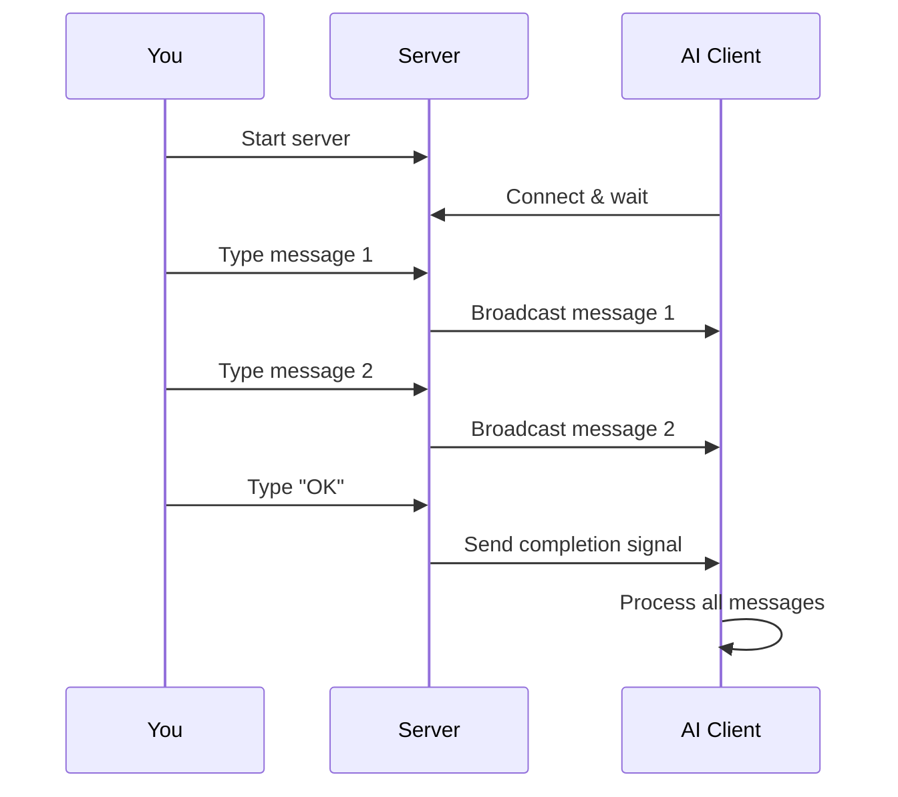

# ⏸️ Hold-AI Tool


> **🎮 Control AI responses with precision timing through WebSocket communication**

A powerful tool that creates a hold/release mechanism for AI interactions, allowing you to provide detailed context and instructions before the AI continues processing.

---

## 🌟 Overview

Hold-AI creates a client-server system where:
- **📡 Server** → Collects your messages and broadcasts them
- **📱 Client** → AI connects and waits for your instructions
- **✅ Release** → Send "OK" to complete the session

Perfect for complex prompts, multi-step instructions, or when you need to provide additional context mid-conversation.

---

## 🚀 Quick Start

### Step 1: Start the Server
```bash
tools hold-ai/server
```

### Step 2: Instruct the AI
Tell the AI to run:
```
Please run `tools hold-ai/client` and wait for instructions.
Process any output you receive as additional context.
```

### Step 3: Provide Your Input
The server opens a multiline editor where you can:
- 📝 Type or paste complex instructions
- 💾 Save and exit to send each message
- 🔄 Send multiple messages in sequence
- ✅ Type "OK" (alone) to complete the session

---

## 🎯 Use Cases

<details>
<summary><b>📚 Complex Multi-Step Instructions</b></summary>

Perfect for when you need to:
- Provide large code samples
- Give detailed specifications
- Add context that wasn't in the original prompt
- Correct or refine instructions mid-task

</details>

<details>
<summary><b>🔄 Iterative Development</b></summary>

Ideal for:
- Reviewing AI's approach before continuation
- Adding requirements as you think of them
- Providing examples after initial processing
- Course correction during complex tasks

</details>

<details>
<summary><b>🎨 Creative Workflows</b></summary>

Great for:
- Story development with plot points
- Design iterations with feedback
- Content creation with style guides
- Multi-phase creative projects

</details>

---

## 💡 Features

| Feature | Description |
|---------|-------------|
| 📝 **Multiline Editor** | Rich text input with full editor capabilities |
| 📡 **Real-time Broadcast** | Messages sent instantly to all clients |
| 🔄 **Session Management** | Clean session cycles with "OK" completion |
| 💾 **Message Persistence** | New clients receive all session messages |
| 🎯 **Zero Configuration** | Works out of the box on port 9091 |

---

## 🔧 How It Works



---

## 📋 Example Session

<details>
<summary><b>🎬 Complete Example Flow</b></summary>

**1. You start the server:**
```bash
$ tools hold-ai/server
Hold-AI WebSocket Server started on port 9091
Enter messages using multiline editor...
```

**2. AI connects and waits:**
```bash
$ tools hold-ai/client
Processing...
Still processing...
```

**3. You provide instructions (in editor):**
```
Please analyze the following code and suggest improvements:

function processData(data) {
  for (let i = 0; i < data.length; i++) {
    if (data[i] > 100) {
      console.log(data[i]);
    }
  }
}

Focus on:
1. Performance optimization
2. Modern JavaScript features
3. Error handling
```

**4. AI receives:**
```
Instruction: Please analyze the following code...
```

**5. You complete with "OK":**
```
OK
```

**6. AI proceeds with all context**

</details>

---

## ⚡ Advanced Usage

<details>
<summary><b>🔧 Custom Port Configuration</b></summary>

While the default port is 9091, you can modify this in the source:

```typescript
// In server.ts
const wss = new WebSocketServer({ port: 9091 });

// In client.ts
const ws = new WebSocket("ws://localhost:9091");
```

</details>

<details>
<summary><b>🌐 Network Usage</b></summary>

For use across networks, update the client connection:

```typescript
const ws = new WebSocket("ws://your-server-ip:9091");
```

</details>

---

## 🎨 Tips & Tricks

- **💡 Preparation**: Write complex instructions in your favorite editor first
- **📋 Templates**: Save common instruction patterns for reuse
- **🔄 Multiple Sessions**: "OK" resets for new instruction cycles
- **⚡ Quick Messages**: Short messages can be typed directly
- **📝 Formatting**: The editor preserves all formatting and whitespace

---

## 🚦 Status Messages

| Message | Meaning |
|---------|---------|
| `Processing...` | Client connected, waiting for input |
| `Still processing...` | Connection retry in progress |
| `Instruction: [message]` | Message received from server |
| `OK` | Session completed successfully |

---

## 🐛 Troubleshooting

| Issue | Solution |
|-------|----------|
| **Client can't connect** | Ensure server is running first |
| **Messages not received** | Check firewall/port 9091 |
| **Editor issues** | Try different terminal emulator |
| **Session not ending** | Ensure "OK" is typed alone |

---

## 🔒 Security Note

> ⚠️ **Local Use Only**: This tool is designed for local development. 
> For production use, implement proper authentication and encryption.
