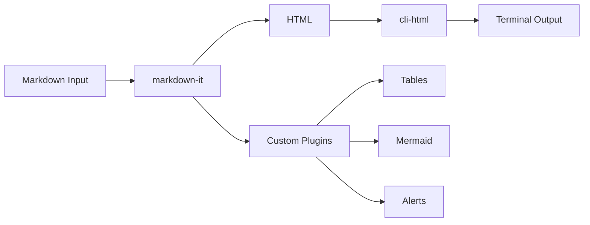

# GenesisTools Markdown Rendering Report

> [!NOTE]
> This is a showcase of all markdown rendering capabilities in GenesisTools CLI.

---

## Overview

The **markdown-cli** tool renders markdown to beautiful terminal output. It supports:
- GitHub-style alerts with colored borders
- Tables with box-drawing characters and alignment
- Code blocks with syntax-aware line numbering
- Mermaid diagram visualization
- Task lists with checkboxes

## Feature Matrix

| Feature | Status | Engine |
|---------|:------:|--------|
| Alerts | Supported | @mdit/plugin-alert |
| Tables | Supported | Custom ASCII renderer |
| Code Blocks | Supported | markdown-it + cli-html |
| Mermaid | Visual only | Custom renderer |
| Task Lists | Supported | markdown-it-task-lists |
| Footnotes | Not yet | markdown-it-footnote |

## Code Example

```ts
import { renderMarkdownToCli } from "../utils/markdown/index.js";

const markdown = "# Hello World";
const output = renderMarkdownToCli(markdown, {
    width: 80,
    theme: "dark",
    color: true,
});
console.log(output);
```

## Architecture



## Progress

- [x] Core rendering engine
- [x] Watch mode with live reload
- [x] Width and theme options
- [x] Template gallery
- [ ] PDF export
- [ ] Custom themes

> [!TIP]
> Run `tools markdown-cli demo` to browse all available templates interactively!
