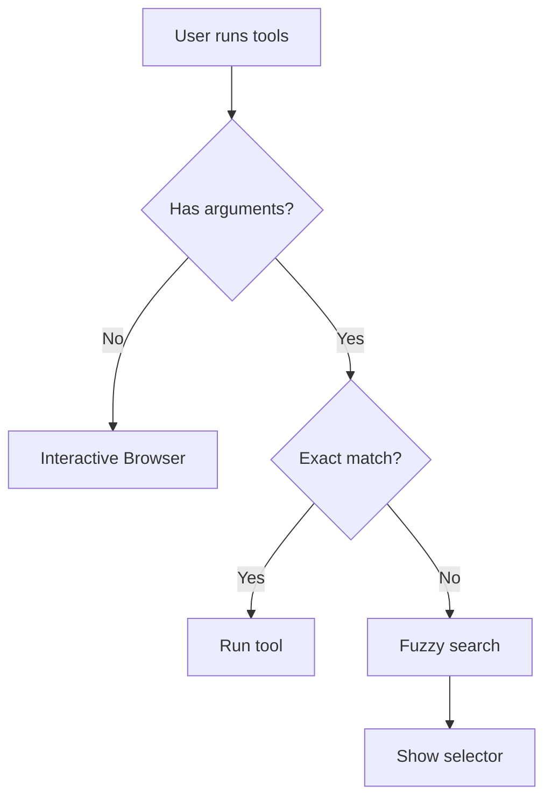
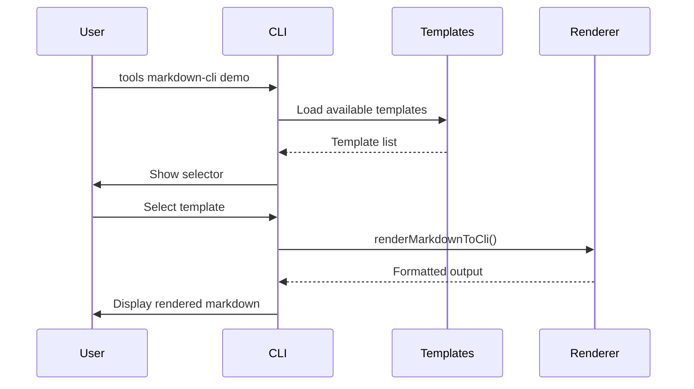
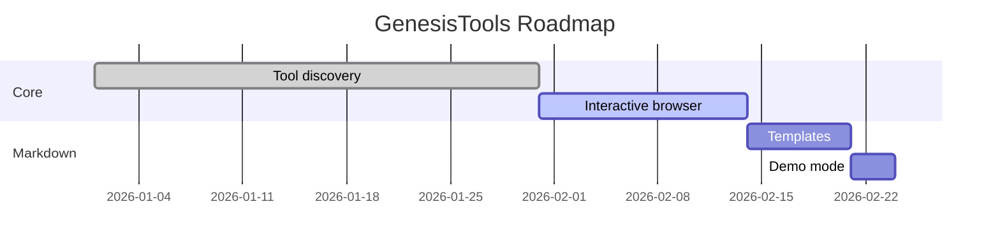

# Mermaid Diagrams

## Flowchart

```mermaid
graph TD
    A[User runs tools] --> B{Has arguments?}
    B -->|No| C[Interactive Browser]
    B -->|Yes| D{Exact match?}
    D -->|Yes| E[Run tool]
    D -->|No| F[Fuzzy search]
    F --> G[Show selector]
```

## Sequence Diagram

```mermaid
sequenceDiagram
    User->>CLI: tools markdown-cli demo
    CLI->>Templates: Load available templates
    Templates-->>CLI: Template list
    CLI->>User: Show selector
    User->>CLI: Select template
    CLI->>Renderer: renderMarkdownToCli()
    Renderer-->>CLI: Formatted output
    CLI->>User: Display rendered markdown
```

## Gantt Chart

```mermaid
gantt
    title GenesisTools Roadmap
    section Core
    Tool discovery    :done, d1, 2026-01-01, 30d
    Interactive browser :active, d2, after d1, 14d
    section Markdown
    Templates          :d3, after d2, 7d
    Demo mode          :d4, after d3, 3d
```
