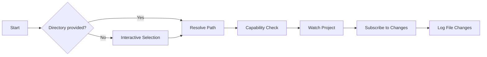

# 👁️ Watchman


> **Real-time file change monitoring powered by Facebook's Watchman**

A command-line tool that watches directories for file changes using Facebook's Watchman, with interactive directory selection and automatic retry handling.

---

## ✨ Features at a Glance

| Feature | Description |
|---------|-------------|
| 👁️ **Facebook Watchman** | Leverages Watchman's efficient file watching engine |
| 🔍 **Interactive Selection** | Search and select from existing watched directories |
| 🔄 **Auto Retry** | Automatically retries failed connections (up to 15 attempts) |
| 📂 **Flexible Input** | Support for relative paths, absolute paths, or CWD |
| ⏰ **Smart Timestamps** | Shows time-only for today, full date for older changes |
| 📋 **Sorted Output** | File changes sorted by modification time (latest last) |

---

## 🚀 Quick Start

```bash
# Interactive mode - select from watched directories
tools watchman

# Watch current directory
tools watchman .
tools watchman -c

# Watch a specific directory
tools watchman /path/to/project
tools watchman ./relative/path
```

---

## 📋 Options Reference

| Option | Alias | Description | Default |
|--------|-------|-------------|---------|
| `--current` | `-c` | Use current working directory | `false` |
| `--temporary` | `-t` | Remove watch when tool exits | `false` |
| `--help-full` | `-?` | Show detailed help message | - |
| `[directory]` | - | Path to directory to watch (positional) | interactive |

---

## 💡 Usage Examples

### Interactive Directory Selection
```bash
# Shows a searchable list of:
# - Currently watched directories in Watchman
# - Current working directory
tools watchman
```

### Watch Current Directory
```bash
# Both commands do the same thing
tools watchman .
tools watchman --current
```

### Watch Specific Project
```bash
# Absolute path
tools watchman /Users/me/projects/myapp

# Relative path
tools watchman ../other-project
```

### Temporary Watch (auto-cleanup)
```bash
# Watch a directory temporarily — unwatch on Ctrl+C
tools watchman -t /path/to/project

# Combine with current directory shorthand
tools watchman -t -c
```

> **Note:** If the directory was already in Watchman's watch list before the tool started, `--temporary` will **not** unwatch it on exit to avoid disrupting pre-existing watches.

---

## 🚦 How It Works



1. **🎯 Directory Selection** - From CLI args, `-c` flag, or interactive picker
2. **🔍 Capability Check** - Verifies Watchman supports required features
3. **📡 Watch Project** - Registers the directory with Watchman
4. **📬 Subscribe** - Sets up subscription for file change events
5. **📋 Monitor** - Logs changes with timestamps as they occur

---

## ⚙️ Prerequisites

**Facebook Watchman must be installed:**

```bash
# macOS
brew install watchman

# Ubuntu/Debian
sudo apt-get install watchman

# From source
# See: https://facebook.github.io/watchman/docs/install
```

---

## 🐛 Troubleshooting

| Issue | Solution |
|-------|----------|
| **"Capability check failed"** | Ensure Watchman is running: `watchman version` |
| **"Invalid directory path"** | Check that the path exists and is accessible |
| **Connection retries** | Watchman service may need restart: `watchman shutdown-server` |
| **No file changes shown** | Verify directory contains files and has write activity |
